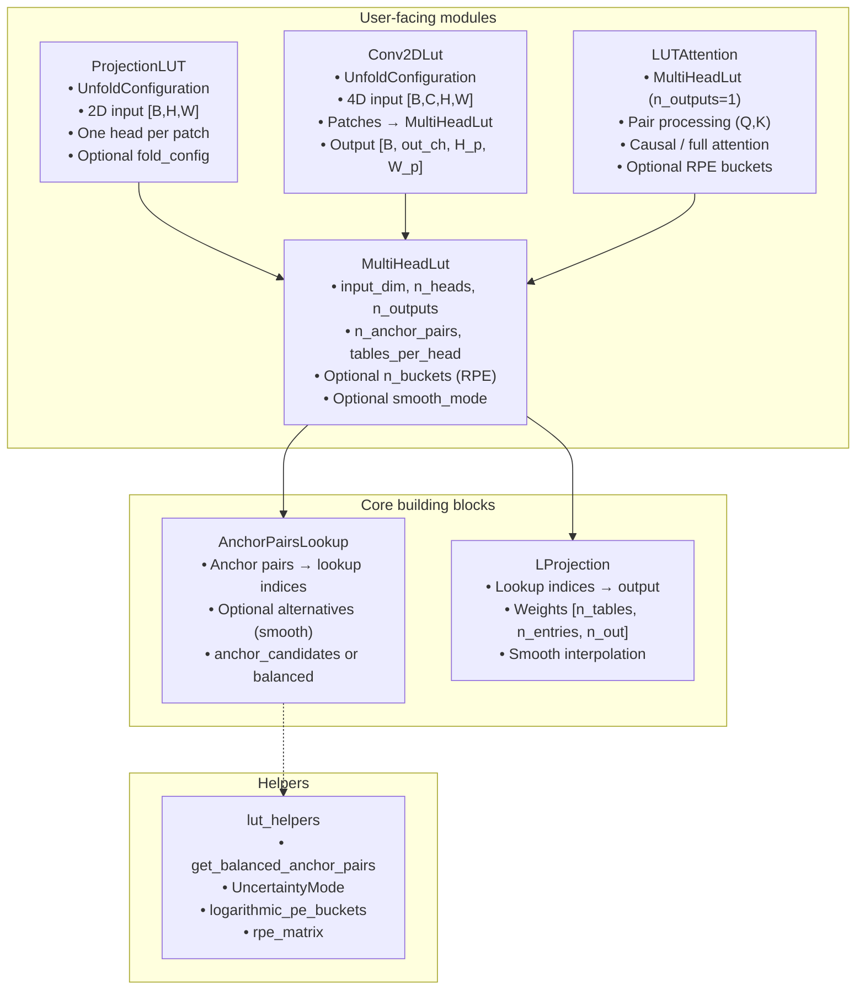

# LUTorch Architecture

LUTorch is the current PyTorch-native stack for LUT (Look-Up Table) layers in the Spiky project. It provides differentiable lookup-table modules that map input vectors to outputs via anchor-pair comparisons and learned table weights. The implementation is **Python-first** with optional native CUDA kernels and `torch.compile` for performance; the CUDA backend is not documented here.

## Conceptual Overview

As in the older `lut_fused` design, the core idea is:

1. **Anchor pairs and lookup indices**: For each lookup table, a set of *anchor pairs* indexes into the input. For each pair `(a, b)` we compute `delta = x[a] - x[b]` and set a bit to 1 if `delta > eps`, else 0. The resulting bits form a binary lookup index into that table.

2. **Table projection**: Each table holds a weight matrix of shape `(n_entries, n_outputs)`. The forward pass gathers the row corresponding to the lookup index and optionally blends nearby entries (smooth mode) to produce the table’s output. Outputs from all tables are combined (e.g. summed over tables per head in `MultiHeadLut`).

LUTorch differs from `lut_fused` in several ways:

- **Immediate construction**: No two-phase setup (`add_detector_connections`, `compile_lut`). Anchor pairs are determined at construction time (balanced over input dimensions or from provided candidates).
- **PyTorch-native**: Core computation is in PyTorch; optional `lutorch_cuda` extension can be used for hot paths. No separate gradient policies or shared context—standard `nn.Parameter` and autograd.
- **Modular building blocks**: `AnchorPairsLookup` (indices only) and `LProjection` (weights only) are separate; `MultiHeadLut` composes them. Higher-level modules (`ProjectionLUT`, `Conv2DLut`, `LUTAttention`) build on `MultiHeadLut`.

## Module Layout

## Component Roles

### Core building blocks

- **AnchorPairsLookup** (`spiky.lutorch.anchor_pairs_lookup`): Input `x` of shape `[B, input_dim]` and fixed anchor pairs (buffers) produce lookup indices `[B, n_tables]` and, when needed, alternative indices/deltas for smooth backward. Anchor pairs are computed at init with balanced coverage over input dimensions or from an optional tensor of shape `[n_tables, max_anchors_per_table]` (candidate input indices per table).

- **LProjection** (`spiky.lutorch.l_projection`): Takes lookup indices (and optional alternative indices/deltas) and gathers from a weight tensor of shape `[n_lookup_tables, n_entries_per_table, n_outputs]`. In smooth mode it blends main and alternative entries using an uncertainty function (`UncertaintyMode`).

### User-facing modules

- **MultiHeadLut**: Composes one `AnchorPairsLookup` and one `LProjection`. Forward: `x [B, input_dim]` → lookup indices → projection → `[B, n_heads, n_outputs]` (with optional `bucket_indices` when `n_buckets > 1` for positional encoding). This is the main building block for 1D vector inputs.

- **ProjectionLUT**: For 2D spatial input `[B, H, W]`. Uses `UnfoldConfiguration` (kernel size, stride, padding) to define patches; builds a `MultiHeadLut` with one head per patch and anchor candidates restricted to each patch. Output is `[B, H_p, W_p, n_outputs]` or, with `fold_config`, scattered to `[B, H_out, W_out]`.

- **Conv2DLut**: For 4D input `[B, C, H, W]`. Unfolds into patches of size `C * kH * kW`, runs `MultiHeadLut` per patch, reshapes output to `[B, out_channels, H_p, W_p]`.

- **LUTAttention**: Cross-attention over two sequences using a `MultiHeadLut` with `n_outputs=1`. For each query/key pair `(i, j)` it forms an input (e.g. `c1*Q[i] + c2*K[j]`), runs the LUT, and gets a score. Supports causal masking and optional relative position encoding via `n_positional_buckets` and bucket indices passed into `MultiHeadLut`.

### Helpers

- **lut_helpers**: `get_balanced_anchor_pairs` for anchor sampling; `UncertaintyMode` (INVERSE_L1, INVERSE_QUADRATIC) for smooth interpolation; `logarithmic_pe_buckets` and `rpe_matrix` for relative positional encoding in attention.

## Data flow (simplified)

- **MultiHeadLut**:  
  `x [B, input_dim]` → **AnchorPairsLookup** → `lookup_indices [B, n_tables]` (+ alternatives if smooth/training)  
  → (optional bucket offset when `n_buckets > 1`)  
  → **LProjection** → `[B, n_tables, n_outputs]` → reshape/sum over `tables_per_head` → `[B, n_heads, n_outputs]`.

- **ProjectionLUT**:  
  `x [B, H, W]` → flatten to `[B, H*W]` → **MultiHeadLut** (one head per patch, anchors per patch) → reshape to `[B, H_p, W_p, n_outputs]` or fold to `[B, H_out, W_out]`.

- **LUTAttention**:  
  Build (q,k) pairs (causal or full), form combined vectors → **MultiHeadLut**(combined, bucket_indices) → scores → densify → softmax → `[B, S, S, H]`.

## Optional behavior

- **torch.compile**: When `SPIKY_LUTORCH_NO_COMPILE` is not set, hot paths use `torch.compile` on CUDA.
- **Native CUDA**: If the `lutorch_cuda` extension is installed, `AnchorPairsLookup` and `LProjection` can use custom CUDA kernels; set `SPIKY_LUTORCH_NO_CUSTOM_CUDA_KERNELS=1` to disable.
