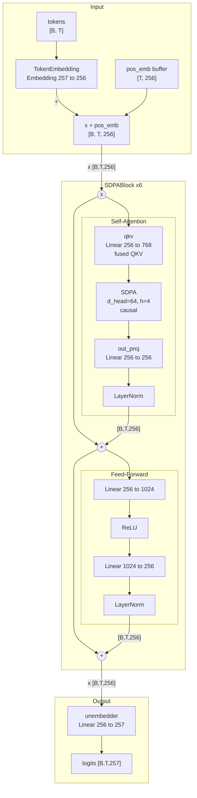

```mermaid
flowchart TD
    subgraph input["Input"]
        direction LR
        tokens["tokens
[B, T]"]
        emb["TokenEmbedding
Embedding 257 to 256"]
        pos["pos_emb buffer
[T, 256]"]
        tokens --> emb
        emb -->|"+"| add_pe["x + pos_emb
[B, T, 256]"]
        pos --> add_pe
    end

    subgraph block["SDPABlock  x6"]
        direction TB
        x_in(( x ))

        subgraph attn["Self-Attention"]
            direction TB
            qkv["qkv
Linear 256 to 768
fused QKV"]
            sdpa["SDPA
d_head=64, h=4
causal"]
            op["out_proj
Linear 256 to 256"]
            ln1["LayerNorm"]

            qkv --> sdpa
            sdpa --> op
            op --> ln1
        end

        r1(( + ))

        subgraph ffn["Feed-Forward"]
            direction TB
            fc1["Linear 256 to 1024"]
            relu["ReLU"]
            fc2["Linear 1024 to 256"]
            ln2["LayerNorm"]
            fc1 --> relu --> fc2 --> ln2
        end

        r2(( + ))

        x_in --> qkv
        x_in --> r1
        ln1 -->|"[B,T,256]"| r1
        r1 --> fc1
        r1 --> r2
        ln2 -->|"[B,T,256]"| r2
    end

    subgraph output["Output"]
        direction LR
        unemb["unembedder
Linear 256 to 257"]
        logits["logits [B,T,257]"]
        unemb --> logits
    end

    add_pe -->|"x [B,T,256]"| x_in
    r2 -->|"x [B,T,256]"| unemb
```
