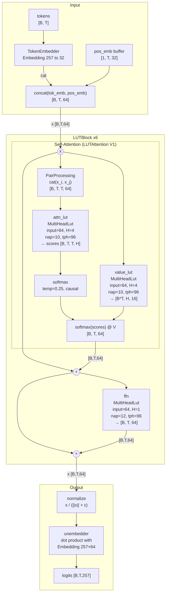

```mermaid
flowchart TD
    subgraph input["Input"]
        direction LR
        tokens["tokens
[B, T]"]
        emb["TokenEmbedder
Embedding 257 to 32"]
        pos["pos_emb buffer
[1, T, 32]"]
        tokens --> emb
        emb -->|"cat"| add_pe["concat(tok_emb, pos_emb)
[B, T, 64]"]
        pos --> add_pe
    end

    subgraph block["LUTBlock  x6"]
        direction TB
        x_in(( x ))

        subgraph attn["Self-Attention  (LUTAttention V1)"]
            direction TB
            pair["PairProcessing
cat(x_i, x_j)
[B, T, T, 64]"]
            al["attn_lut
MultiHeadLut
input=64, H=4
nap=10, tph=96
→ scores [B, T, T, H]"]
            sm["softmax
temp=0.25, causal"]
            vl["value_lut
MultiHeadLut
input=64, H=4
nap=10, tph=96
→ [B*T, H, 16]"]
            attn_out["softmax(scores) @ V
[B, T, 64]"]

            pair --> al --> sm
            x_in --> vl
            sm & vl --> attn_out
        end

        r1(( + ))

        ffn["ffn
MultiHeadLut
input=64, H=1
nap=12, tph=96
→ [B, T, 64]"]

        r2(( + ))

        x_in --> pair
        x_in --> r1
        attn_out -->|"[B,T,64]"| r1
        r1 --> ffn
        r1 --> r2
        ffn -->|"[B,T,64]"| r2
    end

    subgraph output["Output"]
        direction LR
        norm["normalize
x / (||x|| + ε)"]
        unemb["unembedder
dot product with
Embedding 257×64"]
        logits["logits [B,T,257]"]
        norm --> unemb --> logits
    end

    add_pe -->|"x [B,T,64]"| x_in
    r2 -->|"x [B,T,64]"| norm
```
