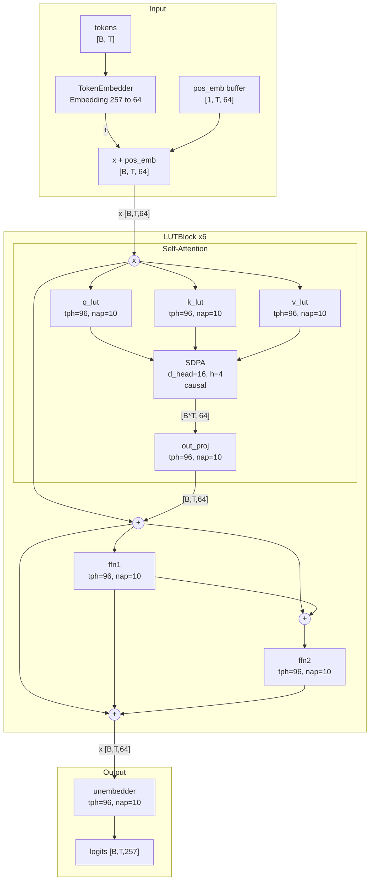

```mermaid
flowchart TD
    subgraph input["Input"]
        direction LR
        tokens["tokens
[B, T]"]
        emb["TokenEmbedder
Embedding 257 to 64"]
        pos["pos_emb buffer
[1, T, 64]"]
        tokens --> emb
        emb -->|"+"| add_pe["x + pos_emb
[B, T, 64]"]
        pos --> add_pe
    end

    subgraph block["LUTBlock  x6"]
        direction TB
        x_in(( x ))

        subgraph attn["Self-Attention"]
            direction TB
            ql["q_lut
tph=96, nap=10"]
            kl["k_lut
tph=96, nap=10"]
            vl["v_lut
tph=96, nap=10"]
            sdpa["SDPA
d_head=16, h=4
causal"]
            op["out_proj
tph=96, nap=10"]

            x_in --> ql & kl & vl
            ql & kl & vl --> sdpa
            sdpa -->|"[B*T, 64]"| op
        end

        r1(( + ))
        ffn1["ffn1
tph=96, nap=10"]
        ri(( + ))
        ffn2["ffn2
tph=96, nap=10"]
        r2(( + ))

        x_in --> r1
        op -->|"[B,T,64]"| r1
        r1 --> ffn1
        r1 --> ri
        ffn1 --> ri
        ri --> ffn2
        r1 --> r2
        ffn1 --> r2
        ffn2 --> r2
    end

    subgraph output["Output"]
        direction LR
        unemb["unembedder
tph=96, nap=10"]
        logits["logits [B,T,257]"]
        unemb --> logits
    end

    add_pe -->|"x [B,T,64]"| x_in
    r2 -->|"x [B,T,64]"| unemb
```
