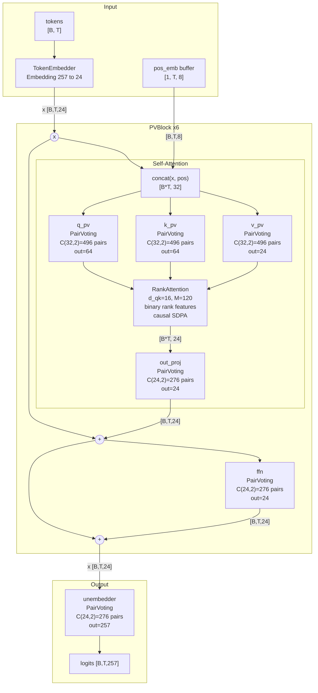

```mermaid
flowchart TD
    subgraph input["Input"]
        direction LR
        tokens["tokens
[B, T]"]
        emb["TokenEmbedder
Embedding 257 to 24"]
        pos["pos_emb buffer
[1, T, 8]"]
        tokens --> emb
    end

    subgraph block["PVBlock  x6"]
        direction TB
        x_in(( x ))
        cat["concat(x, pos)
[B*T, 32]"]

        subgraph attn["Self-Attention"]
            direction TB
            ql["q_pv
PairVoting
C(32,2)=496 pairs
out=64"]
            kl["k_pv
PairVoting
C(32,2)=496 pairs
out=64"]
            vl["v_pv
PairVoting
C(32,2)=496 pairs
out=24"]
            ra["RankAttention
d_qk=16, M=120
binary rank features
causal SDPA"]
            op["out_proj
PairVoting
C(24,2)=276 pairs
out=24"]

            cat --> ql & kl & vl
            ql & kl & vl --> ra
            ra -->|"[B*T, 24]"| op
        end

        r1(( + ))
        ffn["ffn
PairVoting
C(24,2)=276 pairs
out=24"]
        r2(( + ))

        x_in --> cat
        x_in --> r1
        op -->|"[B,T,24]"| r1
        r1 --> ffn
        r1 --> r2
        ffn -->|"[B,T,24]"| r2
    end

    subgraph output["Output"]
        direction LR
        unemb["unembedder
PairVoting
C(24,2)=276 pairs
out=257"]
        logits["logits [B,T,257]"]
        unemb --> logits
    end

    emb -->|"x [B,T,24]"| x_in
    pos -->|"[B,T,8]"| cat
    r2 -->|"x [B,T,24]"| unemb
```
