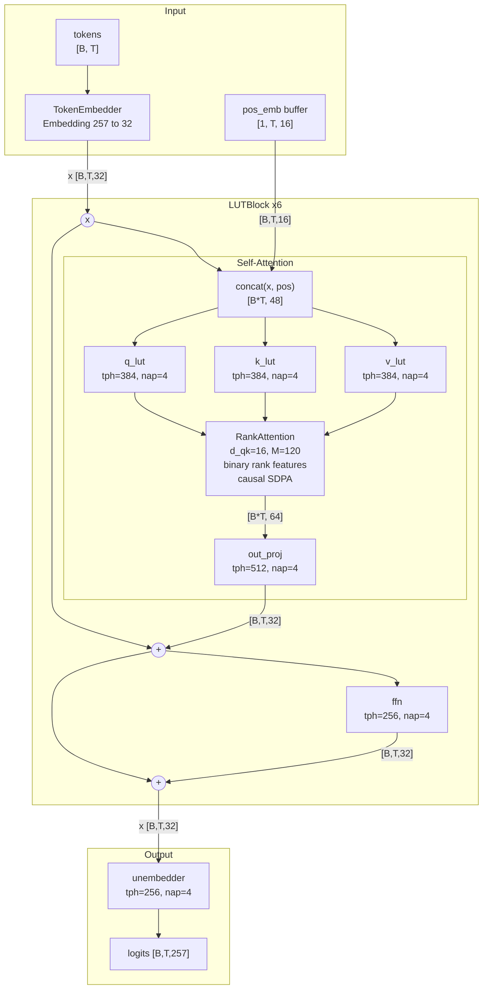

```mermaid
flowchart TD
    subgraph input["Input"]
        direction LR
        tokens["tokens
[B, T]"]
        emb["TokenEmbedder
Embedding 257 to 32"]
        pos["pos_emb buffer
[1, T, 16]"]
        tokens --> emb
    end

    subgraph block["LUTBlock  x6"]
        direction TB
        x_in(( x ))
        cat["concat(x, pos)
[B*T, 48]"]

        subgraph attn["Self-Attention"]
            direction TB
            ql["q_lut
tph=384, nap=4"]
            kl["k_lut
tph=384, nap=4"]
            vl["v_lut
tph=384, nap=4"]
            ra["RankAttention
d_qk=16, M=120
binary rank features
causal SDPA"]
            op["out_proj
tph=512, nap=4"]

            cat --> ql & kl & vl
            ql & kl & vl --> ra
            ra -->|"[B*T, 64]"| op
        end

        r1(( + ))
        ffn["ffn
tph=256, nap=4"]
        r2(( + ))

        x_in --> cat
        x_in --> r1
        op -->|"[B,T,32]"| r1
        r1 --> ffn
        r1 --> r2
        ffn -->|"[B,T,32]"| r2
    end

    subgraph output["Output"]
        direction LR
        unemb["unembedder
tph=256, nap=4"]
        logits["logits [B,T,257]"]
        unemb --> logits
    end

    emb -->|"x [B,T,32]"| x_in
    pos -->|"[B,T,16]"| cat
    r2 -->|"x [B,T,32]"| unemb
```
