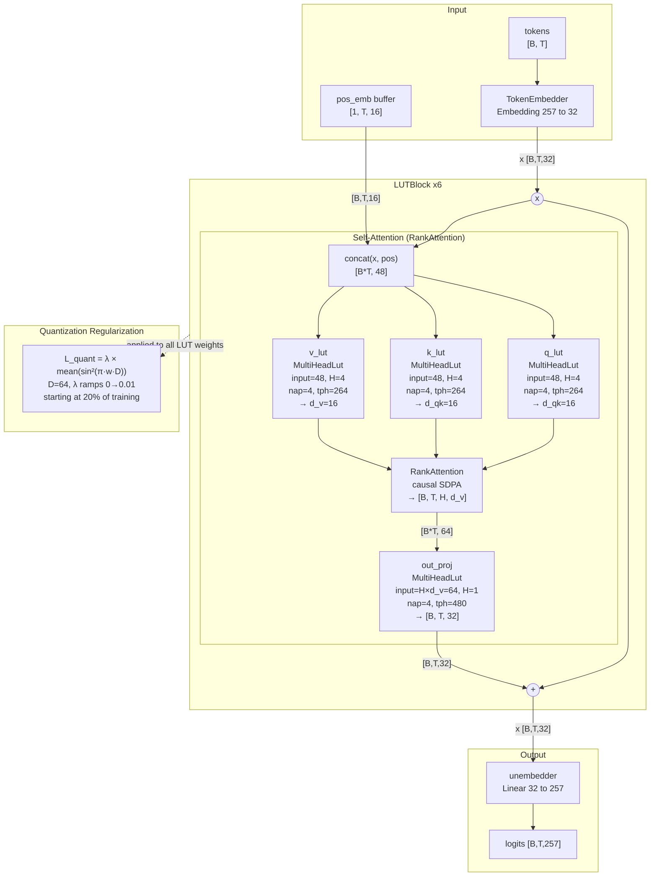

```mermaid
flowchart TD
    subgraph input["Input"]
        direction LR
        tokens["tokens
[B, T]"]
        emb["TokenEmbedder
Embedding 257 to 32"]
        pos["pos_emb buffer
[1, T, 16]"]
        tokens --> emb
    end

    subgraph block["LUTBlock  x6"]
        direction TB
        x_in(( x ))
        cat["concat(x, pos)
[B*T, 48]"]

        subgraph attn["Self-Attention  (RankAttention)"]
            direction TB
            ql["q_lut
MultiHeadLut
input=48, H=4
nap=4, tph=264
→ d_qk=16"]
            kl["k_lut
MultiHeadLut
input=48, H=4
nap=4, tph=264
→ d_qk=16"]
            vl["v_lut
MultiHeadLut
input=48, H=4
nap=4, tph=264
→ d_v=16"]
            ra["RankAttention
causal SDPA
→ [B, T, H, d_v]"]
            op["out_proj
MultiHeadLut
input=H×d_v=64, H=1
nap=4, tph=480
→ [B, T, 32]"]

            cat --> ql & kl & vl
            ql & kl & vl --> ra
            ra -->|"[B*T, 64]"| op
        end

        r1(( + ))

        x_in --> cat
        x_in --> r1
        op -->|"[B,T,32]"| r1
    end

    subgraph qreg["Quantization Regularization"]
        direction LR
        qloss["L_quant = λ × mean(sin²(π·w·D))
D=64, λ ramps 0→0.01
starting at 20% of training"]
    end

    subgraph output["Output"]
        direction LR
        unemb["unembedder
Linear 32 to 257"]
        logits["logits [B,T,257]"]
        unemb --> logits
    end

    emb -->|"x [B,T,32]"| x_in
    pos -->|"[B,T,16]"| cat
    r1 -->|"x [B,T,32]"| unemb
    block -.->|"applied to all LUT weights"| qloss
```
