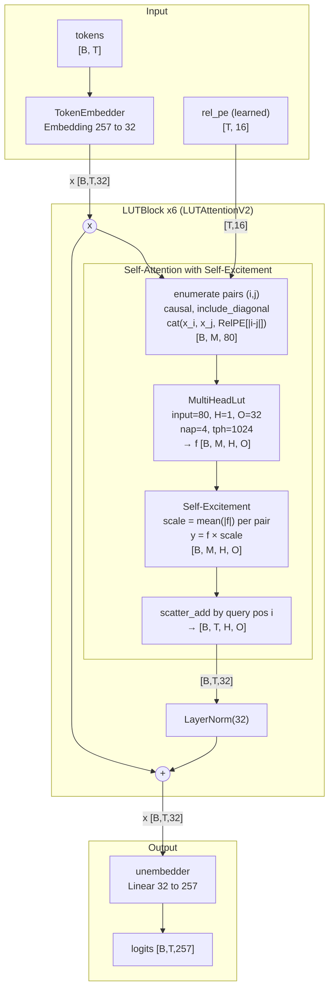

```mermaid
flowchart TD
    subgraph input["Input"]
        direction LR
        tokens["tokens
[B, T]"]
        emb["TokenEmbedder
Embedding 257 to 32"]
        rel_pe["rel_pe (learned)
[T, 16]"]
        tokens --> emb
    end

    subgraph block["LUTBlock  x6  (LUTAttentionV2)"]
        direction TB
        x_in(( x ))

        subgraph attn["Self-Attention with Self-Excitement"]
            direction TB
            pairs["enumerate pairs (i,j)
causal, include_diagonal
cat(x_i, x_j, RelPE[|i-j|])
[B, M, 80]"]
            lut["MultiHeadLut
input=80, H=1, O=32
nap=4, tph=1024
→ f [B, M, H, O]"]
            se["Self-Excitement
scale = mean(|f|) per pair
y = f × scale
[B, M, H, O]"]
            sc["scatter_add by query pos i
→ [B, T, H, O]"]

            pairs --> lut --> se --> sc
        end

        ln["LayerNorm(32)"]
        r1(( + ))

        x_in --> pairs
        x_in --> r1
        sc -->|"[B,T,32]"| ln --> r1
    end

    subgraph output["Output"]
        direction LR
        unemb["unembedder
Linear 32 to 257"]
        logits["logits [B,T,257]"]
        unemb --> logits
    end

    emb -->|"x [B,T,32]"| x_in
    rel_pe -->|"[T,16]"| pairs
    r1 -->|"x [B,T,32]"| unemb
```
