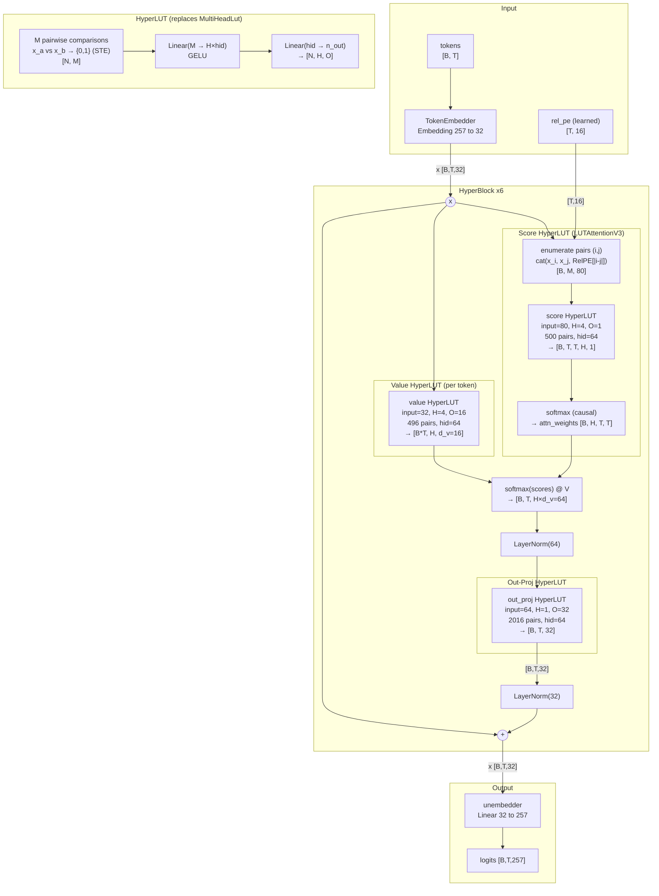

```mermaid
flowchart TD
    subgraph input["Input"]
        direction LR
        tokens["tokens
[B, T]"]
        emb["TokenEmbedder
Embedding 257 to 32"]
        rel_pe["rel_pe (learned)
[T, 16]"]
        tokens --> emb
    end

    subgraph hlut["HyperLUT (replaces MultiHeadLut)"]
        direction LR
        hl_pairs["M pairwise comparisons
x_a vs x_b → {0,1} (STE)
[N, M]"]
        hl_lin1["Linear(M → H×hid)
GELU"]
        hl_lin2["Linear(hid → n_out)
→ [N, H, O]"]
        hl_pairs --> hl_lin1 --> hl_lin2
    end

    subgraph block["HyperBlock  x6"]
        direction TB
        x_in(( x ))

        subgraph score["Score HyperLUT  (LUTAttentionV3)"]
            direction TB
            spairs["enumerate pairs (i,j)
cat(x_i, x_j, RelPE[|i-j|])
[B, M, 80]"]
            sh["score HyperLUT
input=80, H=4, O=1
500 pairs, hid=64
→ [B, T, T, H, 1]"]
            ssm["softmax (causal)
→ attn_weights [B, H, T, T]"]
            spairs --> sh --> ssm
        end

        subgraph value["Value HyperLUT  (per token)"]
            direction TB
            vh["value HyperLUT
input=32, H=4, O=16
496 pairs, hid=64
→ [B*T, H, d_v=16]"]
        end

        matmul["softmax(scores) @ V
→ [B, T, H×d_v=64]"]
        attn_norm["LayerNorm(64)"]

        subgraph proj["Out-Proj HyperLUT"]
            direction TB
            oph["out_proj HyperLUT
input=64, H=1, O=32
2016 pairs, hid=64
→ [B, T, 32]"]
        end

        norm["LayerNorm(32)"]
        r1(( + ))

        x_in --> spairs
        x_in --> vh
        x_in --> r1
        ssm & vh --> matmul
        matmul --> attn_norm --> oph
        oph -->|"[B,T,32]"| norm --> r1
    end

    subgraph output["Output"]
        direction LR
        unemb["unembedder
Linear 32 to 257"]
        logits["logits [B,T,257]"]
        unemb --> logits
    end

    emb -->|"x [B,T,32]"| x_in
    rel_pe -->|"[T,16]"| spairs
    r1 -->|"x [B,T,32]"| unemb
```
