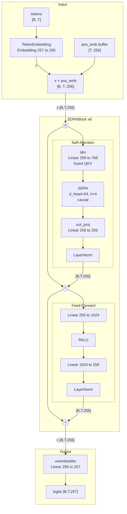
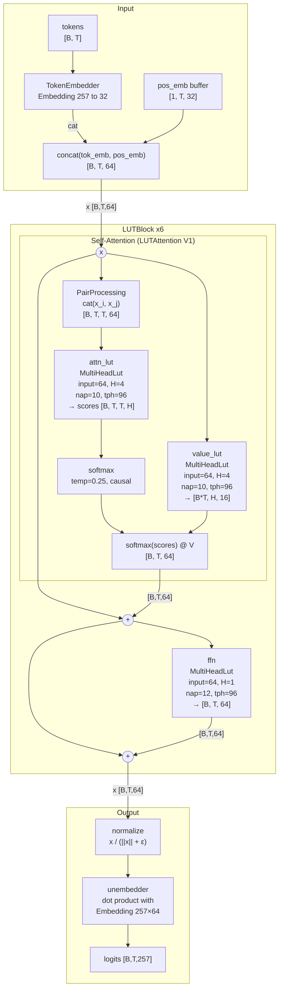
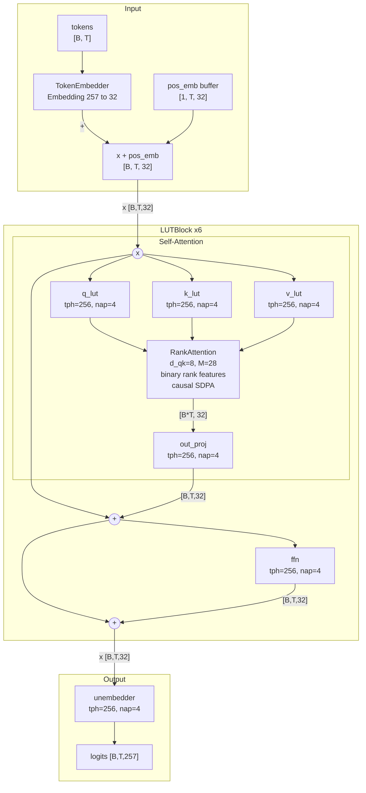
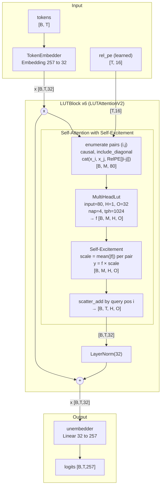
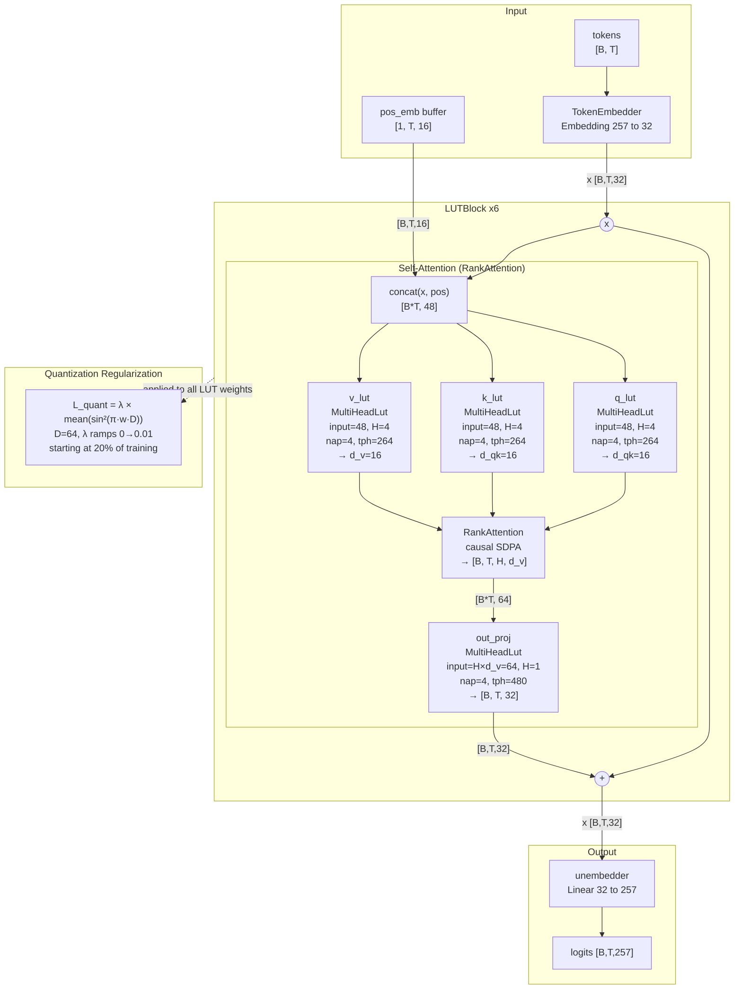
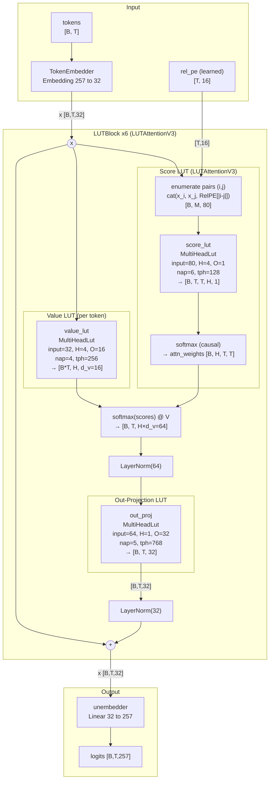
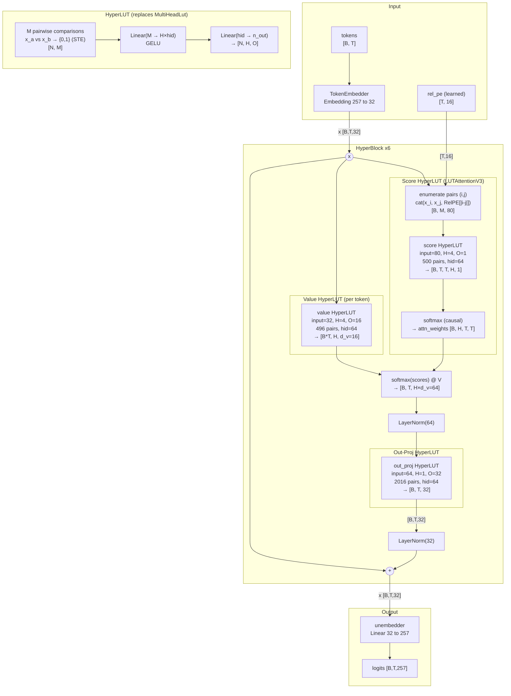

# LUT-Based Transformers: Research Report

## Overview

This report covers our exploration of replacing standard linear projections in transformers with Lookup Table (LUT) based modules. The goal: build a transformer where all learned operations are LUT lookups — piecewise-constant functions that compare pairs of input features to produce outputs. Such models could eventually run on hardware that only needs comparators and table reads, not multiply-accumulate units.

We use a byte-level language model on FineWeb text (vocab=257, context=32) as our benchmark throughout.

**Vanilla baseline** (exp002): d_model=256, 4 heads, 6 layers, FFN 4×, 4.87M params → **val_loss = 1.356** at 100K steps.

---

## 1. LUT Baseline (exp004)


### Vanilla Baseline Architecture (exp002)



The first LUT transformer used LUTAttention V1 with learnable pairwise comparisons for attention scores, LUT-based value projection, and LUT-based FFN. The architecture was direct — each LUT module compares anchor pairs of input features, forms a binary index, and looks up a weight vector.

- **Architecture:** embedding_dim=64, 4 heads, 6 layers, LUTAttention + value LUT + FFN LUT
- **Parameters:** 191M (very large — each LUT table had 2^10 = 1024 entries)
- **Result:** val_loss = **1.463** at 100K steps


### LUT Baseline Architecture (exp004)



Despite 40× more parameters than vanilla, the LUT baseline was slightly worse. The massive table sizes were wasteful — most entries rarely accessed.

---

## 2. Ranking Attention (exp020, exp058)

We explored RankAttention — replacing dot-product attention with pairwise rank features. Instead of Q@K, attention scores come from comparing pairs of features within Q and K vectors.

- **exp020** (RankAttention, 46M params): val_loss = **1.568** — worse than LUT baseline
- **exp058** (RankProjection for all projections, 0.6M params): val_loss = **1.953** — too few params

RankAttention struggled because the rank features lose magnitude information. However, the pairwise comparison idea would later resurface in HyperLUT.

---

## 3. Minimalistic Transformer with nap/tph Tradeoff (exp048–059)


### Minimalistic LUT Transformer (exp059)



We discovered that the nap (anchor pairs per table) vs tph (tables per head) tradeoff is critical. Fixing total budget (tph × 2^nap = const at 5M params):

| nap | tph | entries/table | val_loss |
|-----|-----|---------------|----------|
| 8   | 16  | 256           | 1.942    |
| 6   | 64  | 64            | 1.759    |
| 5   | 128 | 32            | 1.729    |
| **4** | **256** | **16**    | **1.706** |
| 3   | 512 | 8             | 1.706    |
| 2   | 1024| 4             | 1.719    |

**Key finding:** More tables with fewer entries per table beats fewer tables with more entries, down to nap=3–4. This led to our coverage formula: `tph ≈ input_dim × (input_dim - 1) / nap`.

---

## 4. Self-Excitement (exp163–164)

LUTAttentionV2 introduced self-excitement: `y_o = f_o × mean(|f|)`. Each pair's contribution is weighted by the overall activation magnitude — pairs with stronger signals dominate.

- **exp161** (V2, no SE): val_loss = **1.626** (3.16M)
- **exp163** (V2 + self-excitement): val_loss = **1.533** (3.16M)
- **exp164** (V2 + SE + recompute + MLP unembedder): val_loss = **1.519** (3.19M)

Self-excitement gave a ~0.1 improvement at zero parameter cost.


### LUTAttentionV2 with Self-Excitement (exp163)



---

## 5. Weights Quantisation (exp145–146)


### Quantisation-Aware Architecture (exp145)



We tested quantisation-aware training using a sinusoidal regularisation term: `λ × mean(sin²(πwD))` which pushes weights toward multiples of 1/D.

- **exp145** (50K steps, quant_reg): val_loss = **1.605** (6.36M)
- **exp146** (100K steps, quant_reg): val_loss = **1.509** (6.36M)

The quantisation penalty didn't significantly hurt training — the model learned to place weights at grid points while maintaining good loss. This suggests LUT weights can be represented with low bit-width (log2(D) bits per weight).

---

## 6. V3 Architecture — Classic Attention with LUT Projections (exp173–184)


### V3 Softmax Architecture (exp184)



The breakthrough came from LUTAttentionV3: generating raw attention scores with LUTs, then applying standard softmax + matmul. This separates "what to attend to" (LUT scores) from "how to combine" (softmax@V).

**Architecture per block:**
```
x → [Score LUT] → attention scores [B, T, T, H, 1]
x → [Value LUT] → values [B, T, H, d_v]
     softmax(scores) @ values → [B, T, H, d_v]
     LayerNorm → [Out-proj LUT] → [B, T, E]
     residual + LayerNorm
```

### Evolution of V3 results:

| Exp | Config | Params | Val Loss |
|-----|--------|--------|----------|
| exp173 | nap=4, tph=256, d_v=16 | 3.26M | 1.549 |
| exp177 | all nap=6, op_tph=512 | 9.65M | 1.446 |
| exp181 | v_tph=256, op_nap=5, op_tph=768 | 6.51M | 1.458 |
| **exp184** | **same as exp181, 100K** | **6.51M** | **1.441** |

**Key findings from sweeps:**
- **Out_proj is the most important component** — dominates every budget allocation sweep
- **nap > tph for expressiveness** — more entries per table beats more tables
- **Pairs processor:** Concat (default) slightly better than SignedDiff at long training
- **Exclusion sets** (prohibiting within-group pairs): didn't help

### Gap to vanilla:

| Model | Params | Val Loss |
|-------|--------|----------|
| Vanilla (exp002) | 4.87M | **1.356** |
| Best LUT V3 (exp184) | 6.51M | **1.441** |
| Gap | | **0.085** |

### Analysis of the gap:

Gradient analysis revealed balanced |grad/weight| ratios across components (~10⁻⁴ on log scale) — no gradient starvation. The gap appears to be representational: LUT piecewise-constant functions have limited resolution compared to dense linear projections.

Attention entropy analysis showed vanilla achieves much sharper attention (entropy 0.06–0.49) vs LUT (0.68–1.17) — the LUT score function can't produce well-separated scores.

---

## 7. HyperLUT (exp193–195)


### HyperLUT Architecture (exp193)



HyperLUT replaces the lookup table mechanism entirely. Instead of:
- Compare nap pairs → binary index → table lookup → sum over tables

HyperLUT does:
- Compare M pairs → {0,1} vector → Linear → GELU → Linear → output

The MLP sees **all M comparisons simultaneously** (vs LUT where each table only sees its nap pairs independently). This avoids the 2^nap exponential table size while allowing cross-comparison interactions.

### Early results:

| Exp | Config | Params | Val Loss | Steps |
|-----|--------|--------|----------|-------|
| exp193 | hid=64 uniform, sigmoid | 2.34M | 1.657 | 25K |
| exp194 | hid=32/64/256, rational | 4.32M | 1.611 | 25K |
| exp195 | pairs=1024/496/2016, hid=32/64/128 | 3.15M | running | 50K |

HyperLUT is promising: 2.34M params reaching 1.657 at only 25K steps (vs MultiHeadLut needing 6.5M for similar early convergence). The fully differentiable backward (sigmoid STE vs uncertainty derivative) could help with the convergence plateau we observed in standard LUTs.

**Open questions:**
- Will HyperLUT close the gap to vanilla at longer training?
- Temperature tuning: 0.1 works better than 1.0 — sharper comparisons help
- Sigmoid vs rational soft function: both viable, need controlled comparison

---

## Summary & Next Steps

### Progress timeline:

| Milestone | Val Loss | Params | Approach |
|-----------|----------|--------|----------|
| LUT baseline (exp004) | 1.463 | 191M | Brute-force LUTs |
| Minimalistic (exp059) | 1.706 | 5.0M | nap/tph optimisation |
| Self-excitement (exp164) | 1.519 | 3.2M | V2 + SE |
| V3 softmax (exp184) | **1.441** | 6.5M | Classic attention with LUT projections |
| Vanilla baseline | **1.356** | 4.9M | Standard transformer |

### Key insights:
1. **Architecture matters more than scale** — V3 (softmax attention) was the biggest single improvement
2. **nap > tph** — expressiveness per table trumps table count
3. **Out_proj dominates** — the output mixing layer needs the most capacity
4. **The 0.085 gap to vanilla** is likely representational, not optimisational
5. **HyperLUT** is a promising new direction that avoids the exponential table size problem
