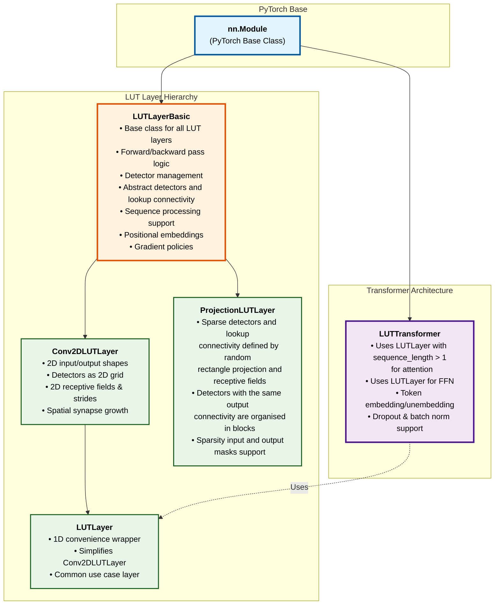

# LUT Hierarchy Diagram

This diagram shows the class hierarchy and organization of LUT components at the Python level.

## Class Descriptions

### Base Layer

**LUTLayerBasic**: The foundational class for all LUT layers. Manages the core LUT computation pipeline including detector initialization, lookup table operations, and gradient computation. Supports both fully-connected and sparse connectivity modes. Handles sequence processing with three modes: non-sequential (sequence_length=1), concatenation product (concatenates sequence elements), and product mode (pairwise comparisons). Manages positional embeddings for sequence processing, supports multiple synapse metadata configurations, and provides flexible gradient policies (Sparse, Dense, Internal). Can use shared context for buffer and CUDA stream management across multiple layers. Supports both float32 and int32 precision modes.

### Derived Layers

**Conv2DLUTLayer**: Extends `LUTLayerBasic` for 2D spatial/convolutional data. Organizes detectors in a 2D grid layout based on input/output shapes. Supports configurable receptive fields and strides for convolutional operations. Uses `Conv2DSynapseGrowthHelper` to automatically generate spatial connections between inputs and detectors. Can optionally use a second convolutional layer for connections from lookup neurons to outputs (when `lut_receptive_field_shape` is specified), otherwise uses fully-connected mode. Automatically handles shape conversions and manages detector anchor initialization for spatial patterns.

**LUTLayer**: A convenience wrapper around `Conv2DLUTLayer` that simplifies usage for 1D inputs. Internally creates a 2D shape `(1, n_inputs)` and `(1, n_detectors)` but exposes 1D shapes through its API. Always operates in fully-connected mode (all lookup neurons connect to all outputs). This is the most commonly used layer type for simple LUT networks where spatial structure isn't needed. Provides a cleaner interface by hiding the 2D shape management complexity while maintaining all the functionality of `Conv2DLUTLayer`.

**ProjectionLUTLayer**: Specialized layer for projection-based architectures with sparse connectivity. Uses `RandomRectanglesSynapseGrowthHelper` to generate detector connections based on random rectangular receptive fields. Detectors are organized into groups where detectors in the same group share the same output connectivity pattern. Uses `GivenRectanglesSynapseGrowthHelper` for the lookup-to-output connections, creating projection patterns based on projection of detector group centers on the output neurons grid. Supports input and output sparsity masks to control which connections are allowed.

### Transformer Architecture

**LUTTransformer**: A complete transformer architecture built using LUT layers. Creates multi-layer transformer stacks where each layer contains an attention mechanism using `LUTLayer` with `sequence_length = CONTEXT_SIZE`. The attention layers can use either concatenation product or product mode for sequence processing. Each transformer layer also includes an optional feed-forward network (FFN) using `LUTLayer` with `sequence_length=1` (sequence is reshaped to [B * S, ...] for processing). Includes token embedding and unembedding layers, supports dropout and batch normalization after attention and FFN operations. All layers share a common `LUTSharedContext` for efficient resource management. Supports configurable number of layers, attention heads, and various LUT-specific parameters like anchor counts per detector.
