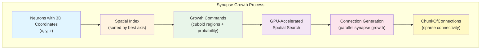
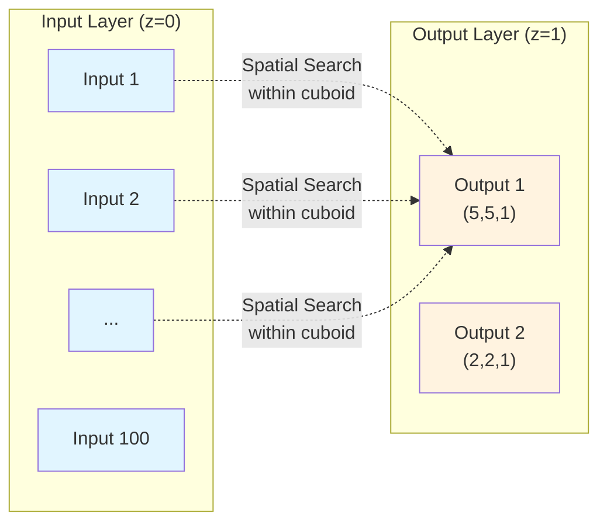
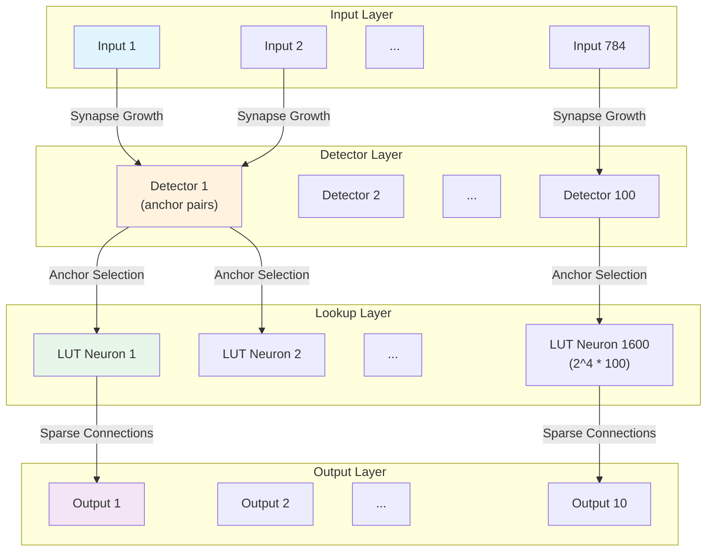
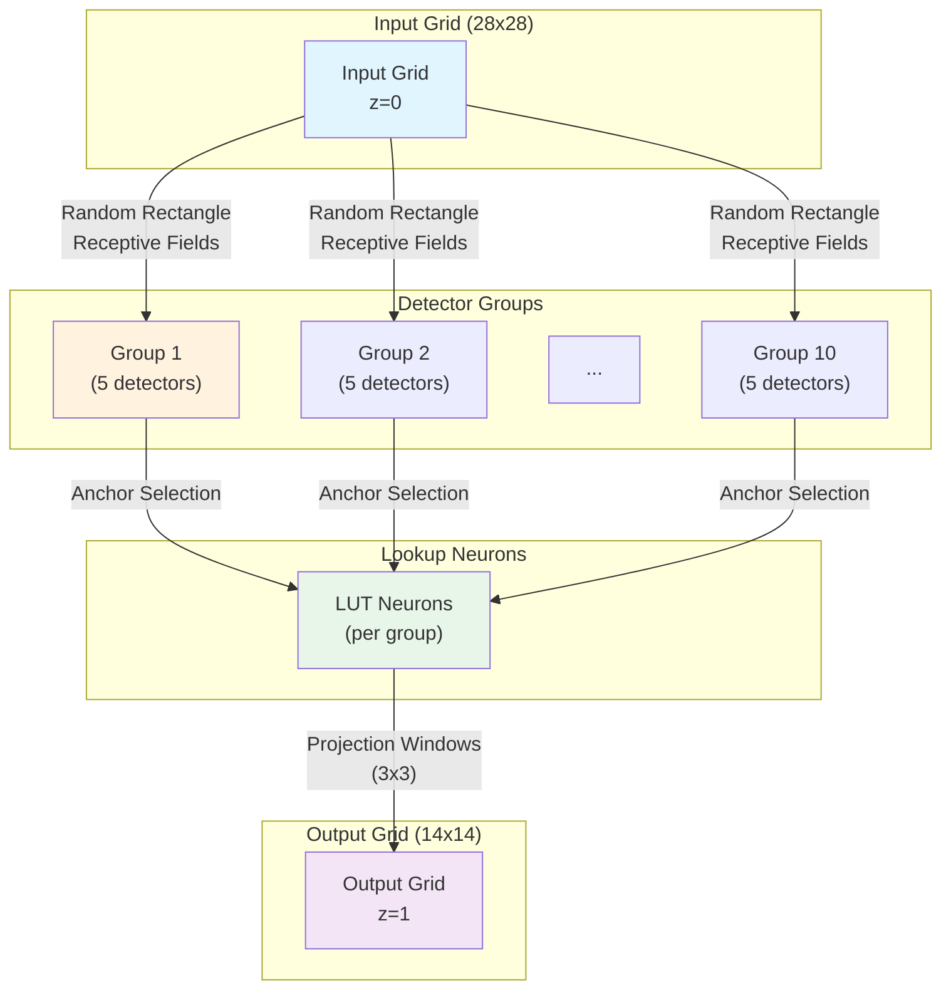
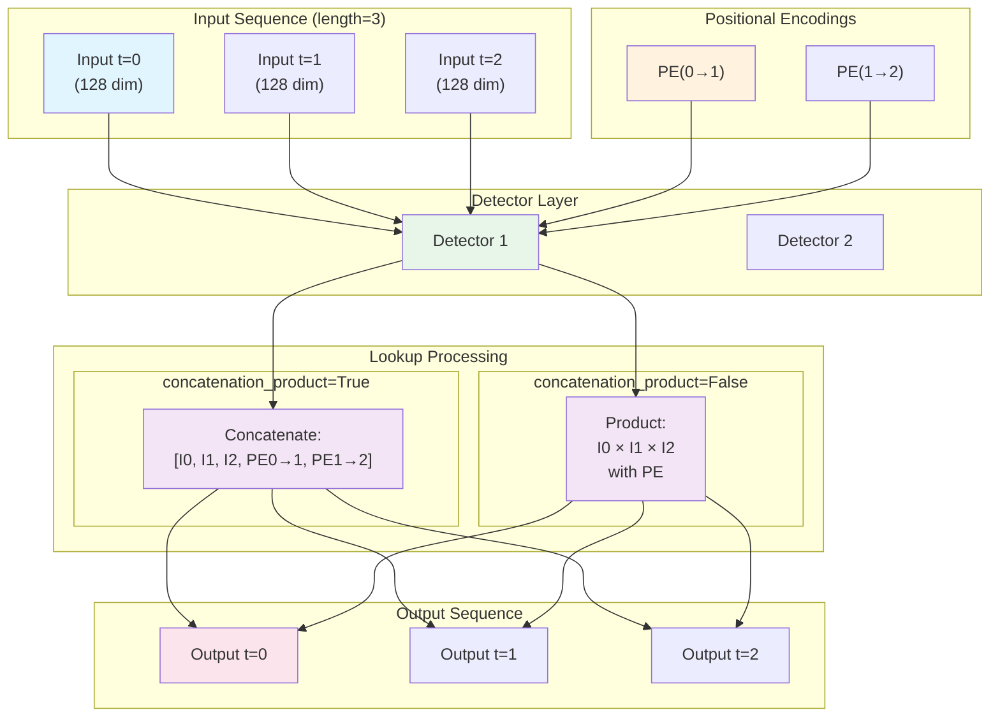
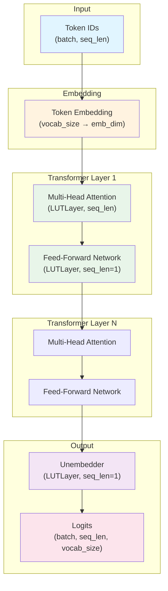
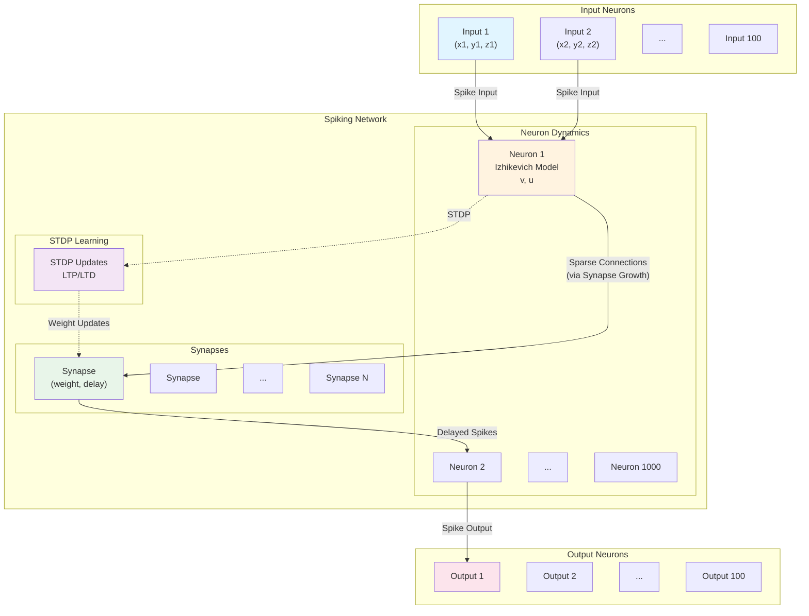

# Spiky Programming Guide

This guide provides a comprehensive overview of how to use the spiky library for building neural networks with synapse growth, LUT layers, and spiking networks.

## Table of Contents

1. [Synapse Growth](#synapse-growth)
2. [LUTs](#luts)
   - [LUTLayerBasic](#lutlayerbasic)
   - [LUTLayer (sequence_length=1)](#lutlayer-sequencelength1)
   - [ProjectionLUTLayer](#projectionlutlayer)
   - [LUTLayer (sequence_length > 1)](#lutlayer-sequencelength--1)
   - [LUTTransformer](#luttransformer)
3. [SPNet](#spnet)

---

## Synapse Growth

### Basic Idea

The synapse growth engine is a powerful mechanism for establishing connections between neurons based on their spatial arrangement in 3D space. The core concept is:

1. **Place neurons in 3D space**: Each neuron is assigned a 3D coordinate (x, y, z)
2. **Define growth rules**: Specify spatial regions (cuboids) relative to each neuron where connections can be formed
3. **Parallel growth**: The engine uses a spatial index to efficiently find candidate connections and grows synapses in parallel on the GPU

The spatial indexing system automatically selects the most uniform axis for efficient spatial queries, enabling fast connection generation even for large networks.

### Architecture Diagram



### Example: Creating Connections with Spatial Growth

```python
from spiky.util.synapse_growth import SynapseGrowthEngine, GrowthCommand
import torch

# Initialize the growth engine
device = torch.device('cuda:0')
growth_engine = SynapseGrowthEngine(device=device)

# Register neuron types with growth rules
# Type 0: Input neurons (no outgoing connections)
growth_engine.register_neuron_type(
    max_synapses=0,
    growth_command_list=[]
)

# Type 1: Output neurons (can receive connections from type 0)
# Growth command: search a 5x5x1 cuboid region with 100% probability
growth_engine.register_neuron_type(
    max_synapses=100,
    growth_command_list=[
        GrowthCommand(
            target_type=0,  # Connect to input neurons
            synapse_meta_index=0,
            x1=-2.5, y1=-2.5, z1=0.0,  # Lower bounds
            x2=2.5, y2=2.5, z2=1.0,    # Upper bounds
            p=1.0,  # 100% connection probability
            max_synapses=0  # No limit
        )
    ]
)

# Add input neurons arranged in a 10x10 grid
input_ids = torch.arange(1, 101, dtype=torch.int32)
input_coords = torch.zeros(100, 3)
for i in range(100):
    input_coords[i] = torch.tensor([i % 10, i // 10, 0.0])
growth_engine.add_neurons(neuron_type_index=0, identifiers=input_ids, coordinates=input_coords)

# Add output neurons at specific locations
output_ids = torch.arange(101, 111, dtype=torch.int32)
output_coords = torch.tensor([
    [5.0, 5.0, 1.0],  # Center
    [2.0, 2.0, 1.0],  # Top-left
    [8.0, 2.0, 1.0],  # Top-right
    [2.0, 8.0, 1.0],  # Bottom-left
    [8.0, 8.0, 1.0],  # Bottom-right
    [5.0, 2.0, 1.0],  # Top-center
    [5.0, 8.0, 1.0],  # Bottom-center
    [2.0, 5.0, 1.0],  # Left-center
    [8.0, 5.0, 1.0],  # Right-center
    [5.0, 5.0, 1.0],  # Center (duplicate)
], dtype=torch.float32)
growth_engine.add_neurons(neuron_type_index=1, identifiers=output_ids, coordinates=output_coords)

# Grow synapses
connections = growth_engine.grow(random_seed=42)
print(f"Generated {connections.get_connections().shape[0]} connections")
```

### Visual Representation



---

## LUTs

### LUTLayerBasic

`LUTLayerBasic` is the abstract base class for all LUT (Look-Up Table) layers. It provides the core functionality for sparse neural network layers that use detector neurons and lookup tables.

#### Abstraction

**Abstract Constructor Explanation**

The `LUTLayerBasic` constructor sets up the fundamental structure of a LUT layer:

- **Input/Output Neurons**: Defines the number of input and output neurons
- **Detector Neurons**: Configures detector neurons that select anchor pairs from inputs
- **Lookup Neurons**: Creates lookup table neurons that store weights
- **Synapse Metas**: Registers synapse metadata (learning rates, weight bounds, etc.)
- **Sequence Handling**: Supports both single-step and multi-step sequence processing

**Abstract Methods**

The class provides abstract methods that subclasses must implement or use:

1. **`add_detector_connections()`**: Adds connections from input neurons to detector neurons using the synapse growth engine
2. **`add_lookup_connections()`**: Adds connections from lookup neurons to output neurons using the synapse growth engine
3. **`initialize_detectors()`**: Initializes detector anchor pairs after connections are established
4. **`compile_lut()`**: Finalizes the layer structure and initializes weights

Both detector and lookup connections use the synapse growth engine to establish sparse connectivity patterns.

#### LUT Shared Context

`LUTSharedContext` is a shared resource manager that optimizes memory usage across multiple LUT layers:

- **Weight Gradient Buffers**: Reusable buffers for gradient computation
- **Dense-to-Sparse Converters**: Shared converters for gradient sparsification
- **CUDA Streams**: Manages CUDA streams for parallel operations

```python
from spiky.lut.LUTLayer import LUTSharedContext

# Create a shared context (typically one per model)
shared_context = LUTSharedContext()
shared_context.to_device(torch.device('cuda:0'))

# Pass to multiple layers for memory efficiency
layer1 = LUTLayer(..., shared_context=shared_context)
layer2 = LUTLayer(..., shared_context=shared_context)
```

---

### LUTLayer (sequence_length=1)

`LUTLayer` is the simplest LUT layer, processing single-step inputs (no sequence).

#### Constructor Example

```python
from spiky.lut.LUTLayer import LUTLayer, SynapseMeta
import torch

layer = LUTLayer(
    n_inputs=784,              # Number of input neurons (e.g., flattened MNIST)
    n_anchors_per_detector=4,  # Number of anchor pairs per detector
    n_detectors=100,           # Number of detector neurons
    n_outputs=10,              # Number of output neurons (e.g., classes)
    sequence_length=1,         # Single-step processing
    synapse_meta=SynapseMeta(
        learning_rate=0.01,
        min_weight=0.0,
        max_weight=1.0,
        initial_weight=0.5
    ),
    device=torch.device('cuda:0')
)
```

#### Architecture Scheme



**Note**: `Conv2DLUTLayer` is deprecated. Use `LUTLayer` with appropriate input reshaping instead.

---

### ProjectionLUTLayer

`ProjectionLUTLayer` creates a projection from a 2D input grid to a 2D output grid using random rectangle receptive fields.

#### Constructor Example

```python
from spiky.lut.LUTLayer import ProjectionLUTLayer, SynapseMeta, PointSamplingPolicy, PointSamplingType
import torch

layer = ProjectionLUTLayer(
    input_shape=(28, 28),           # Input grid dimensions
    output_shape=(14, 14),          # Output grid dimensions
    n_anchors_per_detector=4,        # Anchor pairs per detector
    n_detector_groups=10,           # Number of detector groups
    n_detectors_in_group=5,         # Detectors per group
    receptive_shape=(5, 5),          # Receptive field size
    projection_shape=(3, 3),         # Projection window size
    synapse_meta=SynapseMeta(),
    projection_prob=0.8,            # Connection probability
    detectors_sampling_policy=PointSamplingPolicy(
        type=PointSamplingType.RandomUniform
    ),
    device=torch.device('cuda:0')
)
```

#### Architecture Scheme



---

### LUTLayer (sequence_length > 1)

For sequence processing, `LUTLayer` supports multi-step sequences with positional encodings.

#### Constructor Example

```python
from spiky.lut.LUTLayer import LUTLayer, SynapseMeta
import torch

layer = LUTLayer(
    n_inputs=128,                    # Embedding dimension
    n_anchors_per_detector=4,
    n_detectors=64,
    n_outputs=128,                   # Output dimension
    sequence_length=32,              # Sequence length
    concatenation_product=True,      # Use concatenation product mode
    positional_dim=16,               # Positional embedding dimension
    unified_pe=False,                # Per-detector positional embeddings
    synapse_meta=SynapseMeta(),
    device=torch.device('cuda:0')
)
```

#### Positional Encodings

When `sequence_length > 1`, positional encodings are used:

- **`positional_dim`**: Dimension of positional embeddings (if > 0)
- **`unified_pe`**: If `True`, all detectors share the same positional embeddings; if `False`, each detector has its own

#### concatenation_product = True/False

- **`concatenation_product=True`**: Concatenates input sequences and processes them together (default)
- **`concatenation_product=False`**: Uses product mode, computing products between sequence elements

#### Sequence Processing Scheme



---

### LUTTransformer

`LUTTransformer` is a transformer architecture built using LUT layers for attention and feed-forward networks.

#### Constructor Example

```python
from spiky.lut.LUTTransformer import LUTTransformer
from spiky.lut.LUTLayer import SynapseMeta, GradientPolicy, GradientType
import torch

transformer = LUTTransformer(
    vocab_size=10000,                # Vocabulary size
    embedding_dim=128,               # Embedding dimension
    context_size=32,                 # Context length
    positional_dim=16,              # Positional embedding dimension
    num_layers=4,                    # Number of transformer layers
    num_heads=8,                     # Number of attention heads
    n_detectors=64,                  # Detectors per layer
    n_anchors_per_detector=4,        # Anchors for FFN
    n_anchors_per_detector_attention=4,  # Anchors for attention
    concatenation_product=True,
    unified_pe=False,
    weights_gradient_policy=GradientPolicy(
        type=GradientType.Dense,
        normalized=False
    ),
    device=torch.device('cuda:0')
)

# Forward pass
tokens = torch.randint(0, 10000, (batch_size, 32), device='cuda:0')
logits = transformer(tokens)  # Shape: (batch_size, 32, 10000)
```

#### Architecture Scheme



---

## SPNet

`SpikingNet` implements a spiking neural network using the Izhikevich neuron model with STDP (Spike-Timing-Dependent Plasticity) learning.

#### Constructor Example

```python
from spiky.spnet.spnet import SpikingNet, NeuronMeta, SynapseMeta
from spiky.util.synapse_growth import SynapseGrowthEngine, GrowthCommand
import torch

# Define neuron types
neuron_metas = [
    NeuronMeta(
        neuron_type=0,
        cf_2=0.04, cf_1=5.0, cf_0=140.0,  # Izhikevich parameters
        a=0.02, b=0.2, c=-65.0, d=8.0,
        spike_threshold=30.0,
        stdp_decay=0.95,
        ltp_max=1.0,
        ltd_max=1.2
    )
]

# Define synapse types
synapse_metas = [
    SynapseMeta(
        learning_rate=0.05,
        min_delay=0,
        max_delay=10,
        min_weight=0.0,
        max_weight=10.0,
        initial_weight=5.0,
        weight_decay=0.9,
        weight_scaling_cf=0.01
    )
]

# Create network
spnet = SpikingNet(
    synapse_metas=synapse_metas,
    neuron_metas=neuron_metas,
    neuron_counts=[1000],  # 1000 neurons of type 0
    initial_synapse_capacity=10000,
    summation_dtype=torch.float32
)

# Move to device
spnet.to_device('cuda:0')
```

#### Connectivity Setup

Connectivity is established using the synapse growth engine:

```python
# Get neuron IDs
input_neuron_ids = spnet.get_neuron_ids_by_meta(0)[:100]  # First 100 as inputs
output_neuron_ids = spnet.get_neuron_ids_by_meta(0)[100:200]  # Next 100 as outputs

# Create growth engine
growth_engine = SynapseGrowthEngine(device=torch.device('cuda:0'))

# Register neuron types
growth_engine.register_neuron_type(
    max_synapses=0,
    growth_command_list=[]
)
growth_engine.register_neuron_type(
    max_synapses=50,
    growth_command_list=[
        GrowthCommand(
            target_type=0,
            synapse_meta_index=0,
            x1=-5.0, y1=-5.0, z1=0.0,
            x2=5.0, y2=5.0, z2=1.0,
            p=0.3,  # 30% connection probability
            max_synapses=50
        )
    ]
)

# Add neurons with spatial coordinates
input_coords = torch.rand(100, 3) * 10.0  # Random positions in 10x10x10 cube
growth_engine.add_neurons(0, input_neuron_ids, input_coords)

output_coords = torch.rand(100, 3) * 10.0 + torch.tensor([0.0, 0.0, 10.0])
growth_engine.add_neurons(1, output_neuron_ids, output_coords)

# Grow connections
connections = growth_engine.grow(random_seed=42)

# Add connections to network
spnet.add_connections(connections, random_seed=42)
spnet.compile()
```

#### Architecture Scheme



#### Processing Ticks

```python
# Process network for multiple time steps
batch_size = 10
n_ticks = 1000
n_input_ticks = 100

# Input spikes: (batch_size, n_input_ticks, n_input_neurons)
input_values = torch.rand(batch_size, n_input_ticks, 100, device='cuda:0')
input_values = (input_values > 0.95).float()  # Sparse spike pattern

# Process
spnet.process_ticks(
    n_ticks_to_process=n_ticks,
    batch_size=batch_size,
    n_input_ticks=n_input_ticks,
    input_values=input_values,
    do_train=True,  # Enable STDP learning
    input_neuron_ids=input_neuron_ids,
    do_reset_context=True
)

# Export neuron data
output_neuron_ids = spnet.get_neuron_ids_by_meta(0)[100:200]
voltage_data = spnet.export_neuron_data(
    neuron_ids=output_neuron_ids,
    batch_size=batch_size,
    data_type=NeuronDataType.Voltage,
    first_tick=0,
    last_tick=n_ticks-1
)  # Shape: (batch_size, n_neurons, n_ticks)
```

---

## Summary

This guide covers the main components of the spiky library:

1. **Synapse Growth**: Spatial connection generation using 3D coordinates and growth rules
2. **LUT Layers**: Sparse neural network layers with detector neurons and lookup tables
3. **SPNet**: Spiking neural networks with Izhikevich dynamics and STDP learning

All components leverage GPU acceleration and sparse connectivity for efficient neural network operations.

