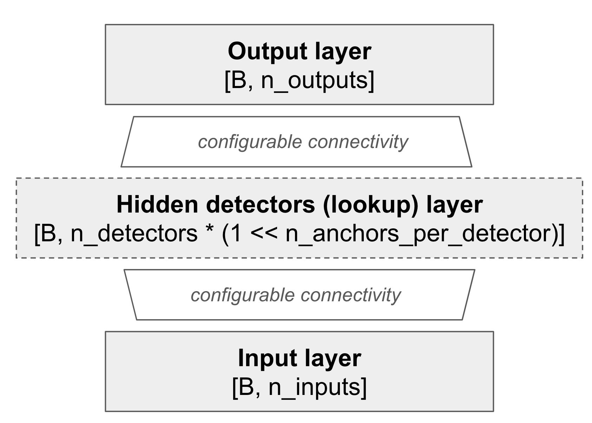
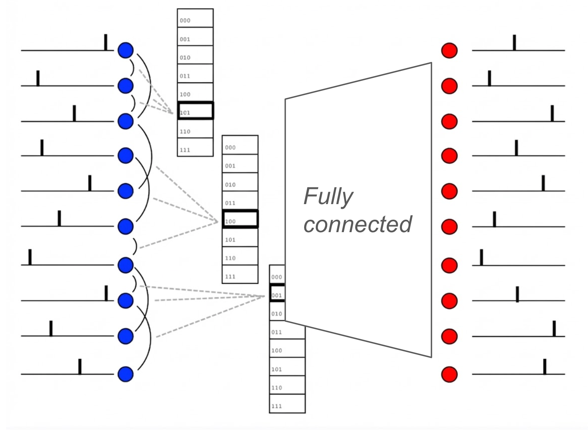
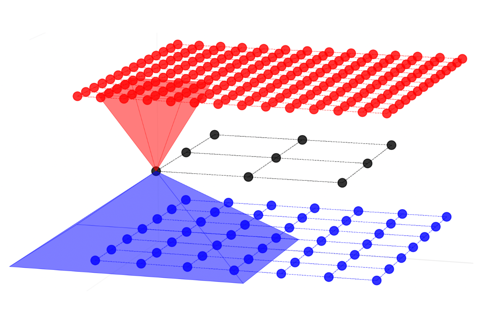
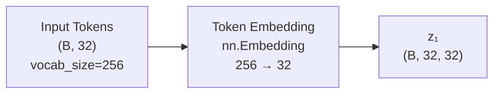
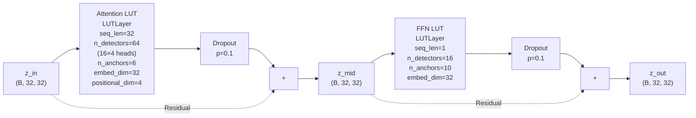
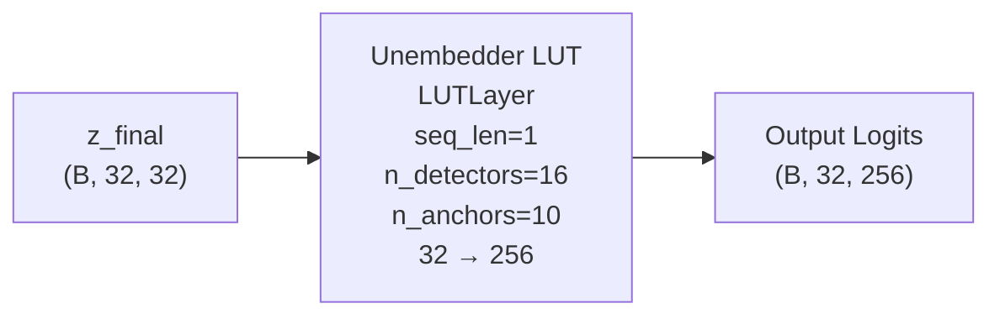
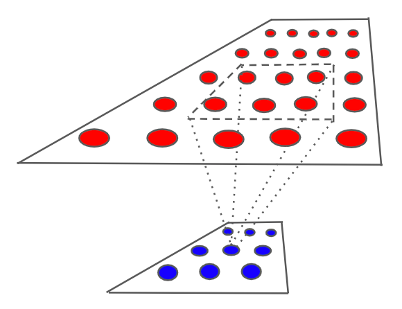

# Spiky Programming Guide

This guide provides a comprehensive overview of how to use the spiky library for building neural networks with synapse growth, LUT layers, and spiking networks.

## Table of Contents

1. [LUTs](#luts)
   - [LUTLayerBasic](#lutlayerbasic)
   - [LUTLayer (sequence_length=1)](#lutlayer-sequencelength1)
   - [ProjectionLUTLayer](#projectionlutlayer)
   - [LUTLayer (sequence_length > 1)](#lutlayer-sequencelength--1)
   - [LUTTransformer](#luttransformer)
2. [SPNet](#spnet)
3. [Synapse Growth](#synapse-growth)

---

## LUTs

### LUTLayerBasic

`LUTLayerBasic` is the abstract base class for all LUT (Look-Up Table) layers. It provides the core functionality for neural network layers that use lookup tables.

#### Abstraction

The core idea behind `LUTLayerBasic` is to define a mapping from an input vector of latencies **x** to an output vector of latencies **y** by introducing a set of lookup tables of a certain size. This mapping is configured through:

1. **Connectivity between tables and input**: For each lookup table, we define anchor pairs that connect to the input vector. These anchor pairs are used to select which entries in the lookup table are activated based on the input.

2. **Connectivity between tables and output**: We connect particular lookup table entries to the outputs. Each entry of the lookup table may be called a "lookup neuron" because it has weighted connections to the outputs.



**Abstract Constructor**

The `LUTLayerBasic` constructor sets up the fundamental structure:

```python
class LUTLayerBasic:
    def __init__(
        self,
        n_inputs,              # Number of input latencies
        n_outputs,              # Number of output latencies
        n_detectors,            # Number of detectors (each manages one lookup table)
        n_anchors_per_detector, # Number of anchor pairs per detector
        is_fully_connected=True | False  # Whether lookup tables are fully connected to outputs
        weights_gradient_policy=GradientPolicy(GradientType.Dense)
    ):
```

- **`n_inputs`**: Number of input latencies in the input vector **x**
- **`n_outputs`**: Number of output latencies in the output vector **y**
- **`n_detectors`**: Number of detectors, where each detector manages one lookup table
- **`n_anchors_per_detector`**: Number of anchor pairs per detector (determines lookup table size: 2^n_anchors_per_detector entries)
- **`is_fully_connected`**: If `True`, all lookup table entries connect to all outputs. If `False`, sparse connections can be configured via `add_lookup_connections()`
- **`weights_gradient_policy`**: Policy for handling weight gradients during backpropagation (see Gradient Policies section below)

**Methods**

The class provides methods that subclasses should use:

1. **`add_detector_connections()`**: Defines the pool of inputs for each detector from which anchor pairs are randomly sampled. 

2. **`initialize_detectors()`**: Performs the anchor sampling itself. After detector connections are established, this method randomly samples anchor pairs from the connected inputs for each detector.

3. **`add_lookup_connections()`**: If `is_fully_connected=False`, this method allows you to set up the projection from lookup table entries to the output vector. It uses the synapse growth engine to establish sparse connections from lookup table entries (lookup neurons) to outputs.

4. **Synapse Growth Engine Usage**: Both detector and lookup connections use the [synapse growth engine](#synapse-growth) to establish sparse connectivity patterns, enabling efficient GPU-accelerated connection generation. Both `add_detector_connections()` and `add_lookup_connections()` methods accept `ChunkOfConnections` input (see [ChunkOfConnections](#chunkofconnections)), so sparse connectivity is genuinely supported.

5. **`compile_lut()`**: Finalizes the layer structure and initializes weights. This must be called after all connections are established and detectors are initialized.

6. **`forward()`**: `LUTLayerBasic` is a PyTorch module that supports forward and backward passes. The forward pass uses a custom autograd function:

```python
class LUTForwardFN(torch.autograd.Function):
    @staticmethod
    def forward(ctx, x, weights, ...):
        # Forward computation
        ...
    
    @staticmethod
    def backward(ctx, grad_output):
        # Backward computation
        ...

def forward(self, x):
    return LUTLayerBasic.LUTForwardFN.apply(x, self._weights, None, self)
```

#### Gradient Policies

The `weights_gradient_policy` parameter controls how weight gradients are computed and stored during backpropagation. It accepts a `GradientPolicy` object with the following options:

```python
from spiky.lut.LUTLayer import GradientPolicy, GradientType

# Available gradient types:
# - GradientType.Dense: Computes gradients in dense format (default)
# - GradientType.Sparse: Computes gradients in sparse format (memory efficient for sparse connections)
# - GradientType.Internal: Handles gradients internally without exposing them to PyTorch's autograd

# Examples:
policy_dense = GradientPolicy(GradientType.Dense, normalized=False)
policy_sparse = GradientPolicy(GradientType.Sparse, normalized=False)
policy_internal = GradientPolicy(GradientType.Internal)  # normalized not supported

# The normalized flag (only for Dense and Sparse):
# - normalized=True: Normalizes gradients before applying updates
# - normalized=False: Uses raw gradients (default)
```

**Gradient Type Options**:

- **`GradientType.Dense`**: Computes and stores gradients in dense format. This is the default and most straightforward option, suitable for most use cases. When `normalized=True`, gradients are normalized before weight updates.

- **`GradientType.Sparse`**: Computes gradients in sparse format, which is memory-efficient when connections are sparse. This can significantly reduce memory usage for large layers with sparse connectivity. The `normalized` flag can be used to normalize sparse gradients. **Note**: Not all optimizers support sparse gradients.

- **`GradientType.Internal`**: An optimization mode for pure SGD without momentum or other optimization techniques. Gradients are updated in place, which saves memory and speeds up training. This mode is most efficient when you only need simple SGD updates without advanced optimizer features. **Note**: `normalized` cannot be combined with `Internal` gradient policy, and `summation_dtype=torch.int32` is incompatible with `Internal` gradient policy.

**Default**: If not specified, `GradientPolicy(GradientType.Dense, normalized=False)` is used.

#### LUT Shared Context

`LUTSharedContext` is a shared resource manager that optimizes memory usage across multiple LUT layers. The key idea is that a shared context may be initialized once and reused in many different LUT layers, saving memory.

If a `shared_context` is not passed to the constructor, a new instance is created automatically to be used only inside that particular LUT layer.

**Shared Resources**:

- **Weight Gradient Buffers**: Reusable buffers for gradient computation
- **Dense-to-Sparse Converters**: Shared converters for gradient sparsification
- **CUDA Streams**: Manages CUDA streams for parallel operations

```python
from spiky.lut.LUTLayer import LUTSharedContext

# Create a shared context (typically one per model)
shared_context = LUTSharedContext()
shared_context.to_device(torch.device('cuda:0'))

# Pass to multiple layers for memory efficiency
layer1 = LUTLayer(..., shared_context=shared_context)
layer2 = LUTLayer(..., shared_context=shared_context)

# Or let each layer create its own context
layer3 = LUTLayer(...)  # Creates its own LUTSharedContext internally
```

---

### LUTLayer (sequence_length=1)

`LUTLayer` is the simplest LUT layer, processing single-step inputs (no sequence).



**Note on Implementation**: Currently, `LUTLayer` is derived from `Conv2DLUTLayer`, which may be confusing. `Conv2DLUTLayer` is a class modeling 2D convolutional connectivity with sliding window and strides. Basic `LUTLayer` may be viewed as a special case—a very simple case of convolution with only one position of a sliding window covering the whole 1D input (which can be viewed as a 2D shape with one dimension equal to 1). `Conv2DLUTLayer` is deprecated because all its functionality is now implemented within [ProjectionLUTLayer](#projectionlutlayer).

#### Constructor Example

```python
from spiky.lut.LUTLayer import LUTLayer, SynapseMeta, GradientPolicy, GradientType
import torch

layer = LUTLayer(
   n_inputs=32,  # Number of input latencies
   n_anchors_per_detector=8,  # Number of anchor pairs per detector
   n_detectors=16,  # Number of detectors
   n_outputs=256,  # Number of output latencies
   weights_gradient_policy=GradientPolicy(GradientType.Dense)
)
```

---

### ProjectionLUTLayer

`ProjectionLUTLayer` creates a projection from a 2D input grid to a 2D output grid using random rectangle receptive fields.

#### Constructor Example

```python
from spiky.lut.LUTLayer import ProjectionLUTLayer, PointSamplingPolicy, PointSamplingType, GradientPolicy, GradientType

layer = ProjectionLUTLayer(
    input_shape=(28, 28),
    output_shape=(56, 56),
    n_anchors_per_detector=3,
    n_detector_groups=13 * 13,
    n_detectors_in_group=4,
    receptive_shape=(5, 5),
    projection_shape=(10, 10),
    projection_prob=1.0,
    detectors_sampling_policy=PointSamplingPolicy(
        PointSamplingType.Grid, grid_h=13, grid_w=13,
        stride_h=2, stride_w=2, pad_h=2, pad_w=2
    )
)
```

**Constructor Parameters**:
- `input_shape`, `output_shape`: Dimensions of the input and output 2D grids
- `n_anchors_per_detector`: Number of anchor pairs per detector
- `n_detector_groups`: Total number of detector groups
- `n_detectors_in_group`: Number of detectors within each group
- `receptive_shape`: Size of the receptive field (height, width) in the input grid from which each detector group samples anchor pairs. This defines the rectangular region in the input grid that detectors in a group can connect to.
- `projection_shape`: Size of the projection window (height, width) in the output grid to which each detector group projects. This defines the rectangular region in the output grid where lookup table entries can connect.
- `projection_prob`: Probability (between 0.0 and 1.0) of connecting to each output position within the projection window. A value of 1.0 means all outputs in the projection window are connected, while lower values create sparser connections.
- `detectors_sampling_policy`: Policy for positioning detector groups (see [PointSamplingPolicy](#pointsamplingpolicy))



Detectors are arranged into groups. Each group is positioned on a virtual plane according to the `PointSamplingPolicy`. The group's location, together with given receptive and projective shapes, determines both the set of inputs from which detector anchors are sampled and the set of outputs to which the detectors project; all detectors within a group share the same projection targets.

#### PointSamplingPolicy

The `PointSamplingPolicy` controls how detector groups are positioned on the virtual plane. It supports three sampling types:

**`PointSamplingType.RandomUniform`** (default):
- Samples detector group positions uniformly at random within the padded region
- Parameters: `pad_h`, `pad_w` (padding from edges, default: 0.0)

**`PointSamplingType.RandomNormal`**:
- Samples detector group positions from a normal distribution
- Parameters:
  - `mu`: Mean of the normal distribution
  - `sigma`: Standard deviation of the normal distribution (must be > 0)
  - `pad_h`, `pad_w`: Padding from edges (default: 0.0)

**`PointSamplingType.Grid`**:
- Arranges detector groups in a regular grid pattern
- Parameters:
  - `grid_h`, `grid_w`: Grid dimensions (height and width in number of groups)
  - `stride_h`, `stride_w`: Stride between grid points (default: 1)
  - `pad_h`, `pad_w`: Offset/shift of the entire grid relative to (0.0, 0.0) (default: 0.0)
- The total number of groups must equal `grid_h × grid_w`
- Note: In Grid mode, `pad_w` and `pad_h` only affect how the whole grid is shifted relative to (0.0, 0.0), not padding in the traditional sense

The grid-based policy is useful for creating structured, regular projections (as in the example above), while random policies allow for more flexible, unstructured arrangements.

---

### LUTLayer (sequence_length > 1)

For sequence processing, `LUTLayer` supports multi-step sequences with positional encodings. This enables the layer to process sequential data similar to how causal attention mechanisms work in transformers, where each position in the sequence can attend to previous positions.

#### Constructor Example

```python
from spiky.lut.LUTLayer import LUTLayer, GradientPolicy, GradientType
import torch

layer = LUTLayer(
    n_inputs=32,
    n_outputs=32,
    n_detectors=16,
    positional_dim=4,
    sequence_length=32,
    n_anchors_per_detector=6,
    concatenation_product=True | False,
    weights_gradient_policy=GradientPolicy(GradientType.Dense)
)
```

#### Sequence Processing and Positional Encodings

**Tensor Shapes**:
- **Input**: `(batch_size, sequence_length, n_inputs)` - A batch of sequences, where each sequence contains `sequence_length` vectors of dimension `n_inputs`
- **Output**: `(batch_size, sequence_length, n_outputs)` - Output sequences with the same length, where each position produces a vector of dimension `n_outputs`

**Positional Encodings**:
Positional encodings are learnable embeddings that encode relative positions in the sequence. Each positional encoding corresponds to a relative position. For a sequence of length `sequence_length`, there are `sequence_length - 1` positional encodings, each representing a relative position offset. Each positional encoding is a vector of dimension `positional_dim`.

- **`positional_dim`**: Dimension of positional embeddings (if > 0). When `positional_dim > 0`, positional encodings are used to incorporate positional information into the lookup process.
- **`unified_pe`**: If `True`, all detectors share the same positional embeddings; if `False`, each detector has its own set of positional embeddings.


#### Pairwise Processing

To process the whole sequence and obtain a sequence of outputs, the LUT layer applies detectors to all pairs of input positions `(i, j)` where `i < j`. For each pair `(i, j)`, the layer computes a lookup index (using either `concatenation_product=True` or `concatenation_product=False` mode) and projects the corresponding lookup entry to the output position `j`. This pairwise processing enables the layer to capture relationships between different positions in the sequence, similar to how attention mechanisms work in transformers.

#### concatenation_product

The `concatenation_product` parameter controls how detectors process sequences:

**`concatenation_product = True`**:
This mode processes each position independently first, then combines the results using positional information.

For each detector:
1. Apply the detector to a pair of input positions independently to obtain a pair of lookup indices
2. Derive the positional index from the positional encoding corresponding to the current pair of positions
4. Bit concatenate all resulting indices (from both input positions and positional encoding) to form a single composite lookup index
4. Use this composite index to look up a value in the lookup table
5. Project the lookup table value to the output

**Deriving Positional Index**: The positional index is derived directly from the positional encoding vector without using anchor pairs. For each positional encoding (a vector of dimension `positional_dim`), the system computes a binary index by checking the sign of each dimension: if the value in dimension `d` is positive, bit `d` is set in the binary index.

**`concatenation_product = False`**:
This mode treats the entire sequence (inputs + positional encodings) as a single input to the detector, producing one lookup index for the entire sequence.

For each detector:
1. Concatenate current pair of input positions and the corresponding positional encoding into a single vector
2. Apply the detector to this concatenated vector to obtain a single lookup index
3. Use this index to look up a value in the lookup table
4. Project the lookup table value to the output

---

### LUTTransformer

`LUTTransformer` is a transformer architecture built using LUT layers for attention and feed-forward networks.

#### Constructor Example

```python
from spiky.lut.LUTTransformer import LUTTransformer
from spiky.lut.LUTLayer import SynapseMeta, GradientPolicy, GradientType
import torch

transformer = LUTTransformer(
    vocab_size=256,                # Vocabulary size
    embedding_dim=64,               # Embedding dimension
    context_size=32,                 # Context length
    positional_dim=4,              # Positional embedding dimension
    num_layers=4,                    # Number of transformer layers
    num_heads=4,                     # Number of attention heads
    n_detectors=16,                  # Detectors per layer
    n_anchors_per_detector=10,        # Anchors for FFN
    n_anchors_per_detector_attention=6,  # Anchors for attention
    concatenation_product=True,
    unified_pe=False,
    weights_gradient_policy=GradientPolicy(
        type=GradientType.Dense,
        normalized=False
    )
)

# Forward pass
tokens = torch.randint(0, 10000, (batch_size, 32), device='cuda:0')
logits = transformer(tokens)  # Shape: (batch_size, 32, 10000)
```

#### Architecture

**Diagram 1: Input Embedding**



**Diagram 2: Transformer Layer** (repeated `num_layers` times)



**Diagram 3: Output Unembedding**



---

## SPNet

`SpikingNet` implements a spiking neural network using the Izhikevich neuron model with STDP (Spike-Timing-Dependent Plasticity) learning.

#### Constructor Example

```python
from spiky.spnet.spnet import SpikingNet, NeuronMeta, SynapseMeta
from spiky.util.synapse_growth import SynapseGrowthEngine, GrowthCommand
import torch

# Define neuron types
neuron_metas = [
    NeuronMeta(
        neuron_type=0,
        cf_2=0.04, cf_1=5.0, cf_0=140.0,  # Izhikevich parameters
        a=0.02, b=0.2, c=-65.0, d=8.0,
        spike_threshold=30.0,
        stdp_decay=0.95,
        ltp_max=1.0,
        ltd_max=1.2
    )
]

# Define synapse types
synapse_metas = [
    SynapseMeta(
        learning_rate=0.05,
        min_delay=0,
        max_delay=10,
        min_weight=0.0,
        max_weight=10.0,
        initial_weight=5.0,
        weight_decay=0.9,
        weight_scaling_cf=0.01
    )
]

# Create network
spnet = SpikingNet(
    synapse_metas=synapse_metas,
    neuron_metas=neuron_metas,
    neuron_counts=[1000],  # 1000 neurons of type 0
    initial_synapse_capacity=10000,
    summation_dtype=torch.float32
)

# Move to device
spnet.to_device('cuda:0')
```

#### Connectivity Setup

Connectivity is established using the synapse growth engine:

```python
# Get neuron IDs
input_neuron_ids = spnet.get_neuron_ids_by_meta(0)[:100]  # First 100 as inputs
output_neuron_ids = spnet.get_neuron_ids_by_meta(0)[100:200]  # Next 100 as outputs

# Create growth engine
growth_engine = SynapseGrowthEngine(device=torch.device('cuda:0'))

# Register neuron types
growth_engine.register_neuron_type(
    max_synapses=0,
    growth_command_list=[]
)
growth_engine.register_neuron_type(
    max_synapses=50,
    growth_command_list=[
        GrowthCommand(
            target_type=0,
            synapse_meta_index=0,
            x1=-5.0, y1=-5.0, z1=0.0,
            x2=5.0, y2=5.0, z2=1.0,
            p=0.3,  # 30% connection probability
            max_synapses=50
        )
    ]
)

# Add neurons with spatial coordinates
input_coords = torch.rand(100, 3) * 10.0  # Random positions in 10x10x10 cube
growth_engine.add_neurons(0, input_neuron_ids, input_coords)

output_coords = torch.rand(100, 3) * 10.0 + torch.tensor([0.0, 0.0, 10.0])
growth_engine.add_neurons(1, output_neuron_ids, output_coords)

# Grow connections
connections = growth_engine.grow(random_seed=42)

# Add connections to network
spnet.add_connections(connections, random_seed=42)
spnet.compile()
```

#### Processing Ticks

```python
# Process network for multiple time steps
batch_size = 10
n_ticks = 1000
n_input_ticks = 100

# Input spikes: (batch_size, n_input_ticks, n_input_neurons)
input_values = torch.rand(batch_size, n_input_ticks, 100, device='cuda:0')
input_values = (input_values > 0.95).float()  # Sparse spike pattern

# Process
spnet.process_ticks(
    n_ticks_to_process=n_ticks,
    batch_size=batch_size,
    n_input_ticks=n_input_ticks,
    input_values=input_values,
    do_train=True,  # Enable STDP learning
    input_neuron_ids=input_neuron_ids,
    do_reset_context=True
)

# Export neuron data
output_neuron_ids = spnet.get_neuron_ids_by_meta(0)[100:200]
voltage_data = spnet.export_neuron_data(
    neuron_ids=output_neuron_ids,
    batch_size=batch_size,
    data_type=NeuronDataType.Voltage,
    first_tick=0,
    last_tick=n_ticks-1
)  # Shape: (batch_size, n_neurons, n_ticks)
```

---

## Synapse Growth

### Basic Idea

The synapse growth engine is a powerful mechanism for establishing connections between neurons based on their spatial arrangement in 3D space. The core concept is:

1. **Place neurons in 3D space**: Each neuron is assigned a 3D coordinate (x, y, z)
2. **Define growth rules**: Specify spatial regions (cuboids) relative to each neuron where connections can be formed
3. **Parallel growth**: The engine uses a spatial index to efficiently find candidate connections and grows synapses in parallel on the GPU

The spatial indexing system automatically selects the most uniform axis for efficient spatial queries, enabling fast connection generation even for large networks.



### ChunkOfConnections

The `grow()` method returns a `ChunkOfConnections` object, which is a special data structure optimized for parallel processing on CUDA. This structure stores sparse connectivity information in a format that enables efficient GPU operations:

- **Grouped by source neurons**: Connections are organized into groups, where each group contains all connections originating from a single source neuron
- **Linked groups**: For neurons with many connections, the structure uses linked groups to handle connections that exceed a single group's capacity
- **Memory efficient**: The structure uses a compact representation that minimizes memory usage while maintaining fast access patterns
- **GPU-optimized layout**: The data layout is designed to maximize parallelism and minimize memory coalescing issues during CUDA kernel execution

In normal use cases, you pass the `ChunkOfConnections` object directly to CUDA modules (such as `SpikingNet.add_connections()` or LUT layer methods) which can efficiently process the optimized structure. To extract the actual connection count or inspect individual connections for debugging purposes, you can use the `unpack_chunk_of_connections()` utility function, which unpacks the optimized structure into a more readable format.

### Example: Creating Connections with Spatial Growth

```python
from spiky.util.synapse_growth import SynapseGrowthEngine, GrowthCommand
from spiky.util.test_utils import unpack_chunk_of_connections
import torch

# Initialize the growth engine
device = torch.device('cuda:0')
growth_engine = SynapseGrowthEngine(device=device)

# Type 0: Source neurons
# Growth command: search a 5x5x1 cuboid region with 100% probability
growth_engine.register_neuron_type(
    max_synapses=10,
    growth_command_list=[
        GrowthCommand(
            target_type=1,  # Connect to input neurons
            synapse_meta_index=0,
            x1=-2.5, y1=-2.5, z1=0.0,  # Lower bounds
            x2=2.5, y2=2.5, z2=2.0,    # Upper bounds
            p=1.0,  # 100% connection probability
        )
    ]
)

# Register neuron types with growth rules
# Type 1: Target neurons (no outgoing connections)
growth_engine.register_neuron_type(
    max_synapses=0,
    growth_command_list=[]
)

# Source neurons are arranged in a flat 10x10 grid with z coordinate 0.0
source_ids = torch.arange(1, 11, dtype=torch.int32)
source_coords = torch.tensor([
    [5.0, 5.0, 0.0],  # Center
    [2.0, 2.0, 0.0],  # Top-left
    [8.0, 2.0, 0.0],  # Top-right
    [2.0, 8.0, 0.0],  # Bottom-left
    [8.0, 8.0, 0.0],  # Bottom-right
    [5.0, 2.0, 0.0],  # Top-center
    [5.0, 8.0, 0.0],  # Bottom-center
    [2.0, 5.0, 0.0],  # Left-center
    [8.0, 5.0, 0.0],  # Right-center
    [5.0, 5.0, 0.0],  # Center (duplicate)
], dtype=torch.float32)
growth_engine.add_neurons(neuron_type_index=0, identifiers=source_ids, coordinates=source_coords)

# Target neurons also form a grid but with z coordinate 1.0
target_ids = torch.arange(11, 111, dtype=torch.int32)
target_coords = torch.zeros(100, 3)
for i in range(100):
    target_coords[i] = torch.tensor([i % 10, i // 10, 1.0])
growth_engine.add_neurons(neuron_type_index=1, identifiers=target_ids, coordinates=target_coords)

# Grow synapses
chunk_of_connections = growth_engine.grow(random_seed=42)
_, connection_count = unpack_chunk_of_connections(chunk_of_connections)
print(f"Generated {connection_count} connections")
```
