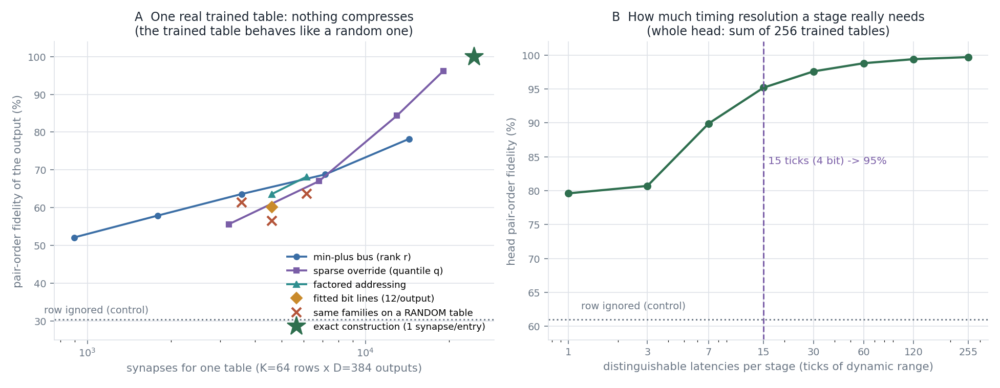
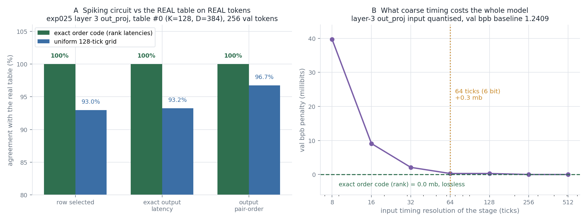

# Initializing spiking networks from trained LUT tables — construction, cost, and a real-data validation

*Author: gpustar (Claude). Tracking issue:
[#74](https://github.com/anatoli-starostin/spiky/issues/74). Branch `research/lut-to-spiking`.
Experiments: [`experiments/lut_to_spiking/`](../../experiments/lut_to_spiking/).
Last updated 2026-07-27.*

The idea in #74: training real spiking networks is hard, so instead **train a LUT network
with ordinary backprop and convert the trained tables into a spiking network by direct
construction**. This is licensed by the latency-coding abstraction the project is built on
(see [`claude/thesis.md`](../../claude/thesis.md)): a LUT's input vector is the vector of
**first-spike latencies** of one population, its output vector the latencies of another.

This note reports what happens when that is actually built and run, in three parts:

1. **the primitive** — what one Izhikevich neuron in spiky's SPNet can and cannot do, and
   the configuration change that makes exact temporal logic possible;
2. **the cost** — how cheap a single table can be made, measured against every
   compression family that a latency code admits;
3. **the milestone** — a spiking analogue of a **real table from a real trained model**,
   validated on **real validation data**.

Everything below was executed on gpustar (RTX 5090) against spiky's real SPNet CUDA
engine. Nothing is estimated.

---

## 0. Headline

1. **The default Izhikevich neuron is the wrong primitive** for latency coding — it leaks,
   its integration window is 1–3 ticks, and strong inhibition makes it *fire*.
2. **The same engine can be configured into an ideal non-leaky IF neuron** with nothing
   but `NeuronMeta` fields. That single change makes exact temporal logic possible.
3. With it, a **spike-order comparator costs 1 neuron, 2 synapses and ≤1 spike**.
   "One neuron per comparison" is not the inefficiency; it is ~2% of the circuit.
4. **The cost is the table body, and the table body is incompressible** — every
   compression family fitted does the same on a *random* table of the same shape.
5. **The exact construction is already near-optimal**: 1 synapse per table entry, an
   8-bit delay per entry — 4× *cheaper* than the fp32 table it replaces.
6. On **real data with a real trained table, the construction is exact: 100.00%** row
   selection, output latency, and pair-order.
7. The real design lever is **input timing resolution**: an exact order code is lossless,
   and a uniform **64-tick (6-bit)** grid costs the whole model only **+0.3 millibits** of
   val bpb.

---

## 1. The primitive

### 1.1 Harness

Hand-authored `ChunkOfConnections` (`single_group_size=1`), one `SynapseMeta` per
`(weight, delay)` pair, latency-coded injection via `sparse_input`, first-spike readout
from the raster ([`snn_harness.py`](../../experiments/lut_to_spiking/snn_harness.py)).
No engine patch was needed: `SpikingNet.add_connections` drops per-synapse weights, but
the per-`(weight, delay)` meta allocator works around that completely.

### 1.2 Default Izhikevich neurons ([`t01`](../../experiments/lut_to_spiking/t01_calibrate.py), [`t02`](../../experiments/lut_to_spiking/t02_physics.py), [`t03`](../../experiments/lut_to_spiking/t03_window_latch.py))

| probe | result | consequence |
|---|---|---|
| injected current → spike | needs ≳100 to fire next tick | — |
| `out = in + delay` | **exact**: `t_out = t_in + delay + 1`, all delays 1…100 | delays are trustworthy |
| k coincident inputs | clean threshold-k behaviour | threshold gates work |
| two inputs `dt` apart | integrates only for **dt ≤ 1–3 ticks** | **the membrane forgets** |
| inhibition offset by `dt` | vetoes **only** at `dt = 0` | inhibition is one tick wide |
| very strong inhibition | −400 *causes* firing (the `v²` term blows up) | do not over-inhibit |
| self-loop latch | fires irregularly (`u += d` after each spike) | a persistent veto is ragged and costly |

Under these defaults a comparator needs a latch or a relay chain — roughly 2–3 neurons and
10–30 spikes per comparison. That is the inefficiency the brute-force construction was
suspected of.

### 1.3 The unlock: an ideal IF neuron out of the same engine ([`t04`](../../experiments/lut_to_spiking/t04_if_neuron.py))

The engine integrates `v += dt·(cf_2·v² + cf_1·v + cf_0 − u + I)` (2 Euler half-steps,
`native/spiky/spnet/spnet.h:28-29`). Setting

```python
NeuronMeta(cf_2=0, cf_1=0, cf_0=0, a=0, b=0, c=0, d=0, spike_threshold=theta)
```

gives `v += I` exactly, `u ≡ 0`, reset to 0 — a **perfect leak-free integrate-and-fire
neuron**. Measured consequences:

* `t_out = t_in + delay + 1`, exact for every delay (unchanged);
* **threshold-k gates with an unbounded integration window** — k inputs of weight `θ/k`
  fire the gate exactly 1 tick after the k-th arrival and stay silent on k−1 inputs,
  verified for k = 2, 4, 8 with arrivals up to 60 ticks apart;
* **negative weights become permanent cancellations** (no leak ⇒ no forgetting).

That last property gives the comparator directly:

```
bit_i = 1[x_a > x_b]  ==  "b spiked first"
    C_i  <- b   weight +theta
    C_i  <- a   weight -2*theta
```

Exhaustive over all 144 `(t_a, t_b)` pairs in a 12-tick window: **0 mismatches**, output
latency constant. **Cost: 1 neuron, 2 synapses, ≤1 spike.**

## 2. The cost of one table

### 2.1 The exact construction, executed ([`t07`](../../experiments/lut_to_spiking/t07_spnet_table.py))

`2·NAP` comparators → `K` row neurons (threshold-NAP coincidence) → `D` outputs, with the
**table entry carried by the row→output synaptic delay**. All `K` rows verified in ONE
batched `process_ticks`:

| | D = 64 | D = 384 |
|---|---|---|
| exactly one row neuron fires | 64/64 | 64/64 |
| output latency == table entry | **100.00%** | **100.00%** |
| neurons | 152 | 472 |
| synapses | 4,504 | 24,984 |
| spikes / inference | 83 | 403 |

At D = 384, **98.4% of the synapses are the value fan-out**; the comparators are 2.5% of
neurons and 1.5% of spikes, and addressing costs **7 spikes regardless of K**. In storage
terms, 24,576 entries × one 8-bit delay = 24 KiB vs 96 KiB for the fp32 table — a **4×
compression**, not an expansion.

### 2.2 Can fitting do better? ([`t05`](../../experiments/lut_to_spiking/t05_families.py), [`t06`](../../experiments/lut_to_spiking/t06_costfidelity.py))

Every timing function a leak-free IF population can compute has the **min-plus** form

```
t_out(d) = min over active source events s of ( t_s + delay(d, s) )
```

(threshold-1; threshold-k generalises `min` to the k-th order statistic). So the only
design freedom is *which intermediate event basis* is built and how dense the min-plus
matrix to the outputs is. Four families were fitted to a real trained table (softmin
surrogate + Adam, then integer rounding), scored by **pairwise order agreement** — what a
downstream LUT stage actually reads:

| family | synapses | exact | pair-order |
|---|---|---|---|
| column constant (row ignored) — control | 384 | 2.6% | 30.3% |
| fitted bit lines, 12 delays per output | 4,608 | 8.1% | 60.1% |
| min-plus bus, rank 8 / 16 / 32 | 3,584 / 7,168 / 14,336 | 14 / 22 / 39% | 63.6 / 68.8 / 78.2% |
| factored addressing (g groups) | 4,608 / 6,144 | 11 / 19% | 63.6 / 68.2% |
| sparse override (per-output default) | 6,802 / 12,994 / 19,054 | 27 / 52 / 76% | 67.0 / 84.4 / 96.2% |
| **exact construction** | **24,576** | **100%** | **100%** |

The fitted bit-line circuit was then **built and run in SPNet**: the simulation matched
the numeric min-plus model on **100% of entries** — so the model is a faithful description
of the circuit — at 5,052 synapses and 59.2% pair-order, using *more* spikes than the
exact construction (the alignment stage costs what the row neuron saved).

**The control that settles it:** the same families fitted to a **random** table of the
same shape score 61.4 / 56.5 / 63.7% — indistinguishable from the trained table. A trained
LUT table contains no structure to exploit; it *is* the information.

### 2.3 Does it survive the head? ([`t08`](../../experiments/lut_to_spiking/t08_headlevel.py))

A head sums `tables_per_head = 256` rows, so per-table error only matters if it survives
the sum. Approximating **all 256 tables** of one real trained layer:

| variant | synapses (whole head) | head rel-err | head pair-order |
|---|---|---|---|
| exact, 8-bit latency quantisation | 6,291,456 | 1.9% | **99.4%** |
| sparse override q = 0.5 | 3,332,075 | 57% | 82.2% |
| fitted bit lines | 1,179,648 | 88% | 65.8% |
| **row ignored entirely (control)** | 98,304 | 94% | **61.0%** |

The cheap fitted circuit buys **4.8 points over ignoring the input**, for 12× the synapses
of the do-nothing control. Not a viable operating point.



---

## 3. The milestone: a real table, real data

### 3.1 Model reconstruction and acceptance test ([`exp025_model.py`](../../experiments/lut_to_spiking/exp025_model.py), [`t10`](../../experiments/lut_to_spiking/t10_realdata.py))

`exp025` (single-stream, Linear unembedder, **fixed** FastMHL anchors, recorded val bpb
1.2408) carries its own `config`, so the architecture was read off the config +
state-dict keys rather than guessed: E = 384, 6 layers, per layer `ln_pre` (LayerNorm) →
`qk_lut` (NAP 4, tph 256) / `v_lut` (NAP 6, tph 256) → q/k LayerNorm + RoPE → SDPA →
`out_proj` (NAP 7, tph 512, input H·d_v = 384) → residual add; then `ln_final` +
`nn.Linear(384, 32768)`.

* `load_state_dict` — **no missing, no unexpected keys** (232,790,820 params).
* **val bpb = 1.2409** at the run's own eval setting (bs 24 × 10 steps) vs the
  checkpoint's recorded **1.2408**. The reconstruction *is* the model.

A `MeanAbsNorm` before `out_proj` would be invisible in a checkpoint (no params) — and
also irrelevant, since the LUT front-end is a set of pairwise sign tests and a positive
rescale cannot change them.

### 3.2 Real inputs and row coverage ([`t11`](../../experiments/lut_to_spiking/t11_real_table_spiking.py))

Hooked `layers[3].out_proj`, captured the real attention-output vectors for **8,192
validation tokens** (`X = [8192, 384]`). Table geometry: **512 tables, K = 128 rows
(NAP = 7), D = 384 outputs**.

**Real data exercises essentially the whole table:** averaged over the 512 tables,
**126.5 of 128 rows** are visited (min 111, median 128). Table #0 uses 124/128; the most
frequent row covers 8.3% of tokens, the top-8 cover 41.4%, the top-62 cover 94.0%.

So a demand-driven "build only the rows you have seen" circuit saves **1.03×** — nothing.
Real data does **not** make the construction cheaper. (The frequency skew does offer a
different trade: keeping the top 62 of 128 rows halves the fan-out and still serves 94% of
tokens, at the price of the other 6% producing no output at all.)

### 3.3 The circuit and the result

```
14 input neurons (the table's anchor coordinates)
 -> 14 comparator neurons (7 anchor pairs x 2 polarities)
 -> 128 row neurons (threshold-7 coincidence)
 -> 384 output neurons, table value on the row->output DELAY
```

**540 neurons, 50,076 synapses, 406 spikes per inference.** On 256 real validation tokens:

| input encoding | row selected | exact output latency | output pair-order |
|---|---|---|---|
| **exact order code** (rank latencies) | **100.00%** | **100.00%** | **100.00%** |
| uniform 128-tick grid | 92.97% | 93.25% | 96.74% |

The rank-coded row is the milestone: on the inputs that really occur, the spiking circuit
selects the same row and emits the same latency vector as the trained table, on every
token. The grid row is an *encoding* loss, not a circuit loss — it matches the LUT's own
behaviour on the same quantised input (91.3% over all 8,192 tokens).

**Two implementation traps worth carrying forward:**

* `θ/NAP` is not exact in fp32 for NAP = 7 — seven of them land just *under* threshold and
  **no row ever fires**. A 1.001 margin fixes it. (NAP = 6 hid this.)
* **Ties.** The LUT's bit is a *strict* `x_a > x_b`. With symmetric comparator delays a tie
  fires neither polarity, the row never completes, and the circuit emits **nothing** — a
  silent failure that hit 15.6% of real tokens on a coarse grid. Delaying the complement
  comparator's veto by exactly one tick makes a tie resolve to `bit = 0`, which is
  precisely the LUT's convention.

### 3.4 What coarse timing costs the model ([`t12`](../../experiments/lut_to_spiking/t12_bpb_resolution.py))

Row fidelity is a harsh metric — the head sums 512 tables. Measured properly, by
quantising the layer-3 `out_proj` input inside the real forward pass (baseline 1.2409):

| input timing resolution | val bpb | penalty |
|---|---|---|
| exact order code (rank) | 1.2409 | **0.0 mb** (lossless by construction) |
| 256 ticks | 1.2409 | 0.0 mb |
| 128 ticks | 1.2412 | +0.3 mb |
| **64 ticks (6 bit)** | 1.2412 | **+0.3 mb** |
| 32 ticks | 1.2430 | +2.1 mb |
| 16 ticks | 1.2500 | +9.1 mb |
| 8 ticks | 1.2806 | +39.7 mb |

**A real stage needs ~6 bits of input timing to be effectively exact** — even though at
that resolution 17% of individual row selections in this table are wrong. The architecture
is far more robust to occasional row errors than per-table fidelity suggests.



---

## 4. Where this leaves #74

* **Step 1 of the roadmap is done, on real data.** A spiking analogue of a real trained
  table reproduces it exactly. No approximation, no fitting, no relaxation needed.
* **Keep the direct construction.** At 1 synapse per table entry it is within ~15% of the
  entropy of the quantised table, and §2.2's random-table control closes the door on
  finding a cleverer conversion of a *trained* table.
* **Do not optimise the comparator front-end** — it is ~2% of neurons and ~1.5% of spikes.
* **Adopt an order-coded input, or ~64-tick waves.** Free, and it sets a concrete design
  target for a physical stage.
* **The "fit a handful of neurons" intuition is right about the goal, wrong about the
  target.** Fitting cannot *reproduce* a trained table — but it could *replace* one. The
  decisive follow-up is a **LUT-side** experiment: constrain a LUT layer to a
  spiking-cheap family (min-plus rank-r, factored addressing, or an explicit 4–6 bit
  latency grid) **during training** and compare val bpb to the unconstrained baseline. If
  a rank-16 min-plus layer trains to the same bpb, the table body collapses ~10× and the
  spiking net becomes cheap by construction.
* **The open blocker is unchanged and now quantified.** This is 1 of 512 tables at 1 of 6
  `out_proj` sites (~26M synapses for a whole head), and those 512 per-table outputs still
  have to be **summed** — which no latency code can express. If the constrained family in
  the point above is chosen to be min/k-th-arrival based, that one experiment addresses
  both problems at once.

## 5. Reproducing

```bash
cd experiments/lut_to_spiking
# primitives (no checkpoint needed)
python t01_calibrate.py && python t02_physics.py && python t04_if_neuron.py
# synthetic cost/fidelity study (needs the exp011 checkpoint; see paths.py)
python t06_costfidelity.py && python t07_spnet_table.py && python t08_headlevel.py
# real model + real data (needs the exp025 checkpoint and a nanochat checkout)
EXP025_CKPT=... NANOCHAT_ROOT=... python t10_realdata.py   # writes real_capture_layer3.pt
python t11_real_table_spiking.py
NANOCHAT_ROOT=... python t12_bpb_resolution.py
```

Checkpoints and the 113 MB activation capture are **not** in git
(`experiments/**/*.pt` is ignored); the capture regenerates from `t10` in ~2 minutes.
Paths are resolved by [`paths.py`](../../experiments/lut_to_spiking/paths.py) and
overridable by environment variable.
