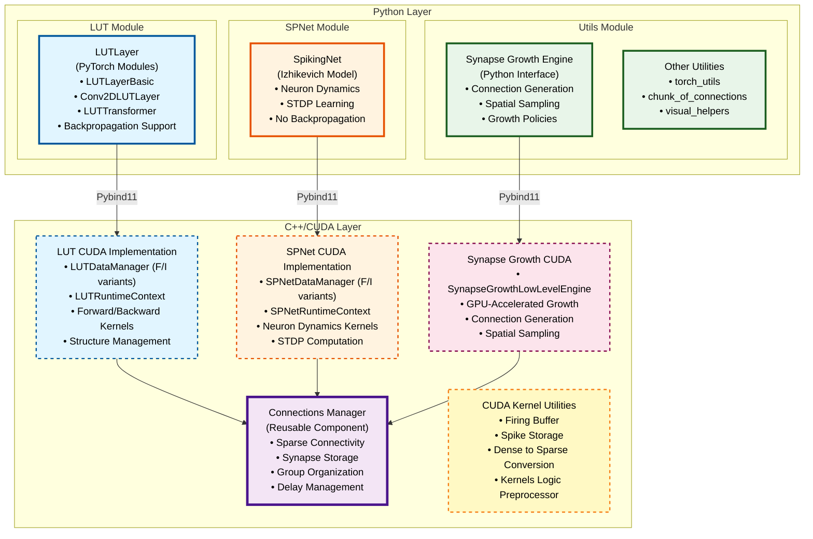

# LUT Architecture Diagrams

## Project Architecture Overview

This diagram shows the complete architecture of the spiky project, including both Python and C++/CUDA layers.

## Component Descriptions

### Python Layer

**LUT Module**: Full-fledged PyTorch modules implementing different versions of LUT networks with backpropagation support. Includes basic layers, convolutional and projection layers, and transformer like architecture. Supports gradient computation and integration with PyTorch's autograd system.

**SPNet Module**: Implementation of spiking network model from polychronization paper (Izhikevitch, 2003). Handles neuron dynamics using the Izhikevich model, implements STDP (Spike-Timing-Dependent Plasticity) learning, but does not support backpropagation.

**Utils Module**: Collection of useful utilities. The **Synapse Growth Engine** is particularly important - it provides connection generation capabilities used by both LUT and SPNet modules. Supports various growth policies (convolutional, random rectangles and others) and spatial sampling strategies.

### C++/CUDA Layer

**LUT CUDA Implementation**: CUDA implementation of LUT networks. Includes data managers, runtime context, and CUDA kernels for forward and backward pass computations. Manages structure, compilation, and GPU execution.

**SPNet CUDA Implementation**: CUDA implementation of Izhkevitch spiking network model. Includes data managers, runtime context, and CUDA kernels for neuron dynamics, spike detection, and STDP weight updates.

**Connections Manager**: Reusable component responsible for effective sparse connectivity handling. Used by both LUT and SPNet implementations. Manages synapse storage, organizes connections into groups for efficient GPU access, handles delays, and provides indexed access patterns. This shared infrastructure enables efficient sparse neural network operations.

**Synapse Growth CUDA**: GPU-accelerated implementation of synapse growth. The core idea is placing neurons in 3D space and allowing them to "grow" synapses using spatial search. `SynapseGrowthLowLevelEngine` performs connection generation and spatial sampling directly on GPU, enabling efficient spatial queries and connection generation based on neuron positions and growth policies. Provides high-performance connection generation for both LUT and SPNet modules.

**CUDA Kernel Utilities**: Supporting utilities for CUDA kernel operations. Includes firing buffer for spike storage and event management, spike storage for recording spike events, dense to sparse conversion utilities for tensor operations, and kernels logic preprocessor for processing proto-defined kernel logic files.
