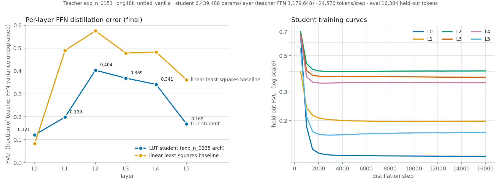
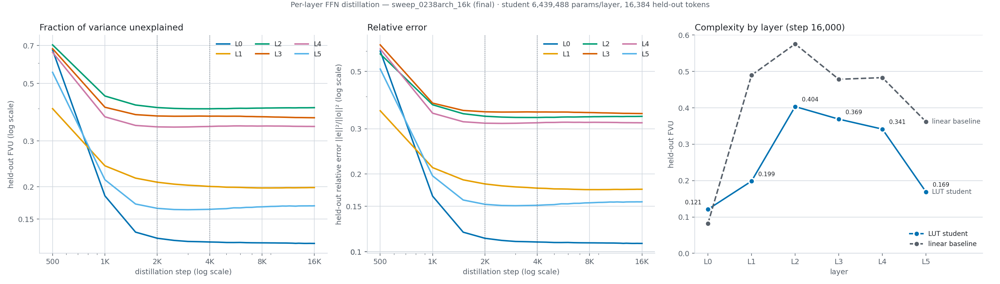

# Per-layer FFN distillation — how hard is each layer's FFN for a fixed LUT?

A frozen, fully trained vanilla transformer is the **teacher**. For each layer we train an
independent `CompressionMHL(LightMHL)` **student** to reproduce that layer's FFN map

```
h = ln2(x)   ->   o = mlp(h)
```

on real data, then measure how much of the teacher's FFN output the student leaves
unexplained. With the student architecture and budget **held fixed across layers**, that error
is a per-layer "FFN complexity" measure.

## Run it

```bash
cd experiments/ffn_replacement/distill
python distill_ffn.py --out runs/<name> --steps 16000      # all 6 layers, one process
python plot_distill.py runs/<name>                          # -> distill_per_layer.png
python analyze_curves.py runs/<name>                        # -> curves_by_layer.png, analysis.json
CUDA_VISIBLE_DEVICES= python rank_floor.py                  # FVU floor from the output rank
bash run_ladder_heads.sh                                    # 4K-native capacity ladder over H
python plot_ladder.py runs/ladder4k_H4 runs/ladder4k_H8 ... # -> runs/ladder4k_heads.png
```

Useful flags: `--layers 0,3,5`, `--student-config <run>/config.json`,
`--student-overrides '<json>'`, `--cell-smoothness <lambda>`, `--student-chunks auto|N`,
`--max-steps-smoke 200`.

## Defaults

| | |
|---|---|
| teacher | `runs/exp_n_0151_long48k_untied_vanilla` — dense 4×GELU MLP, 6L/d384, 48,000 steps, corrected val bpb **1.1154196**, 35,792,640 params |
| student architecture | read from `runs_corrected/exp_n_0238_pureLUT0193_TVlam10_48k_seed1/config.json`: LightMHL, `margin`, no z_norm, constant cell, H=4, tph=128, nap=8, inner 48→48 — **6,439,488 params/layer** (the teacher FFN is 1,179,648) |
| data | fresh train-split tokens each step, 48 rows × 512 = 24,576 tokens/step |
| optimiser | `train_fixed.py`'s exactly: AdamW (0.9, 0.95), wd 0.1, LUT tables no-decay, warmup 10% then cosine to 0.1× **over `--steps`**, clip 1.0, lr 3e-4 |
| metric | held-out val slab, 32 rows = 16,384 tokens, leading 12 rows skipped as in the eval protocol |

## Design choices, and why

- **Exact activations.** Forward hooks on each block's `mlp` capture its true input and output.
  The teacher forward stops after the deepest requested layer and never computes the
  32,768-way unembedding.
- **Fresh data every step**, so a student cannot memorise a fixed activation set. Error is
  always measured on held-out val tokens, never on training samples.
- **All layers in one process, on the same batches.** Each student has its own optimiser and
  is otherwise independent, but every layer sees byte-identical batches, steps and LR — the
  cleanest same-budget comparison, and N-layers cheaper than separate runs. The data order
  does not depend on `--seed`, so separate runs (e.g. ladder points) also see identical batches.
- **The student is the LM code path, not a re-implementation.** It is the `ffn` of a
  `MinimalBlock` built from a run config, initialised exactly as `MinimalGPT` does (normal
  std 0.02 on Linear weights, decompress weight zeroed). LUT kwargs, seeds and init are
  therefore byte-identical to what an LM training run of that config builds. A zeroed
  decompress means every student starts at output 0.
- **FVU is the headline, not MSE.** `FVU = MSE / Var(teacher output)`, the fraction of
  variance left unexplained. Raw MSE is **not comparable across layers**: the teacher's FFN
  output variance at layer 5 is ~6× the other layers', so an MSE ranking would mostly rank
  output scale. MSE and relative error `‖e‖² / ‖o_t‖²` are reported alongside. Note a zero
  predictor scores FVU slightly **above** 1 when the output has a non-zero mean.
- **A linear baseline calibrates the scale.** A closed-form least-squares affine map `h → o`
  is fit per layer on train tokens and scored on the same val slab. It answers "is this FFN
  nonlinear at all", and whether the LUT beats a plain linear layer on it.
- **The output rank bounds the student.** `decompress` is `Linear(H·inner_out → 384)`, so the
  student's output lives in a rank-`H·inner_out` affine subspace and its FVU cannot go below
  the teacher-output variance outside the top `H·inner_out` principal directions
  (`rank_floor.py`). At H=4, inner_out=48 that is rank 192 of 384.
- **The TV cell-smoothness regulariser is off by default.** exp_n_0238 trains with it
  (λ = 10), but it is a training-objective choice, not architecture; turning it on here would
  mix "how hard is this layer" with "how strongly was the student smoothed". It is one flag.
- **Large students are stepped in chunks.** LightMHL's fused read is `F.embedding_bag` with
  `per_sample_weights`, whose CUDA backward faults ("illegal memory access") once
  tokens × tables × output_dim reaches 2³¹ — first hit at H=32 (24,576 × 4,096 × 48 = 4.8e9).
  `--student-chunks auto` (the default) splits such a student's step into the fewest
  token-weighted chunks that stay under the limit; the gradient is the full-batch gradient,
  and students under the limit take the unchunked path unchanged.

## Results: `runs/sweep_0238arch_16k` (exp_n_0238 architecture, 16,000 steps)

All 6 layers in one process: 0.141 s/step, 38 min, 4.6 GB GPU.

| layer | teacher out var | linear FVU | **LUT FVU** | LUT / linear | rel err | plateau step (≤2% of final) | rank-192 FVU floor |
|---|---|---|---|---|---|---|---|
| L0 | 0.07255 | 0.0818 | **0.1209** | 1.479 | 0.1077 | 3,000 | 0.0935 |
| L1 | 0.03718 | 0.4898 | **0.1985** | 0.405 | 0.1747 | 3,500 | 0.0737 |
| L2 | 0.02793 | 0.5757 | **0.4035** | 0.701 | 0.3349 | 2,000 | 0.1252 |
| L3 | 0.05088 | 0.4785 | **0.3689** | 0.771 | 0.3434 | 2,000 | 0.1166 |
| L4 | 0.08666 | 0.4831 | **0.3415** | 0.707 | 0.3163 | 1,500 | 0.1091 |
| L5 | 0.47301 | 0.3617 | **0.1688** | 0.467 | 0.1562 | 1,500 | 0.0497 |




- **Hardest first by FVU: L2 > L3 > L4 > L1 > L5 > L0.** The same order holds at steps 2,000,
  4,000 and 16,000 (Kendall τ = 1). By relative error L2 and L3 swap (L3 > L2 > L4 > L1 > L5 > L0),
  also at every step.
- **The middle layers are the hard ones.** On L2–L4 the LUT removes only 23–30% of what a
  linear map leaves unexplained (FVU 0.34–0.40). On L1 and L5 it removes 60% and 53%.
- **L0 is almost linear, and the LUT is worse than linear there** (0.121 vs 0.082). That is
  forced by the architecture, not the training: the rank-192 floor for L0 is already 0.0935,
  above the linear fit. A student with output rank 192 cannot beat it however good its
  tables are.
- **Every layer plateaus by 3.5K steps.** L5 reaches its minimum near 3K (0.163) and then
  drifts up to 0.169; every step uses fresh tokens, so this is not memorisation.
- **Caveat:** the cosine schedule spans 16K steps, so the early points were measured at high LR.
  A sweep configured natively short anneals and lands lower at the same step; the 4K-native
  capacity ladder (`run_ladder_heads.sh`) is the comparable short protocol.

## Reuse for per-layer LUT hyperparameters (goal 2)

`--student-overrides` takes a JSON list with **one dict per requested layer** (or a single
dict for all), merged over `--student-config`. Anything `MinimalBlock` reads — `lut_n_anchor_pairs`,
`lut_tables_per_head`, `lut_n_heads`, `lut_inner_in_dim`, `lut_read_top_n`, … — can differ by
layer with no code change:

```bash
python distill_ffn.py --out runs/nap_by_layer --layers 0,5 \
  --student-overrides '[{"lut_n_anchor_pairs": 6}, {"lut_n_anchor_pairs": 10}]'
```

Budgets stay identical across layers either way, so results remain comparable.

## Outputs (`runs/<name>/`)

| file | contents |
|---|---|
| `manifest.json` | every setting, teacher output variance and mean norm per layer, the linear baseline, student param counts, chunks per step |
| `curves.csv` | per eval step and layer: train MSE, val MSE, val relative error, val FVU |
| `results.json` | manifest + final per-layer metrics, the LUT/linear FVU ratio and peak GPU memory (written only on completion) |
| `train.log` | stdout |
| `distill_per_layer.png` | FVU across layers (student vs linear) and held-out training curves |
| `curves_by_layer.png`, `analysis.json` | from `analyze_curves.py`: FVU and relative error vs step, plateau steps, rankings at 2K/4K/final |

No student checkpoints are saved.
