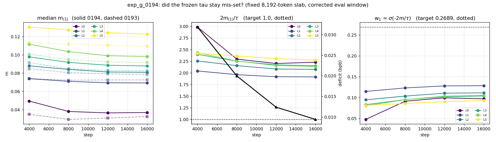

# LightMultiHeadLUT: every run, 16K and 48K

Survey of **all** LightMHL runs on branch `research/ffn_replacement_fix` (issue
[#112](https://github.com/anatoli-starostin/spiky/issues/112)), as of **2026-09-07 17:50 IDT**,
remote head `189aa69b` — i.e. including `exp_n_0202`, the last 48K run, which completed the
tables-vs-cells A/B and repriced the whole budget axis (§5, §6, §II.6.7). Sibling of [`LOOKUPFFN_LINE.md`](LOOKUPFFN_LINE.md), which covers the
earlier 4,000-step confidence-gate arms; this file covers the 16K/48K line that grew out of it.

Every number here is on the corrected protocol (`evaluate_bpb_fixed`, bs48 × 100, leading 12
rows skipped, 2,451,456 held-out tokens of `shard_06542.parquet`). See
[`../FIXED_EVAL.md`](../FIXED_EVAL.md).

---

## Current standard configuration

> **`confidence_form: margin`, `lut_z_norm: false`.**
> Reference run: **`exp_g_0193_B16k_light_margin_tph128_noznorm_seed1`** — **1.172852**,
> 67,351,680 params, nap8/K256, tph128, H4, d_in=d_out=48, 16K steps, seed 1.
> Fork **that** config for new LightMHL experiments, not `exp_n_0192`'s.

Decided 2026-09-07 on the 2×2 factorial below. All four runs are nap8/tph128, seed 1,
`tables_no_decay`, and differ **only** in the two flags:

| | no z_norm | z_norm | effect of z_norm |
|---|---|---|---|
| **`bounded_norm`** | 1.207493 (`exp_g_0189`) | 1.203936 (`exp_g_0190`) | −0.003557 (helps) |
| **`margin`** | **1.172852 (`exp_g_0193`)** | 1.177081 (`exp_n_0192`) | **+0.004229 (hurts)** |
| **effect of `margin`** | **−0.034641** | −0.026855 | interaction **+0.007786** |

### How strongly each half of this is supported — they are NOT the same

**`margin` over `bounded_norm`: very strong.** −0.034641 on the clean pair
(`exp_g_0189 → exp_g_0193`, differing in nothing but the form) is **10.3× the 0.00335 seed
spread**. It also reproduces at every other geometry tried and on both hosts. Treat as
settled.

**Dropping z_norm: weak on its own, and it should not be quoted as if it were the same
grade of evidence.** +0.004229 is only **~1.26× the seed spread** — inside the range a
single seed can produce. What actually carries it is not that margin but two structural
facts: the **interaction term of +0.007786 (2.3× the spread)**, and the **sign flip** —
z_norm *helps* `bounded_norm` and *hurts* `margin`. A pure noise story would have to
produce a sign flip and a 2.3×-spread interaction by chance. So this rests on **mechanism,
not on margin of measurement**, and the mechanism is coherent: both interventions fix the
same problem (margin scale), so stacking them is redundant and z_norm's constraint on the
code then costs more than it returns.

**Explicitly untested, and worth saying before anyone leans on it:**

- **One seed.** No replicate at any geometry.
- **One geometry** — nap8/tph128 only. **Untested at tph256**, which is where the best
  16K and 48K numbers live (`exp_n_0196`, `exp_n_0200`).
- **16K only. Untested at 48K**, and §5 shows that *every* effect measured at 16K shrank
  at 48K, some by 29×. There is no reason to assume this one transfers intact, and some
  reason to expect it to shrink.
- Every existing 48K result (`0199`, `0200`, `0202`) was run **with** z_norm, so the whole
  48K leaderboard is on the *old* standard.

**What would settle it:** `margin`, no z_norm, at **tph256/16K** (≈1.6 h) to test the
geometry, and at **48K** (≈3-5 h) to test the horizon. Until then this is a sensible default
chosen on a coherent mechanism, not an established result.

*(Note the asymmetry in what changed: `lut_z_norm`'s code default was **already** `false`,
so adopting it required no code change at all — only a change in which config gets forked.
The `confidence_form` default did change, from `bounded` to `margin`.)*

---

## 0. The bug that started the branch, and the fix

The historical per-run trainers built the val loader at the **training** `device_batch_size`
and scored a fixed `eval_steps=10`. The loader walks the held-out shard deterministically from
token 0, so the number of validation tokens scored was `device_batch_size × 512 × 10` — a
function of the training batch size. LUT runs (`device_batch_size` 12) were scored on the first
**61,440** tokens; vanilla baselines (`device_batch_size` 48) on the first **245,760**. Those
are different, nested slices of the val stream: the comparison that produced the earlier "LUT
matches vanilla" reads was **comparing models on different data**.

The fix (`tools/fixed_eval.py`):

- **Always bs48 × 100 eval steps**, decoupled from training entirely.
- **Skip the leading 12 rows** — rows 0 and 8 are the two easiest 512-token spans in the shard.
  Scored set is rows `[12, 4800)` = 2,451,456 target tokens, identical for every model.
- **One eval set, two call sites** — the training-loop curve and the standalone final scorer
  call the same function, so a run's curve and its final number are the identical measurement.
- **Clone-then-score.** The nanochat loader yields views into one GPU buffer that the next
  yield overwrites via a `non_blocking` HtoD copy; interleaving forwards with further `next()`
  calls raced the copy and silently corrupted later batches (repeated calls drifted
  1.147→1.153). `fixed_eval` drains all eval batches with `.clone()` first.

**Size of the correction:** −0.036 for the vanilla baselines (bs48, wider window already),
−0.008 to −0.011 for the LUT runs (bs12). Because the two classes were corrected by *different*
amounts, several signs flipped. The clearest casualty: `exp_n_0129` was reported as −0.020
**below** vanilla and is actually **+0.006 above** it.

| anchor | originally reported | corrected |
|---|---|---|
| `exp_n_0135` vanilla @16K seed 1 | 1.20144 | **1.165147** |
| `exp_n_0151` vanilla @48K | 1.151444 | **1.115420** |
| `exp_n_0157` vanilla @144K | 1.147985 | **1.111369** |
| `exp_n_0127` Fast nap7/tph128 @16K | 1.194711 | **1.187011** |
| `exp_n_0129` Fast nap8/tph256 @16K | 1.181484 | **1.170961** |

Runs from `exp_n_0176` onward use the corrected trainer, so their `metrics.csv` curve is
already the corrected metric (`correction: 0.0` in their `corrected_score.json`). Older runs
were re-scored from checkpoints; **use `corrected_score.json`, not `summary.json`, for those.**

### ⚠ OPEN ITEM — `exp_n_0138` carries an uncorrectable number (deferred to Anatoli)

**Not resolved. Flagged here so it is not forgotten, and explicitly not actioned.**

`exp_n_0138_outcompress_only_H4_nap8_tph128` reports **1.21249**, and that number came from
the **old batch-coupled eval** — device_batch_size × 512 × 10 tokens, not the 2,451,456-token
window every other number in this file uses. It is the **only** run in `runs_corrected/`
without a `corrected_score.json`, and it **can never get one**: `checkpoint_sources.json`
lists its checkpoint under `missing`, so there is nothing left to re-score.

Why it matters: **it is quoted in the paper (section 5 / Table 3) beside corrected numbers**,
which is an apples-to-oranges comparison. Scale of the discrepancy, for orientation only —
the correction for other bs12 runs ran −0.008 to −0.011, so 1.21249 is *probably* ~1.202–1.205
corrected. **That is an estimate from the class, not a measurement, and it cannot be turned
into one.** Do not quote it as if it were.

Nothing in this survey depends on it — `exp_n_0138` appears nowhere else in this file.

Its `train.py` is also the one legacy trainer in `runs_corrected/` deliberately left
uncorrected (owner's instruction, 2026-09-07), while the other 22 were patched. The fork
guard in `tools/fork_trainer.py` refuses to fork it, so it cannot seed a new run.

---

### Baselines used throughout

| | bpb | run |
|---|---|---|
| vanilla dense @16K, seed 1 | **1.165147** | `exp_n_0135` (re-scored) |
| vanilla dense @16K, seed 2 | **1.161798** | `exp_n_0176` |
| vanilla dense @48K | **1.115420** | `exp_n_0177` (re-run) / `exp_n_0151` (re-scored) — agree to 6 dp |
| vanilla dense @144K | **1.111369** | `exp_n_0157` (re-scored) |
| **vanilla 16K seed spread** | **0.00335** | 0135 vs 0176 — the noise floor for every claim below |

---

## 1. What LightMHL is

`src/spiky/lutorch/light_multi_head_lut.py`. Same tables, same anchor-pair sign addressing and
same `embedding_bag` gather as `FastMultiHeadLut`; the difference is **the backward**:

- **Fast** builds a full-`K` softmax *surrogate* over all `2^nap` cells of each table, so `x`
  receives gradient through a differentiable relaxation of the routing decision.
- **Light** addresses with `pack(sign(d).detach())` — no STE, no temperature surrogate. Gradient
  reaches `x` **only through the confidence score**. If the score is flat, the routing side gets
  essentially nothing.

That is why the confidence form is not cosmetic for Light: it *is* the input-side gradient path.
Light has no learnable temperatures (12 fewer parameters than the matched Fast model) and no
`K`-sized backward buffer, which is why it can run nap=9 (K=512) at bs12 where Fast OOMs.

Wrapped by `CompressionMultiHeadLUT` (`src/spiky/lutorch/compression_mhl.py`): `compress`
384→48, per-head LUT, `decompress` 48→384, `decompress.weight` zero-initialised.

---

## 2. The confidence forms

With `m_j = |d_j|`, `d = z[a_j] − z[b_j]` and `P = Π_j σ(2 m_j)`:

| form | score | property |
|---|---|---|
| `bounded` | `P` | collapses as `nap` grows (0.054 at nap=8 — an 18.4× forward attenuation) |
| `bounded_norm` | `P^(1/nap)` = `exp(mean_j logsigmoid(2 m_j))` | nap-invariant, but **saturates**: `d/dm` falls 0.0619 → 0.0006 over m = 0.1 → 3.0 |
| `margin` | `(Σ_j m_j) · P` | **exactly the LookupFFN kernel** (arXiv 2403.07221); `Σ m_j` holds `d/dm` near 1 indefinitely |

`margin` was verified against nucstar's reference implementation (`research/lookupffn`,
`lookup_ffn.py`) at |z| = 0.01/0.1/1/3/10: **max relative difference 1.9e-15**. The paper writes
`score = (Σ_j m_j) / Π_j (1 + e^{−2 m_j})`, and `σ(2m) = 1/(1 + e^{−2m})`, so it is our `margin`
term for term. The bit-packed sign address is the same function too — ours packs MSB-first and
theirs LSB-first, which relabels cells within a table but induces the identical partition. **No
new code was needed to run the LookupFFN score.**

---

## 3. All LightMHL runs at 16K

`H=4`, `d_in=d_out=48`, depth 6, `d_model` 384, `seq_len` 512, effective batch 24,576 tokens,
lr 3e-4, cosine + 10% warmup, wd 0.1, seed 1, bf16, `device_batch` 12 × `grad_accum` 4 (except
the vanilla baselines at bs48). All differences from that are in the table.

`exp_g_*` ran on **gpustar** (RTX 5090); `exp_n_*` on **nebius** (H100 80GB).

| run | host | form | z_norm | no-decay | nap (K) | tph | anchor policy | params | **bpb @16K** | vs vanilla@16K | ×sd | h | s/step |
|---|---|---|---|---|---|---|---|---|---|---|---|---|---|
| `exp_n_0181` | n | bounded_norm | – | – | 8 (256) | 256 | full_cov | 104,952,576 | 1.477708 *(4K proxy)* | – | – | 0.33 | 0.293 |
| `exp_n_0186` | n | bounded_norm | – | – | 7 (128) | 128 | full_cov | 48,477,312 | 1.208987 | +0.043840 | 13.1 | 0.90 | 0.202 |
| `exp_g_0189` | **g** | bounded_norm | – | ✔ | 8 (256) | 128 | full_cov | 67,351,680 | 1.207493 | +0.042346 | 12.6 | 0.89 | 0.200 |
| `exp_n_0185` | n | bounded_norm | – | – | 8 (256) | 128 | full_cov | 67,351,680 | 1.206222 | +0.041075 | 12.3 | 0.96 | 0.215 |
| `exp_g_0190` | **g** | bounded_norm | ✔ | ✔ | 8 (256) | 128 | full_cov | 67,352,256 | 1.203936 | +0.038789 | 11.6 | 0.91 | 0.205 |
| `exp_n_0184` | n | bounded_norm | – | – | 8 (256) | 256 | full_cov | 105,100,416 | 1.201075 | +0.035928 | 10.7 | 1.50 | 0.338 |
| `exp_n_0194` | n | **margin** | ✔ | ✔ | 7 (128) | 128 | full_cov | 48,477,888 | 1.183957 | +0.018810 | 5.6 | 0.97 | 0.218 |
| `exp_g_0191` | **g** | **margin** | ✔ | ✔ | 8 (256) | 128 | full_cov | 67,352,256 | *1.178680 @15K, **crashed*** | +0.013533 | 4.0 | – | – |
| `exp_n_0197` | n | **margin** | ✔ | ✔ | 8 (256) | 128 | **distinct** | 67,352,256 | 1.177476 | +0.012329 | 3.7 | 1.03 | 0.233 |
| `exp_n_0192` | n | **margin** | ✔ | ✔ | 8 (256) | 128 | full_cov | 67,352,256 | 1.177081 | +0.011934 | 3.6 | 1.04 | 0.233 |
| `exp_n_0198` | n | **margin** | ✔ | ✔ | 8 (256) | 128 | **disjoint** | 67,352,256 | 1.174424 | +0.009277 | 2.8 | 1.03 | 0.232 |
| `exp_n_0201` | n | **margin** | ✔ | ✔ | 7 (128) | 256 | full_cov | 67,352,256 | 1.171830 | +0.006683 | 2.0 | 1.42 | 0.320 |
| `exp_n_0195` | n | **margin** | ✔ | ✔ | 9 (512) | 128 | full_cov | 105,100,992 | 1.168194 | +0.003047 | 0.9 | 1.08 | 0.243 |
| `exp_n_0196` | n | **margin** | ✔ | ✔ | 8 (256) | **256** | full_cov | 105,100,992 | **1.163912** | **−0.001234** | −0.4 | 1.56 | 0.351 |

*(×sd = multiples of the 0.00335 vanilla seed spread. `exp_n_0181` is the 4,000-step proxy from
the earlier arm-B line and is not comparable to the 16K column.)*

**Reference points at the same budgets, all 16K, corrected:**

| run | what | params | bpb @16K |
|---|---|---|---|
| `exp_n_0127` | Fast gate-off, nap7/tph128 | 48,477,324 | 1.187011 |
| `exp_n_0188` | Fast + soft_topk (2-cell) backward, nap7/tph128 | 48,477,324 | 1.185226 |
| `exp_n_0129` | Fast gate-off, nap8/tph256 | 105,100,428 | 1.170961 |
| `exp_n_0135` | **vanilla dense** | 35,792,640 | **1.165147** |

Note `exp_n_0194` (Light+margin, 48.48M) = 1.183957 **beats** `exp_n_0127` (Fast, same
geometry, 48.48M) = 1.187011 by −0.003054 — Light with the LookupFFN score is no longer paying
the +0.043 penalty that arm B measured at 4K.

### Which runs nearly match vanilla at 16K

Two, and only in the top param class:

- **`exp_n_0196` (105.1M) = 1.163912.** That is **−0.001234 below** vanilla seed 1 and
  **+0.002114 above** vanilla seed 2 — i.e. it lands *inside* the two-seed vanilla band. On one
  seed this is parity, not a win.
- **`exp_n_0195` (105.1M) = 1.168194**, +0.003047 — 0.9× the seed spread, also parity.

At 67.35M the best is `exp_n_0201` at +0.006683 (2.0× sd) — outside the band but close. At
48.48M the best is `exp_n_0194` at +0.018810.

---

## 4. All LightMHL runs at 48K — and the gap does **not** hold

| run | what | params | bpb @48K | vs vanilla@48K | h | s/step |
|---|---|---|---|---|---|---|
| `exp_n_0177` | **vanilla dense** | 35,792,640 | **1.115420** | — | 1.72 | 0.129 |
| `exp_n_0200` | Light+margin, nap8/tph256 | 105,100,992 | **1.134538** | **+0.019118** | 4.69 | 0.351 |
| `exp_n_0171` | Fast gate-off, nap9/tph256 | 180,597,900 | 1.134511 | +0.019091 | 16.25 | 1.219 |
| `exp_n_0202` | Light+margin, nap9/tph128 | 105,100,992 | 1.136375 | +0.020955 | 3.24 | 0.243 |
| `exp_n_0199` | Light+margin, nap8/tph128 disjoint | 67,352,256 | 1.136588 | +0.021168 | 3.10 | 0.232 |
| `exp_n_0155` | Fast gate-off, nap7/tph128 | 48,477,324 | 1.145471 | +0.030051 | 3.82 | 0.286 |
| `exp_n_0158` | Fast gate-off, nap7/tph128 **@144K** | 48,477,324 | 1.137558 | +0.026189 *(vs vanilla@144K 1.111369)* | 11.51 | 0.288 |

**This is the central finding of the survey.** `exp_n_0196` reaches vanilla parity at 16K
(−0.0012). Forked to 48K it becomes `exp_n_0200` and lands at **+0.019118**. The reason is that
both improve over the 3× horizon but vanilla improves **1.69× more**:

```
vanilla   1.165147 -> 1.115420   =  -0.049727
0196/0200 1.163912 -> 1.134538   =  -0.029374
```

And it is not a Light quirk. `exp_n_0171` (Fast, 180.6M, gate off, a completely different
backward) did exactly the same thing: parity at 16K (−0.0002) → **+0.019091** at 48K. Two
architectures, two backward paths, two parameter counts — **the same +0.019 at 48K, agreeing to
3e-5.** Whatever the LUT FFN is missing, it is not something the confidence form or the routing
gradient reaches.

### The four 48K LUT runs cluster by `tph`, and by nothing else

With `exp_n_0202` in hand there are four LUT points at 48K, and they fall into two tight pairs
that are **not** grouped by parameter count, cell count, implementation or backward:

| pair | runs | `tph` | params | vs vanilla | spread within pair |
|---|---|---|---|---|---|
| more tables | `0200` Light nap8, `0171` **Fast** nap9 | **256** | 105.1M / 180.6M | +0.019118 / +0.019091 | **0.000027** |
| fewer tables | `0202` Light nap9, `0199` Light nap8 | **128** | 105.1M / 67.4M | +0.020955 / +0.021168 | **0.000213** |

Inside each pair the parameter count varies by **56–72%**, the cell count `2^K` varies by 2×, and
in the first pair the *entire backward* differs — and none of that moves the number by more than
2e-4. Across the pairs, the only structural difference is `tph`, worth **0.0019**.

Four points is not a law, and the pairing could be coincidence. But it sharpens the statement:
at 48K, the one structural knob still doing anything is **tables per head**, and it is doing
0.002 per doubling.

**Do not read the step-16,000 row of a 48K run as a 16K result.** It sits on the 48K cosine
schedule and is systematically worse: vanilla 1.178467 there vs 1.165147 as a finished 16K run.
Step-aligned on the *same* schedule the gap is already **+0.007966** at step 16,000
(0200 1.186433 vs vanilla 1.178467) and roughly doubles by 48,000.

Trajectories, all on the 48K schedule:

| step | vanilla | `0200` L/105M | `0202` L/105M | `0199` L/67M | `0171` F/180M | `0155` F/48M |
|---|---|---|---|---|---|---|
| 4,000 | 1.435410 | 1.401593 | 1.411217 | 1.423623 | 1.421090 | 1.469477 |
| 8,000 | 1.249850 | 1.250391 | 1.255513 | 1.260585 | 1.254139 | 1.282913 |
| 16,000 | 1.178467 | 1.186433 | 1.189308 | 1.192137 | 1.183450 | 1.210289 |
| 24,000 | 1.152844 | 1.164719 | 1.166313 | 1.168283 | 1.161929 | 1.186517 |
| 32,000 | 1.133479 | 1.148078 | 1.150745 | 1.151254 | 1.146470 | 1.171519 |
| 40,000 | 1.120560 | 1.139221 | 1.140835 | 1.141021 | 1.137995 | 1.161071 |
| 48,000 | **1.115420** | 1.134538 | 1.136375 | 1.136588 | 1.134511 | 1.156018 |

The LUT runs are *ahead* at step 4,000 and lose steadily from step 8,000 on.

---

## 5. What each knob is worth (16K, one seed each, sd = 0.00335)

| change | runs | Δ bpb | ×sd |
|---|---|---|---|
| **`bounded_norm` → `margin`** (clean, no z_norm) | 0189 → 0193 | **−0.034641** | **−10.3** |
| `bounded_norm` → `margin` (both with z_norm) | 0190 → 0192 | −0.026855 | −8.0 |
| **`z_norm` ON TOP OF `margin`** | 0192 vs 0193 | **+0.004229** | **+1.3** |
| tables over cells @105M | 0195 → 0196 (tph 128→256 vs nap 9→8) | −0.004281 | −1.3 |
| tables over cells @67M | 0192 → 0201 (tph 128→256 vs nap 8→7) | −0.005251 | −1.6 |
| `z_norm` on the code | 0189 → 0190 | −0.003556 | −1.1 |
| anchor policy `disjoint` | 0192 → 0198 | −0.002657 | −0.8 |
| anchor policy `distinct` | 0192 → 0197 | +0.000395 | +0.1 |
| exempt tables from weight decay | 0185 → 0189 | +0.001270 | +0.4 |
| doubling the table budget | 0192 → 0196 | −0.013168 | −3.9 |
| doubling the table budget | 0194 → 0201 | −0.012127 | −3.6 |

### The same knobs at 48K — every one of them shrinks

`exp_n_0202` completes the matched 48K forks, so each 16K comparison now has a 48K twin. The
pairs below are **matched**: the same policy mismatch appears on both sides of each row, so the
16K and 48K columns are measuring the same thing at two horizons.

| change | 16K pair | Δ @16K | 48K pair | Δ @48K | shrink |
|---|---|---|---|---|---|
| doubling **cells** (nap8→9, tph128) | 0198 → 0195 | **−0.006230** (−1.9 sd) | 0199 → 0202 | **−0.000213** (−0.1 sd) | **29×** |
| doubling **tables** (tph128→256, nap8) | 0198 → 0196 | **−0.010511** (−3.1 sd) | 0199 → 0200 | **−0.002050** (−0.6 sd) | **5.1×** |
| tables vs cells @105M (equal budget) | 0195 → 0196 | −0.004281 (−1.28 sd) | 0202 → 0200 | −0.001837 (−0.55 sd) | 2.3× |

**Mean bpb per table-budget doubling: −0.008371 at 16K, −0.001131 at 48K — a 7.4× collapse.**
That reprices the whole budget axis. At 16K rates, closing the +0.019 gap by budget alone needed
~2.3 doublings (~500M params); at 48K rates it needs **~17 doublings**, i.e. on the order of
10⁵× the table budget. **Budget is not a route to parity — it is not even a slow route.**

Two consequences worth separating:

- **Cells are effectively dead at 48K.** `0202` (nap9, 105.1M) and `0199` (nap8, 67.4M) land
  0.000213 apart — 0.06× the seed spread — despite `0202` carrying **56% more parameters**. If
  that were the only pair one could dismiss it, but it is the *matched fork* of a 16K pair that
  showed −0.0062, so the effect genuinely evaporated over the horizon rather than never existing.
- **Tables survive, barely.** −0.002050, 0.6× the seed spread. Below the noise floor by
  magnitude — but `0202` is behind `0200` at **96 of 96 evals**, with the gap flat near +0.002
  from step 16,000 on. These are paired runs (same seed, same data order), so an unbroken
  96-eval sign run is much stronger evidence of a real ordering than the cross-seed sd suggests.
  **Direction: safe. Magnitude: one seed.**

**Only one of these is a result at one seed: the confidence form.** `margin` is worth
**−0.0269 bpb, 8× the seed spread**, at fixed geometry, fixed everything. It is the single
largest lever found on this line and it costs nothing — no parameters, no new code, no
throughput (0190 0.205 s/step → 0192 0.233 s/step, and that 14% is the z_norm/host difference,
not the score).

Everything else is inside or barely outside the noise floor on one seed:

- **Tables beat cells at matched budget, twice.** −0.0043 at 105M and −0.0053 at 67M, both from
  spending the budget on more tables per head rather than more cells per table. Individually
  1.3× and 1.6× sd — neither is decisive, but they are two independent points pointing the same
  way at different budgets, which is worth more than either alone.
- **Anchor policy is nearly inert.** `canonical_disjoint` (each table's pairs use 16 distinct
  coordinates of 48 — a partial matching) is the best of the three at −0.0027, 0.8× sd.
  `canonical_distinct` is a wash. Enum in `src/spiky/lutorch/lut_helpers.py`, selected via
  `lut_anchor_policy` in `config.json` and mapped in `tools/model_build.py::_anchor_policy`.
- **Exempting tables from weight decay is not a win.** `exp_g_0189` (no-decay) is +0.001270
  *worse* than its matched control `exp_n_0185`. It was retained because it is harmless and was
  in the config lineage, not because it helped.
- **Table budget buys ~0.013 per doubling *at 16K* — and ~0.001 at 48K.** The 16K figure is
  nearly double the −0.007455/doubling law fitted on the earlier Fast grid, which read as "the
  Light+margin arm is still on a steep part of its curve". `exp_n_0202` shows that reading was an
  artefact of the short horizon: the same doublings are worth 5–29× less at 48K. **The budget
  law does not survive the horizon**, which is the single most consequential thing `0202` added.

---

## 6. `exp_n_0202` — the last 48K run, and what it settled

**`exp_n_0202_light_margin_znorm_nap9_48k_seed1`** — nebius, **completed cleanly** (commit
`189aa69b`, 17:39 IDT).

- **Config:** fork of `exp_n_0195` (Light + `margin` + `z_norm` + `tables_no_decay`, H4, nap=9
  (K=512), tph=128, d48, **105,100,992 params**) with **only** `n_steps` 16000 → 48000 (cosine +
  warmup auto-stretch to 4,800). Seed 1, `device_batch` 12 × `grad_accum` 4, eval every 500.
- **Result: final 1.136375, best 1.135937 (step 47,000)** — `+0.020955` vs vanilla@48K.
- **Integrity:** 96/96 evals present, steps contiguous 500…48,000 and strictly increasing, no
  `CRASHED`/`STOPPED`/`ABANDONED` note. **No stalls or restarts.**
- **Cost:** 3.239 h, **0.2429 s/step** — the cheapest 105M run in the set, and within 0.2% of the
  3.23 h predicted from its 16K sibling's throughput.
- **Scoring:** the corrected trainer wrote this curve, so `metrics.csv`/`summary.json` **are** the
  corrected metric (bs48 × 100, skip 12); there is no `corrected_score.json` to prefer, and no
  `checkpoint.pt` was kept.

**Curve:** 4,000 → 1.411217 · 8,000 → 1.255513 · 16,000 → 1.189308 · 24,000 → 1.166313 ·
32,000 → 1.150745 · 40,000 → 1.140835 · 44,000 → 1.137060 · **48,000 → 1.136375**.

**The prediction was directionally right and quantitatively wrong.** It called ~1.139, behind
`0200`; the run landed at **1.136375**, behind `0200` by **+0.001837** rather than the ~0.0045
that carrying the 16K edge forward implied — an over-prediction of 2.3×. The error is itself the
finding: it assumed a 16K margin transfers to 48K, and the whole point of §5's new table is that
budget effects **shrink** with horizon.

**Diagnostics available for this run:** only the per-layer `ln1`/`ln2` gain columns — cell
occupancy, gradient norms and margin distributions are *not* logged during training, exactly the
gap flagged in §II.6. What the `ln` columns do show: **every layer's `ln2` gain is healthy**
(19.66 / 19.62 / 19.60 / 19.58 / 19.50 / 18.58 against an init of 19.596), so the layer-0 collapse
that dogged the `bounded_norm` runs is fully gone and is not what separates `0202` from `0200`
(whose profile is nearly identical). `ln1_norm_L0` falls to ~9.9 by step 30,500 and recovers to
10.14 — the same U-shape in all three 48K Light runs; the vanilla baseline predates the `ln`
logging, so **there is no comparison available** and this should not be read as LUT-specific.
Nothing in the logged diagnostics bears on the discontinuity hypothesis either way.

## 6b. `exp_g_0193` — margin without z_norm. **Prediction recorded before the result.**

Launched on gpustar 2026-09-07 ~19:30 IDT, ~1 h. This section was written and committed
**before the run produced a number**, so the reading cannot be retrofitted.

**The question.** §5 credits `margin` with **−0.026855 bpb**, the largest lever on this line
and the only one outside the noise floor. But that is `exp_g_0190` (bounded_norm + z_norm)
against `exp_n_0192` (margin + z_norm) — **both with z_norm on**. `margin` has never been run
without it, so the −0.026855 is strictly *margin-given-z_norm*. §II.6(5) flags this as the one
place where the mechanism behind this line's only real result is inferred, not observed.

**The run.** `exp_n_0192`'s `config.json` read from disk with exactly one substantive key
changed, `lut_z_norm: true → false`; 35 of 38 keys byte-identical, the other two being
`exp_name` and `_arch_note`. Confirmed to have bitten: the LayerNorm module is not
constructed at all (`compression_mhl.py`:168) and the forward skips it (:302–304), so the
parameter count drops 67,352,256 → **67,351,680**, matching `exp_g_0189` and `exp_n_0185`.

### What each outcome would mean

| result | reading |
|---|---|
| **≈ 1.177** | `margin` stands alone; z_norm contributes nothing to it, and §5's −0.0269 is `margin`'s own. |
| **≈ 1.181** | the two are *additive*: z_norm's own −0.003556 (0189→0190) simply adds. No interaction. |
| **1.185–1.195** | real interaction — most of `margin`'s gain survives, but a measurable part of it needed z_norm. |
| **≈ 1.204** | `margin` does **nothing** without z_norm; the −0.0269 is entirely conditional and §5 must be rewritten. |

### The prediction: **1.185–1.195**, i.e. the third row

Reasoning, stated so it can be wrong for a reason:

1. **The additive null is 1.1806** (1.177081 + 0.003556, giving z_norm back its own measured
   value). Anything materially worse than that is interaction.
2. **`margin`'s derivative is *weakest* exactly where an unnormalised code is worst.** §II.3:
   `∂s/∂m` for `margin` is **0.1×** `bounded_norm`'s at m = 0.00001 and **0.7×** at m = 0.21,
   overtaking only from m ≈ 0.39. Without z_norm the code scale is unconstrained, and the
   measured no-z_norm profile (`exp_n_0184`) is exactly that bad regime at the shallow layers:
   median |d| = 0.00001 / 0.210 / 0.388 / 0.516 / 0.555 / 0.781 by depth. So layers 0–1 start
   `margin` at a disadvantage.
3. **But the deficit should be partly self-correcting**, which is why the prediction is not
   1.204. `margin`'s derivative *grows* with the margin while `bounded_norm`'s *shrinks*, so
   once any margin growth begins `margin` accelerates and `bounded_norm` stalls. That
   dynamical asymmetry is what today's `diag_blend_weight.py` measurement shows in its
   converged form: with z_norm, `margin` (`exp_n_0192`) reaches median |d| = **0.4158 at layer
   0** where `bounded_norm` (`exp_g_0190`) sits at **0.0001** — a 4,000× difference at the very
   layer that was dead. `margin` can bootstrap layer 0; the open question is only whether it
   can do so *without* z_norm handing it a unit-scale code to start from.

Net: most of the gain survives, a real part does not. **1.185–1.195.**

*(The owner's own expectation was truncated in transit and is therefore not recorded here.
If it should be on the record, it needs to be restated before the run lands.)*

### RESULT: **1.172852** — the prediction was wrong, and informatively so

`exp_g_0193` completed cleanly (16,000/16,000, 0.92 h, 67,351,680 params as required, the
three periodic checkpoints written at 4,000 / 8,000 / 12,000).

**1.172852 is outside the predicted 1.185–1.195 band, and below even the most optimistic row
of the table above.** `margin` without z_norm does not merely stand alone — it is
**−0.004229 BETTER than margin with z_norm** (`exp_n_0192`, 1.177081), 1.26× the seed spread.

The four runs now form a complete 2×2 factorial at nap8/tph128, all seed 1, all
`tables_no_decay`, differing only in the two flags:

| | no z_norm | z_norm | **effect of z_norm** |
|---|---|---|---|
| **`bounded_norm`** | 1.207493 (`0189`) | 1.203936 (`0190`) | **−0.003557** (helps) |
| **`margin`** | **1.172852 (`0193`)** | 1.177081 (`0192`) | **+0.004229** (hurts) |
| **effect of `margin`** | **−0.034641** | −0.026855 | interaction **+0.007786** |

**z_norm helps `bounded_norm` and hurts `margin` — the sign flips.** The interaction term is
+0.007786, **2.3× the seed spread**, so this is not noise-level: the two interventions are
**antagonistic**, doing partly the same job and getting in each other's way when stacked.

**Two corrections to the survey follow from this.**

1. **§5 understated `margin`.** The clean single-variable comparison for the confidence form
   is now the no-z_norm pair `0189 → 0193`, where the two runs differ in *nothing* but the
   form: **−0.034641, i.e. 10.3× the seed spread**, not the −0.026855 measured through the
   z_norm-confounded pair. `margin` is a bigger lever than this file has been claiming.
2. **z_norm should be dropped from the margin line.** It was adopted on `bounded_norm`
   evidence (−0.0036 on `0189 → 0190`) and carried forward into every margin run without ever
   being re-tested there. On `margin` it costs +0.004.

**Why the prediction failed, named rather than waved at.** §II.3 argued from the *static*
derivative that `margin`'s `∂s/∂m` is weaker than `bounded_norm`'s at small margins (0.1× at
m = 0.00001, 0.7× at m = 0.21), so an unnormalised code should leave `margin` stuck at the
shallow layers. That reasoning treated the margin distribution as fixed. It is not — it is the
*state* of a dynamical system, and `margin`'s derivative **grows** with the margin while
`bounded_norm`'s shrinks, so `margin` generates its own healthy margins from a cold start
instead of needing z_norm to hand them over. §II.6(5)'s open question is therefore answered,
and the answer is the opposite of what was expected: **z_norm is not a precondition for
`margin`, it is a partial substitute for it, and a slightly costly one.**

---


---

## 6c. `exp_g_0194` — the top-2 blend, TRAINED. Final **1.182259**, +0.009407 vs `0193`

First training run with the blend, and therefore the first with a directional routing
gradient. Frozen tau at the measured per-layer Delta_m, 16K, seed 1, 67,351,680 params
(param-matched to `exp_g_0193` exactly). 1.664 h, 0.300 s/step.

**Result: 1.182259 against `exp_g_0193`'s 1.172852 — the blend LOSES by +0.009407, which is
+2.81x the 0.00335 seed spread.** Outside the noise band: a real deficit, not a tie. It is
behind at **32 of 32** evals and never crosses.

| step | `0194` | `0193` | delta | sigma |
|---|---|---|---|---|
| 500 | 2.055185 | 2.029398 | +0.025787 | +7.70 |
| **1,500** | 1.670175 | 1.614276 | **+0.055899** | **+16.69** (peak) |
| 4,000 | 1.356875 | 1.325009 | +0.031866 | +9.51 |
| 8,000 | 1.245054 | 1.225082 | +0.019972 | +5.96 |
| 12,000 | 1.198957 | 1.186580 | +0.012377 | +3.69 |
| **16,000** | **1.182259** | **1.172852** | **+0.009407** | **+2.81** |

The deficit peaks at step 1,500 and closes monotonically thereafter, but **does not reach
zero**. Extrapolating the last four evals it is still shrinking at ~0.0002 per 500 steps at
the end, so a longer run might close it — that is a guess, not a measurement.

**This contradicts the eval-only probe.** On single-winner checkpoints the same blend was
worth **−0.006** at 16K and **−0.011** at 48K. Trained with, it costs **+0.009**. So the
post-hoc read-out change and the trained-with change are not the same intervention, which is
exactly the caveat recorded before the run and is now measured rather than asserted.

### The "mis-set tau" hypothesis — tested and FALSIFIED, in the opposite direction

The proposal was that tau, frozen at a Delta_m measured on a *converged* model, was too
large early: 2m/tau would start below 1, w1 = sigmoid(-2m/tau) would start near 0.5
(over-blended), and the deficit would close as margins grew into tau.

Measured on a fixed 8,192-token slab (the corrected eval window, rows [12,28)), identical for
every checkpoint (`diag_margin_trajectory.py`):

| step | deficit | L0 2m/tau (w1) | L1 | L3 | L5 |
|---|---|---|---|---|---|
| 4,000 | +0.031866 | 2.985 (0.0481) | 2.041 (0.1149) | 2.399 (0.0833) | 2.420 (0.0816) |
| 8,000 | +0.019972 | 2.296 (0.0915) | 1.962 (0.1233) | 2.250 (0.0953) | 2.363 (0.0860) |
| 12,000 | +0.012377 | 2.201 (0.0996) | 1.917 (0.1282) | 2.173 (0.1022) | 2.305 (0.0907) |
| 16,000 | +0.009407 | 2.228 (0.0972) | 1.913 (0.1286) | 2.153 (0.1041) | 2.274 (0.0933) |

**Both predictions fail.** `2m/tau` is never below 1 — it sits at **1.9-3.0 throughout** —
and `w1` is **0.048-0.129**, far BELOW an even blend, not above it. The run was
**UNDER-blended, not over-blended**: much closer to plain single-winner than to 50/50. The
premise that margins grow into tau is also wrong; margins *shrink* slightly over training
(`0193` L0: 0.0349 -> 0.0324).

**A correction that belongs here, because it is the source of the confusion.** `2m/tau = 1`
and `w1 = sigmoid(-1) = 0.2689` require **tau = 2*Delta_m**. `exp_g_0194` used
**tau = Delta_m**, whose design point is `2m/tau = 2`, `w1 = sigmoid(-2) = 0.119`. The
tau = Delta_m choice was made on *peak sensitivity* `|dw/dtau|` (95.6% of maximum, verified
with the correct -2m/tau convention) and that reasoning stands; but it was reported at launch
as "matched tau makes 2m/tau = 1, w1 = 0.2689 at every layer", and that was wrong. The
measured 1.9-3.0 band is consistent with the design point of 2, not with a mis-set tau.

### The control, which is the more interesting finding

Both runs saved checkpoints at the same steps, so `exp_g_0193` gives the margin trajectory of
an identical model with **no blend at all**. Median m_(1), `0194` / `0193`:

| step | L0 | L1 | L3 | L5 |
|---|---|---|---|---|
| 4,000 | 0.0494 / 0.0349 | 0.0739 / 0.0741 | 0.0978 / 0.0915 | 0.1305 / 0.1136 |
| 16,000 | 0.0369 / 0.0324 | 0.0693 / 0.0726 | 0.0878 / 0.0825 | 0.1227 / 0.1095 |

**The blend widens the margins** — by 5-14% at every layer except L1, and by 42% at L0 early.
Wider margins mean *smaller* w1, i.e. **less blending**. So the model responds to the blend by
suppressing it: given a differentiable route to push the runner-up away, it takes it. That is
a direct, mechanistic reading of what the new routing gradient actually does, and it argues
against the mundane "the model just absorbs a fixed cost" story — the model is not absorbing
the blend, it is turning it off.

### What the data cannot settle

**The timing test is unanswerable.** The deficit peaks at step **1,500**; the earliest
checkpoint is step **4,000**. `2m/tau` at the peak cannot be measured, so whether the early
deficit tracked a tau mismatch in steps 0-4,000 is simply not determined by these artefacts.
The per-layer correlation between `2m/tau` and the deficit is +0.93 to +0.997, but **both
series are monotone in training step, so that correlation is near-tautological** — any
monotone quantity would score the same. It is reported because it was asked for, not because
it discriminates.



---

## 6d. `exp_g_0195` — ASSIGNED TO NEBIUS, deliberately NOT run on gpustar

Built, gated and committed here; **execution reassigned to nebius before it started**. It is
not pending and not failed — it has simply never run, and its artefacts are intact and
runnable so nebius can pick them up from this branch.

Config: `exp_g_0193` + `lut_read_top_n: 2`, `lut_read_tau: 0.5` (flat), `lut_read_tau_learnable:
true`. Exactly three substantive keys; `lut_read_tau_measured` deliberately absent. Learnable
tau makes `log_tau` an `nn.Parameter`, so **total_params is 67,351,686 = +6 vs `0193`/`0194`
and the comparison is NOT param-matched.** `metrics.csv` gains `tau_L0..tau_L5` at every eval
so tau's trajectory is plottable. tau lands in the no-decay optimiser group (0-dim, and a
direct parameter of a `tables_no_decay`-exempt module) — verified, since decaying a
temperature toward zero would look like a result.

---

### Incomplete / abandoned

| run | what | stopped at | last bpb | why |
|---|---|---|---|---|
| `exp_g_0191` | gpustar, Light+margin nap8/tph128, 16K | 15,100 / 16,000 | 1.178680 @15,000 | `torch.AcceleratorError` cudaErrorLaunchTimeout / **Xid 8 RC watchdog** on the desktop-driving RTX 5090. Environmental. Re-run verbatim on the H100 as `exp_n_0192` → 1.177081, no crash. See `CRASHED.md`. |
| `exp_g_0192` | gpustar, **BH4** addressing (not Light), 16K | 10,500 / 16,000 | 1.230552 | stopped by request; no checkpoint. See `STOPPED.md` and §7. |
| `exp_n_0193` | 48K fork of `exp_n_0192` (full_coverage) | 6,000 / 48,000 | 1.310791 | superseded by `exp_n_0199` (the 48K of the better `disjoint` policy) and `exp_n_0200`. |
| `exp_n_0187` | Light `bounded_norm` nap7/tph128 @48K | 29,500 / 48,000 | 1.193214 | overtaken by the `margin` line before it finished. |
| `exp_n_0188_…_innerres` | Light + `lut_inner_residual` | 9,000 / 16,000 | 1.256461 | clearly diverging from control; `ABANDONED.md`. |

---

## 7. The BH4 side-branch (not Light, recorded for completeness)

`exp_g_0192` (gpustar) replaced anchor-pair addressing *and* the compression projection with
LookupFFN's **BH4** block-Hadamard transform — coordinate-sign addressing, no anchor pairs at
all, nap=7, 4 heads, 128 tables/head, `decompress` on top, 48,427,008 params (−28.1% vs the
matched Light run). Stopped by request at step 10,500/16,000:

| step | `exp_g_0192` BH4 | vs `exp_g_0191` (Light+margin, matched score) | vs `exp_g_0190` |
|---|---|---|---|
| 10,500 | 1.230552 | **+0.026201** | +0.001501 |

The gap to `0191` was flat from step 4,000, so it was not still resolving. Adjusting for the
table-halving handicap (≈ +0.0075 from the budget law) still leaves ≈ **+0.019**. On this
evidence, at a matched score, **coordinate-sign addressing is behind anchor-pair addressing** —
one seed, stopped early, handicap extrapolated rather than measured. Implementation in
`src/spiky/lutorch/bh4_multi_head_lut.py`; verification battery in `diag_bh4_verify.py`.

A separate hash-quality diagnostic (`diag_hash_quality.py`) settled the "is it the hash or the
gradient?" question for Light: every run addresses **83–91%** of its cells at **0.86–0.90** of
maximum address entropy, and **Fast — the best performer — has the worst address distribution
of all of them.** Routing quality is not the bottleneck; the input-side gradient path is, which
is exactly what `margin` improves.

---

## 8. Throughput, parameters, memory

At the 16K sizing (`device_batch` 12 × `grad_accum` 4), s/step on the host that ran it:

| config | params | s/step (nebius H100) |
|---|---|---|
| vanilla dense | 35,792,640 | 0.129 (bs48) |
| Light nap7/tph128 | 48,477,888 | 0.218 |
| Light nap8/tph128 | 67,352,256 | 0.233 |
| Light nap9/tph128 | 105,100,992 | 0.243 |
| Light nap8/tph256 | 105,100,992 | 0.351 |
| Light nap7/tph256 | 67,352,256 | 0.320 |
| **Fast** nap9/tph256 | 180,597,900 | **1.219** |
| Fast nap7/tph128 | 48,477,324 | 0.286 |

Two things worth keeping:

1. **`nap` is nearly free for Light, `tph` is not.** nap 7→8→9 at fixed tph128 costs
   0.218 → 0.233 → 0.243 s/step (+11% total) while the table budget quadruples; doubling tph
   costs ~+45%. Light has no `K`-sized softmax buffer, so cells are cheap in both time and
   memory — this is why nap=9 (K=512) runs at bs12 where the Fast soft-backward path OOMs
   (`exp_n_0162/0163/0164` were cancelled for exactly that).
2. **Light is 3–5× faster than Fast at comparable quality.** `exp_n_0200` matches
   `exp_n_0171`'s 48K bpb (1.134538 vs 1.134511) with **58% of the parameters and 29% of the
   wall clock** (4.69 h vs 16.25 h). If the LUT line has a live advantage right now, it is this,
   not the bpb.

Projection FLOPs for the compression wrapper are 147,456 per token pair (compress + decompress),
**0.125×** a vanilla FFN's — recorded in each run's `corrected_score.json`.

---

## 9. Conclusions

1. **The LookupFFN `margin` score is the real result of this line.** −0.0269 bpb on Light at
   fixed geometry, 8× the seed spread, for zero parameters and zero new code. It works because
   Light's only input-side gradient path is the score, and `bounded_norm` saturates
   (`d/dm` → 0.0006) exactly where Light's margins end up, while `margin`'s `Σ m_j` factor keeps
   `d/dm` near 1. Measured at init on our own module, swapping the string alone gives **8.9×**
   more gradient into `compress`/`x` with table gradients within 6%.
2. **Light with `margin` has erased arm B's +0.043 penalty and now beats Fast at matched
   geometry** (`0194` 1.183957 vs `0127` 1.187011 at 48.48M), at lower cost.
3. **16K parity with vanilla is reachable** — `exp_n_0196` at 105.1M is 1.163912 against a
   vanilla two-seed band of 1.161798–1.165147.
4. **16K parity does not survive to 48K.** `0200` = +0.019118. `exp_n_0171` (Fast, 180.6M, a
   different backward) = +0.019091. The agreement of those two numbers to 3e-5 is the strongest
   signal in the survey: the residual deficit is **architecture- and gradient-path-independent**,
   and neither the confidence form nor the parameter budget touches it. Vanilla simply extracts
   1.69× more from the extra 32K steps.
5. **The budget law does not survive the horizon** — `exp_n_0202`'s contribution. Doubling the
   table budget is worth −0.008371 per doubling at 16K and **−0.001131 at 48K** (§5), a 7.4×
   collapse; the cells axis specifically is worth −0.006230 at 16K and **−0.000213 at 48K**, i.e.
   effectively nothing. Closing +0.019 by budget alone would take ~17 doublings. Combined with
   (4), **both of the obvious levers — architecture and scale — are now measured and neither
   works.**
6. **Confounds, stated.** Every 16K arm here stacks `margin` on top of `z_norm` and
   `tables_no_decay`; `margin`-without-`z_norm` has never been run, so the −0.0269 is the
   *combination*'s credit assigned to the one variable that changed between `0190` and `0192`
   (`z_norm` and `no_decay` were already on in both). Every comparison is one seed against a
   0.00335 spread measured on **vanilla**, not on this architecture — the LUT runs' own paired
   noise floor has never been measured.

### What would move the needle next

- **The 48K +0.019 is the whole problem now.** It is not a routing, score, or budget issue —
  three independent knobs have been shown not to touch it. The informative experiment is one
  that changes *how the LUT FFN uses its extra steps*: an LR/schedule sweep at 48K, or a
  longer-horizon run to see whether the gap is a constant offset or still opening
  (`exp_n_0158` at 144K sits at +0.026 vs vanilla@144K, which suggests still opening).
- **A paired seed floor for this architecture** (two runs differing only by something provably
  irrelevant). Every "suggestive, not decisive" row in §5 is limited by borrowing vanilla's
  0.00335.
- **Deconfound `margin`:** `margin` without `z_norm` at nap8/tph128, one hour, tells us whether
  the −0.0269 is the score or the pair.
- **Tables over cells: direction confirmed, magnitude shrunk.** `0202` settled it — more tables
  still wins at 48K (`0200` ahead at **96/96 evals**) but by only −0.001837, 0.55× the seed
  spread, against −0.004281 at 16K. Worth keeping as a design default; not worth another run.
- **A budget sweep is now retired**, not deprioritised. §5's 48K column prices it out.

---

## 10. Where things live

| what | path |
|---|---|
| LightMHL implementation | `src/spiky/lutorch/light_multi_head_lut.py` |
| Fast (surrogate backward) | `src/spiky/lutorch/fast_multi_head_lut.py` |
| BH4 addressing | `src/spiky/lutorch/bh4_multi_head_lut.py` |
| CompressionMHL wrapper (`lut_impl`, `forward_confidence`, `confidence_form`, `z_norm`) | `src/spiky/lutorch/compression_mhl.py` |
| Anchor-pair generation + `AnchorSamplingPolicy` | `src/spiky/lutorch/lut_helpers.py`, `src/spiky/lutorch/anchor_pairs_lookup.py` |
| The eval set | `experiments/ffn_replacement/tools/fixed_eval.py` |
| Config → model (incl. `_anchor_policy`) | `experiments/ffn_replacement/tools/model_build.py` |
| Trainer template | `experiments/ffn_replacement/train_fixed.py` |
| Standalone scorer | `experiments/ffn_replacement/tools/score_checkpoint.py` |
| Protocol write-up | `experiments/ffn_replacement/FIXED_EVAL.md` |
| Runs (one folder each: `config.json`, `metrics.csv`, `summary.json`, `loss.png`, `train.py`) | `experiments/ffn_replacement/runs_corrected/exp_{g,n}_NNNN_*/` |
| Corrected re-scores of pre-fix runs | `…/exp_*/corrected_score.json` |
| The 4K confidence-gate arms | `experiments/ffn_replacement/runs_corrected/LOOKUPFFN_LINE.md` |
| Diagnostics | `…/runs_corrected/diag_*.py`, `dump_margins.py`, `bench_*.py` |

Naming: `exp_g_NNNN` = gpustar (RTX 5090), `exp_n_NNNN` = nebius (H100). The index is shared —
check both disk **and** `git log --all` before claiming one. Note the collision hazard:
`exp_g_0192` (BH4, gpustar) and `exp_n_0192` (Light+margin repro, nebius) are unrelated runs.

---
---

# Part II — the mathematics as implemented

Everything below is read off the code at the commit this file was written on, not from the
paper and not from memory. Every equation carries its file and line. Line-number prefixes:

- `L` = `src/spiky/lutorch/light_multi_head_lut.py`
- `F` = `src/spiky/lutorch/fast_multi_head_lut.py`
- `C` = `src/spiky/lutorch/compression_mhl.py`
- `Hp` = `src/spiky/lutorch/lut_helpers.py`
- `M` = `experiments/ffn_replacement/tools/model_build.py`
- `T` = `experiments/ffn_replacement/train_fixed.py`
- `R` = `research/lookupffn/lookup_ffn.py` on branch `origin/research/lookupffn` (nucstar's
  reference implementation of the paper; **not** in our import path, used only for checking)

Symbols, fixed for the whole part:

| symbol | meaning | value in the runs |
|---|---|---|
| `d` | model width | 384 |
| `L` | layers | 6 |
| `N` | tokens in a forward (`B·T`) | 12·512 = 6,144 per micro-batch |
| `H` | LUT heads | 4 |
| `p` | tables per head (`tph`) | 128 or 256 |
| `K` | anchor pairs per table (`nap`) | 7, 8 or 9 |
| `Q = 2^K` | rows (cells) per table | 128, 256 or 512 |
| `c_in`, `c_out` | code width in / row width out | 48 / 48 |
| `T_max = H·p` | total tables | 512 or 1024 |

---

## II.1 LookupFFN as the paper defines it

Dense FFN, written as a sum over hidden units — the form LookupFFN starts from (`R` module
docstring):

    y = W2 σ(W1 x) = Σ_i σ(⟨x, W1_i⟩) · W2_i          O(d²) MACs

LookupFFN replaces the *scoring of all d_ff units* by a **hash** that addresses one row of each
of `k` learnable tables (paper Eq. 6/13; `R` `LookupFFN.forward`):

    y = Σ_k s_k(x) · T_k[ code_k(x) ]

with, per head (`R` `LookupTableHead.forward`):

1. **Projection** — `z = BH4(x)`, a structured `O(d log d)` transform (paper Eq. ~19, `R` `BH4`):

       R = B₄ H B₃ H B₂ H B₁ H

   `H` is the normalised Walsh–Hadamard transform (`R` `fwht`, divided by `√n` so `H Hᵀ = I`);
   each `B_i` is block-diagonal with learnable `b×b` blocks, initialised near-identity
   (`eye + 0.02·randn`).

2. **Address** — the *hard* sign pattern of the first `code_length` coordinates
   (`R` `lookup_address`):

       code = Σ_j 1[z_j > 0] · 2^j

   With the full hypercube codebook `S = {−1,+1}^b`, `argmax_i ⟨z, S_i⟩` **is** `sign(z)`, so no
   explicit codebook matrix exists. **LSB-first** packing.

3. **Score** — the single dominant softmax-over-codes term, Eq. 13 with `N=1`
   (`R` `lookup_score`), with `m_j = |z_j|`:

       s = (Σ_j m_j) / Π_j (1 + e^{−2 m_j})

4. **Output** — `s · T[code]`, summed over heads. Tables are full width: `T ∈ R^{2^b × d}`.

**No temperature, no annealing, no straight-through estimator, no auxiliary loss** — stated
explicitly in `R`'s module docstring and confirmed there against the official repo. Train and
eval run the identical forward.

### Where we diverge — the complete list

| # | LookupFFN | LightMHL (ours) | consequence |
|---|---|---|---|
| 1 | address bits are **coordinate signs** `sign(z_j)` | address bits are **anchor-pair difference signs** `sign(z_{a_j} − z_{b_j})` (`L`:331, `L`:224) | ours cancels any offset shared by the coordinates; theirs dies when a coordinate's sign is constant. Measured: `exp_g_0190` layer 0 has **100% of code coordinates sign-constant** (\|mean\|/std = 752), where coordinate-sign addressing gives a **dead** address and ours still reaches 44–61% of cells (commit `a9aaab46`) |
| 2 | projection is **learnable BH4**, `O(d log d)` | projection is a **dense `nn.Linear`** `compress` (`C`:210) plus an optional `LayerNorm` (`C`:168) | ours costs `O(d·c_in)` MACs but is unstructured. BH4 was tried on our tables as `exp_g_0192` and lost by +0.026 at a matched score (§7) |
| 3 | tables are **full width** `2^b × d` | tables are **narrow**, `Q × c_out` with `c_out = 48`, then one shared `decompress` back to `d` (`C`:223) | our rows are `d/c_out = 8×` cheaper, which is what makes `p = 128–256` tables affordable |
| 4 | packing is **LSB-first** | packing is **MSB-first** (`L`:151–154) | relabels cells within a table; the induced partition of input space is identical. Cannot change a loss |
| 5 | score fixed to `margin` | one of three forms, selectable (`F`:171–185) | `margin` **is** their form; verified equal to 1.9e-15 |
| 6 | heads read the same `x` | heads read **disjoint slices** of the compressed code — block-diagonal routing (`L`:243, `C`:301) | head `h` sees columns `[h·c_in, (h+1)·c_in)` only |

Divergences 1 and 3 are the substantive ones. 4 is cosmetic, 5 is a superset, 6 is a budget
choice.

---

## II.2 The forward pass, with shapes and dtypes

**Dtype, stated once because the configs are misleading.** Every run in this survey trains in
**fp32 throughout**. `train_fixed.py` has no `autocast` and no `.bfloat16()` anywhere, so the
`"compute_dtype": "bf16"` key in `config.json` is **inert** on this trainer; `lut_use_bf16` is
`false` and is not read on the Light path at all. The only dtype event inside the layer is the
cast at `L`:282, `per_sample_weights=score…to(w)` with `w = tables.dtype` — a no-op at fp32.

### Block level (`M`:137–149)

Pre-norm, standard, unchanged from the vanilla baseline:

    x ← x + Attn(LN₁(x))
    x ← x + FFN(LN₂(x))

`M`:143 flattens `[B,T,d] → [N,d]` before the FFN and reshapes back at `M`:146. **The FFN slot
is the only thing that differs from vanilla** — attention, both LayerNorms, the residual
placement, RoPE and the untied unembedder are all identical, which is what makes the bpb
comparison clean.

### Step 1 — compress (`C`:301)

    z = reshape(W_c h + b_c) ∈ R^{N × H × c_in}        W_c ∈ R^{(H·c_in) × d}
    [N,384] → [N,192] → [N,4,48]                        fp32

`nn.Linear(384, 4·48=192)`, **with bias**. `W_c ~ N(0, 0.02²)` (`M`:190–192, applied via
`self.apply` at `M`:161); `b_c` keeps PyTorch's `Linear` default `U(±1/√384)`. The reshape at
`C`:301 is what makes routing block-diagonal: head `h` owns columns `[48h, 48h+48)`.

### Step 2 — z_norm (`C`:303–304), when `lut_z_norm: true`

    z ← γ ⊙ (z − μ(z)) / √(Var(z) + ε) + β             ε = 1e-5, γ init 1, β init 0

`nn.LayerNorm(48)` (`C`:168), **normalising over the last axis only — each head's own 48-dim
code, independently**. 96 parameters per layer, 576 per model; that is exactly the
`67,352,256 − 67,351,680 = 576` difference between `exp_g_0190` and `exp_g_0189`.

Why it exists (`C`:160–166): nothing else constrains `z`'s scale, and because the address is
`sign(d.detach())` nothing pulls it back either. Measured drift without it — Light's median
`|d|` by layer was `0.00001 / 0.210 / 0.388 / 0.516 / 0.555 / 0.781` against Fast's flat
`~0.6–0.7` (commit `8e0f3e12`). z_norm pins each head's code to unit scale so the margins live
somewhere fixed.

### Step 3 — routing margins (`L`:243)

For head `h`, table `t`, anchor pair `j`:

    d[h,t,j] = z[h, a[h,t,j]] − z[h, b[h,t,j]]         [N, H, p, K]  fp32

`a, b` are **non-learnable `int64` buffers** of shape `[H, p, K]`, drawn once at construction
(`L`:129–149) and `register_buffer`'d, so they are saved in the checkpoint and **never receive
gradient**. Head `h` draws from generator seed `random_seed + h` (`L`:131).

Four sampling policies exist (`Hp`:14–35), selected by `lut_anchor_policy` in `config.json` and
mapped at `M`:32–35:

- **`CANONICAL_FULL_COVERAGE`** (default, and what almost every run used) — tiled random
  permutations of the canonical pool `{(a,b) : a<b}`, `P = C(48,2) = 1128` pairs, giving full
  coverage whenever `T_max·K ≥ P`, plus a greedy swap-repair for within-table distinctness.
- **`CANONICAL_DISTINCT`** — per-table draw without replacement from the pool; no cross-table
  coverage guarantee.
- **`CANONICAL_DISJOINT`** (`Hp`:210–238) — each table's `K` pairs are **coordinate-disjoint**,
  i.e. a size-`K` partial matching on the 48 coordinates; requires `2K ≤ c_in`. Built by
  rejection sampling, which the docstring proves is *exactly* uniform over size-`K` matchings.
- `BALANCED`, `CONNECTED` — legacy, unused here.

### Step 4 — the address (`L`:245, `L`:211–225)

    idx[h,t] = Σ_{j=0}^{K−1} 1[ d̄[h,t,j] > 0 ] · 2^{K−1−j}      d̄ ≡ d.detach()
    [N, H, p]  int64,  values in {0 … Q−1}

Two things are load-bearing:

- **`2^{K−1−j}` is MSB-first** (`L`:151–154 builds `powers` as `2**arange(K−1,−1,−1)`), where
  LookupFFN is LSB-first. A bijective relabelling of cells; the same partition.
- **`.detach()` at `L`:224 is explicit intent, not decoration.** Even without it, `>` gives a
  bool and `.to(int64)` an integer, so no gradient could flow anyway; the detach documents that
  there is deliberately **no straight-through estimator**.

On CUDA fp32/fp64 a native kernel replaces gather+sign+pack (`L`:219–222), asserted bit-equal
to the torch expression by test — a speed choice only (1.27 ms → 0.12 ms).

Flat gather index (`L`:248, `L`:341): `flatidx = idx + Q · (table ordinal)`.

### Step 5 — the confidence score (`L`:250, `F`:171–185)

With `m_j = |d_j|` and `P = Π_j σ(2 m_j)`, the three forms exactly as coded:

| `confidence_form` | code | equation |
|---|---|---|
| `bounded` | `F`:183–184 | `s = P = Π_j σ(2 m_j)` |
| `margin` | `F`:184 | `s = (Σ_j m_j) · P` |
| `bounded_norm` | `F`:181 | `s = P^{1/K} = exp( (1/K) Σ_j logsigmoid(2 m_j) )` |

All three are computed through `logsigmoid` so `exp(2m)` is never built (`F`:181, 183). A
constant `confidence_gain` multiplies whichever form is chosen (`F`:185); it is **1.0 in every
run in this survey**.

**`margin` is LookupFFN's kernel term for term.** Their form is `(Σ m_j) / Π_j (1 + e^{−2 m_j})`,
and `σ(2m) = 1/(1 + e^{−2m})`, so `Π_j σ(2 m_j) = 1/Π_j(1 + e^{−2 m_j})`. Verified numerically
against `R` at `|z| ∈ {0.01, 0.1, 1, 3, 10}`: **max relative difference 1.9e-15**. The only
substantive difference is *what `m` is measured on* — their `|z_j|` (a coordinate) versus our
`|z_{a_j} − z_{b_j}|` (a difference).

Score shape `[N, H, p]`, fp32, **differentiable**.

### Step 6 — gather, gate, sum (`L`:253 → `L`:255–283)

    y[n,h] = Σ_{t=1}^{p} s[n,h,t] · T[ flatidx[n,h,t] ]        [N, H, c_out]  fp32

Implemented as **one** `F.embedding_bag(…, mode="sum", per_sample_weights=score)` (`L`:280–283),
one bag per `(token, head)` of size `p`. Mathematically identical to gathering
`[N, H, p, c_out]` rows and doing `(rows * score.unsqueeze(-1)).sum(-2)` — the naive form is
kept as the reference in `test_light_embedding_bag_fusion.py`, which asserts equality — but it
never materialises the rows. At the anchor sizing those are **1.2 GiB of traffic per layer per
call**; removing them made the forward ~2.3× faster at ~2.4× less peak memory (`L`:255–264).

Using `per_sample_weights` for the score is not a trick — it is literally one scalar
multiplying one gathered row, and it is what **preserves the layer's defining property**:
`flatidx` is an integer built from `d.detach()`, so autograd reaches `z` **only** through
`per_sample_weights → score → |d| → d` (`L`:266–270).

### Step 7 — decompress (`C`:308)

    FFN(h) = W_o · vec(y) + b_o          W_o ∈ R^{d × (H·c_out)} = R^{384 × 192}

**`W_o` is zero-initialised** (`M`:167–168), so at step 0 the FFN contributes only `b_o` and
every block starts as identity-plus-attention. `b_o` keeps the default `U(±1/√192)` and is *not*
zeroed on the Light path (only on BH4, `M`:181–183): on Light a constant output offset is
harmless, because the next layer's `compress` absorbs it and, more importantly, `d = z_a − z_b`
cancels any offset shared by coordinates. That is precisely the property BH4 lacks, and why BH4
needed the extra zeroing.

### Where the nonlinearity is

**There is no GELU, no SwiGLU and no activation function anywhere in this FFN.** All three
sources of nonlinearity are unusual ones:

1. **The address itself**, `sign(z_a − z_b)` — a piecewise-constant map `R^{c_in} → {0…Q−1}`.
   This is the main one: the FFN is a *lookup*, and the row is an arbitrary learned function of
   the cell. Within one cell the layer is affine in `z` (through the score) and constant in the
   row.
2. **The score** `s(|d|)`, smooth and nonlinear.
3. `LayerNorm` on the code, when `z_norm` is on.

So the function class is **"constant row × smooth scalar", piecewise over `T_max = 512–1024`
independent hyperplane arrangements, summed.** The composite `z ↦ y` is discontinuous at every
cell boundary — the row jumps — which is a real difference from a dense FFN and is §II.6's
leading suspect.

---

## II.3 The backward pass — the crux

### What is and is not differentiable

The layer is **plain autograd**. There is no `autograd.Function`, no custom backward, no STE,
no Gumbel-softmax, no temperature, no annealing and no soft relaxation on the Light path
(`L`:1–26 is explicit about every one of these). Consequently

    ∂ idx / ∂ z ≡ 0.

**Contrast with Fast**, which is where arm B's +0.043 came from: `FastMultiHeadLut` builds a
full-`Q` softmax **surrogate** over all `2^K` cells in its backward, so `z` receives a
*directional* routing gradient — a signal saying *which other cell would have been better*.
Light has no such term. One number for it: `cos(grad_light, grad_fast) = +0.576` on
`compress.weight` at the 4K sizing, with Light's `grad_x` at **16.3%** of Fast's norm, while
the **table and decompress gradients are identical** (195.89 / 13.49 in both) because those
flow through the gathered rows and never touch the surrogate.

### The three gradients that exist

Write `g = ∂ℒ/∂y[n,h] ∈ R^{c_out}`, and let `c = flatidx[n,h,t]` be the addressed row.

**(a) Into the tables** — one row per (token, head, table):

    ∂ℒ/∂T[c] = Σ_{n,h,t : flatidx = c}  s[n,h,t] · g[n,h]

Every one of the other `Q−1` rows of that table receives **exactly zero**. This sparsity is what
makes the LUT cheap and is the first suspect in §II.6.6.

**(b) Into the score** — a scalar per (token, head, table):

    ∂ℒ/∂s[n,h,t] = ⟨ g[n,h], T[c] ⟩

**(c) Into the code `z` — the only path, and the whole story:**

    ∂ℒ/∂z[h] = Σ_{t=1}^{p} ⟨g[n,h], T[c_t]⟩ · Σ_{j=1}^{K} (∂s_t/∂m_{t,j}) · sgn(d_{t,j}) · (e_{a_{t,j}} − e_{b_{t,j}})

using `∂m_j/∂d_j = sgn(d_j)` and `∂d_j/∂z = e_{a_j} − e_{b_j}`.

**Read what that says.** The gradient into the code is a sum of **anchor-difference directions**
`±(e_a − e_b)`, each weighted by (i) how useful the row it fetched turned out to be and (ii) how
sensitive the score is to that margin. It contains **no information about which cell would have
been better** — only *"push this margin wider or narrower"*. It is a confidence-sharpening
signal, not a routing signal. That is the exact mathematical content of "Light has no
directional routing gradient", and it is also exactly LookupFFN's learning signal.

### The score derivatives, exactly as coded

`F`:188–200 gives the analytic forms (used by the native backward; the torch path gets the same
thing from autograd):

| form | `∂s/∂m_j` |
|---|---|
| `bounded` | `2 s σ(−2 m_j)` |
| `margin` | `P + 2 s σ(−2 m_j)` |
| `bounded_norm` | `(2/K) s σ(−2 m_j)` |

All three verified against autograd to 1e-12 (`K=8`, `m=0.5`: bounded 0.043883889541,
bounded_norm 0.049152983310, margin 0.257121892684 — analytic and autograd agree to every
printed digit).

The `bounded_norm` derivative is the derivative of the **normalised** score, not the bounded one
rescaled: `log s = (1/K) Σ_j logsigmoid(2 m_j)`, so `∂s/∂m_j = s·(1/K)·2σ(−2m_j)`. It shares the
*shape* of `bounded`'s only because both are `exp` of a (weighted) sum of the same logsigmoids;
`s` itself differs, so the two are **not** proportional (`F`:195–199).

### Why `margin` beat `bounded_norm` by 0.027 — and the caveat that matters

At `K=8`, with all anchors at the same margin `m`:

| `m` | `bounded` | `∂s/∂m` | `bounded_norm` | `∂s/∂m` | `margin` | `∂s/∂m` |
|---|---|---|---|---|---|---|
| 0.10 | 0.008353 | 0.007521 | 0.549834 | **0.061879** | 0.006683 | 0.014370 |
| 0.30 | 0.030200 | 0.021403 | 0.645656 | 0.057196 | 0.072481 | 0.081566 |
| 0.50 | 0.081586 | 0.043884 | 0.731059 | 0.049153 | 0.326345 | 0.257122 |
| 0.80 | 0.229648 | 0.077153 | 0.832018 | 0.034941 | 1.469750 | 0.723430 |
| 1.00 | 0.362249 | 0.086362 | 0.880797 | 0.026248 | 2.897990 | 1.053147 |
| 1.50 | 0.677938 | 0.064304 | 0.952574 | 0.011294 | 8.135261 | 1.449582 |
| 2.00 | 0.864850 | 0.031111 | 0.982014 | 0.004416 | 13.837597 | 1.362622 |
| 3.00 | 0.980389 | 0.004848 | 0.997527 | **0.000617** | 23.529345 | 1.096748 |

`bounded_norm`'s sensitivity **collapses by 100×** across this range — it saturates, as a bounded
product must. `margin`'s rises and then holds near 1, because its `Σ_j m_j` factor grows without
bound. That is the mechanism the runs were designed around.

**The honest version is more interesting than the design note.** Evaluate the same two
derivatives at Light's *actually measured* per-layer margins (from `exp_n_0184`, which had no
z_norm):

| layer | median \|d\| | `bounded_norm` ∂s/∂m | `margin` ∂s/∂m | ratio |
|---|---|---|---|---|
| L0 | 0.00001 | 0.062500 | 0.003907 | **0.1×** |
| L1 | 0.2103 | 0.059815 | 0.041134 | **0.7×** |
| L2 | 0.3882 | 0.053953 | 0.143188 | 2.7× |
| L3 | 0.5158 | 0.048431 | 0.276487 | 5.7× |
| L4 | 0.5548 | 0.046617 | 0.327548 | 7.0× |
| L5 | 0.7807 | 0.035841 | 0.689853 | 19.2× |

**At the two shallow layers where the pathology was measured, `margin` is *weaker* than
`bounded_norm`, not stronger.** So "margin fixes the shallow-layer gradient deficit" is not what
the arithmetic says. What reconciles it is that `margin` was never run without `z_norm`:
`z_norm` pins every head's code to unit scale, which moves all six layers into the `m ≈ 0.5–1.5`
band where `margin`'s derivative is 5–20× `bounded_norm`'s. The two are **complementary by
construction**, and the −0.0269 credited to `margin` in §5 is really the credit for `margin`
*given* `z_norm`. This is the strongest argument in this file for running `margin` without
`z_norm` before building anything on the result.

### Which parameters are updated, and how

**Gradient-updated (AdamW, `T`:81–109):** `tables`, `compress.{weight,bias}`,
`decompress.{weight,bias}`, `z_norm.{weight,bias}`, and the rest of the model.

**Never updated:** `anchor_a`, `anchor_b`, `powers`, `table_offset`, `native_anchor_{a,b}` — all
`register_buffer`, no gradient, fixed for the whole run and saved in the checkpoint.

**There is nothing else.** Grepped and confirmed across the layer, the wrapper, the model
builder and the trainer: **no EMA codebook update, no k-means re-initialisation, no dead-entry
restart, no commitment loss, no entropy or load-balancing loss, no importance or sparsity term,
and no auxiliary loss of any kind.** The training objective is plain token cross-entropy
(`M`:203) and nothing is added to it. (The only `ema` in the trainer is cosmetic 0.99-decay
smoothing of the *displayed* training loss, `T`:189.) This matches LookupFFN, which also ships
none of these. **So the estimator question here is narrower than in the usual VQ setting: there
is nothing to tune away, only the score's derivative to redesign.**

Optimiser detail that turned out to matter (`T`:81–109):

    exempt = ((FastMultiHeadLut, LightMultiHeadLUT, BH4MultiHeadLUT)
              if tables_no_decay else (FastMultiHeadLut,))              # T:97-98
    (nodecay if (id(p) in lut_ids or p.ndim < 2) else decay).append(p)  # T:105

AdamW `betas=(0.9, 0.95)`, `eps=1e-8`, `weight_decay=0.1` on the decay group and `0.0` on the
other; `clip_grad_norm_(…, 1.0)` (`T`:187); LR warmup over 10% of steps then cosine down to
`0.1·lr` (`T`:114–119). **Before `lut_tables_no_decay` existed, Light's tables fell into the
*decay* group while Fast's identical tables were exempt** — so Light trained 37.7–75.5M table
parameters at `wd=0.1` where Fast trained them at 0. Every Light-vs-Fast comparison before
`exp_g_0189` carries that asymmetry. (Fixing it did not help — §5 — but it removed a confound.)

### Table init (`L`:161–178)

    T ~ U[−η, +η],   η = 1e-3

from `(rand(p, Q, c_out) − 0.5)·2η`, generator seeded `random_seed + h + 1` per head. Rows start
essentially at zero, and with `W_o = 0` the whole FFN starts silent.

---

## II.4 The CompressionMHL wrapper

`CompressionMultiHeadLUT` (`C`:61) is a **bottleneck**, not a compressor in the quantisation
sense — nothing is quantised, nothing is entropy-coded, no rate–distortion quantity is involved.
It exists so the table lookup happens in a narrow space:

    h --compress--> z ∈ R^{H × c_in} --LUT--> y ∈ R^{H × c_out} --decompress--> out ∈ R^d

Both projections are dense `nn.Linear` with bias; either can be dropped with an `inner_dim` of
`−1` (`C`:69–72), unused in this survey. Two topologies exist (`C`:207): **independent** (the
default here — one `Linear(d, H·c_in)` whose row-blocks are the per-head compressors,
block-diagonal routing, one `Linear(H·c_out, d)` over the concatenation) and **joint** (one
shared pair, heads summed). At `H = 1` they coincide.

**How it interacts with the indices: entirely through `z`.** The compress determines *what is
hashed* — the anchors index columns of `z` — so `compress` is the learnable part of the hash and
`decompress` is the learnable read-out of the gathered rows. `decompress` also **absorbs any
constant factor in the score**, which is why `confidence_gain` adds nothing to the function
class (`F`:162–168) and why a near-constant gate cannot help: it is already expressible.

The meaningful "compression ratio" is the **table-row** ratio — how much cheaper one row is than
a full-width row:

    ρ_row = c_out / d = 48 / 384 = 1/8

and the **projection-FLOP ratio** against a vanilla FFN, the number recorded in every run's
`corrected_score.json`:

    ρ_proj = H·d·(c_in + c_out) / (2·d·4d) = (4·384·96) / (2·384·1536) = 147,456 / 1,179,648 = 0.125

---

## II.5 Parameters and FLOPs, closed form

### Parameters, per layer

    P_FFN = [ d·(H·c_in) + H·c_in ]        compress
          + [ 2·c_in  if z_norm ]          LayerNorm
          + [ H·p·2^K·c_out ]              tables
          + [ (H·c_out)·d + d ]            decompress

against the vanilla FFN's `2·d·4d = 8d² = 1,179,648`. `C`:342–374 (`param_count`) is the same
formula. **Verified against every reported total.** The non-FFN backbone (embeddings, attention,
both LayerNorms per block, final LN, untied head) is 28,714,752, itself confirmed as
`35,792,640 − 6·1,179,648` from the vanilla baseline:

| config | compress | z_norm | tables | decompress | FFN/layer | model total | reported |
|---|---|---|---|---|---|---|---|
| dense 384→1536→384 | – | – | – | – | 1,179,648 | 35,792,640 | 35,792,640 ✓ |
| nap7 tph128 | 73,920 | 96 | 3,145,728 | 74,112 | 3,293,856 | 48,477,888 | 48,477,888 ✓ |
| nap8 tph128 | 73,920 | 96 | 6,291,456 | 74,112 | 6,439,584 | 67,352,256 | 67,352,256 ✓ |
| nap7 tph256 | 73,920 | 96 | 6,291,456 | 74,112 | 6,439,584 | 67,352,256 | 67,352,256 ✓ |
| nap9 tph128 | 73,920 | 96 | 12,582,912 | 74,112 | 12,731,040 | 105,100,992 | 105,100,992 ✓ |
| nap8 tph256 | 73,920 | 96 | 12,582,912 | 74,112 | 12,731,040 | 105,100,992 | 105,100,992 ✓ |
| nap8 tph128, no z_norm | 73,920 | 0 | 6,291,456 | 74,112 | 6,439,488 | 67,351,680 | 67,351,680 ✓ |

Every row matches to the parameter. Note that `nap7/tph256` and `nap8/tph128` are the **same
budget reached two ways** — that is the tables-vs-cells A/B of §5.

**The tables are 97–99% of the FFN and ~87% of the whole model** at these sizings. Everything
else is rounding.

### FLOPs, per token, per layer

    MACs ≈ H·d·(c_in + c_out)      projections
         + H·p·c_out               score × row, accumulated
      plus H·p·K subtractions (margins) and H·p·K logsigmoids

and a **table read of `H·p·c_out·4` bytes per token** that is not a FLOP at all and is the real
cost.

| config | projections | gather | ≈ total MACs | vs dense | margins | table bytes/token |
|---|---|---|---|---|---|---|
| dense | — | — | 1,179,648 | 1.000× | — | 4,718,592 (reused across the batch) |
| nap7 tph128 | 147,456 | 24,576 | 172,032 | **0.146×** | 3,584 | 98,304 |
| nap8 tph128 | 147,456 | 24,576 | 172,032 | **0.146×** | 4,096 | 98,304 |
| nap9 tph128 | 147,456 | 24,576 | 172,032 | **0.146×** | 4,608 | 98,304 |
| nap8 tph256 | 147,456 | 49,152 | 196,608 | **0.167×** | 8,192 | 196,608 |

**`K` (cells) is free in arithmetic and free in per-token memory** — doubling `2^K` doubles the
*stored* table but not a single per-token operation, because exactly one row per table is read
whatever `Q` is. That is the whole reason `nap=9` (`Q=512`) trains at `bs12` on Light where
Fast's full-`Q` soft backward OOMs, and it shows in measured throughput: nap 7→8→9 costs
0.218 → 0.233 → 0.243 s/step (+11%) while the table budget quadruples. **`p` (tables) is free in
neither**: it scales the gather and the traffic linearly, ~+45% wall clock per doubling.

The arithmetic ratio (0.146×) badly understates the wall clock: Light is ~1.8× *slower* per step
than the dense baseline (0.233 vs 0.129 s/step), because 98 KB/token of scattered gather reads
has none of a GEMM's reuse. **The LUT's advantage is a CPU-inference argument — which is what
LookupFFN's paper is about — and on an H100 it is a handicap.**

---

## II.6 Mathematical weak points, ranked by what the evidence supports

### (1) The 48K deficit is not in any mechanism above — the strongest fact in the file

`exp_n_0200` (Light, score-only backward, 105M) lands **+0.019118** vs vanilla at 48K.
`exp_n_0171` (Fast, full-`Q` softmax surrogate backward, 180M) lands **+0.019091**. Those two
models differ in the estimator, the parameter count and the table geometry, and they agree to
**3e-5**. Whatever is missing is **not** the gradient estimator, **not** the score and **not**
the budget. Any theory of the residual gap has to explain why two very different backward passes
converge on the same number.

`exp_n_0202` (Light, nap9/tph128, 105M) adds a fourth point at **+0.020955**, and `exp_n_0199`
(67.4M) a fifth at **+0.021168**. All four LUT runs sit in a **0.0021-wide band** spanning 67M to
181M parameters, `K ∈ {8,9}`, both backward passes and both anchor policies. Within that band the
only knob that separates anything is `tph` (§4), worth 0.0019 — and §5 now prices further
doublings of it at −0.002, i.e. ~17 doublings from parity.

The candidate that survives all of that is the **function class** rather than the optimisation:
what the layer *can represent*, which every variant shares.

### (2) Discontinuity at cell boundaries — the strongest a-priori candidate, never tested

`z ↦ y` is discontinuous: crossing a hyperplane `z_a = z_b` swaps the whole row `T[c]` for an
unrelated one. The score does **not** damp the jump — at a crossing, `m_j → 0` for that one
anchor while the other `K−1` factors keep `s` well away from zero. Concretely at `K=8` with the
others at `m=0.5`, `margin`'s score is still 0.326 when one margin is exactly zero. So the layer
is a genuinely discontinuous function of its input, with `T_max = 512–1024` arrangements each
contributing `K` hyperplanes' worth of jumps.

A dense FFN is Lipschitz. Over a **long** horizon, where the model fits increasingly fine
distinctions, a discontinuous FFN is exactly the thing that would plateau earlier — and
"plateaus earlier, independent of the backward" is precisely the observed signature.
**The cheap probe:** a soft/interpolated read-out at *eval only* (blend the top-2 cells by
margin) on checkpoints we already have. If the discontinuity costs bpb, blending recovers some
of it with no retraining and no new run.

### (3) Gradient bias from the estimator — real, measured, but insufficient

`cos(grad_light, grad_fast) = +0.576` on `compress.weight`; Light's `grad_x` is 16.3% of Fast's.
The estimator is genuinely biased — it can only sharpen the margins it already has and never
says which cell would have been better. Depth-graded evidence (`8e0f3e12`): Light's median `|d|`
is 27,000× weaker than Fast's at L0, 3.4× at L1, 1.7× at L2, 1.3× at L3, and *overtakes* Fast at
L5 (0.78 vs 0.60).

**Why this cannot be the 48K story:** Fast *has* the directional gradient and lands at the same
+0.019. The estimator explains Light-vs-Fast at 16K; it does not explain LUT-vs-vanilla at 48K.

### (4) Hash quality and dead entries — measured, and explicitly ruled out

`diag_hash_quality.py` on final checkpoints, on real val tokens (commit `a9aaab46`):

| run | frac cells used | H/K | eff. buckets | gini | \|corr\| |
|---|---|---|---|---|---|
| `exp_g_0190` z_norm (best Light) | 0.840 | 0.877 | 105.5 | 0.572 | 0.0971 |
| `exp_g_0189` nodecay (control) | 0.895 | 0.898 | 110.0 | 0.543 | 0.1011 |
| `exp_n_0185` pre-decay-fix | 0.905 | 0.898 | 112.2 | 0.535 | 0.1162 |
| `exp_n_0129` **Fast** (the one that works) | 0.832 | 0.864 | 82.2 | 0.627 | 0.1085 |

Every run addresses **83–91%** of its 256 cells at **0.86–0.90** of maximum address entropy, so
**dead entries are not a problem here** — and Fast, the *best* performer, has the **worst**
distribution of the four (fewest effective buckets, most skew). **Table under-utilisation and
codebook collapse are ruled out by measurement, not by argument.** `z_norm` also did not win by
improving codes: it slightly *reduced* occupancy (0.895 → 0.840) while improving bpb, so its gain
came from rescaling margins, not from better addressing.

### (5) Score/derivative mismatch with the measured margin regime — open, and cheap to check

§II.3 shows `margin`'s derivative is *below* `bounded_norm`'s at the shallow-layer margins
actually measured, and above it only from L2 down. The stated mechanism for the −0.0269 win
therefore holds **only if `z_norm` moved the margins into the 0.5–1.5 band** — plausible and
consistent, but never measured directly. **The margin distribution per layer under
`margin + z_norm` has not been dumped**, although `dump_margins.py` exists and would do it in
minutes. Until it is, the mechanism behind this line's only real result is inferred, not
observed.

### (6) LR / schedule interaction with a sparse-gradient parameter population — untested

Every LUT run uses vanilla's hyperparameters unchanged: `lr = 3e-4`, cosine, 10% warmup,
`wd = 0.1`, `clip = 1.0`. But the parameter *population* is completely different — 87% of the
model is a table whose every row is touched by only `N/Q` tokens per batch (at `bs12`:
6,144/256 ≈ **24 gradient contributions per row per micro-batch**, against a dense weight that
sees all 6,144). Under AdamW the second moment of a rarely-hit row is stale between hits, and
with `tables_no_decay` those rows are not pulled back either. **Whether `3e-4`-cosine is even
approximately right for that population has never been tested**, and the 48K result is precisely
a claim about *how well the model uses a long schedule*. Of the untried interventions this is
the one that both fits the evidence in (1) and costs a single run.

### (7) Capacity saturation — **revised by `exp_n_0202`: the evidence now points TOWARD it**

*This entry previously read "evidence points away from it", on the strength of the 16K doublings
(−0.0132 / −0.0121, ~1.8× the −0.007455/doubling law from the Fast grid). `exp_n_0202` supplied
the matched 48K forks and overturned it.*

Measured at both horizons on matched pairs (§5):

| doubling | @16K | @48K | shrink |
|---|---|---|---|
| cells (nap8→9, tph128) | −0.006230 | **−0.000213** | 29× |
| tables (tph128→256, nap8) | −0.010511 | **−0.002050** | 5.1× |
| mean per table-budget doubling | −0.008371 | **−0.001131** | 7.4× |

**At the horizon that matters the arm IS saturating**, and the cells axis has essentially stopped
paying: `0202` (105.1M) and `0199` (67.4M) land 0.000213 apart despite a 56% parameter difference.
Closing +0.019 by budget alone goes from ~2.3 doublings at 16K rates to **~17 at 48K rates**.

This matters for (1) and (2). The old reading — "budget still works, it is just not efficient" —
left open that the LUT was under-parameterised for the task. It is not. A model that stops
converting parameters into loss while a smaller dense model keeps converting *steps* into loss is
behaving like one whose **hypothesis class is the binding constraint**, which is exactly what (2)
predicts and what (1)'s architecture-independence already implied. Saturation is now a third
independent line of evidence for the same conclusion rather than a counter-argument to it.

### Diagnostics that exist, and what they measure

| script | measures |
|---|---|
| `diag_hash_quality.py` | bucket occupancy, address entropy, collisions, bit correlation, coordinate-sign contrast |
| `diag_grad_flow.py` | per-parameter gradient norms through the layer |
| `diag_light_vs_fast.py` | `grad_x`, table/decompress/compress grads, `cos(light, fast)` |
| `diag_confidence_forms.py`, `dump_margins.py` | score/margin distributions on real tokens, at init and trained |
| `diag_confidence_backward.py` | score-path gradient, analytic vs autograd |
| `diag_margin_growth.py`, `diag_layer_trend.py` | margin evolution over training and over depth |
| `diag_table_diversity.py`, `diag_diversity_control.py` | row diversity within and between tables |
| `metrics.csv` columns `ln{1,2}_{norm,mean}_L*` | per-layer LayerNorm gain health, logged every eval (`T`:148–158) |

**Not logged, and worth logging:** per-cell hit counts *during* training (occupancy is only
measured post-hoc from final checkpoints), table-gradient sparsity over time, and the margin
distribution under `margin + z_norm`.

---

## II.7 If the math is going to change — where the levers actually are

Ordered by what the measurements above support, not by novelty:

1. **The read-out, not the estimator.** (1) says the estimator is not the binding constraint at
   48K, and (2) names the function class as the survivor. A top-`n` soft read
   `y = Σ_i w_i T[c_i]` over the `n` nearest cells by margin restores continuity, and it is
   testable **at eval only, on checkpoints that already exist**, before spending a training run.
2. **Measure the margins under `margin + z_norm`** (`dump_margins.py`, minutes). The only real
   result on this line currently rests on an inferred mechanism (§II.6.5).
3. **Deconfound `margin` from `z_norm`** — one 16K run, ~1 h.
4. **A schedule/LR control for the table population** (§II.6.6) — the one intervention that both
   fits (1) and has never been tried.
5. **Anchor geometry is nearly exhausted.** Three sampling policies span 0.0027 bpb (0.8× the
   noise floor). Coordinate-sign addressing was tried (BH4) and is worse by +0.019 adjusted. Do
   not spend more here without a new idea about *what* is hashed rather than *how* the pairs are
   drawn.
6. **Scale is now retired as a lever**, on `exp_n_0202`'s evidence (§II.6.7): −0.001131 per
   table-budget doubling at 48K, ~17 doublings from parity. Any proposal that closes the gap by
   growing the tables should be checked against that number first.

**What `exp_n_0202` changed about this ranking:** nothing moved up, but item 5's neighbour —
"just make it bigger" — moved off the list entirely. Three independent axes (backward pass,
score form, parameter budget) have now each been measured and each fails to touch the 48K
deficit. That is what promotes the function-class hypothesis (1)–(2) from "the candidate that
survives" to "the only candidate anyone has proposed that has not been falsified", and it is why
the eval-only soft-read-out probe is worth running before any further training run.


## exp_g_0195 — learnable-tau top-2 blend (16K, corrected) — RESULT

Light + margin + top-2 blend with **learnable per-layer tau (init 0.5)**, no z_norm, NAP8/tph128/H4, seed 1; optimized path (topk→min + submodule torch.compile). Final corrected val_bpb **1.160637** (reload-verified, delta 0). σ = 0.00335.

- **−3.65σ vs the n=1 control 0193 (1.172852)** — the blend, with a *tuned* temperature, clearly helps.
- **−6.45σ vs the frozen-tau blend 0194 (1.182259)** — fixing tau at the measured Δ_m was the mistake; learnable wins big.
- **Below both vanilla@16K seeds** (−1.35σ vs seed1 1.165147; −0.35σ vs seed2 1.161798) → at/under dense parity at 16K, best Light arm to date.
- **tau descended 0.5 → [0.158, 0.292, 0.334, 0.380, 0.465, 0.669] (L0..L5)** — toward Δ_m [0.033..0.108] but settling **~4–6× above it**; per-layer order matches Δ_m (sharpest where margins smallest). The routing optimum is a *softer* blend than Δ_m, which is why 0194 failed. Not power-of-2-close (1.17–1.34× off nearest 2^k) — shift-only deploy cost TBD in the PTQ study.
- Trajectory: starts worse (softer blend during warmup), crosses 0193 ~step 2500, widens to −3.65σ by 16k.

Full detail: `exp_g_0195_.../ANALYSIS_0195.md`. Follow-ups: 48K fork (exp_g_0203) for the longer-horizon number; eval-only PTQ / no-multiply-int16 study on the 0195 checkpoint.


## Quantisation study (STEP 3) — no-multiply-int16 north star, on 0195@16K

Eval-only PTQ fake-quant on the 0195 checkpoint (σ=0.00335, fp32 baseline 1.160637).

- **int8 tables are free** — per-row −0.00σ, per-tensor +0.01σ. The 37.7M table params
  compress 4× (int8) or 2× (int16) with **zero measurable bpb cost**; the score gate
  dominates and 8 bits capture the small stored values exactly.
- **Shift-only tables (each value → nearest 2^k) cost +1.03σ** (1.164086) and the model
  **stays −2.62σ under the n=1 control 0193** and ~+0.69σ over dense parity. That converts
  ~96% of the read-out's multiplies (`w·table`, 96 per table) into **shifts** for ≈1σ —
  the single biggest step toward no-multiply, and it nearly lands for free.
- **+ pow2 tau adds only +0.22σ** (1.164813) — the routing weight's own multiply removes cheaply.
- **But a FULLY multiply-free read-out is NOT free:** rounding the data-dependent score & w to
  pow2 too costs +3.26σ together, and the full shift-only stack (tables+tau+score+w) is
  **+5.39σ — above the n=1 control 0193**. score·w carries the routing info the blend exists
  for; hard pow2 rounding of it destroys the advantage. **Verdict: target int16/int8 tables +
  real integer score·w (multiply-lean), not pure shift.** Shift-only *tables* (+1.03σ) is the
  viable aggressive knob; multiply-free is off the table. Op catalog + full ladder (rungs
  0–10): `exp_g_0195_.../QUANT_STUDY_0195.md`.
- **10 transcendentals/table (8 logsigmoid + exp + sigmoid)** remain the separate all-integer
  cost (LUT/piecewise-linear approx) — unmeasured axis.
- Re-run the ladder on 0203@48K when it lands (better-trained tables usually quantise more robustly).
