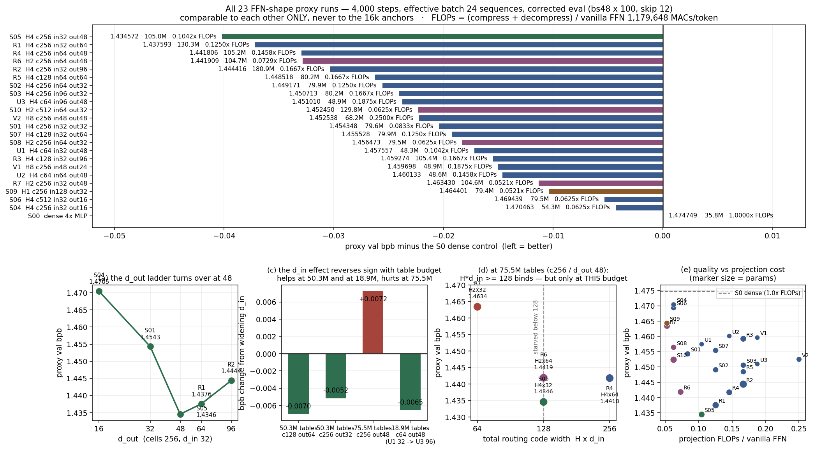
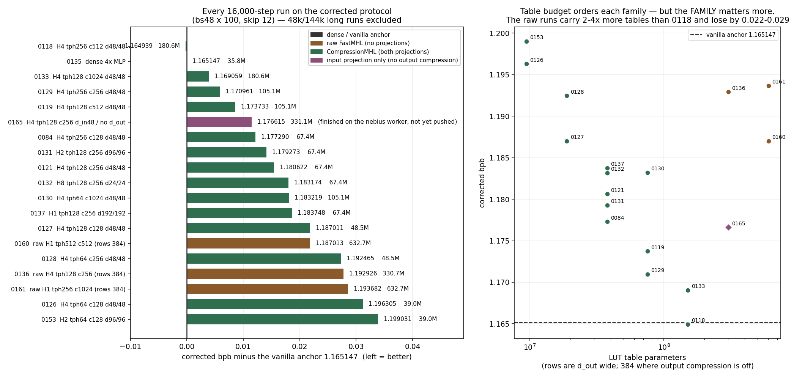
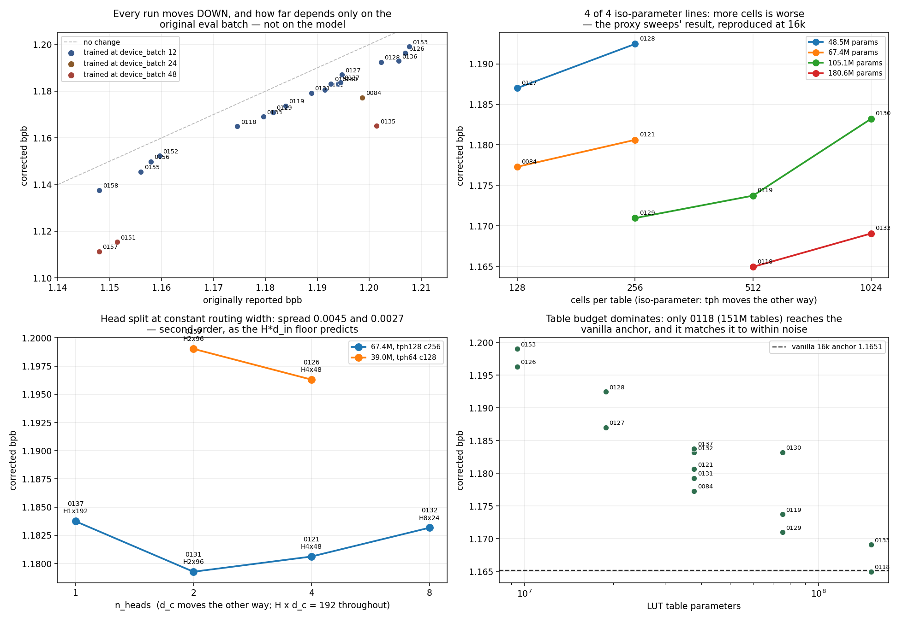
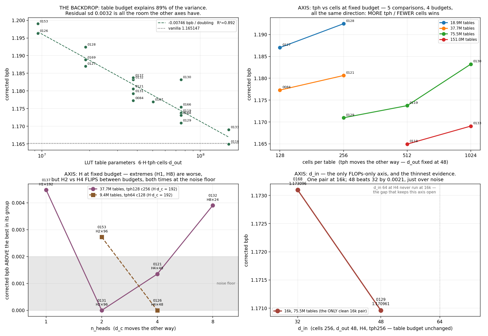

# FFN-shape proxy sweeps — results (23 runs)

Six sweeps, 11 + 6 + 1 + 3 + 1 + 1 runs, all on one budget: 4,000 steps, effective batch 24 sequences
(12,288 tokens), lr 3e-4 with 10% linear warmup and cosine decay to 0.1× peak parameterised by
`n_steps=4000`. Every run is scored on the corrected protocol (`evaluate_bpb_fixed`: bs48 × 100,
leading 12 rows skipped, 2,451,456 val tokens of held-out `shard_06542.parquet`). Setup and
file map: [`SWEEP_README.md`](SWEEP_README.md). Table and analysis are regenerated by
`summarise_all.py`.

> ## ⚠️ Comparable to each other only
> The training budget is one eighth of the 16k / batch-48 line at half the batch. These
> numbers sit far above it and must **never** be read against `exp_n_0135` (1.165147),
> `exp_n_0136` (1.192926), `exp_n_0118` (1.164939) or `exp_n_0129` (1.170961).
> **S0 is the zero-line.** Only the *ordering* transfers, and only where a margin clears the
> **~0.002 noise floor** (set by the S2/S3 pair: differences that small flip sign across eval
> points).

## All 23 runs

FLOPs are MACs/token for the two dense projections — compress `H·384·d_in` and decompress
`H·384·d_out` — against vanilla's **whole** FFN at `2·384·1536` = 1,179,648. The first sweep
reported only the compress side, which flattered high-`d_out` shapes; this table does not.

| | shape | params | tables | proxy bpb | vs S0 | vs S1 | compress | decompress | proj/vanilla | h |
|---|---|---|---|---|---|---|---|---|---|---|
| **S5** | H4 c256 in32 **out48** | 104,952,588 | 75,497,472 | **1.434572** | −0.040177 | −0.019776 | 49,152 | 73,728 | 0.1042× | 0.50 |
| R1 | H4 c256 in32 out64 | 130,265,868 | 100,663,296 | 1.437593 | −0.037156 | −0.016755 | 49,152 | 98,304 | 0.1250× | 0.52 |
| R4 | H4 c256 in64 out48 | 105,248,268 | 75,497,472 | 1.441806 | −0.032943 | −0.012542 | 98,304 | 73,728 | 0.1458× | 0.50 |
| **R6** | **H2** c256 in64 out48 | 104,731,404 | 75,497,472 | 1.441909 | −0.032840 | −0.012439 | 49,152 | 36,864 | **0.0729×** | 0.50 |
| R2 | H4 c256 in32 out96 | 180,892,428 | 150,994,944 | 1.444416 | −0.030333 | −0.009932 | 49,152 | 147,456 | 0.1667× | 0.58 |
| R5 | H4 c128 in64 out64 | 80,229,900 | 50,331,648 | 1.448518 | −0.026232 | −0.005830 | 98,304 | 98,304 | 0.1667× | 0.32 |
| **S2** | H4 c256 in64 out32 | 79,934,988 | 50,331,648 | 1.449171 | −0.025578 | −0.005177 | 98,304 | 49,152 | 0.1250× | 0.49 |
| S3 | H4 c256 in96 out32 | 80,230,668 | 50,331,648 | 1.450713 | −0.024036 | −0.003635 | 147,456 | 49,152 | 0.1667× | 0.49 |
| U3 | H4 c64 in96 **out48** | 48,920,844 | 18,874,368 | 1.451010 | -0.023740 | -0.003339 | 147,456 | 73,728 | 0.1875x | 0.22 |
| S10 | H2 c512 in64 out32 | 129,823,500 | 100,663,296 | 1.452450 | −0.022299 | −0.001898 | 49,152 | 24,576 | 0.0625× | 0.87 |
| V2 | H8 tph64 c256 in48 out48 | 68,237,580 | 37,748,736 | 1.452538 | -0.022212 | -0.001810 | 147,456 | 147,456 | 0.2500x | 0.29 |
| S1 | H4 c256 in32 out32 *(control)* | 79,639,308 | 50,331,648 | 1.454348 | −0.020401 | — | 49,152 | 49,152 | 0.0833× | 0.49 |
| S7 | H4 c128 in32 out64 | 79,934,220 | 50,331,648 | 1.455528 | −0.019222 | +0.001180 | 49,152 | 98,304 | 0.1250× | 0.32 |
| S8 | H2 c256 in64 out32 | 79,491,852 | 50,331,648 | 1.456473 | −0.018276 | +0.002125 | 49,152 | 24,576 | 0.0625× | 0.49 |
| U1 | H4 c64 in32 out48 | 48,329,484 | 18,874,368 | 1.457557 | -0.017192 | +0.003209 | 49,152 | 73,728 | 0.1042x | 0.22 |
| R3 | H4 c128 in32 out96 | 105,394,956 | 75,497,472 | 1.459274 | −0.015475 | +0.004926 | 49,152 | 147,456 | 0.1667× | 0.36 |
| V1 | H8 tph64 c256 in48 out24 | 48,920,844 | 18,874,368 | 1.459698 | -0.015051 | +0.005350 | 147,456 | 73,728 | 0.1875x | 0.28 |
| U2 | H4 c64 in64 out48 | 48,625,164 | 18,874,368 | 1.460133 | -0.014616 | +0.005785 | 98,304 | 73,728 | 0.1458x | 0.22 |
| R7 | **H2** c256 in32 out48 | 104,583,564 | 75,497,472 | 1.463430 | −0.011319 | +0.009082 | 24,576 | 36,864 | 0.0521× | 0.51 |
| S9 | H1 c256 in128 out32 | 79,418,124 | 50,331,648 | 1.464401 | −0.010349 | +0.010053 | 49,152 | 12,288 | 0.0521× | 0.46 |
| S6 | H4 c512 in32 out16 | 79,491,852 | 50,331,648 | 1.469439 | −0.005310 | +0.015091 | 49,152 | 24,576 | 0.0625× | 0.84 |
| S4 | H4 c256 in32 out16 | 54,326,028 | 25,165,824 | 1.470463 | −0.004287 | +0.016115 | 49,152 | 24,576 | 0.0625× | 0.47 |
| S0 | dense 4× MLP | 35,792,640 | — | 1.474749 | — | +0.020401 | — | — | 1.0000× | 0.07 |

Every LUT shape beats the dense control, by 0.004 to 0.040. **No training instability in any
of the 23** — all curves monotone at every eval point, no loss spikes, no NaNs, including the
high-`d_in` (S3, S9, R4, R5) and low-`d_out` (S4, S6) configurations. Every built param count
was verified before its run trained; all landed within 1% of the brief. Sweeps 2 and 3 ran at
device_batch 12 × accum 2 throughout; in sweep 1 only S6 and S10 needed 6 × 4 (their
`H·tph·cells = 524,288` buffer is 12.9 GiB at bs12).



## (a) The d_out ladder — an inverted U with its minimum at 48

At cells 256, d_in 32:

| d_out | params | proxy bpb | step | cost |
|---|---|---|---|---|
| 16 | 54,326,028 | 1.470463 | — | — |
| 32 | 79,639,308 | 1.454348 | −0.016115 | +25.3M |
| 48 | 104,952,588 | **1.434572** | −0.019776 | +25.3M |
| 64 | 130,265,868 | 1.437593 | **+0.003021** | +25.3M |
| 96 | 180,892,428 | 1.444416 | +0.006823 | +50.6M |

Sweep 1 saw increasing returns across 16→32→48 and flagged that the ladder had not saturated.
It turns over immediately after. Past 48 it degrades monotonically, and by d_out 96 the model
is 72% larger than S5 and 0.0098 worse. **d_out = 48 is the optimum at cells 256**, and the
+0.003 at d_out 64 is only just over the noise floor — the safe reading is "the return has gone
to zero, and 48 gets it 25.3M parameters and 0.02× vanilla FLOPs cheaper".

## (b) Table params are *not* the driver — the split matters, a lot

Two pairs holding the table budget fixed:

| tables | pair | bpb | Δ |
|---|---|---|---|
| 75,497,472 (~105M total) | S5 c256/out48 vs **R3** c128/out96 | 1.434572 / 1.459274 | **+0.024702** |
| 50,331,648 (~80M total) | S1 c256/out32 vs S7 c128/out64 | 1.454348 / 1.455528 | +0.001180 |

At the smaller budget the split is free — halving cells to double row width is a tie. At the
larger budget the same trade costs 0.0247, twelve times the noise floor, widening monotonically
through the run, **and** R3 pays 60% more projection FLOPs for it. R3 is the only run in either
sweep to lose to the S1 control while being 32% bigger.

**This revises sweep 1's headline.** "d_out is the axis, cells are not" was too strong: R3 has
the *larger* d_out and loses. The accurate statement is that **cells has an interior optimum at
256** — 512 is bad (S6, S10), 128 is free at moderate d_out and costly once d_out is pushed —
and that **cells and d_out interact**: widening rows only pays while the table has enough cells
to make distinct use of them. Sweep 1 simply never tested going *down* in cells at a large
budget.

## (c) d_in and d_out do not stack — d_in's sign flips with the table budget

The d_in 32→64 effect, everywhere it has been measured:

| cells | d_out | tables | d_in 32 | d_in 64 | effect |
|---|---|---|---|---|---|
| 256 | 32 | 50.3M | S1 1.454348 | S2 1.449171 | −0.005177 helps |
| 128 | 64 | 50.3M | S7 1.455528 | R5 1.448518 | −0.007010 helps |
| 256 | 48 | **75.5M** | S5 1.434572 | R4 1.441806 | **+0.007234 hurts** |

Interaction between the two "gains" at the 105M point: **+0.012411**, six times the noise floor.
The sign does not track d_out (helps at 64, hurts at 48) or cells (helps at both) — it tracks
the **table budget**. R4, the stack, was the configuration recommended after sweep 1 as first
choice for a 16k run; it loses to S5, which was recommended second. That recommendation was
wrong, and the reasoning behind it — "different resources, so no destructive interaction" —
does not survive the measurement.

The curve shapes distinguish the two cases cleanly. Where d_in helps (S7→R5) it leads at all
eight eval points with no crossover. Where it hurts (S5→R4) it *leads early* and is overtaken
at step ~2500: a wider routing code learns faster and then caps the ceiling once the tables can
exploit fine routing. R1 shows the same crossover against S5.

**Confound, stated plainly:** the two 50.3M-table runs are also the ~80M-total runs and the
75.5M-table run is the ~105M-total run, so this data cannot separate "table budget" from "model
size class". A c128/d_out 96 point at d_in 64 would; nothing here has one.

## (c2) The small-budget d_in ladder — the sign flips again, the other way

Every run in the historical 16k grid has `d_in == d_out`, so untying had never been tested at a
**small** table budget. U1/U2/U3 pin the table budget at **18,874,368** — a quarter of S5's,
with cells cut to 64 (nap6, only 6 comparisons per address) — and move nothing but `d_in`:

| | d_in | `H·d_in` | params | proxy bpb | vs U1 | proj FLOPs |
|---|---|---|---|---|---|---|
| U1 | 32 | 128 | 48,329,484 | 1.457557 | — | 0.1042× |
| U2 | 64 | 256 | 48,625,164 | 1.460133 | +0.002576 | 0.1458× |
| U3 | 96 | 384 | 48,920,844 | **1.451010** | **−0.006548** | 0.1875× |

**The `d_in` effect has flipped sign again, and this is the finding.** At 75.5M tables widening
`d_in` from 32 to 64 *hurt* by +0.007234 (S5 → R4). At 18.9M tables widening it to 96 *helps* by
−0.006548 (U1 → U3), and U3 beats U1 at all eight eval points with no crossover. Scarce tables
really do make routing work harder — the hypothesis holds.

But it is **not** a floor that has cleanly risen. U1, sitting exactly at `H·d_in` = 128, is not
the worst of the three — U2 is, by +0.002576 over U1, and that pair shows the familiar `d_in`
crossover (U2 leads from step 1000 to 2500, U1 overtakes after 3000), so U1-vs-U2 is best read
as indistinguishable. What moved is the **optimum**, not a cliff: at 75.5M tables it sits at or
below 128, at 18.9M tables it is at least 384 and the ladder has not turned over at the top rung
tested. The spread across the three, **0.009124**, is 4.6× the noise floor.

**Cost, which must not be buried.** Unlike a table-split change, `d_in` moves FLOPs: U3 pays
0.1875× vanilla projection cost against U1's 0.1042× — 80% more — for its 0.0065 bpb. So a
small model does not just *prefer* more routing width, it has to *pay* for it, which closes off
the small end of the design space on the FLOPs axis exactly as the hypothesis anticipated.

For scale: U3 at 18.9M tables (1.451010) still loses to S5 at 75.5M (1.434572) by **+0.016438**,
so a 4× smaller table budget costs about 0.016 even with the best routing width available to it.
It does, though, beat S1 (1.454348) and S8 (1.456473) despite having 2.7× fewer tables — because
it keeps `d_out` at 48 where they use 32, which is the d_out result again.

All three curves are monotone at every eval point with no plateau and no instability; cells = 64
showed no pathology despite giving only 6 comparisons per address.

## (c3) V1 — probing a corner the rules reject, and untying does not rescue it

V1 (`exp_n_0172`, H8 / tph64 / cells 256 / d_in 48 / d_out 24) was built to attack two
established regularities at once. Both predicted it would lose, and it does — though by less
than the tied comparisons implied.

At the shared 18,874,368 table budget, all four runs:

| | shape | d_in | d_out | proxy bpb | vs U3 |
|---|---|---|---|---|---|
| U3 | H4 tph256 c64 | 96 | 48 | **1.451010** | — |
| U1 | H4 tph256 c64 | 32 | 48 | 1.457557 | +0.006547 |
| **V1** | **H8 tph64 c256** | 48 | 24 | 1.459698 | +0.008688 |
| U2 | H4 tph256 c64 | 64 | 48 | 1.460133 | +0.009123 |

*Rank 16 of 22 proxy runs; −0.015051 against the S0 dense anchor.*

**The tph-over-cells rule survives.** V1 sits in the rejected corner (tph 64 / cells 256) while
U1–U3 sit in the favoured one (tph 256 / cells 64), and V1 loses to U1 by 0.002141 and to U3 by
0.008688. Untying did *not* rescue it. But the margin is smaller than the tied comparison at this
same budget suggested (0127 beat 0128 by 0.005454), and V1 is indistinguishable from U2
(0.000435, well inside noise) — so the fair statement is that the corner is *disfavoured, not
disqualifying*.

**H8 likewise survives as mildly bad, not fatal** — V1 is mid-pack rather than at the bottom,
consistent with the 37.7M H-slice where H8 cost 0.0039 rather than collapsing.

**Attribution caveat, and it is a real one.** V1 differs from U1/U2/U3 in *four* things at once —
H, tph, cells and d_out — so nothing here isolates any single axis. It tests the *conjunction*
the rules reject, which is what it was for, and the conjunction loses. It is emphatically **not**
a clean `d_out` result: it is the first run at this budget with d_out 24 rather than 48, but
cells and tph move with it to hold the budget, exactly the confound the axis analysis described.

Curve monotone at every eval point, no spikes, no NaNs; cells 256 with H8/tph64 showed no
pathology. Ran at device_batch 12 × grad_accum 2, buffer 3.22 GB, 0.28 h.

## (c4) V2 — doubling d_out buys exactly the budget law, and nothing else

V2 (`exp_n_0173`, H8 / tph64 / cells 256 / d_in 48 / d_out 48) is V1 with the dims tied. Because
`d_out` enters the table count linearly, that doubles the budget from 18,874,368 to 37,748,736 —
**exactly one doubling**, at fixed H, tph, cells and d_in.

| | d_out | tables | proxy bpb |
|---|---|---|---|
| V1 | 24 | 18,874,368 | 1.459698 |
| V2 | 48 | 37,748,736 | **1.452538** |

```
actual            −0.007160
budget law        −0.007455 per doubling
miss              +0.000295     (V2 delivers 96% of the law, far inside noise)
```

**So `d_out`'s benefit here is entirely the table parameters it buys — no shape bonus, no shape
penalty.** That is a genuinely useful null: on this axis, at this pair of budgets, the parameters
are the whole story, and there is no separate "wider rows help the routing" effect to claim.
V2 ranks *11 of 23*, −0.022212 against the S0 dense anchor.

**Two comparisons the framing invited that the data will not support.**

*V2 against 0132* was proposed as the closest thing to a clean tph-vs-`d_out` isolate (H 8, cells
256 and budget all fixed; only tph 128→64 trading against `d_out` 24→48). The **shapes** do form
that pair — but 0132 is a *16k* run and V2 is a *4k proxy*, so the two numbers are on different
training budgets and cannot be differenced. That is precisely the cross-budget error this whole
line of work exists to correct. To use the pair, one side needs a twin at the other budget.

*V2 as an H8 datapoint*: only V1 and V2 are H8 anywhere in the proxy set, and they differ in
`d_out`, so there is no proxy H-slice at fixed budget at all. V2 says nothing about whether H8 is
a bad extreme.

**No proxy peer at this budget.** Read from disk: the proxy budgets present are 18.9M ×4, 25.2M
×1, 50.3M ×8, 75.5M ×5, 100.7M ×2, 151M ×1 — **V2 is the first proxy run at 37,748,736**, so its
only same-budget company is the 16k slice it cannot be differenced against.

**Not worth a 16k slot, and this time the cost argument settles it independently.** Calibrating
proxy→16k on the four shapes that exist at both budgets gives `16k = 0.242892 + 0.647166 × 4k`
(R² = 0.828, max in-sample residual 0.0039), projecting V2 to ≈ **1.1829, band 1.179–1.187**. The
16k anchors at that exact budget are 0084 1.177290, 0131 1.179273, 0121 1.180622, 0132 1.183174,
0137 1.183748 — so V2 projects to *mid-pack*, and even the optimistic end of its band does not
reach 0084. And **it would pay 0.2500× vanilla projection FLOPs to get there, double the 0.1250×
every one of those five runs uses.** The projection rests on only four paired shapes and should
be treated as indicative; the FLOPs argument does not depend on it and holds regardless.

Curve monotone at every eval point, no spikes, no NaNs. Ran at device_batch 12 × grad_accum 2,
buffer 3.22 GB, 0.287 h.

## (d) It was never about head count — the rule is `H · d_in ≥ 128` *at 75.5M tables*

Scope note added after U1/U2/U3: everything in this section is measured at cells 256 / d_out 48
/ 75,497,472 tables. Section (c2) shows the preferred code width moves with the table budget, so
"≥ 128" is the rule *at that budget*, not a universal constant.

The head trade looked like it depended on how "rich" the config was:

| config | H4 | H2 | Δ | proj FLOPs |
|---|---|---|---|---|
| d_in 32, d_out 32 | S1 1.454348 | S8 1.456473 | +0.002125 | 0.0833× → 0.0625× |
| d_in 64, d_out 48 | R4 1.441806 | R6 1.441909 | +0.000103 | 0.1458× → 0.0729× |
| d_in 32, d_out 48 | S5 1.434572 | **R7 1.463430** | **+0.028858** | 0.1042× → 0.0521× |

**R7 refutes the "richness" reading outright.** It is the richest config of the three and the
head penalty there is +0.0289 — the *largest* head effect measured anywhere, fourteen times
the noise floor, and bigger than collapsing to H1 at the lean config (S9, +0.0101).

What actually separates the cases is the **total routing code width `H · d_in`** — the number
of dimensions the sign comparisons are computed over, summed across heads. At cells 256 /
d_out 48 / 75,497,472 tables, all four points that exist:

| | H × d_in | total code | proxy bpb |
|---|---|---|---|
| R7 | 2 × 32 | **64** | 1.463430 |
| S5 | 4 × 32 | 128 | **1.434572** |
| R6 | 2 × 64 | 128 | 1.441909 |
| R4 | 4 × 64 | 256 | 1.441806 |

The three configurations at total code ≥ 128 span 1.4346–1.4419; the one at 64 sits 0.021
below the worst of them. **Total code width ≥ 128 is a binding floor; above it the split
across heads is a second-order effect** (S5's 4×32 beats R6's 2×64 by 0.0073 — real, but four
times smaller than the starvation penalty). R6's "free FLOPs halving" works precisely because
2×64 still totals 128; halving the heads *without* doubling `d_in` breaks the floor.

Note this makes the FLOPs arithmetic transparent: compress cost is `H·384·d_in` = 384 × total
code width, so it depends on nothing but the code width. R6 and S5 have **identical compress
cost** (49,152); R6's saving is entirely on the decompress side, where halving heads halves
`H·384·d_out`. So the real trade R6 offers is "half the decompress projection for +0.0073 bpb",
not "half of everything for free".

The curve shapes confirm the two cases are different in kind. R6's deficit *converges* to zero
(+0.0072 at step 2000 → +0.0001 at 4000) — a slow start. R7's *widens* monotonically (+0.0084
at 500 → +0.0289 at 4000) — a ceiling, and one that should be **worse** at 16k, not better.

H1 remains clearly worse (S9, +0.010053), and S9's total code is 1 × 128 = 128, i.e. it clears
the floor and still loses — so the floor is necessary, not sufficient. The useful range is
H ∈ {2, 4} with `H · d_in ≥ 128`.

## (e) Quality per projection-FLOP

bpb below S0 per unit of the proj/vanilla ratio — how much quality each shape extracts per unit
of dense projection cost:

| | below S0 | proj/vanilla | ratio | params |
|---|---|---|---|---|
| **R6** | 0.032840 | 0.0729× | **0.4504** | 104,731,404 |
| S5 | 0.040177 | 0.1042× | 0.3857 | 104,952,588 |
| S10 | 0.022299 | 0.0625× | 0.3568 | 129,823,500 |
| R1 | 0.037156 | 0.1250× | 0.2972 | 130,265,868 |
| S8 | 0.018276 | 0.0625× | 0.2924 | 79,491,852 |
| S1 | 0.020401 | 0.0833× | 0.2448 | 79,639,308 |
| … | | | | |
| R7 | 0.011319 | 0.0521× | 0.2172 | 104,583,564 |

The honest counterweight to the ranking table: **high-d_out shapes buy quality with projection
FLOPs.** S5 is the best model but at 0.1042× vanilla, twice S8's 0.0625×; R2 reaches 0.1667×
and is worse than S5 anyway. R6 tops this column because it matches R4's quality at half the
cost. R7 is the cheapest LUT of all 18 at 0.0521× and still ranks near the bottom of this
column — cutting the routing code below the floor is not a way to buy efficiency.

Note also that projection FLOPs are only part of the story — the table gather itself is not
counted here, and it scales with `H·tph`, which is 1024 for every LUT run in all three sweeps.

## (f) Updated recommendation for 16k / batch 48 on nebius-h100

Revised in light of (a)–(e). The post-sweep-1 recommendation (R4, the d_in+d_out stack) is
**withdrawn** — it was measured and it loses.

1. **S5 — `H4 / tph256 / cells256 / d_in 32 / d_out 48`, 104,952,588 params, 0.1042× vanilla
   projection FLOPs.** The measured optimum, and now triangulated from four directions: pushing
   d_out past it (R1, R2), pushing d_in past it (R4), and re-splitting its budget at coarser
   routing (R3) all cost. Best pure-quality choice. The cost is that it is 32% larger than the
   80M class and doubles S1's projection FLOPs.

2. **R6 — `H2 / tph512 / cells256 / d_in 64 / d_out 48`, 104,731,404 params, 0.0729× vanilla.**
   0.0073 behind S5 on quality but at 70% of its projection cost, and the best quality-per-FLOP
   of all 18. This is the efficiency pick, and the one to run if the FFN-replacement claim is
   about cost rather than raw bpb. Note precisely what it buys: its compress cost is identical
   to S5's (49,152 — both total 128 code dimensions); the saving is entirely decompress.

3. **S2 — `H4 / tph256 / cells256 / d_in 64 / d_out 32`, 79,934,988 params, 0.1250× vanilla.**
   The 80M-class point: 0.0146 behind S5 at 76% of the parameters. R5 ties it (0.000653, inside
   noise) while paying 33% more projection FLOPs, so S2 is the better representative of that
   size class. Worth a slot as the cheap end of the frontier and as the test of whether d_in
   survives a longer schedule.

That run was made — it is **R7**, and the answer is no. R7 (`H2 / tph512 / cells256 / d_in 32 /
d_out 48`, 104,583,564) reads **1.463430**, +0.028858 behind S5, because halving the heads at
d_in 32 drops the total routing code from 128 to 64 and starves it. The ranking above is
therefore unchanged by it, and (d) now states the rule that survives: **`H · d_in ≥ 128`.**

**Do not spend 16k time on**: d_out 16 in any form (S4, S6), d_out ≥ 64 (R1, R2 — past the
turnover), H = 1 (S9), cells 512 (S6, S10), the d_in+d_out stack (R4), or any shape with
`H · d_in < 128` (R7).

**Carry these caveats into the 16k reads.** One eighth the training at half the batch, with peak
LR held at 3e-4 across all 17 for mutual comparability (a √2 rule would suggest 2.12e-4 at this
batch). Effects that *widened* through training — the d_out ladder below 48, the d_out-16
penalty, the R3 gap — should be at least as large at 16k. Effects that *converged* — the head
gaps, and the d_in advantage where it appeared — may shrink or vanish, and the two crossover
cases (R4, R1 overtaken by S5 mid-run) are exactly where a longer schedule could change the
ordering. Nothing here transfers numerically; only the ordering does, and only above ~0.002.

---

# The 16,000-step picture, consolidated

Every 16k run scored under the corrected protocol (`evaluate_bpb_fixed`: bs48 × 100, skip 12,
2,451,456 val tokens of held-out `shard_06542.parquet`), read from each run's own
`corrected_score.json` / `summary.json`. Regenerated by `report_16k.py`; `report_16k.py --verify`
re-runs the guard. The 48k/144k long runs are excluded — separate budget, own section.

**Guard, run independently.** For all 23 runs I rebuilt the model from its own `config.json` and
compared to its own `summary.json`: **23 of 23 match exactly**, and every score file that records
state-dict load counts records 0 missing / 0 unexpected. Five older files (0118, 0129, 0133,
0135, 0136) state the clean load in prose rather than as fields — those were verified at scoring
time, but the *field* is absent, so this table reports them as verified-by-description.

| run | label | H | tph | cells | d_in | d_out | tables | params | proj/vanilla | corrected | vs vanilla |
|---|---|---|---|---|---|---|---|---|---|---|---|
| 0118 | — | 4 | 256 | 512 | 48 | 48 | 150,994,944 | 180,597,900 | 0.1250× | **1.164939** | −0.000208 |
| 0135 | vanilla | — | — | — | — | — | — | 35,792,640 | 1.0× | 1.165147 | — |
| 0133 | — | 4 | 128 | 1024 | 48 | 48 | 150,994,944 | 180,597,900 | 0.1250× | 1.169059 | +0.003912 |
| 0129 | — | 4 | 256 | 256 | 48 | 48 | 75,497,472 | 105,100,428 | 0.1250× | 1.170961 | +0.005814 |
| 0168 | **S5** | 4 | 256 | 256 | 32 | 48 | 75,497,472 | 104,952,588 | 0.1042× | 1.173096 | +0.007949 |
| 0119 | — | 4 | 128 | 512 | 48 | 48 | 75,497,472 | 105,100,428 | 0.1250× | 1.173733 | +0.008586 |
| 0166 | **R6** | 2 | 512 | 256 | 64 | 48 | 75,497,472 | 104,731,404 | 0.0729× | 1.175473 | +0.010326 |
| 0165 | in-proj | 4 | 128 | 256 | 48 | −1 | 301,989,888 | 331,148,172 | 0.0625× | 1.176615 | +0.011468 |
| 0167 | **S2** | 4 | 256 | 256 | 64 | 32 | 50,331,648 | 79,934,988 | 0.1250× | 1.176887 | +0.011740 |
| 0084 | — | 4 | 256 | 128 | 48 | 48 | 37,748,736 | 67,351,692 | 0.1250× | 1.177290 | +0.012143 |
| 0131 | — | 2 | 128 | 256 | 96 | 96 | 37,748,736 | 67,351,692 | 0.1250× | 1.179273 | +0.014126 |
| 0121 | — | 4 | 128 | 256 | 48 | 48 | 37,748,736 | 67,351,692 | 0.1250× | 1.180622 | +0.015475 |
| 0132 | — | 8 | 128 | 256 | 24 | 24 | 37,748,736 | 67,351,692 | 0.1250× | 1.183174 | +0.018028 |
| 0130 | — | 4 | 64 | 1024 | 48 | 48 | 75,497,472 | 105,100,428 | 0.1250× | 1.183219 | +0.018073 |
| 0137 | — | 1 | 128 | 256 | 192 | 192 | 37,748,736 | 67,351,692 | 0.1250× | 1.183748 | +0.018601 |
| 0127 | — | 4 | 128 | 128 | 48 | 48 | 18,874,368 | 48,477,324 | 0.1250× | 1.187011 | +0.021864 |
| 0160 | raw | 1 | 512 | 512 | — | — | 603,979,776 | 632,694,540 | — | 1.187013 | +0.021866 |
| 0169 | **U1** | 4 | 256 | 64 | 32 | 48 | 18,874,368 | 48,329,484 | 0.1042× | 1.188807 | +0.023660 |
| 0128 | — | 4 | 64 | 256 | 48 | 48 | 18,874,368 | 48,477,324 | 0.1250× | 1.192465 | +0.027318 |
| 0136 | raw | 4 | 128 | 256 | — | — | 301,989,888 | 330,704,652 | — | 1.192926 | +0.027780 |
| 0161 | raw | 1 | 256 | 1024 | — | — | 603,979,776 | 632,694,540 | — | 1.193682 | +0.028535 |
| 0126 | — | 4 | 64 | 128 | 48 | 48 | 9,437,184 | 39,040,140 | 0.1250× | 1.196305 | +0.031158 |
| 0153 | — | 2 | 64 | 128 | 96 | 96 | 9,437,184 | 39,040,140 | 0.1250× | 1.199031 | +0.033884 |

`proj/vanilla` is `H·384·(d_in + d_out)` against vanilla's whole FFN at `2·384·1536` = 1,179,648
MACs/token; the raw runs have no projections at all.



## 1. The front-runner — it is 0118, not S5

**0118 is the best LUT result at 16k**, and by a clear margin over the proxy-recommended shapes.
S5 (0168) confirms from disk at **1.173096**, +0.007949 vs vanilla — but that is **+0.008157
above 0118**, and S5 is only the *fourth*-best LUT run, behind 0118, 0133 and 0129.

So the tension resolves cleanly and not in S5's favour: any "closest to dense" claim belongs to
**0118**, which *matches vanilla to within noise* (0.000208 below the anchor, ~10× under the
~0.002 noise floor). S5's merit is efficiency, not quality — it reaches +0.0079 at 105.0M params
and 0.1042× projection cost where 0118 needs 180.6M and 0.1250×. That is a real 42%
parameter saving for 0.0082 bpb, but it is a trade, not a win.

## 2. S5 vs 0129 — the free-d_in-cut question, answered: it is **not** free

The cleanest single-variable ablation in the whole 16k set. Same 75,497,472 tables, same
H4/tph256/cells256/d_out48; the *only* difference is `d_in` 48 → 32, and the parameter gap of
**147,840** is exactly the compress projection.

| | d_in | params | corrected bpb |
|---|---|---|---|
| 0129 | 48 | 105,100,428 | **1.170961** |
| 0168 (S5) | 32 | 104,952,588 | 1.173096 |

**S5 is worse by +0.002135** — just above the ~0.002 noise floor. Cutting `d_in` from 48 to 32
drops compress FLOPs from 73,728 to 49,152 (−33%) and total projection FLOPs from 147,456 to
122,880 (**−16.7%**), and it costs 0.0021 bpb. So a ~17% multiply reduction at fixed table budget
is *cheap but not free*, and the effect sits right at the edge of what this protocol can resolve.
Stated without spin: **S5 does not beat 0129.** Effective batch is 24,576 tokens for both, so the
comparison is fair; only the micro-batching differs (0129 at device_batch 12, S5 at 24).

## 3. Untying downward at 18.9M tables — it cost, and the proxy's direction did not hold

U1 (0169) against its tied reference 0127, same 18,874,368 tables, `d_in` 32 vs 48:

| | d_in | corrected bpb |
|---|---|---|
| 0127 | 48 | **1.187011** |
| 0169 (U1) | 32 | 1.188807 |

**+0.001796 — untying downward bought nothing**, and if anything cost a hair, at the noise floor.

Blunt version: the 4k proxy's `d_in` direction has now failed twice at full length. At 75.5M
tables the proxy said narrower `d_in` was better (S5 32 beat R4 64 by 0.0072); full length says
`d_in` 32 is *worse* than 48 by 0.0021 (Q2). At 18.9M tables the proxy said wider was better
(U3 96 beat U1 32 by 0.0065); full length so far says `d_in` 32 is worse than 48 by 0.0018,
which is at least the same sign as "32 is not the place to be". The `d_in` axis is the one
dimension where the proxy has been an unreliable *ranker*, not merely an exaggerating one. U3
(0170) will complete the pair.

## 4. The projections ladder — it holds, and gets stronger

| | projections | tables | corrected bpb |
|---|---|---|---|
| 0136 | none | 301,989,888 | 1.192926 |
| 0165 | input only | 301,989,888 | 1.176615 |
| 0167 (S2) | both | 50,331,648 | 1.176887 |
| 0166 (R6) | both | 75,497,472 | 1.175473 |
| 0168 (S5) | both | 75,497,472 | 1.173096 |
| 0118 | both | 150,994,944 | **1.164939** |

The three new both-projection runs slot in exactly where the ladder predicts, and sharpen it:
**S2 ties input-only 0165 (0.000272 apart, inside noise) with 6× fewer table parameters**, and S5
beats it outright by 0.003519 with 4× fewer. Adding the output compression is worth roughly a
4–6× table budget. The rung ordering none → input-only → both is unchanged.

## 5. Monotonicity in table parameters — preserved, and S5 does **not** displace 0129

Best-of-budget within CompressionMHL, now with a new 50.3M point from S2:

| tables | best run | bpb |
|---|---|---|
| 9,437,184 | 0126 | 1.196305 |
| 18,874,368 | 0127 | 1.187011 |
| 37,748,736 | 0084 | 1.177290 |
| 50,331,648 | 0167 (S2) | 1.176887 |
| 75,497,472 | **0129** | 1.170961 |
| 150,994,944 | 0118 | 1.164939 |

Strictly monotone across all six budgets. **0129 remains the best entry at 75.5M** — S5 (1.173096)
and R6 (1.175473) both sit above it, so the proxy-recommended shapes did not improve on the
historical grid at their own budget. Globally the relation still fails, and by more than before:
0165 at 301,989,888 tables (1.176615) and 0136 at the same budget, plus 0160/0161 at 603,979,776,
all lose to 0118 at 150,994,944.

## 6. The honest headline

At 16k, exactly one LUT configuration reaches the dense baseline: **0118 matches vanilla to
within noise** — 0.000208 below the 1.165147 anchor, about ten times smaller than the ~0.002
noise floor — and it does so at 180,597,900 parameters against dense's 35,792,640, a 5× model
for parity. Every other LUT run sits above the anchor, from +0.0039 to +0.0339, and the three
shapes the 4k proxy recommended land at +0.0079 (S5), +0.0103 (R6) and +0.0117 (S2), so the
proxy sweep did not produce a configuration competitive with 0118. **16k parity does not imply
48k parity**, and the existing long-run evidence points the other way: at 48k dense reads
1.115420 against the best LUT's 1.145471 (+0.030), and at 144k 1.111369 against 1.137558
(+0.026). The outstanding question is therefore `exp_n_0171` (0118 @ 48k), which is the direct
test of whether the one parity result survives a longer schedule.

---

# The historical grid, re-scored — complete

Separate from the proxy sweeps above: these are the **real 16k / 48k / 144k runs** re-scored
under the corrected protocol, so they are mutually comparable *and* they are the cross-check on
what the 4k proxy sweeps concluded. Regenerated by `summarise_grid.py`; inventory by
`inventory_old_grid.py`; scoring by `score_old_grid.py`, which reuses the exact code path used
for exp_n_0118/0129/0133 (`tools/fixed_eval.evaluate_bpb_fixed` + `tools/model_build`) and
refuses to publish a number unless the checkpoint loads with 0 missing / 0 unexpected keys
**and** the rebuilt parameter count matches the run's own `summary.json`.

**24 runs scored. One refused — `exp_n_0138`, and the refusal is the correct outcome** (see
below). Checkpoints were fetched from nebius one at a time and deleted after scoring.

## Every corrected run

16k runs first — the only ones on a common training budget and therefore the only ones
comparable to the 1.165147 vanilla anchor.

| run | shape | params | steps | dbs | orig bpb | corrected | correction | vs vanilla |
|---|---|---|---|---|---|---|---|---|
| 0118 | H4 tph256 c512 d48 | 180,597,900 | 16000 | 12 | 1.174600 | **1.164939** | −0.009661 | −0.000208 |
| 0135 | dense 4× MLP *(anchor)* | 35,792,640 | 16000 | 48 | 1.201440 | 1.165147 | −0.036293 | — |
| 0133 | H4 tph128 c1024 d48 | 180,597,900 | 16000 | 12 | 1.179608 | 1.169059 | −0.010549 | +0.003912 |
| 0129 | H4 tph256 c256 d48 | 105,100,428 | 16000 | 12 | 1.181484 | 1.170961 | −0.010523 | +0.005814 |
| 0119 | H4 tph128 c512 d48 | 105,100,428 | 16000 | 12 | 1.183857 | 1.173733 | −0.010124 | +0.008586 |
| 0084 | H4 tph256 c128 d48 | 67,351,692 | 16000 | 24 | 1.198660 | 1.177290 | −0.021371 | +0.012143 |
| 0131 | H2 tph128 c256 d96 | 67,351,692 | 16000 | 12 | 1.188834 | 1.179273 | −0.009561 | +0.014126 |
| 0121 | H4 tph128 c256 d48 | 67,351,692 | 16000 | 12 | 1.191455 | 1.180622 | −0.010833 | +0.015475 |
| 0132 | H8 tph128 c256 d24 | 67,351,692 | 16000 | 12 | 1.192631 | 1.183174 | −0.009457 | +0.018028 |
| 0130 | H4 tph64 c1024 d48 | 105,100,428 | 16000 | 12 | 1.194052 | 1.183219 | −0.010833 | +0.018073 |
| 0137 | H1 tph128 c256 d192 | 67,351,692 | 16000 | 12 | 1.194480 | 1.183748 | −0.010732 | +0.018601 |
| 0127 | H4 tph128 c128 d48 | 48,477,324 | 16000 | 12 | 1.194711 | 1.187011 | −0.007700 | +0.021864 |
| 0160 | raw H1 tph512 c512 | 632,694,540 | 16000 | 24 | 1.187013 | 1.187013 | 0 † | +0.021866 |
| 0128 | H4 tph64 c256 d48 | 48,477,324 | 16000 | 12 | 1.202275 | 1.192465 | −0.009810 | +0.027318 |
| 0136 | raw H4 tph128 c256 | 330,704,652 | 16000 | 12 | 1.205670 | 1.192926 | −0.012744 | +0.027780 |
| 0161 | raw H1 tph256 c1024 | 632,694,540 | 16000 | 24 | 1.193682 | 1.193682 | 0 † | +0.028535 |
| 0126 | H4 tph64 c128 d48 | 39,040,140 | 16000 | 12 | 1.206939 | 1.196305 | −0.010634 | +0.031158 |
| 0153 | H2 tph64 c128 d96 | 39,040,140 | 16000 | 12 | 1.207717 | 1.199031 | −0.008685 | +0.033884 |

† 0160/0161 were trained by nebius *on* the corrected protocol, so their "original" number
already is the corrected one.

**Long runs — a separate budget, NOT comparable to the 16k rows above or to the anchor.**

| run | shape | params | steps | dbs | orig bpb | corrected | correction |
|---|---|---|---|---|---|---|---|
| 0157 | dense 4× MLP | 35,792,640 | 144000 | 48 | 1.147985 | 1.111369 | −0.036617 |
| 0151 | dense 4× MLP | 35,792,640 | 48000 | 48 | 1.151444 | 1.115420 | −0.036025 |
| 0158 | H4 tph128 c128 d48 | 48,477,324 | 144000 | 12 | 1.148013 | 1.137558 | −0.010455 |
| 0155 | H4 tph128 c128 d48 | 48,477,324 | 48000 | 12 | 1.156018 | 1.145471 | −0.010547 |
| 0156 | H4 tph64 c256 d48 | 48,477,324 | 48000 | 12 | 1.157926 | 1.149841 | −0.008085 |
| 0152 | H4 tph64 c128 d48 | 39,040,140 | 48000 | 12 | 1.159622 | 1.152300 | −0.007322 |

At matched length the LUT still trails dense: 48k gives 1.115420 vs 1.145471 (+0.030), 144k
gives 1.111369 vs 1.137558 (+0.026). Longer training does not close the gap.



## The correction is a property of the original eval window, not of the model

| original `device_batch_size` | old window | n | mean correction | range |
|---|---|---|---|---|
| 12 | 61,440 tok | 18 | **−0.009903** | [−0.012744, −0.007322] |
| 24 | 122,880 tok | 1 | **−0.021371** | (0084) |
| 48 | 245,760 tok | 3 | **−0.036312** | [−0.036617, −0.036025] |
| — | already on the fixed protocol | 2 | 0 by construction | (0160, 0161) |

Monotone in the old window size and tight within each cohort — the bs48 cohort spans 0.00059
across three runs. Every one of the 22 corrections is negative. This is the confound
`FIXED_EVAL.md` describes, now measured across the whole grid.

## (i) and (ii) — what survives

**Within the bs12 16k cohort the ordering is PERFECTLY preserved, all 14 runs:**

```
by ORIGINAL:  0118 < 0133 < 0129 < 0119 < 0131 < 0121 < 0132 < 0130 < 0137 < 0127 < 0128 < 0136 < 0126 < 0153
by CORRECTED: 0118 < 0133 < 0129 < 0119 < 0131 < 0121 < 0132 < 0130 < 0137 < 0127 < 0128 < 0136 < 0126 < 0153
```

Identical, including the 0132/0130 pair that sits 0.000045 apart after correction. **Every
comparison made *within* that cohort still stands.**

**Across cohorts it reshuffles, and the runs that move are the ones on a different eval
window.** 0135 goes from 14th of eighteen to 2nd; 0084 climbs six places; 0160 and 0161 drop.
Thirteen runs flip sign against the anchor.

**0118, stated precisely:** it lands **0.000208 below** the corrected vanilla anchor — roughly
*ten times smaller* than the ~0.002 noise floor. The correct reading is that **0118 matches
vanilla to within noise**: not that it beats vanilla, and not that nothing reaches vanilla.
Every other compression run sits clearly above the anchor, by 0.0039 to 0.0339.

## (iii) Cross-validation of the proxy sweeps

**Cells — CONFIRMED, 4 of 4 iso-parameter lines.** Holding parameters and `d_c` fixed and
trading cells against tables, more cells is worse at every budget:

| budget | line (cells → bpb) |
|---|---|
| 48,477,324 | 128 → **1.187011** (0127) · 256 → 1.192465 (0128) |
| 67,351,692 | 128 → **1.177290** (0084) · 256 → 1.180622 (0121) |
| 105,100,428 | 256 → **1.170961** (0129) · 512 → 1.173733 (0119) · 1024 → 1.183219 (0130) |
| 180,597,900 | 512 → **1.164939** (0118) · 1024 → 1.169059 (0133) |

Monotone in all four, including a clean three-point line at 105.1M. This is the proxy's
S1/S7-beat-S6 result reproduced at full length and full batch.

**The `H·d_in ≥ 128` floor — CONFIRMED, with one sub-claim withdrawn.** Two budgets test the
head split at constant `H·d_c`:

| budget | split → bpb | spread |
|---|---|---|
| 67,351,692 (`H·d_c` = 192) | H2×96 **1.179273** · H4×48 1.180622 · H8×24 1.183174 · H1×192 1.183748 | 0.004475 |
| 39,040,140 (`H·d_c` = 192) | H4×48 **1.196305** · H2×96 1.199031 | 0.002726 |

All six clear 128 and land in bands of 0.0045 and 0.0027 — under the 0.005 falsification
threshold, and an order of magnitude below the **0.0289** penalty the proxy measured when the
floor was actually broken (R7). The split is second-order, as the floor predicts.

The sub-claim **"more, narrower heads win" does not survive.** Full length gives
**H2 ≥ H4 > H8 > H1** — an interior optimum, not monotone in head count. H1 is the worst as the
proxy predicted, but by 0.0031 vs H4 rather than the proxy's 0.0101, so the direction is right
and the magnitude was overstated ~3×. H2-over-H4 at 67.4M (0.0013) and H4-over-H2 at 39.0M
(0.0027) point opposite ways and are both at or below noise — consistent with "second-order",
not with a head-count law. H8×24 being clearly worse is new: the proxy never tested H8.

**The `d_out` ladder — NOT TESTABLE at full length.** Every compression run in the historical
grid has `d_in == d_out`. The single candidate that varies them independently is
`exp_n_0138` (`inner_in_dim = -1`, `inner_out_dim = 48`), and it is unscoreable — and in any
case it is an extreme *d_in* point (each head routes on the full 384-d input), not a d_out
variation. **So the d_out optimum at 48, and therefore the S5 pick itself, rests on the 4k
proxy alone and has no full-length confirmation.**

## exp_n_0138 — refused, and why that is right

```
STOP exp_n_0138_outcompress_only_H4_nap8_tph128:
     rebuilt params 66,908,172 != summary.json 66,908,208
```

A difference of exactly **36 = 6 layers × 6**. That is the documented PR #109 change: for
`inner_in_dim = -1` with `joint_head_compression = False`, the old code built a ModuleList of
four single-head LUTs (4 heads × 2 learnable temperatures = 8 scalars per layer) and the
current code builds one shared-input multi-head LUT (2 scalars per layer) — 6 fewer per layer,
36 across the model. The checkpoint is from the old structure and the current code cannot
reproduce that model, so no number was published. Recorded, not silently dropped.

## (iv) Does this move the shortlist?

**Not on shape — but it adds a caution about budget that the proxy could not see.**

The two proxy findings that *can* be checked both hold at full length, so nothing argues
against S5 / R6 / S2 as shapes. But the full-length grid shows **table budget dominates**: bpb
falls monotonically with table parameters, and **only 0118's 150,994,944-table model reaches
the vanilla anchor**. S5's table budget is 75,497,472 — the same as 0129, which reads 1.170961,
**+0.0058 above vanilla**. S5 is essentially 0129 with `d_in` narrowed 48 → 32, so a 16k run of
S5 should be expected to land near 1.171, not at parity.

There is a real tension worth stating: under `H·tph ≤ 1024` with the proxy's preferred cells 256
and d_out 48, the table budget is capped at `6 × 1024 × 256 × 48 = 75,497,472` — exactly S5's.
**Reaching 0118's budget within that constraint requires d_out 96, which is R2, which the proxy
found past the turnover.** So one of the three has to give: raise `H·tph`, raise cells (as 0118
does), or raise d_out. 0118 is the only configuration shown to reach parity, and it does so by
breaking the cells preference.

---

# What regularities exist across tph, nap, d_in, d_out and H

Regenerated by `axis_analysis.py`. Everything is read from each run's own `config.json` /
`summary.json` / `corrected_score.json`. **Deliberately conservative** — every claim is labelled
by strength of evidence, and anything resting on a single pair says so.

## The methodological problem, and how it is handled

`tables = 6·H·tph·cells·d_out` spans 9.4M → 604M across the set and is a *product of four of
the five axes*. A raw correlation of any axis against bpb is therefore mostly re-measuring the
table budget. So the budget is fitted first, and every axis is then read **only inside
iso-table-budget groups**, where the budget is held fixed by construction.

**The backdrop.** Over the 18 CompressionMHL runs at 16k:

```
bpb = 1.369488 − 0.007455 · log2(tables)     R² = 0.8922     residual sd = 0.003163
```

−0.00746 bpb **per doubling** of table budget; 0.0298 bpb over the 4 doublings observed. The
residual sd of 0.0032 — 1.6× the ~0.002 noise floor — is *all the room every other axis has
combined*, once the budget is accounted for. That is the single most important number here: the
shape axes are second-order against budget, and several of them are not separable from noise.



## The iso-budget groups, enumerated from the data

| tables | runs | axes varying | spread |
|---|---|---|---|
| 9,437,184 | 0126, 0153 | H, d_in, d_out | 0.002726 |
| 18,874,368 | 0127, 0169, 0128 | tph, cells, d_in | 0.005454 |
| 37,748,736 | 0084, 0131, 0121, 0132, 0137 | H, tph, cells, d_in, d_out | 0.006459 |
| 75,497,472 | 0129, 0168, 0119, 0166, 0130 | H, tph, cells, d_in | 0.012259 |
| 150,994,944 | 0118, 0133 | tph, cells | 0.004119 |

Every spread clears the noise floor, but in most groups **more than one axis moves at once**, so
attribution needs sub-selections where only one axis differs. Those are used below.

## (a) tph vs cells — CONFIRMED at 16k, and the hypothesis as posed is backwards

The hypothesis was put to me as *"cells (nap) beat tph at fixed table budget — previously claimed
4/4"*. **That inverts what I claimed and what the data say.** The earlier finding was "more cells
is worse"; the new data agree, now across five clean comparisons (`d_out` fixed at 48, so only
tph↔cells moves) at four independent budgets:

| tables | fewer cells / more tph | more cells / fewer tph | Δ |
|---|---|---|---|
| 18,874,368 | 0127 tph128 c128 **1.187011** | 0128 tph64 c256 1.192465 | +0.005454 |
| 37,748,736 | 0084 tph256 c128 **1.177290** | 0121 tph128 c256 1.180622 | +0.003333 |
| 75,497,472 | 0129 tph256 c256 **1.170961** | 0119 tph128 c512 1.173733 | +0.002772 |
| 75,497,472 | 0119 tph128 c512 **1.173733** | 0130 tph64 c1024 1.183219 | +0.009486 |
| 150,994,944 | 0118 tph256 c512 **1.164939** | 0133 tph128 c1024 1.169059 | +0.004119 |

**5 of 5, same direction, all above noise: at fixed table budget, spend on `tph`, not on
`cells`.** This is the strongest and best-evidenced regularity in the whole dataset. Note it is
*not* free on the uncounted axes — the gather touches `H·tph` entries and the soft-backward
buffer is `[tokens, H·tph, cells]`, whose product `H·tph·cells = tables/(6·d_out)` is **constant
within each of these rows**, so the trade is genuinely cost-neutral there. Evidence class: **(i)
confirmed at 16k on iso-budget comparisons.**

## (b) `H·d_in ≥ 128` — NOT TESTABLE at 16k

The hypothesis note suggested 0137 (H1, d_in 192) is a starved point. It is not: `H·d_in` = 192.
Checking every 16k CompressionMHL run:

```
0169 H4×32 = 128   0168 H4×32 = 128   all others ≥ 192
minimum over the 18 runs: 128 — nothing sits below the floor
```

**No 16k run has `H·d_in < 128`, so the floor cannot be tested at full length at all.** Its sole
supporting observation remains one 4k proxy run (R7, H2×32 = 64, +0.0289 vs its H4×32 sibling).
The 4k U-ladder additionally suggested the *preferred* code width rises when tables are scarce,
which is a different claim and also untested at 16k. Evidence class: **(iii) not testable with
current data** — and a rule with zero full-length support should not be carried into the paper as
established.

## (c) d_out vs d_in — d_out is structurally confounded; d_in rests on one pair

`d_out` enters `tables` linearly, so **changing `d_out` at fixed budget forces a compensating
change in `H`, `tph` or `cells`** — there is no clean `d_out` slice anywhere in the 16k set, by
construction rather than by omission. `d_in` is the only axis that touches FLOPs and *not*
parameters, and it has exactly **one** clean 16k comparison:

| | d_in | bpb |
|---|---|---|
| 0129 | 48 | **1.170961** |
| 0168 | 32 | 1.173096 |

+0.002135 — just over the noise floor, from a single pair. The 2×2 corner the hypothesis hoped
for does not exist: S2 (d_in 64 / d_out 32) sits at 50.3M tables while S5 and 0129 sit at 75.5M,
so the three are not comparable. Evidence class: **(iii) for d_out, (i)-but-single-pair for
d_in.** This is the thinnest important result in the set and should be described that way.

## (d) H — interior optimum CONFIRMED at the extremes, unresolved in the middle

Clean H slice at 37,748,736 tables (tph 128, cells 256 fixed; `H·d_c` = 192 throughout):

| H | run | bpb | vs best |
|---|---|---|---|
| 1 | 0137 | 1.183748 | +0.004475 |
| 2 | 0131 | **1.179273** | — |
| 4 | 0121 | 1.180622 | +0.001349 |
| 8 | 0132 | 1.183174 | +0.003901 |

Second slice at 9,437,184 tables (tph 64, cells 128): 0126 H4 **1.196305** vs 0153 H2 1.199031,
+0.002726 — **the opposite order for the H2/H4 pair**.

So: **both extremes are worse — H1 by 0.0045 and H8 by 0.0039 at 37.7M — and that is solid. The
H2-vs-H4 ordering is not resolved**: it flips between the two budgets, and both margins (0.0013,
0.0027) sit at or barely above the noise floor. Evidence class: **(i) for "avoid H1 and H8",
(iii) for any preference between H2 and H4.**

## (e) Proxy vs 16k — ranking reliable so far, one axis unresolved

Four shapes exist at both budgets. **The 16k ranking and the 4k ranking are identical:**

```
by 16k:  0168 (S5) < 0166 (R6) < 0167 (S2) < 0169 (U1)
by 4k :  S05       < R6        < S02       < U1
```

4/4 rank agreement on whole-shape comparisons. Magnitudes are, as before, compressed at 16k.

**Correction to my own earlier claim.** I previously reported that the proxy's `d_in` *direction*
had failed. That was too strong. The proxy's `d_in` evidence at 75.5M tables compares 32 vs 64
(S5 beats R4); the 16k evidence compares 32 vs 48 (0129 beats 0168). **The proxy never ran
`d_in` = 48 at that budget**, so both results are consistent with an interior optimum near 48 and
neither contradicts the other. What *is* established is narrower: the proxy's *recommendation* to
cut `d_in` to 32 does not survive at 16k. Evidence class: **(ii) suggested by the proxy only**,
for the shape of the `d_in` curve.

## The cost axes nobody charges for — and 0118 does spend most on them

Gather traffic scales with `H·tph` (capped at 1024 by fiat) and the soft-backward buffer with
`[tokens, H·tph, cells]`. Note the identity **`H·tph·cells = tables / (6·d_out)`** — so within an
iso-budget, iso-`d_out` group this factor is *constant*, and it cannot explain any of the tph↔cells
spreads in (a). Across budgets it simply tracks the budget (r = −0.866 with bpb, which is the
budget effect again).

The one thing that must be said plainly: **0118, the only run that matches vanilla to within
noise, sits at the `H·tph` cap of 1024 *and* has the largest buffer factor in the entire set
(1024 × 512 = 524,288)** — tied only with 0133, which spends it on cells and loses. So the parity
result is obtained at the maximum of both uncharged axes. Any FLOPs-based efficiency claim that
counts only the dense projections is flattering 0118, and a fair accounting has to price the
gather and the backward buffer.

## The multiple regression — reported, and why it should not be used

Over the 18 CompressionMHL 16k runs with 6 predictors (11 residual df): R² = 0.973, adjusted
0.959, standardised coefficients log2(tables) −0.0078, log2(H) −0.0072, log2(d_in) −0.0037,
log2(d_out) −0.0036, log2(tph) −0.0034, nap +0.0007.

**Do not read those as effects.** `tables = 6·H·tph·cells·d_out` makes `log2(tables)` an *exact*
linear combination of `log2(H) + log2(tph) + nap + log2(d_out)`, so the design matrix is
rank-deficient in exact arithmetic and the fit is a projection, not an identification. On top of
that `H·tph ≤ 1024` forces `log2(H)` and `log2(tph)` toward anti-correlation, and the observed
predictor correlations include |r| = 0.926 (log2 H vs log2 d_in) and 0.915 (log2 H vs log2 d_out).
Section (a)–(d) above, built on iso-budget slices, is the analysis; this fit is reported only
because it was asked for.

## Summary — effect per axis at fixed table budget

| axis | direction | magnitude | above 0.002 noise? | evidence class |
|---|---|---|---|---|
| **table budget** *(backdrop)* | more is better | −0.00746 / doubling | yes, dominant | (i) 18 runs, R² 0.89 |
| **tph vs cells** | more tph, fewer cells | +0.0028 … +0.0095 | yes, 5/5 | **(i) strongest result** |
| **H (extremes)** | avoid H1 and H8 | +0.0039 … +0.0045 | yes | (i) one 4-point slice |
| **H2 vs H4** | unresolved — flips | 0.0013 / 0.0027 | marginal | (iii) contradictory |
| **d_in** | 48 beats 32 | +0.0021 | barely | (i) **single pair** |
| **d_out** | — | — | — | (iii) confounded with budget by construction |
| **`H·d_in` floor** | — | — | — | (iii) no 16k run below the floor |

## The single most valuable next run

**`H4 / tph256 / cells256 / d_in 64 / d_out 48`** — R4's shape at 16k, ~105.2M params, same
75,497,472 table budget as 0129 and 0168. It turns the `d_in` axis from one pair into a three
point ladder {32, 48, 64} at fixed budget, and it is the *only* axis that moves FLOPs without
moving parameters — so it is the axis the efficiency story rests on and currently the worst
evidenced. It also directly tests whether the interior optimum near 48 is real, which is the
question my earlier over-claim turned on. One 16k run, ~3 h on an H100.
