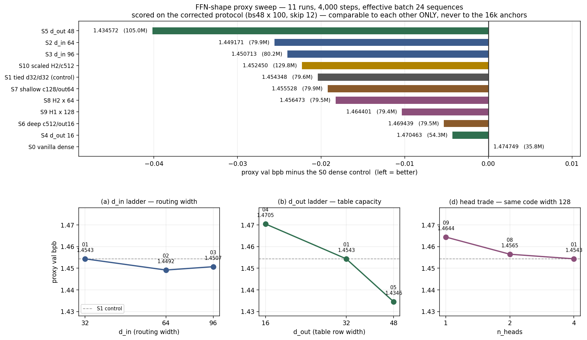

# FFN-shape proxy sweep — results

Eleven runs, 4,000 steps each, effective batch 24 sequences, all scored on the corrected
protocol (`evaluate_bpb_fixed`: bs48 × 100, leading 12 rows skipped, 2,451,456 val tokens of
held-out `shard_06542.parquet`). Setup, constraints and file map: [`SWEEP_README.md`](SWEEP_README.md).

> ## ⚠️ Comparable to each other only
> The training budget is one eighth of the 16k / batch-48 line. These numbers sit far above
> it and must **never** be read against `exp_n_0135` (1.165147), `exp_n_0136` (1.192926),
> `exp_n_0118` (1.164939) or `exp_n_0129` (1.170961). **S0 is this sweep's zero-line.**

## Ranking

| | shape | params | proxy bpb | vs S0 | vs S1 | compress FLOPs | batch | h |
|---|---|---|---|---|---|---|---|---|
| **S5** | H4 tph256 c256 **d_out 48** | 104,952,588 | **1.434572** | −0.040177 | −0.019776 | 0.0833× | 12×2 | 0.503 |
| **S2** | H4 tph256 c256 **d_in 64** | 79,934,988 | **1.449171** | −0.025578 | −0.005177 | 0.1667× | 12×2 | 0.486 |
| S3 | H4 tph256 c256 d_in 96 | 80,230,668 | 1.450713 | −0.024036 | −0.003635 | 0.2500× | 12×2 | 0.487 |
| S10 | H2 tph512 **c512** d_in64 | 129,823,500 | 1.452450 | −0.022299 | −0.001898 | 0.0833× | 6×4 | 0.868 |
| S1 | H4 tph256 c256 32/32 *(control)* | 79,639,308 | 1.454348 | −0.020401 | — | 0.0833× | 12×2 | 0.488 |
| S7 | H4 tph256 c128 d_out 64 | 79,934,220 | 1.455528 | −0.019222 | +0.001180 | 0.0833× | 12×2 | 0.320 |
| S8 | H2 tph512 c256 d_in 64 | 79,491,852 | 1.456473 | −0.018276 | +0.002125 | 0.0833× | 12×2 | 0.487 |
| S9 | H1 tph1024 c256 d_in 128 | 79,418,124 | 1.464401 | −0.010349 | +0.010053 | 0.0833× | 12×2 | 0.461 |
| S6 | H4 tph256 c512 d_out 16 | 79,491,852 | 1.469439 | −0.005310 | +0.015091 | 0.0833× | 6×4 | 0.840 |
| S4 | H4 tph256 c256 d_out 16 | 54,326,028 | 1.470463 | −0.004287 | +0.016115 | 0.0833× | 12×2 | 0.469 |
| S0 | dense 4× MLP | 35,792,640 | 1.474749 | — | +0.020401 | 1.0000× | 12×2 | 0.069 |

Every LUT shape beats the dense control on this budget, by 0.004 to 0.040. Every run's built
param count was checked before it trained; all landed within 1% of the brief. **No training
instability anywhere** — all eleven curves are monotone at every one of their eight eval
points, with no loss spikes and no NaNs, including the configurations the brief flagged as
risky (high d_in: S3, S9; low d_out: S4, S6).

The **noise floor** is set by the S2/S3 pair: differences up to ~0.002 with an inconsistent
sign across eval points are not distinguishable on this budget. Read every margin below
against that.

## (a) The d_in ladder — routing width moves bpb, then stops

| d_in | params | proxy bpb | step gain | params spent | bpb per M params |
|---|---|---|---|---|---|
| 32 | 79,639,308 | 1.454348 | — | — | — |
| 64 | 79,934,988 | **1.449171** | −0.005177 | +295,680 | **+0.01751** |
| 96 | 80,230,668 | 1.450713 | +0.001542 | +295,680 | −0.00521 |

Yes, routing width moves bpb at essentially constant parameters — and *very* cheaply: 32→64
is the single most parameter-efficient move in the sweep at 0.0175 bpb per M params, 22×
better than the best d_out step. But it is a **one-off**. S2 beats S1 at all eight eval points
with a widening gap, so that step is real; S3 vs S2 flips sign four times and never exceeds
0.0021, so it is noise. The cost is not parameters but FLOPs — the compress projection scales
linearly with d_in (0.0833× → 0.1667× → 0.2500× of vanilla), so d_in = 96 pays 50% more
projection FLOPs than d_in = 64 for nothing.

**d_in = 64 is the efficient point.**

## (b) The d_out ladder — capacity moves it far more, and has not saturated

| d_out | table params | total | proxy bpb | step gain | params spent | bpb per M params |
|---|---|---|---|---|---|---|
| 16 | 25,165,824 | 54,326,028 | 1.470463 | — | — | — |
| 32 | 50,331,648 | 79,639,308 | 1.454348 | −0.016115 | +25,313,280 | +0.00064 |
| 48 | 75,497,472 | 104,952,588 | **1.434572** | −0.019776 | +25,313,280 | **+0.00078** |

Each rung costs exactly the same 25.3M parameters and the **second pays more than the first**
— the return is increasing over the range tested, not diminishing. In total magnitude d_out
dwarfs d_in: 0.036 bpb across the ladder versus 0.005.

Per parameter the picture inverts — d_in is ~25× more efficient — so the two are not
substitutes but complements on different resources: **d_in buys a small fixed win almost for
free in parameters but costs FLOPs; d_out costs parameters linearly and keeps paying.**

S5's advantage over S1 also *grows* with training (−0.0028 at step 1500 → −0.0198 at 4000),
whereas the head-count deficits converge. On a 4k budget that is a strong hint the short
budget **understates** d_out.

## (c) The iso-param shape line — it is not depth-vs-width, it is a d_out floor

All three spend the same 50,331,648 table parameters:

| | cells (nap) | d_out | proxy bpb | vs S1 |
|---|---|---|---|---|
| S6 | 512 (9) | 16 | 1.469439 | +0.015091 |
| S1 | 256 (8) | 32 | **1.454348** | — |
| S7 | 128 (7) | 64 | 1.455528 | +0.001180 |

Deeper costs 0.0151 — the largest penalty in the sweep. Wider costs 0.0012 — inside the noise
floor. S1 and S7 are effectively tied.

S4 supplies the attribution the line could not: **S6 (c512, d_out 16) spends 25,165,824 more
parameters than S4 (c256, d_out 16) and buys 0.001 bpb**, i.e. nothing. So the finding is not
"deep loses to wide" but "**d_out 16 loses whatever you do with the cells**". Once table rows
are 16 wide, doubling the number of cells is very nearly wasted parameters.

Both d_out-16 runs share a diagnostic curve shape: the deficit narrows to step ~2500 and then
**reopens**. A gap that reopens late is a capacity ceiling, not a slow start.

**Best way to spend a fixed 50.3M table budget: keep d_out ≥ 32 and put the remainder in
tables, not depth.** Cells 128 and 256 are indistinguishable; 512 is actively bad. Shallower
is also much faster — S7 ran in 0.32 h against S6's 0.84 h, since wall time tracks the
`[tokens, H*tph, cells]` soft-backward buffer.

## (d) The head trade — more, narrower heads win, non-linearly

S1/S8/S9 are a properly controlled triple: same table budget, same **total** routing width
(128), same compress FLOPs (49,152). Only the split across heads varies.

| | H | tph | d_in | split | proxy bpb | vs S1 |
|---|---|---|---|---|---|---|
| S1 | 4 | 256 | 32 | 4×32 | **1.454348** | — |
| S8 | 2 | 512 | 64 | 2×64 | 1.456473 | +0.002125 |
| S9 | 1 | 1024 | 128 | 1×128 | 1.464401 | +0.010053 |

Monotone, but strongly non-linear: 4→2 costs 0.0021, 2→1 costs 0.0079 — nearly 4× as much.
Most of what the block-diagonal head structure buys is lost only when you collapse to a single
head. So **no, fewer/wider heads do not win** — but the H4-vs-H2 margin decays monotonically
through training (+0.0080 at step 500 → +0.0021 at 4000) and now sits at the noise floor.
Honest reading: **H = 1 is definitely worse; H = 4 vs H = 2 is real but converging and may
close at 16k.** S9's deficit narrows the same way (+0.0194 → +0.0101).

S10 confirms the same lesson from the other side. It is S8 with the cells doubled — 50,331,648
extra parameters for −0.004023 bpb, i.e. **+0.00008 bpb per M params, 9.8× less efficient than
spending the same parameters on d_out**. At 129.8M it is the largest model in the sweep and
still loses to S2 at 79.9M.

## (e) Recommendation — what to run at 16k / batch 48 on nebius-h100

Ranked, with reasoning. All keep H = 4, tph = 256, cells = 256, which the sweep says is the
right frame.

1. **`H4 / tph256 / cells256 / d_in 64 / d_out 48` — ~105.2M — the one to run if only one.**
   Not in the sweep. It stacks the only two effects that were both real and independent: d_in
   32→64 (−0.005 for +0.3M params) and d_out 32→48 (−0.020 for +25.3M). They act on different
   resources — routing FLOPs and table capacity — so there is no reason for them to interact
   destructively, and neither was near saturation in the direction being stacked. Compress
   FLOPs 0.1667× vanilla.

2. **S5 as run — `H4 / tph256 / cells256 / d_in 32 / d_out 48` — 104,952,588.** The sweep's
   measured winner by 0.0146 over anything else, with an advantage that was still widening at
   step 4000. Run this as the safe version of (1) — it is the configuration that actually has
   evidence behind it, where (1) is an extrapolation.

3. **S2 as run — `H4 / tph256 / cells256 / d_in 64 / d_out 32` — 79,934,988.** Best value:
   second-best bpb at 76% of S5's parameters, 0.0052 ahead of the S1 control for 0.3M extra
   parameters. Worth running if the 16k slot budget allows a third, as the cheap point on the
   frontier and the control for whether d_in survives a longer schedule.

**Do not spend 16k time on**: d_out = 16 in any form (S4, S6 — a capacity ceiling that reopens
late), H = 1 (S9), or buying cells (S10 — 9.8× worse per parameter than d_out). If a fourth
slot exists, a d_out = 64 point would be more informative than any of these, since the ladder
had not turned over.

**Carry these caveats into the 16k reads.** The budget is 1/8 the training and half the batch,
at the 0118 peak LR of 3e-4 held constant across all eleven for mutual comparability (a
√2-scaling rule would have suggested 2.12e-4 at this batch). Effects that *widened* through
training — d_out, and the d_out-16 penalty — should if anything be larger at 16k; effects that
*converged* — the head-count gaps — may vanish. And nothing here transfers numerically: only
the ordering does.

