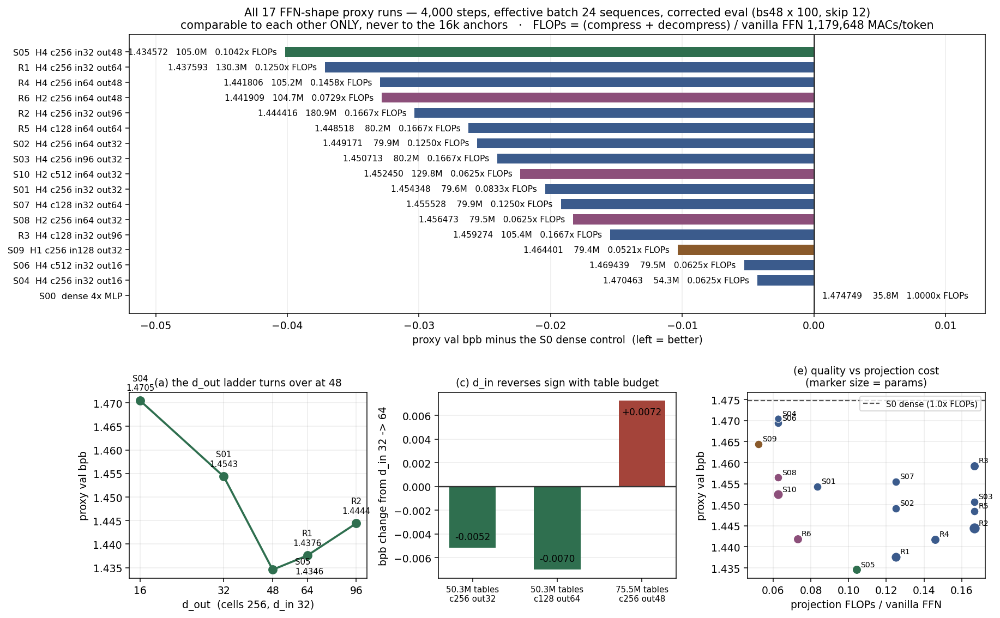

# FFN-shape proxy sweeps — results (17 runs)

Two sweeps, 11 + 6 runs, all on one budget: 4,000 steps, effective batch 24 sequences
(12,288 tokens), lr 3e-4 with 10% linear warmup and cosine decay to 0.1× peak parameterised by
`n_steps=4000`. Every run is scored on the corrected protocol (`evaluate_bpb_fixed`: bs48 × 100,
leading 12 rows skipped, 2,451,456 val tokens of held-out `shard_06542.parquet`). Setup and
file map: [`SWEEP_README.md`](SWEEP_README.md). Table and analysis are regenerated by
`summarise_all.py`.

> ## ⚠️ Comparable to each other only
> The training budget is one eighth of the 16k / batch-48 line at half the batch. These
> numbers sit far above it and must **never** be read against `exp_n_0135` (1.165147),
> `exp_n_0136` (1.192926), `exp_n_0118` (1.164939) or `exp_n_0129` (1.170961).
> **S0 is the zero-line.** Only the *ordering* transfers, and only where a margin clears the
> **~0.002 noise floor** (set by the S2/S3 pair: differences that small flip sign across eval
> points).

## All 17 runs

FLOPs are MACs/token for the two dense projections — compress `H·384·d_in` and decompress
`H·384·d_out` — against vanilla's **whole** FFN at `2·384·1536` = 1,179,648. The first sweep
reported only the compress side, which flattered high-`d_out` shapes; this table does not.

| | shape | params | tables | proxy bpb | vs S0 | vs S1 | compress | decompress | proj/vanilla | h |
|---|---|---|---|---|---|---|---|---|---|---|
| **S5** | H4 c256 in32 **out48** | 104,952,588 | 75,497,472 | **1.434572** | −0.040177 | −0.019776 | 49,152 | 73,728 | 0.1042× | 0.50 |
| R1 | H4 c256 in32 out64 | 130,265,868 | 100,663,296 | 1.437593 | −0.037156 | −0.016755 | 49,152 | 98,304 | 0.1250× | 0.52 |
| R4 | H4 c256 in64 out48 | 105,248,268 | 75,497,472 | 1.441806 | −0.032943 | −0.012542 | 98,304 | 73,728 | 0.1458× | 0.50 |
| **R6** | **H2** c256 in64 out48 | 104,731,404 | 75,497,472 | 1.441909 | −0.032840 | −0.012439 | 49,152 | 36,864 | **0.0729×** | 0.50 |
| R2 | H4 c256 in32 out96 | 180,892,428 | 150,994,944 | 1.444416 | −0.030333 | −0.009932 | 49,152 | 147,456 | 0.1667× | 0.58 |
| R5 | H4 c128 in64 out64 | 80,229,900 | 50,331,648 | 1.448518 | −0.026232 | −0.005830 | 98,304 | 98,304 | 0.1667× | 0.32 |
| **S2** | H4 c256 in64 out32 | 79,934,988 | 50,331,648 | 1.449171 | −0.025578 | −0.005177 | 98,304 | 49,152 | 0.1250× | 0.49 |
| S3 | H4 c256 in96 out32 | 80,230,668 | 50,331,648 | 1.450713 | −0.024036 | −0.003635 | 147,456 | 49,152 | 0.1667× | 0.49 |
| S10 | H2 c512 in64 out32 | 129,823,500 | 100,663,296 | 1.452450 | −0.022299 | −0.001898 | 49,152 | 24,576 | 0.0625× | 0.87 |
| S1 | H4 c256 in32 out32 *(control)* | 79,639,308 | 50,331,648 | 1.454348 | −0.020401 | — | 49,152 | 49,152 | 0.0833× | 0.49 |
| S7 | H4 c128 in32 out64 | 79,934,220 | 50,331,648 | 1.455528 | −0.019222 | +0.001180 | 49,152 | 98,304 | 0.1250× | 0.32 |
| S8 | H2 c256 in64 out32 | 79,491,852 | 50,331,648 | 1.456473 | −0.018276 | +0.002125 | 49,152 | 24,576 | 0.0625× | 0.49 |
| R3 | H4 c128 in32 out96 | 105,394,956 | 75,497,472 | 1.459274 | −0.015475 | +0.004926 | 49,152 | 147,456 | 0.1667× | 0.36 |
| S9 | H1 c256 in128 out32 | 79,418,124 | 50,331,648 | 1.464401 | −0.010349 | +0.010053 | 49,152 | 12,288 | 0.0521× | 0.46 |
| S6 | H4 c512 in32 out16 | 79,491,852 | 50,331,648 | 1.469439 | −0.005310 | +0.015091 | 49,152 | 24,576 | 0.0625× | 0.84 |
| S4 | H4 c256 in32 out16 | 54,326,028 | 25,165,824 | 1.470463 | −0.004287 | +0.016115 | 49,152 | 24,576 | 0.0625× | 0.47 |
| S0 | dense 4× MLP | 35,792,640 | — | 1.474749 | — | +0.020401 | — | — | 1.0000× | 0.07 |

Every LUT shape beats the dense control, by 0.004 to 0.040. **No training instability in any
of the 17** — all curves monotone at every eval point, no loss spikes, no NaNs, including the
high-`d_in` (S3, S9, R4, R5) and low-`d_out` (S4, S6) configurations. Every built param count
was verified before its run trained; all landed within 1% of the brief. All of sweep 2 ran at
device_batch 12 × accum 2; in sweep 1 only S6 and S10 needed 6 × 4 (their
`H·tph·cells = 524,288` buffer is 12.9 GiB at bs12).

## (a) The d_out ladder — an inverted U with its minimum at 48

At cells 256, d_in 32:

| d_out | params | proxy bpb | step | cost |
|---|---|---|---|---|
| 16 | 54,326,028 | 1.470463 | — | — |
| 32 | 79,639,308 | 1.454348 | −0.016115 | +25.3M |
| 48 | 104,952,588 | **1.434572** | −0.019776 | +25.3M |
| 64 | 130,265,868 | 1.437593 | **+0.003021** | +25.3M |
| 96 | 180,892,428 | 1.444416 | +0.006823 | +50.6M |

Sweep 1 saw increasing returns across 16→32→48 and flagged that the ladder had not saturated.
It turns over immediately after. Past 48 it degrades monotonically, and by d_out 96 the model
is 72% larger than S5 and 0.0098 worse. **d_out = 48 is the optimum at cells 256**, and the
+0.003 at d_out 64 is only just over the noise floor — the safe reading is "the return has gone
to zero, and 48 gets it 25.3M parameters and 0.02× vanilla FLOPs cheaper".

## (b) Table params are *not* the driver — the split matters, a lot

Two pairs holding the table budget fixed:

| tables | pair | bpb | Δ |
|---|---|---|---|
| 75,497,472 (~105M total) | S5 c256/out48 vs **R3** c128/out96 | 1.434572 / 1.459274 | **+0.024702** |
| 50,331,648 (~80M total) | S1 c256/out32 vs S7 c128/out64 | 1.454348 / 1.455528 | +0.001180 |

At the smaller budget the split is free — halving cells to double row width is a tie. At the
larger budget the same trade costs 0.0247, twelve times the noise floor, widening monotonically
through the run, **and** R3 pays 60% more projection FLOPs for it. R3 is the only run in either
sweep to lose to the S1 control while being 32% bigger.

**This revises sweep 1's headline.** "d_out is the axis, cells are not" was too strong: R3 has
the *larger* d_out and loses. The accurate statement is that **cells has an interior optimum at
256** — 512 is bad (S6, S10), 128 is free at moderate d_out and costly once d_out is pushed —
and that **cells and d_out interact**: widening rows only pays while the table has enough cells
to make distinct use of them. Sweep 1 simply never tested going *down* in cells at a large
budget.

## (c) d_in and d_out do not stack — d_in's sign flips with the table budget

The d_in 32→64 effect, everywhere it has been measured:

| cells | d_out | tables | d_in 32 | d_in 64 | effect |
|---|---|---|---|---|---|
| 256 | 32 | 50.3M | S1 1.454348 | S2 1.449171 | −0.005177 helps |
| 128 | 64 | 50.3M | S7 1.455528 | R5 1.448518 | −0.007010 helps |
| 256 | 48 | **75.5M** | S5 1.434572 | R4 1.441806 | **+0.007234 hurts** |

Interaction between the two "gains" at the 105M point: **+0.012411**, six times the noise floor.
The sign does not track d_out (helps at 64, hurts at 48) or cells (helps at both) — it tracks
the **table budget**. R4, the stack, was the configuration recommended after sweep 1 as first
choice for a 16k run; it loses to S5, which was recommended second. That recommendation was
wrong, and the reasoning behind it — "different resources, so no destructive interaction" —
does not survive the measurement.

The curve shapes distinguish the two cases cleanly. Where d_in helps (S7→R5) it leads at all
eight eval points with no crossover. Where it hurts (S5→R4) it *leads early* and is overtaken
at step ~2500: a wider routing code learns faster and then caps the ceiling once the tables can
exploit fine routing. R1 shows the same crossover against S5.

**Confound, stated plainly:** the two 50.3M-table runs are also the ~80M-total runs and the
75.5M-table run is the ~105M-total run, so this data cannot separate "table budget" from "model
size class". A c128/d_out 96 point at d_in 64 would; nothing here has one.

## (d) The head trade — the gap closes as the config gets richer

| config | H4 | H2 | Δ | proj FLOPs |
|---|---|---|---|---|
| d_in 32, d_out 32 | S1 1.454348 | S8 1.456473 | +0.002125 | 0.0833× → 0.0625× |
| d_in 64, d_out 48 | R4 1.441806 | R6 1.441909 | **+0.000103** | 0.1458× → **0.0729×** |

At the lean config H2 cost a (marginal) 0.0021; at the rich config it costs 0.000103 — twenty
times *below* the noise floor. H2 starts slower (+0.0072 at step 2000) and catches up
completely. Sweep 1 flagged this shape as "may close at 16k"; it closes inside 4k.

Since halving heads halves **both** projections, **R6 is a free halving of the FFN's dense
projection cost at identical quality** — the cleanest efficiency result in either sweep. H1
remains clearly worse (S9, +0.010053), so the useful range is H ∈ {2, 4}, not fewer.

Scope: measured at d_in 64 / d_out 48. The best config overall is S5 (H4, d_in 32, d_out 48)
and its H2 counterpart was **not** run — and halving heads at d_in 32 also halves the *total*
routing width (4×32 = 128 → 2×32 = 64), a different change from the one tested here
(4×64 = 256 → 2×64 = 128). H2-at-S5 does not follow from R6 and should not be assumed.

## (e) Quality per projection-FLOP

bpb below S0 per unit of the proj/vanilla ratio — how much quality each shape extracts per unit
of dense projection cost:

| | below S0 | proj/vanilla | ratio | params |
|---|---|---|---|---|
| **R6** | 0.032840 | 0.0729× | **0.4504** | 104,731,404 |
| S5 | 0.040177 | 0.1042× | 0.3857 | 104,952,588 |
| S10 | 0.022299 | 0.0625× | 0.3568 | 129,823,500 |
| R1 | 0.037156 | 0.1250× | 0.2972 | 130,265,868 |
| S8 | 0.018276 | 0.0625× | 0.2924 | 79,491,852 |
| S1 | 0.020401 | 0.0833× | 0.2448 | 79,639,308 |

The honest counterweight to the ranking table: **high-d_out shapes buy quality with projection
FLOPs.** S5 is the best model but at 0.1042× vanilla, twice S8's 0.0625×; R2 reaches 0.1667×
and is worse than S5 anyway. R6 tops this column because it matches R4's quality at half the
cost. Note also that projection FLOPs are only part of the story — the table gather itself is
not counted here, and it scales with `H·tph`, which is 1024 for every LUT run in both sweeps.

## (f) Updated recommendation for 16k / batch 48 on nebius-h100

Revised in light of (a)–(e). The post-sweep-1 recommendation (R4, the d_in+d_out stack) is
**withdrawn** — it was measured and it loses.

1. **S5 — `H4 / tph256 / cells256 / d_in 32 / d_out 48`, 104,952,588 params, 0.1042× vanilla
   projection FLOPs.** The measured optimum, and now triangulated from four directions: pushing
   d_out past it (R1, R2), pushing d_in past it (R4), and re-splitting its budget at coarser
   routing (R3) all cost. Best pure-quality choice. The cost is that it is 32% larger than the
   80M class and doubles S1's projection FLOPs.

2. **R6 — `H2 / tph512 / cells256 / d_in 64 / d_out 48`, 104,731,404 params, 0.0729× vanilla.**
   0.0073 behind S5 on quality but at 70% of its projection cost, and the best quality-per-FLOP
   of all 17. This is the efficiency pick, and the one to run if the FFN-replacement claim is
   about cost rather than raw bpb.

3. **S2 — `H4 / tph256 / cells256 / d_in 64 / d_out 32`, 79,934,988 params, 0.1250× vanilla.**
   The 80M-class point: 0.0146 behind S5 at 76% of the parameters. R5 ties it (0.000653, inside
   noise) while paying 33% more projection FLOPs, so S2 is the better representative of that
   size class. Worth a slot as the cheap end of the frontier and as the test of whether d_in
   survives a longer schedule.

**One cheap run would sharpen this a lot:** `H2 / tph512 / cells256 / d_in 32 / d_out 48`
(~104.8M) — the H2 counterpart of S5, which no run in either sweep covers. If the head gap is
closed there as it is at R4/R6, it would dominate both (1) and (2): S5's quality at roughly
0.052× vanilla projection FLOPs.

**Do not spend 16k time on**: d_out 16 in any form (S4, S6), d_out ≥ 64 (R1, R2 — past the
turnover), H = 1 (S9), cells 512 (S6, S10), or the d_in+d_out stack (R4).

**Carry these caveats into the 16k reads.** One eighth the training at half the batch, with peak
LR held at 3e-4 across all 17 for mutual comparability (a √2 rule would suggest 2.12e-4 at this
batch). Effects that *widened* through training — the d_out ladder below 48, the d_out-16
penalty, the R3 gap — should be at least as large at 16k. Effects that *converged* — the head
gaps, and the d_in advantage where it appeared — may shrink or vanish, and the two crossover
cases (R4, R1 overtaken by S5 mid-run) are exactly where a longer schedule could change the
ordering. Nothing here transfers numerically; only the ordering does, and only above ~0.002.
