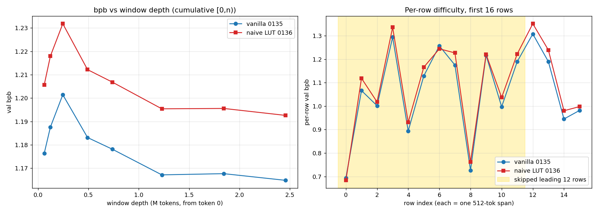

# Window-difficulty vs model-effect decomposition

Read-only diagnostic: vanilla (exp_n_0135) vs naive LUT (exp_n_0136) scored on the
SAME validation windows, held-out shard_06542 from token 0, corrected eval machinery
(bs48 drained+cloned; per-row nats/bytes accumulated once, windows derived from them).

## bpb by window

| window (tokens) | vanilla 0135 | naive LUT 0136 | LUT − vanilla |
|---|---|---|---|
| (a) 61,440 (bs12x10 orig LUT window) | 1.176369 | 1.205674 | +0.029305 |
| (b) 245,760 (bs48x10 orig vanilla window) | 1.201442 | 1.231811 | +0.030369 |
| 491,520 (bs48x20) | 1.183133 | 1.212178 | +0.029045 |
| 1,228,800 (bs48x50) | 1.167166 | 1.195421 | +0.028255 |
| 2,457,600 (bs48x100, no skip) | 1.164821 | 1.192600 | +0.027779 |
| (c) 2,451,456 (bs48x100, skip 12) CORRECTED | 1.165147 | 1.192926 | +0.027780 |

## Per-chunk difficulty (bpb over row ranges)

| rows | vanilla 0135 | naive LUT 0136 |
|---|---|---|
| rows 0-12 | 1.041327 | 1.068735 |
| rows 12-100 | 1.206472 | 1.235138 |
| rows 100-1000 | 1.184490 | 1.213556 |
| rows 1000-4800 | 1.159673 | 1.187131 |
| rows 0-4800 (all) | 1.164821 | 1.192600 |

## Per-row bpb, first 16 rows

| row | vanilla 0135 | naive LUT 0136 |
|---|---|---|
| 0 | 0.694317 | 0.683535 |
| 1 | 1.066284 | 1.118767 |
| 2 | 1.001803 | 1.017814 |
| 3 | 1.294279 | 1.335978 |
| 4 | 0.893953 | 0.930899 |
| 5 | 1.128878 | 1.165994 |
| 6 | 1.257001 | 1.244396 |
| 7 | 1.175150 | 1.226989 |
| 8 | 0.726569 | 0.761582 |
| 9 | 1.217038 | 1.221155 |
| 10 | 0.997289 | 1.036880 |
| 11 | 1.189941 | 1.222707 |
| 12 | 1.307760 | 1.351381 |
| 13 | 1.189890 | 1.239286 |
| 14 | 0.945094 | 0.980339 |
| 15 | 0.981588 | 0.997985 |

