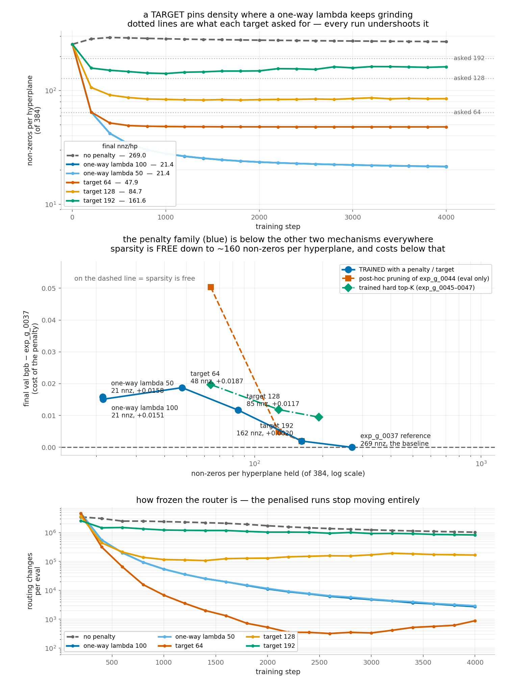
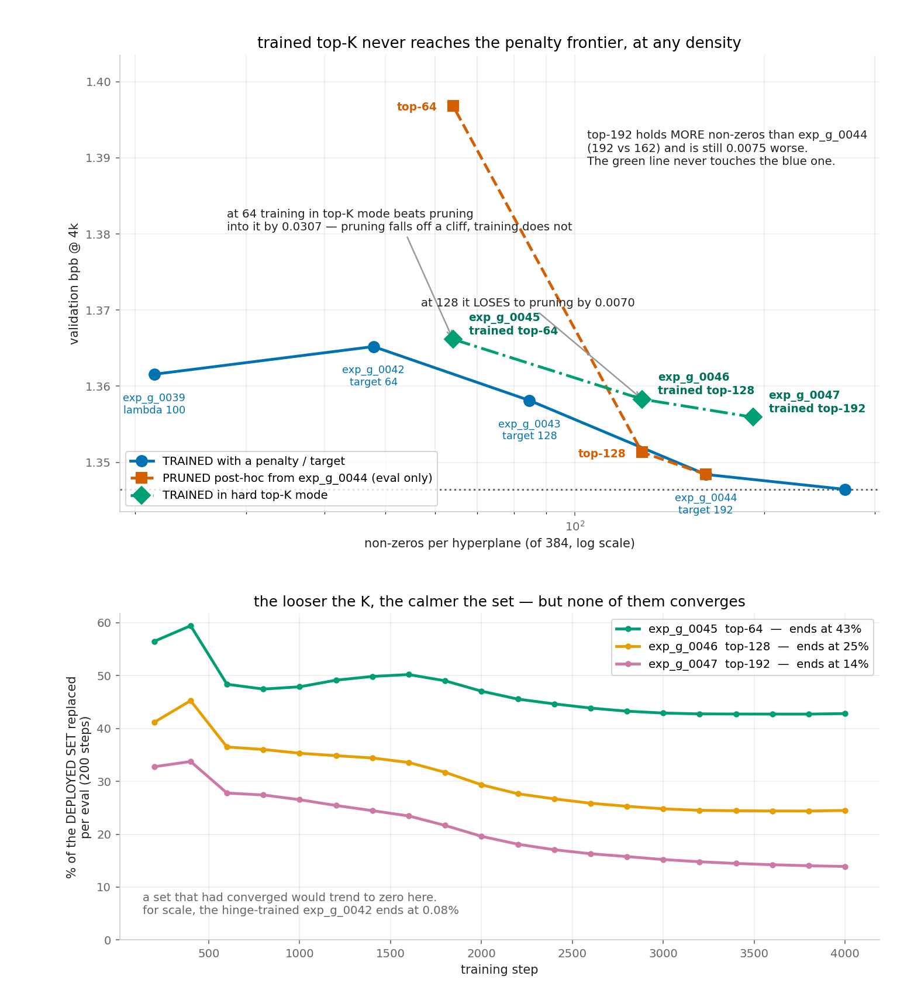

# Sparsity sweep — where routing sparsity stops being free, and how best to buy it

Eight runs on the **exp_g_0037** recipe (ternary routing + per-head decompress, 76,373,004
params, 1.346459 at 4k), each differing from it only in how routing density is constrained,
plus an eval-only pruning study. The question: the ternary router uses ~269 of each
hyperplane's 384 components — **how many can be forced to zero before validation bpb pays
for it, and what is the best way to force them?**

Three mechanisms were tried. A **penalty** on the soft density surrogate (one-way, then a
target hinge); **post-hoc pruning** of a trained model; and **training under a hard top-K**
mask. The penalty family wins at every density tested — the sections below are in that
order.

| run | regime | nnz/hyperplane | frac_zero | val bpb @ 4k | vs lambda 0 |
|---|---|---|---|---|---|
| exp_g_0037 | no penalty (reference) | 269.04 | 0.2994 | 1.346459 | — |
| exp_g_0044 | target 192 | 161.58 | 0.5792 | 1.348412 | +0.001953 |
| exp_g_0043 | target 128 | 84.71 | 0.7794 | 1.358134 | +0.011675 |
| exp_g_0042 | target 64 | 47.85 | 0.8754 | 1.365208 | +0.018749 |
| exp_g_0039 | one-way lambda 100 | 21.44 | 0.9442 | 1.361572 | +0.015113 |
| exp_g_0040 | one-way lambda 50 | 21.37 | 0.9443 | 1.362309 | +0.015850 |

## The frontier

**Sparsity is free down to ~162 non-zeros per hyperplane.** At 161.58 — 1.7x sparser than
unregularised — the cost is +0.0020, inside what a single eval moves (exp_g_0038 and
exp_n_0121 are the same configuration on two machines and differ by 0.0015). At 84.71 it is
+0.0117, six times that and unambiguously real. **The boundary lies between 85 and 162.**

From 48 non-zeros upward the frontier is monotone — more density, less cost. The single
inversion is at the low end: **exp_g_0042 holds 2.2x more non-zeros than the one-way runs
and still costs more** (+0.0187 against +0.0151).

## Four findings

**1. Lambda is a no-op knob under AdamW.** exp_g_0040 (lambda 50) reproduced exp_g_0039's
(lambda 100) density trajectory to five decimal places while its penalty value was exactly
halved; the finals differ by 0.0007 bpb and 0.07 non-zeros of 384. Adam divides each
update by that parameter's own gradient magnitude, so wherever the penalty dominates,
lambda cancels in `m / sqrt(v)`. A planned lambda=10 rung was dropped as redundant.

**2. A target-density hinge has a stable fixed point; the one-way push does not.** Every
target reached its target by step 200–400, released, and then *held* — exp_g_0042 sat at
48.5 → 47.9 over 3,200 steps while the one-way penalty ground 30 → 21 over the same span.
Density has to be controlled by a target, not by lambda.

**3. The soft target undershoots the hard count, and not by a constant.** 192 → 161.58
(0.84x), 128 → 84.71 (0.66x), 64 → 47.85 (0.75x). The runs settle where the *surrogate*
equals the target, and the surrogate sits below the hard density by an amount that depends
on how the weights are distributed around the dead zone. A wanted hard count cannot be
obtained by scaling the soft target.

**4. The cost tracks how frozen the router is, better than it tracks density.** Final
routing changes per eval:

| run | regime | churn/eval | T drift | cost |
|---|---|---|---|---|
| exp_g_0037 | no penalty | 1,029,846 | 0.993x | — |
| exp_g_0044 | target 192 | 827,778 | 1.076x | +0.0020 |
| exp_g_0043 | target 128 | 166,796 | 1.031x | +0.0117 |
| exp_g_0042 | target 64 | 888 | 1.195x | +0.0187 |
| exp_g_0039 | one-way lambda 100 | 2,736 | 0.971x | +0.0151 |
| exp_g_0040 | one-way lambda 50 | 2,923 | 0.985x | +0.0158 |

exp_g_0042 is the most frozen run on the board and the most expensive, despite holding more
density than either one-way run. Its T also rises the most (1.195x): the penalty has T
detached and cannot widen the band, but after release the *task* gradient is the only thing
acting on T and nothing holds it, so part of the held sparsity is band-widening rather than
weight structure. **Letting T move after release is the obvious next variable.**

## Two other ways to reach a density — both worse

**Post-hoc pruning** (eval-only, exp_g_0044's final checkpoint, ranked by
`|normalized_weight()|`, no retraining). The control reproduced the run's 1.348412 to
0.00e+00, so the harness is the training one.

| variant | nnz/hp | val bpb | vs exp_g_0037 |
|---|---|---|---|
| exp_g_0044 unpruned | 161.58 | 1.348412 | +0.0020 |
| pruned to top-128 | 127.95 | 1.351329 | +0.0049 |
| pruned to top-64 | 64.00 | 1.396849 | +0.0504 |

Not a graceful slope but a knee: 162 → 128 costs +0.0029, about what a single eval moves;
continuing to 64 costs +0.0484, seventeen times more for the same factor of density
removed.

**Trained hard top-K** (exp_g_0045–0047): every forward keeps exactly the top-K components
per hyperplane by confidence and applies the same mask at eval, so train-mode and
deploy-mode are the same function. Density pins exactly — each run's
`nonzero_per_hyperplane` took a single distinct value across all 21 evals.

| trained top-K | nnz/hp | val bpb | penalty run at a LOWER density | its bpb |
|---|---|---|---|---|
| exp_g_0045 K=64 | 64.00 | 1.366177 | exp_g_0042 @ 47.85 | **1.365208** |
| exp_g_0046 K=128 | 128.00 | 1.358295 | exp_g_0043 @ 84.71 | **1.358134** |
| exp_g_0047 K=192 | 192.00 | 1.355937 | exp_g_0044 @ 161.58 | **1.348412** |

**Top-K is dominated at every rung.** At each one the penalty-trained model matches or
beats it while using 25%, 34% and 16% FEWER components respectively. It does beat post-hoc
pruning at K=64 by 0.0307 — a real rescue of the regime where pruning collapses — but it
loses to pruning at K=128 by 0.0070, and at K=192 it is 0.0075 behind exp_g_0044 *while
holding more non-zeros than exp_g_0044 uses*. A constraint looser than the model's own
natural density still costs.

The likeliest reason: **top-K cannot emit zero as a decision.** It must nominate exactly K
components and give each full ±1 weight, however unconfident it is about them, because a
kept component is ±1 even inside the dead zone. The penalty-trained runs keep the third
state and can spend it — a component they are unsure about simply quantises to 0. The zero
is not merely absence, it carries information, and top-K trades it away for a fixed count.
Testable by intersecting the mask with the dead zone ("at most K" instead of "exactly K").

The top-K sets also never converge. Normalised by each run's own set size, turnover falls
early then flattens at 42.8% (K=64), 24.5% (K=128) and 13.9% (K=192) of the set replaced
per eval — the looser the constraint the calmer the set, but none reaches zero, and the
distance from the initial mask plateaus, so they churn in place. For scale, the
hinge-trained exp_g_0042 ends at 0.08%. Note the direction: the run that thrashes MOST
(K=64) is the one that beats its pruning counterpart, so instability is not what makes
top-K lose.

## Numbering

exp_g_0041 was to be the lambda=10 rung and was dropped before launch once exp_g_0040
showed the ladder answered nothing. The number is left as a deliberate gap; see
`exp_g_0041_DROPPED_lam10_redundant/DROPPED.md`.

## Caveat

The run stops at **94% of peak LR**, having traversed ~6% of the cosine — the schedule is
anchored to 16,000 steps and merely stopped at 4,000. exp_n_0121 goes on to 1.1915 by step
16,000. Every number here is an early-trajectory reading. It is fair *relative* to
exp_g_0037, which is identical in every respect but the penalty, but a full-anneal verdict
is not established by it.
