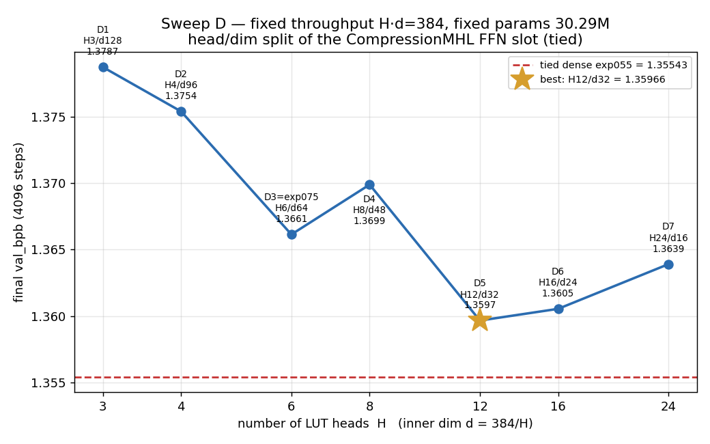

# FFN-slot LUT sweep (exp036, exp042, exp043–exp069)

FFN slot per block: `x = x + gamma·Linear(384→384)(h) + CompressionMultiHeadLUT{n_heads, inner_in, inner_out, tph, nap}(h)`, `h = ln2(x)`.
CompressionMHL fixed for all: `joint_head_compression=False` (independent per-head), `forward_mode="hard"`, fp32, near-zero table init, per-layer seed 1000+idx, decompress zero-init.
`inner_in=-1` → no compress (LUT reads x); `inner_out=-1` → no decompress (LUT emits 384, heads summed). `gamma=1` adds a plain `Linear(384→384)` skip.

Shared trainer: `train.py` (config-driven; `ffn_type`, `gamma`, `tie_unembedder`, `lut_*`). Training config identical across the sweep: MinimalGPT+RoPE d384/6L/6H/seq512, device_bs 48, total_bs 24576, **n_steps 4096**, lr 3e-4, wd 0.1, warmup 0.1, eval_every 200, seed 1, same data. Runs param-matched to the vanilla baseline of their sweep.

## Sweep A — UNTIED unembedder (target total 35,792,640; reference = exp032 dense FFN **1.39371**)

| run | exp | n_heads | inner_in/out | nap | gamma | tph | total params | Δ% | val_bpb |
|-----|-----|--------:|:------------:|----:|:-----:|----:|-------------:|----:|--------:|
| A1  | exp036 | 1 | 64/64 | 6 | 0 | 276 | 35,795,328 | +0.0075 | 1.40699 |
| A2  | exp043 | 2 | 64/64 | 6 | 0 | 132 | 35,795,712 | +0.0086 | 1.40735 |
| A3  | exp042 | 3 | 64/64 | 6 | 0 | 84  | 35,796,096 | +0.0097 | 1.39577 |
| A4  | exp044 | 4 | 64/64 | 6 | 0 | 60  | 35,796,480 | +0.0107 | 1.39811 |
| A5  | exp045 | 6 | 64/64 | 6 | 0 | 36  | 35,797,248 | +0.0129 | 1.39063 |
| A6  | exp046 | 3 | 64/64 | 5 | 0 | 168 | 35,796,096 | +0.0097 | 1.39219 |
| A7  | exp047 | 3 | 64/64 | 7 | 0 | 42  | 35,796,096 | +0.0097 | 1.40603 |
| A8  | exp048 | 3 | 32/32 | 6 | 0 | 180 | 35,795,520 | +0.0080 | 1.40369 |
| A9  | exp049 | 3 | 96/96 | 6 | 0 | 52  | 35,796,672 | +0.0113 | 1.39356 |
| A10 | exp050 | 3 | 128/128 | 6 | 0 | 36 | 35,797,248 | +0.0129 | 1.39698 |
| A11 | exp051 | 3 | -1/64 | 6 | 0 | 90  | 35,794,944 | +0.0064 | 1.42388 |
| A12 | exp052 | 3 | 64/-1 | 6 | 0 | 15  | 35,793,792 | +0.0032 | 1.44419 |
| A13 | exp053 | 3 | -1/-1 | 6 | 0 | 16  | 35,792,640 | +0.0000 | 1.48079 |
| A14 | exp054 | 3 | 64/64 | 6 | 1 | 72  | 35,798,400 | +0.0161 | 1.42022 |

## Sweep B — TIED unembedder (target total 23,209,728; reference = exp055 tied vanilla dense FFN)

| run | exp | n_heads | inner_in/out | nap | gamma | tph | total params | Δ% | val_bpb |
|-----|-----|--------:|:------------:|----:|:-----:|----:|-------------:|----:|--------:|
| B0  | exp055 | — dense FFN (tied vanilla baseline) | | | | — | 23,209,728 | +0.0000 | 1.35543 |
| B1  | exp056 | 1 | 64/64 | 6 | 0 | 276 | 23,212,416 | +0.0116 | 1.39896 |
| B2  | exp057 | 2 | 64/64 | 6 | 0 | 132 | 23,212,800 | +0.0132 | 1.39154 |
| B3  | exp058 | 3 | 64/64 | 6 | 0 | 84  | 23,213,184 | +0.0149 | 1.38371 |
| B4  | exp059 | 4 | 64/64 | 6 | 0 | 60  | 23,213,568 | +0.0165 | 1.37955 |
| B5  | exp060 | 6 | 64/64 | 6 | 0 | 36  | 23,214,336 | +0.0198 | 1.38111 |
| B6  | exp061 | 3 | 64/64 | 5 | 0 | 168 | 23,213,184 | +0.0149 | 1.38394 |
| B7  | exp062 | 3 | 64/64 | 7 | 0 | 42  | 23,213,184 | +0.0149 | 1.38607 |
| B8  | exp063 | 3 | 32/32 | 6 | 0 | 180 | 23,212,608 | +0.0124 | 1.38582 |
| B9  | exp064 | 3 | 96/96 | 6 | 0 | 52  | 23,213,760 | +0.0174 | 1.38402 |
| B10 | exp065 | 3 | 128/128 | 6 | 0 | 36 | 23,214,336 | +0.0198 | 1.38780 |
| B11 | exp066 | 3 | -1/64 | 6 | 0 | 90  | 23,212,032 | +0.0099 | 1.40742 |
| B12 | exp067 | 3 | 64/-1 | 6 | 0 | 15  | 23,210,880 | +0.0050 | 1.41168 |
| B13 | exp068 | 3 | -1/-1 | 6 | 0 | 16  | 23,209,728 | +0.0000 | 1.45407 |
| B14 | exp069 | 3 | 64/64 | 6 | 1 | 72  | 23,215,488 | +0.0248 | 1.39622 |

## Synthesis (all 27 done; 4096 steps)

**Best per sweep:**
- Sweep A (untied): **A5 = 6 heads, 64/64, nap6, g0 → 1.39063**, which BEATS the untied dense FFN (exp032, 1.39371) by −0.00308. Two more configs also beat it: A6 (nap5) 1.39219 and A9 (96/96) 1.39356.
- Sweep B (tied): the **tied dense FFN baseline (B0, 1.35543) beats every tied LUT variant**; best LUT is B4 (4 heads) 1.37955 (+0.024 behind B0).

**Levers (both sweeps agree):**
- **Head count = the dominant lever.** More independent heads → better, saturating around 4–6: A 1h/2h ≈ 1.407, 3h 1.396, 4h 1.398, 6h **1.391**; B 1h 1.399 → 4h **1.380** → 6h 1.381. (1h≈2h weak; the gain kicks in at 3h+.)
- **Projections are essential.** Dropping compress (-1/64) or decompress (64/-1) hurts badly, and the pure-LUT slot (-1/-1) is the worst by far (A13 1.481, B13 1.454). The compress→LUT→decompress bottleneck is doing real work.
- **nap:** nap5 ≥ nap6 > nap7 (A6 1.392 < A3 1.396 < A7 1.406). Slight preference for fewer, wider tables.
- **inner width:** 64 and 96 best; 32 and 128 slightly worse. Mild, non-monotonic (interacts with tph at fixed budget).
- **gamma (parallel Linear) HURTS:** A14 1.420 vs A3 1.396; B14 1.396 vs B3 1.384. Spending budget on a parallel Linear steals it from the tables and loses.

**Tying flips the LUT-vs-dense verdict.** Untied: several LUT slots beat the dense FFN. Tied: the dense FFN pulls decisively ahead — because tying helps the dense baseline far more (untied dense 1.39371 → tied dense 1.35543, −0.038) than it helps the LUT slot (untied A5 1.391 → tied B5 1.381, −0.010). So "LUT beats dense" is specific to the untied setting at 4096 steps.

_(All runs step-limited at 4096, best=final. exp070 re-runs the Sweep-A champion (A5) at 16000 steps vs exp002's dense trajectory to test a late crossover.)_

## Follow-ups — full 16k budget & Lion-for-LUT (exp070/072/073/074)

| exp | config | steps | opt(LUT) | val_bpb | ref |
|-----|--------|------:|---------|--------:|-----|
| exp002 | untied dense FFN | 16k | — | 1.20144 | untied dense ref |
| exp070 (AdamW, git 7ff2e5b2) | untied CompressionMHL 6h | 16k | AdamW | 1.23103 | +0.0296 vs exp002 |
| exp070 (Lion, current) | untied CompressionMHL 6h | 16k | **Lion** | 1.23289 | +0.0314 vs exp002; **+0.0019 vs its own AdamW** |
| exp073 | tied dense FFN | 16k | — | **1.19665** | tied dense ref (beats untied dense 1.20144) |
| exp074 | tied CompressionMHL 6h | 16k | Lion | 1.23472 | +0.0381 vs exp073 |
| exp045 / exp072 | untied CompressionMHL 6h | 4k | AdamW / Lion | 1.39063 / **1.38767** | 4k: Lion −0.0030 vs AdamW |

**Findings:** (1) At 4k, Lion on the LUT tables beats AdamW by −0.0030 (exp072<exp045). (2) That edge does NOT survive to 16k — exp070-Lion (1.23289) is marginally worse than exp070-AdamW (1.23103); Lion ≈ AdamW at full budget. (3) The dense FFN wins decisively at 16k in BOTH untied (+0.031) and tied (+0.038) settings, at every checkpoint — no crossover. (4) Tying helps the dense model at 16k too (tied dense 1.19665 < untied dense 1.20144). So the LUT FFN slot's competitiveness is a short-schedule (4k) phenomenon; at the full budget the dense GELU FFN is clearly ahead regardless of LUT optimizer or tying.

## Sweep C — tied, 4096 steps, 2× FFN budget, AdamW-LUT (exp075-087)

Repeat of Sweep B at 2× the per-layer FFN budget (2,359,296; target total 30,287,616). Fixed 6 heads, hard, AdamW-LUT. Reference: tied dense exp055 (4k) **1.35543**.

| rank | run | config | tph | val_bpb | Δ vs tied-dense 1.35543 | vs 1× (Sweep B) |
|------|-----|--------|----:|--------:|------------------------:|-----------------|
| 1 | C5 exp079 | 6h 64/64 nap5 | 168 | **1.36453** | +0.00910 | — |
| 2 | C1 exp075 | 6h 64/64 nap6 | 84 | 1.36613 | +0.01070 | B5 1.38111 → **−0.01498** |
| 3 | C7 exp081 | 6h 128/64 nap6 | 78 | 1.36952 | +0.01409 | — |
| 4 | C2 exp076 | 6h 96/96 nap6 | 52 | 1.37093 | +0.01550 | — |
| 5 | C6 exp080 | 6h 64/64 nap7 | 42 | 1.37125 | +0.01582 | — |
| 6 | C12 exp083 | 6h 96/96 nap5 | 104 | 1.37138 | +0.01595 | — |
| 7 | C3 exp077 | 6h 128/128 nap6 | 36 | 1.37509 | +0.01966 | — |
| 8 | C9 exp085 | 6h 64/64 nap6 g1 | 78 | 1.37615 | +0.02072 | — |
| 9 | C4 exp078 | 6h 192/192 nap6 | 20 | 1.37850 | +0.02307 | — |
| 10 | C8 exp082 | 6h 64/128 nap6 | 39 | 1.37904 | +0.02361 | — |
| 11 | C13 exp084 | 6h 128/128 nap7 | 18 | 1.38157 | +0.02614 | — |
| 12 | C11 exp087 | 6h -1/64 (no compress) | 90 | 1.39623 | +0.04080 | — |
| 13 | C10 exp086 | 6h 64/-1 (no decompress) | 15 | 1.41704 | +0.06161 | — |

**Findings:** 2× budget helped clearly — best C5 (1.36453) is well below the Sweep-B best (B4 1.37955), and the same-shape C1 (2×) beats its 1× twin B5 by **−0.0150**. But it still does NOT beat the tied dense baseline (best C5 is +0.0091 short of 1.35543); doubling closed most of the Sweep-B gap (~+0.024 → +0.009) without closing it. Levers hold: nap5 ≥ nap6 > nap7; NARROW inner (64) beats wider (64<96<128<192) — at 2× budget with 6 heads the extra params are better spent on MORE tables (higher tph) than a wider inner; wide-read asymmetry (128/64) helps, wide-write (64/128) hurts; gamma still hurts (C9); dropping a projection is worst (C10/C11).

### Sweep C follow-ups (exp091/exp092) — forked from C1 (exp075, 1.36613; tied dense exp055 1.35543)
| exp | change from C1 | tph | total params | val_bpb | vs C1 | vs tied-dense | crosses dense? |
|-----|----------------|----:|-------------:|--------:|------:|--------------:|:--------------:|
| exp091 | tph 84→96 (OVER budget +5.9%) | 96 | 32,061,696 | 1.36532 | −0.00081 | +0.00989 | no |
| exp092 | inner 64/64→48/48 (param-matched) | 116 | 30,291,648 | 1.36168 | −0.00445 | +0.00625 | no |
| exp093 | inner 48/48, tph 116→128 (OVER +4.4%) | 128 | 31,618,752 | 1.36062 | −0.00551 | +0.00519 | no |
| exp094 | 6h→**12 heads**, inner 48/48, tph=64 fixed (OVER +8.8%) | 64 | 32,947,584 | **1.35924** | −0.00689 | +0.00381 | no (closest yet) |

**exp094 is the new closest-to-dense** — doubling the head count (6→12) at fixed inner 48/48, tph=64 gives **1.35924**, beating exp093 (6h) by −0.00138 and cutting the gap to tied dense to **+0.0038** (vs exp093's +0.0052) — the smallest any CompressionMHL FFN slot has reached, but still no crossover. It runs +8.8% over the 2× budget (32.95M vs 30.29M), so this is not a like-for-like budget win; head count is a genuine lever (independent per-head summation adds capacity) but costs params to exercise. Standing question: whether 12 heads *at* budget (re-solving tph down) still beats exp092's 6h-matched 1.36168.

**exp092 is the best tied-2×-budget result** — narrower inner (48) with more tables (tph 84→116) beats C1's 64/64 by −0.0044, extending the "narrow inner + more tables" trend (Sweep C: 64<96<128<192; now 48<64). The optimum inner is ≤48. But it's still +0.0063 above tied dense — no crossover. exp091 shows pushing tph past the budget (+5.9% params) barely helps (−0.0008) — table count past budget is not the lever. Net: at the 2× tied budget the CompressionMHL slot gets to within ~+0.006 of tied dense but does not cross it; a narrower inner is the better use of budget than more tables-over-budget.

---

## Sweep D — fixed-throughput head/dim split (H·d = 384), exp095–100

Hold the **throughput budget** constant: compress+decompress matmul cost 2·H·D·d =
2·384·384 = 294,912 MACs/layer (a fixed ~4× saving vs the dense FFN's 8·D² = 1,179,648),
and sweep **only** how the fixed product H·d=384 splits between head count H and inner dim d.
Because tables = tph·2⁶·(H·d) depends only on H·d, the solved **tph = 84 for every run** and the
**total params are identical = 30,292,224** — a clean fixed-throughput AND fixed-param sweep, only
the head/dim split varies. Common config = the exp092 line (tied, nap6, gamma0, AdamW two-group, 4096
steps). D3 (H=6/d=64) = C1/exp075 (reused). Refs: tied dense exp055 = 1.35543.

| rank | run | H×d | tph | total params | val_bpb | Δ vs tied-dense | Δ vs C1/H6 (1.36613) | crosses dense? |
|----:|-----|-----|----:|-------------:|--------:|----------------:|---------------------:|:--------------:|
| 1 | D5 exp098 | 12×32 | 84 | 30,292,224 | **1.35966** | +0.00423 | −0.00647 | no (closest at-budget) |
| 2 | D6 exp099 | 16×24 | 84 | 30,292,224 | 1.36054 | +0.00511 | −0.00559 | no |
| 3 | D7 exp100 | 24×16 | 84 | 30,292,224 | 1.36390 | +0.00847 | −0.00223 | no |
| 4 | D3 exp075 | 6×64 | 84 | 30,292,224 | 1.36613 | +0.01070 | 0 | no |
| 5 | D4 exp097 | 8×48 | 84 | 30,292,224 | 1.36988 | +0.01445 | +0.00375 | no |
| 6 | D2 exp096 | 4×96 | 84 | 30,292,224 | 1.37538 | +0.01995 | +0.00925 | no |
| 7 | D1 exp095 | 3×128 | 84 | 30,292,224 | 1.37871 | +0.02328 | +0.01258 | no |

**Findings — more-but-narrower heads win, with an interior optimum at H≈12.** At fixed throughput and
fixed params, increasing the head count (shrinking per-head inner d) improves bpb strongly: H3→H6 falls
1.37871→1.36613, then the **optimum is H=12/d=32 = 1.35966** (−0.0065 vs the H6/d64 standard). Past the
optimum it gently regresses (H12<H16<H24: 1.35966, 1.36054, 1.36390), giving a broad basin around H12–16.
The lone wrinkle is **D4 (H8/d48 = 1.36988)**, which is *worse* than both neighbours H6 and H12 — a
non-monotone dip almost certainly single-seed noise (seed=1, one run each), since the H3→H6 and H12→H24
arms are otherwise smooth. Mechanism: more **independent** heads = more parallel sign-test addressers
summed into the output, and that addressing capacity outweighs the loss from a narrower compressed vector
down to d≈32; below that (d=24,16) the compressed code is too thin and the gain saturates then reverses.

**No config crosses tied dense.** Best (D5 H12/d32) is +0.0042 above 1.35543 — the closest any *at-budget*
CompressionMHL FFN slot has reached (the only closer point, exp094 at +0.0038, is H12/d48 but spends +8.8%
over budget). This corroborates exp094: **H=12 is the sweet-spot head count** both over-budget (exp094,
1.35924) and at-budget (D5, 1.35966) — nearly the same bpb, so on-budget D5 is the better deal. Net across
Sweeps C+D: the strongest lever is **head count (→~12), then narrow inner (d≈32–48)**; more tables past
budget and wider inner both underperform. The slot converges to ~+0.004 of tied dense but does not cross it.

### 16k confirm of the D5 champion (exp_n_0001)

Ran the Sweep-D winner **D5 (H12/d32, 30,292,224 params)** at the full **16000-step** budget
(`exp_n_0001_D5champ_H12_d32_16k`): **final val_bpb = 1.22473**. vs **tied dense 16k exp073 = 1.19665 →
+0.02808 (dense wins)**; vs 4k D5 = 1.35966 → −0.13493 (compute effect). **The gap to tied dense WIDENS
with budget**: +0.0042 at 4k → +0.0281 at 16k. Dense benefits far more from the longer schedule than the
CompressionMHL LUT slot — the slot's short-horizon competitiveness is a low-budget effect that erodes at
full budget, consistent with every other 16k pairing where dense wins.

**Inner-dim at 16k flips vs 4k (exp_n_0002).** Cloning exp_n_0001 with inner **d=32→64** (H stays 12,
so H·d 384→768, breaking fixed-throughput; params 30.29M→**44,450,304**, +46.7%) gives 16k **val_bpb =
1.20823** — **−0.0165 better** than the d=32 champion at 16k (1.22473), cutting the gap to tied dense 16k
(1.19665) from +0.0281 down to **+0.0116** (closest a LUT slot has reached at 16k). So the optimal inner
dim **depends on budget**: narrow d=32 wins at 4k (Sweep D), but wider d=64 wins at 16k — a wider
compressed code needs the longer schedule to be exploited. Caveat: the gain rode a +46.7% param increase
(44.45M ≈ 1.9× tied dense's 23.21M), and dense still wins per-param — so this is a capacity effect, not a
sign the LUT slot overtakes dense.

**16k head/dim split at tph=128 (exp_n_0003 / exp_n_0004).** Both fix H·d=384 (fixed-throughput,
~4× cheaper than dense) and tph=128 → identical **36,780,288 params** (+21.4% over 2× budget), differing
only in the head/dim split — a clean 16k split comparison. **exp_n_0003 (H6/d64) = 1.21994** (best 1.21981):
vs exp_n_0002 H12/d64 (1.20823) **+0.0117** — i.e. at 16k more HEADS (H12) beats fewer-wider heads (H6)
even though H6 here carries more tables/head (tph128 vs 84); vs exp_n_0001 D5 H12/d32 (1.22473) −0.0048
(marginally better, but +6.49M params); vs tied dense 16k (1.19665) +0.0233. So at 16k the head-count lever
(→H12) still dominates the split, echoing the 4k Sweep-D optimum.

**exp_n_0004 (H8/d48/tph128) = 1.21738** (best=final) — the same-params (36.78M) counterpart to exp_n_0003:
H8/d48 beats H6/d64 by **−0.00256** at fixed params/throughput/tph, confirming that at 16k more-but-narrower
heads still help along the H·d=384 line (H6 < H8, extrapolating toward the ~H12 optimum). vs exp_n_0001 D5
H12/d32 (1.22473) −0.0074; vs tied dense 16k (1.19665) +0.0207. Net of the tph=128 16k pair: the split
ranking is the same as 4k Sweep-D (more heads better), but the best 16k LUT slot overall stays exp_n_0002
(H12/d64, 1.20823) — bought with +46.7% params (44.45M) — and nothing crosses tied dense (23.21M, 1.19665).
Overall 16k verdict: head count is the top lever, wider d helps only with the longer schedule, and the
CompressionMHL slot needs ~1.9× dense's params just to get within +0.012 of it — dense stays more efficient.

**exp_n_0005 (H12/d32/tph128) = 1.21739** (best=final) completes the fixed-params (36.78M) tph=128/16k
split family, and the head-count gain **SATURATES**: H12 (1.21739) essentially TIES H8 (exp_n_0004,
1.21738; Δ +0.0000084), both beating H6 (exp_n_0003, 1.21994 → H12 is −0.00255 vs H6). So the 16k split
optimum is a **plateau over H8–H12 ≈ 1.2174**, not a peak at H12 — the earlier "extrapolate to H12"
guess was only half right (H12 matches, does not beat, H8). Also the clean **tph 84→128 effect at
H12/d32**: exp_n_0001 (tph84, 30.29M) 1.22473 → exp_n_0005 (tph128, 36.78M) 1.21739 = **−0.00734**, i.e.
more tables help at 16k but cost +6.49M params (over budget). vs tied dense 16k (1.19665): +0.02074.
FINAL 16k picture: best LUT slot = exp_n_0002 (H12/d64, 1.20823, 44.45M); split optimum plateaus H8–H12;
tables and wider-d both help at 16k but only by spending params; **nothing crosses tied dense (1.19665)**
and dense remains the most parameter-efficient. This closes the CompressionMHL FFN-slot line.

**Inner residual skip HURTS (exp_n_0009).** Cloning exp_n_0004 (H8/d48/tph128) with the LUT's inner
residual on (`y_h = lut(z_h) + z_h` — LUT learns a delta on its compressed input, added back before
decompress; param-free, so 36,780,288 = identical to exp_n_0004) gives 16k **val_bpb = 1.22696** —
**+0.00958 WORSE** than the no-skip twin (1.21738). Clean isolation (only the skip differs): forcing the
compressed input through as a residual constrains the slot worse than letting the LUT+decompress learn the
full transform. vs exp_n_0002 (1.20823) +0.0187; vs tied dense 16k (1.19665) +0.0303. So the skip is not a
useful lever for this FFN-slot design.

**nap 6→7 (more clusters/table) HELPS, at 2× table params (exp_n_0029).** Cloning exp_n_0004 (H8/d48/tph128)
with nap 6→7 (2⁷=128 clusters/table instead of 64) doubles the LUT tables (36.78M → **55,654,656**, 2.40×
dense) but keeps FLOPs identical (compress/decompress unchanged, routing is sign-tests). 16k **val_bpb =
1.21035** — **−0.00703 vs the nap6 twin exp_n_0004 (1.21738)**: finer routing is a real lever. But vs the best
LUT slot exp_n_0002 (H12/d64, 1.20823, 44.45M) it's +0.0021 (bigger AND slightly worse), and vs tied dense
(1.19665) +0.0137 — still no crossover. So more clusters help per the nap6→7 comparison, but not enough to
beat the best point or dense, and the gain costs ~2× table params.

### H16 head-count push + learnable-temps A/B (exp_n_0030 / exp_n_0033)

**exp_n_0030 (H16/d24/tph64, fixed-temp, 16k) = 1.22936** (27,343,104 params, 1.18× dense — the leanest
point). vs exp_n_0004 (H8/d48/tph128, 1.21738) **+0.012** and vs exp_n_0005 (H12/d32/tph128, 1.21739) +0.012:
pushing head count to H16 with fewer tables/head (tph64) and narrower d=24 UNDERPERFORMS the H8/H12 tph128
points — head count past ~H8-12 with reduced tables does not help; the tables budget matters more. vs tied
dense (1.19665) +0.0327. This is the FIXED-TEMP baseline for the learnable-temps A/B: exp_n_0033 (identical
H16/d24/tph64/nap6/tied but learnable_temps=True) runs next to test whether learnable soft/select temps —
which every strong past LUT result (exp010=1.19399) had, and which the current CompressionMHL line had
dropped — recover loss. (learnable_temps is now the default going forward; exp_n_0030 ran before the flip.)

**RESULT — exp_n_0033 (H16/d24/tph64/nap6/tied, learnable_temps=True, 16k) = 1.228762.** vs exp_n_0030
(fixed-temp, 1.22936) **−0.0006 — a wash.** Learnable soft/select temperatures make essentially no difference
at matched steps on the modern CompressionMHL backbone (unlike the historical lutgpt line where they mattered);
the ~0.032 gap to tied dense (1.19665) is unchanged. Same 27.34M params (192 temp scalars are negligible).

### Historical best-practice reproduction: MeanAbsNorm + Lion (exp_n_0035)

**exp_n_0035 (H16/d24/tph64/nap6/tied, 16k) — clone of exp_n_0033 with two documented historical best-practice
changes, running.** (1) **MeanAbsNorm** on each head's compressed z BEFORE FastMHL routing, param-free
`z_h/(z_h.abs().mean(-1)+1e-6)`, behind guarded flag `pre_lut_meanabsnorm` (**default False**, module tests
19/19 pass). (2) **Hybrid Lion optimizer** (faithful to exp010 / examples/lutgpt): Lion on the LUT **table
tensors only** (ndim≥3 `weights`; 9,437,184; lr=2e-4, betas=(0.9,0.95), wd=0); AdamW on the rest **including
the 192 learnable log-temp scalars** (lr=3e-4, decay_wd=0.1, eps=1e-8); both share warmup+cosine + grad-clip 1.0.
(An initial "all FastMHL params" grouping had swept the 0-dim temps onto Lion's fixed sign-step — corrected to
the ndim routing that exp010/lutgpt use, so temps get magnitude-aware AdamW updates.) Params =
27,343,296 (1.178× dense; MeanAbsNorm is param-free, Lion changes only the optimizer). Serial order
0033 → 0035 → 0034. Question: do MeanAbsNorm + Lion — the pairing behind the strong historical LUT results
(exp010=1.19399) — close any of the ~0.032 bpb gap to dense at 16k that learnable temps alone did not?

**RESULT — exp_n_0035 = 1.231325 (final, 16k; best=final; 1.32 h).** NO — the historical best-practice pairing
did **not** recover the gap; it made it marginally WORSE. vs exp_n_0033 (learnable-temp, plain AdamW, 1.228762)
**+0.0026** and vs exp_n_0030 (fixed-temp, 1.229361) **+0.0020**; gap to tied dense (1.19665) = **+0.0347**
(vs exp_n_0033's +0.0321). The matched-step curve tracked a hair behind 0033/0030 the whole run, not just at the
end. **Conclusion: MeanAbsNorm-on-compressed-router-input + Lion-on-tables (the exp006-017/lutgpt recipe) does
not transfer to the modern CompressionMHL FFN-slot backbone** — with a LayerNorm pre-norm already in the block
and a compress/decompress bottleneck, the extra MeanAbsNorm + sign-based table updates give nothing here (if
anything a slight regression). The ~0.03 LUT-vs-dense gap at 16k H16/d24 is not an optimizer/normalization
artifact; it's the routing/capacity of the slot itself. Next: exp_n_0034 (nap5/tph128, same recipe) tests
whether the nap/tph split moves it.

**RESULT — exp_n_0034 (nap5/tph128, same MeanAbsNorm+Lion recipe as exp_n_0035, 16k) = 1.235338** (best=final,
1.61 h, 27,343,296 params). **nap/tph A/B verdict (fixed 2^nap·tph=4096 budget): nap6/tph64 (exp_n_0035,
1.231325) BEATS nap5/tph128 (exp_n_0034, 1.235338) by +0.0040** — finer routing RESOLUTION (more clusters/table)
beats table MULTIPLICITY (more tables/head) at fixed budget. Both use the Lion+MeanAbsNorm recipe and both are
WORSE than plain-AdamW learnable-temp exp_n_0033 (1.228762): 0034 +0.0066, 0035 +0.0026 — reconfirming the
best-practice pairing hurts here. Ranking so far (H16/d24, 16k): exp_n_0033 1.228762 &lt; exp_n_0030 1.229361
&lt; exp_n_0035 1.231325 &lt; exp_n_0034 1.235338; all ~+0.032–0.039 over tied dense (1.19665). Next in queue:
0037 (drop attn out_proj) → 0036 (orthogonal init + clean AdamW).

### New AdamW baseline + orthogonal head-init (exp_n_0036)

**exp_n_0036 (H16/d24/tph64/nap6/tied, 16k) — clone of exp_n_0035's train.py with three changes, running after
exp_n_0034.** (1) **AdamW everywhere** — Lion hybrid removed; one standard AdamW over all params (lr 3e-4, betas
(0.9,0.95), eps 1e-8; 2-D weights → decay wd 0.1, LUT tables+temps+1-D → nodecay wd 0, matching exp_n_0033's
single-AdamW convention). (2) **No MeanAbsNorm** (`lut_pre_meanabsnorm=False`; the block's LayerNorm pre-norm
stays). (3) **NEW: orthogonal per-head init of the compress projection** — each head's `[24,384]` block of
`compress.weight` initialised with `nn.init.orthogonal_` (orthonormal rows; verified worst `max|BBᵀ−I|`=8.9e-07
over all 16 heads). Params = 27,343,296 (identical; orthogonal init changes values not counts). Serial order
0033 done → 0035 (1.231325) → 0034 → 0036. Question: with the Lion+MeanAbsNorm best-practice pairing shown NOT
to help (exp_n_0035 regressed to 1.231325 vs plain-AdamW exp_n_0033's 1.228762), does orthonormal head-init give
a clean AdamW baseline any edge on the ~0.032 gap to dense? exp_n_0034 stays apples-to-apples with exp_n_0035
(Lion+MeanAbsNorm), untouched.

**RESULT — exp_n_0036 STOPPED EARLY @ step 5200/16000 (last val_bpb = 1.334241). Answer: orthogonal per-head
init of the compression matrix does NOT beat default (std0.02) init — the effect washes out.** exp_n_0036 is
exactly exp_n_0033 + orthogonal compress init (verified single-variable A/B: configs identical but
`compress_ortho_init`; same AdamW-everywhere optimizer, same seeds). At matched steps it tracked a **steady
~+0.0075 bpb BEHIND exp_n_0033** (default init): +0.00755 @4600, +0.00817 @4800, +0.00737 @5000, +0.00755
@5200 — flat, if anything marginally worse (a tiny −0.0007 edge at step 200 reversed by ~step 4600). So
orthonormal head bases give no lasting advantage on this backbone; init choice is not the lever. Stopped early
and freed the GPU; not worth carrying forward. **exp_n_0033 (default init, 1.228762) remains the best H16/d24
LUT point.**

### Depth over width: sequential two half-head-count FFN sub-blocks (exp_n_0038) — BUILT, not launched

**exp_n_0038 (seq-2 FFN, H8/d24/tph64/nap6, tied, 16k; dir exp_n_0038_H8_d24_tph64_seq2ffn_16k) — clone
of exp_n_0033 with a SEQUENTIAL two-sub-block FFN slot.** Each block's single `x = x + CompressionMHL(ln2(x))`
becomes two stacked CompressionMHL, each with its own pre-LN + residual: `h = x + ffn_a(ln2_a(x)); out = h +
ffn_b(ln2_b(h))`. Each sub-block is **H8/tph64** (half the head count of 0033's H16, same tph64; d24, nap6
unchanged). Plain AdamW (0033 grouping); learnable temps; no MeanAbsNorm/Lion. **Params = 27,350,208
(SMOKE-confirmed) — essentially EQUAL to 0033 (27,343,296), only +6,912: LUT tables now EXACTLY equal 0033's
9,437,184 (2×H8/tph64 = 1×H16/tph64), projections equal 0033's single 384→384 pair, and the +6,912 is just the
extra ln2_b LayerNorm/block (4,608) + the second sub-block's proj biases (2,304).** = 1.178× tied dense (same
as 0033). A clean **depth-vs-width A/B at equal params AND equal total tables**: does splitting one H16/tph64
slot into two stacked H8/tph64 slots (each with its own norm+residual) beat exp_n_0033's single slot (1.228762)?
Built + SMOKE-passed; awaiting launch.

**RESULT — exp_n_0038 = 1.2259986 (final; best 1.2259694; 16k; 1.29 h). YES — depth beats width. This is the
FIRST experiment in the whole H16/d24 campaign to BEAT exp_n_0033 (1.228762): −0.0028.** At equal params
(27,350,208) and EQUAL total LUT tables (9,437,184), splitting one H16/tph64 slot into two sequentially-stacked
H8/tph64 sub-blocks (each with its own pre-LN + residual) improves loss by ~0.0028 — two routed passes with an
intermediate norm/residual beat one wide routed pass. Gap to tied dense (1.19665) shrinks to **+0.0293** (the
smallest LUT gap yet at H16/d24, vs 0033's +0.0321). New ranking: **exp_n_0038 1.2259986 < exp_n_0033 1.228762
< exp_n_0030 1.229361 < exp_n_0035 1.231325 < exp_n_0034 1.235338.** Takeaway: **stacking routed FFN sub-blocks
(depth) is the first lever that moves the LUT slot toward dense** — worth pushing (3+ sub-blocks? deeper/narrower?).

### Single-slot width probe: H8/d48 tph128 (exp_n_0039) — BUILT, not launched

**exp_n_0039 (H8/d48/tph128/nap6, tied, 16k; dir exp_n_0039_H8_d48_tph128_16k) — clone of
exp_n_0033 evolved to a single-slot H8/d48/tph128 probe.** Same single FFN slot as 0033, but lut_n_heads=8,
inner_in=inner_out=48, tph=128, nap6. H·d = 8·48 = 384 (so compress/decompress stay 384→384). Motivation
(gpustar's exp_g_0006): H8/d48 matches H16/d24 in loss but ~28% faster — this tests that width at 2× tables in a
single slot. **LUT tables = 8·128·2⁶·48/layer × 6 = 18,874,368 (2× 0033's 9,437,184). Params = 36,780,384
(SMOKE-confirmed)** = 0033 + 9,437,088 (one extra 0033-tables-worth −96 temp scalars, since 8 heads → 96 temps vs
0033's 192) = 1.585× tied dense. Near-identical to exp_n_0004 (36,780,288, H8/d48/tph128; +96 = this run's 96
learnable-temp scalars, which 0004 lacked as params). decay(2-D)=17,891,328 (identical to 0033),
nodecay=18,889,056 [tables 18,874,368]. Built + SMOKE-passed; awaiting launch. Question: does the wider-d
H8/d48 shape at 2× tables beat exp_n_0033 (1.228762) / exp_n_0038 (seq-2 depth-win, 1.2259986) in a single slot,
or does single-slot width saturate — leaving depth as the real lever? (History note: first built as H16/d24
tph256 = 55,654,848; then tph→128 = H16/d24 36,780,480; then width→H8/d48 = 36,780,384, this entry.)

**RESULT — exp_n_0039 = 1.216393 (final; best=final; 16k; 1.33 h). NEW CAMPAIGN BEST LUT slot — lowest val_bpb
of any LUT FFN so far.** Beats every prior point: vs exp_n_0004 (H8/d48/tph128 fixed-temp, 1.217377) −0.00098
(clean learnable-vs-fixed-temps A/B — configs differ only by lut_learnable_temps — so **learnable temps give a
small but real edge here, ~0.001**); vs exp_n_0033 (1.228762) −0.0124; vs exp_n_0038 (seq-2 depth-win, 1.2259986)
−0.0096. **Gap to tied dense (1.19665) shrinks to +0.0197 — the smallest LUT-vs-dense gap yet** (vs 0038's
+0.0293). Caveat: 0039 is not matched-params — it carries 2× tables + wider d (36.78M vs 0033/0038's ~27.3M), so
this is "spend more capacity, get closer," not a free win like 0038's depth result. New ranking: **0039 1.216393
< 0004 1.217377 < 0038 1.2259986 < 0033 1.228762 < 0030 1.229361 < 0035 1.231325 < 0034 1.235338.** Two levers
now proven to move the LUT slot toward dense: **wider-d + more tables (width/capacity, 0039)** and **stacked
sub-blocks (depth, 0038)** — worth combining. exp_n_0040 (H8/d48/tph256, 2× 0039's tables) is built to probe how
far single-slot capacity reaches.

### Single-slot capacity keeps paying: H8/d48 tph256 (exp_n_0040)

**RESULT — exp_n_0040 (H8/d48/tph256, 4× 0033 tables, 55,654,752 params, tied, 16k) = 1.2042656 (final=best;
2.13 h). NEW campaign best — capacity has NOT saturated.** Doubling tables again (0039 tph128 → 0040 tph256)
bought another **−0.0121** (1.216393 → 1.204266). **Gap to tied dense (1.19665) now just +0.0076 — by far the
closest any LUT FFN has reached** (0039 was +0.0197, 0038 +0.0293, 0033 +0.0321). The tph-scaling curve at H8/d48
is still steeply downward: tph128 +0.0197 → tph256 +0.0076 vs dense. So raw single-slot table capacity is a
strong lever here (unlike the fixed-partition/orthogonal-init dead-ends) — but it's expensive (0040 = 2.398×
dense params, 2.13 h). New ranking: **0040 1.204266 < 0039 1.216393 < 0004 1.217377 < 0038 1.2259986 < 0033
1.228762 < 0030 < 0035 < 0034.** Queued next (built, not launched): exp_n_0041 (H8/d32/tph256/nap6, narrower d)
and exp_n_0042 (H8/d32/tph256/nap5) — test whether narrower-d/coarser-routing keeps the gains at fewer params.

### Narrower d hurts: H8/d32/tph256 (exp_n_0041)

**RESULT — exp_n_0041 (H8/d32/tph256/nap6, 42,481,248 params, tables 25,165,824, tied, 16k) = 1.2169448
(final=best; 1.96 h). Narrowing per-head d 48→32 COSTS +0.0127 vs exp_n_0040 (d48, 1.2042656)** — the wider d48
matters. Telling: **exp_n_0041 (d32, 42.5M params, 25.2M tables) ≈ exp_n_0039 (d48, 36.8M params, 18.9M tables):
1.2169448 vs 1.2163933** — nearly identical despite 0041 carrying MORE tables and MORE params. So **per-head
width d is more param-efficient than raw table count**: shrinking d and compensating with tables does not pay;
d48 buys more per param than extra tph. Ranking unchanged at the top: 0040 1.204266 < 0039 1.216393 < 0041
1.216945 < 0004 1.217377 < 0038 < 0033. Next: exp_n_0042 (same d32 but nap5, coarser routing, ⅓ 0040's tables).

**RESULT — exp_n_0042 (H8/d32/tph256/nap5, 29,898,336 params, tables 12,582,912, tied, 16k) = 1.2235820
(final; best 1.2234587; 1.51 h). Coarser routing (nap 6→5) HURTS: +0.0066 vs exp_n_0041 (nap6, 1.216945)** —
reconfirming finer routing resolution helps (echoes exp_n_0035 nap6 > exp_n_0034 nap5). Both d32 runs stay
behind the d48 line (0040 1.204266, 0039 1.216393). So the narrower-d/coarser-routing directions do NOT recover
0040's gains — **d48 + finer routing + more tables is the winning combination so far.** Full ranking (H8/d48/d32
+ H16/d24 LUT family): **0040 1.204266 < 0039 1.216393 < 0041 1.216945 < 0004 1.217377 < 0042 1.223582 < 0038
1.2259986 < 0033 1.228762 < 0030 < 0035 < 0034.** exp_n_0043 (H8/d48/tph128/nap8, 4× routing rows, built not
launched) probes whether finer routing at d48 pushes further.

### Finer routing at d48 nudges best, but param-inefficient: nap8 (exp_n_0043)

**RESULT — exp_n_0043 (H8/d48/tph128/nap8, 93,403,488 params, tables 75,497,472, tied, 16k) = 1.2029199
(final; best 1.2022929; 2.95 h). NEW campaign best, but barely — beats exp_n_0040 (tph256, 1.2042656) by only
−0.0013 while carrying 2× the tables (75.5M vs 37.7M) and 1.68× the params (93.4M vs 55.65M).** So finer routing
(nap 6→8, 4× rows) DOES help and reaches the lowest LUT val_bpb yet (gap to dense +0.0063 final / +0.0056 best,
closest yet), but it's **very param-inefficient** — the capacity-scaling curve is flattening near ~1.20 (0039→0040
= 2× tables bought −0.012; 0040→0043 = 2× more tables bought only −0.0013). Single-slot H8/d48 appears to be
approaching a floor ~+0.006 above tied dense. New ranking (top): **0043 1.202920 < 0040 1.204266 < 0039 1.216393
< 0041 1.216945 < 0004 1.217377 < 0042 1.223582 < 0038 < 0033.** Levers so far: capacity (tables via tph or nap
rows) and d48 width move the needle but with diminishing returns; depth (0038) was the only *free* win. Next
queued: exp_n_0044 (tph64 + hybrid_smooth forward) — tests whether a softer forward is a near-free lever at the
lean 1× budget.

### hybrid_smooth forward looks like a param-efficiency lever (exp_n_0044)

**RESULT — exp_n_0044 (H8/d48/tph64/nap6, hybrid_smooth forward, 27,343,200 params, tables 9,437,184, tied,
16k) = 1.2175917 (final=best; 1.23 h). Promising: at the LEANEST budget (1× 0033 tables, 9.4M) the softer 2-row
forward nearly TIES exp_n_0039 (hard, tph128, 18.9M tables, 1.2163933) — within +0.0012 while using HALF the
tables and 9.4M fewer params.** So hybrid_smooth appears worth roughly a table-DOUBLING, param-free — a genuine
param-efficiency lever (contrast the fixed-partition/orthogonal-init dead-ends). Same-table-budget point
(9,437,184) vs exp_n_0033 (H16/d24, hard, 1.228762): −0.0112, though that also folds in the d48-width benefit.
**Caveat: not a perfectly clean A/B** — the tight comparison (0044 vs 0039) differs in tph too; a hard-forward
H8/d48/tph64 baseline would isolate the hybrid_smooth delta exactly (worth building). Ranking: 0043 1.202920 <
0040 1.204266 < 0039 1.216393 < 0041 1.216945 < 0004 1.217377 < 0044 1.217592 < 0042 1.223582 < 0038 < 0033.
Levers proven: depth (0038, free), width d48 + capacity (diminishing), and now **hybrid_smooth forward (free,
~2× table-equivalent)** — the two "free" levers (depth + soft forward) are the most interesting to combine.

### Fixed-partition FFN slot — no learned compress (exp_n_0037, option A)

**exp_n_0037 (H16/d24/tph64/nap6/tied, 16k) — clone of exp_n_0036 with ONE architectural change: the FFN slot's
learned compression matrix is REPLACED by a fixed contiguous partition.** (Re-tasked from an earlier option B
— drop attn out_proj — to this option A; the dir name `no_attn_outproj` is a kept misnomer so the serial-queue
waiters stay wired.) CompressionMHL's `compress = Linear(384 → 16·24)` is replaced by `nn.Identity()`, so the
raw 384-dim h reshapes straight into 16 heads × 24 dims — head h routes on the fixed slice `h*24:(h+1)*24`, no
learned compression weight/bias. Attention **out_proj is RESTORED** (normal MinimalAttention), ln1/ln2 vanilla;
recipe otherwise = exp_n_0036 (AdamW-everywhere, no MeanAbsNorm, learnable temps ON; the orthogonal compress
init is dropped — nothing to init). **Params = 26,456,256 = exp_n_0036's 27,343,296 − 887,040** (compress
Linear(384→384): 884,736 weight from the decay group 17,891,328 → 17,006,592, + 2,304 bias from nodecay
9,451,968 → 9,449,664). LUT tables unchanged 9,437,184. = 1.140× tied dense. **Serial order: 0034 (done) → 0037
→ 0036.** 0034 and 0036 untouched. Question: is the learned compression matrix doing real work, or does routing
FastMHL on raw fixed head-partitions of the residual stream match it (−0.89M params for free)?

**RESULT — exp_n_0037 STOPPED EARLY @ step 10000/16000 (last val_bpb = 1.282485). Answer: the learned
compression matrix is doing REAL work — it can't be deleted.** The fixed-partition slot (frozen axis-aligned
head-partition, no learned compress) tracked a **steady ~+0.025 bpb BEHIND exp_n_0033** (learned compression =
learnable-hyperplane routing) at matched steps — +0.02556 @9600, +0.02511 @9800, +0.02507 @10000, flat across
the whole run with no sign of closing. That gap is ~6–10× the ~0.002–0.004 spreads between all the
recipe/optimizer variants (0030/0033/0035), so it's a real architectural effect, not noise: **replacing the
learned compress Linear with a fixed contiguous partition costs ~0.025 bpb** — the compression matrix earns its
0.89M params. Stopped early once the trajectory was unambiguous (GPU freed). exp_n_0036 (orthogonal-init + clean
AdamW) is HELD pending this call.

### ⭐ MILESTONE — exp_n_0045 essentially MATCHES tied dense; table-multiplicity beats routing-resolution

**RESULT — exp_n_0045 (H8/d48/tph256/nap7, 93,403,488 params, tables 75,497,472, tied, 16k) = 1.1977670
(final; best 1.1975260; 3.28 h). This is the CLOSEST any LUT FFN has reached tied dense (1.19665): gap
+0.00112 final / +0.00088 best — essentially matching dense quality.** So the CompressionMHL slot CAN reach
dense — reachability is answered YES — but only at ~4× dense params (93.4M) and ~2.35× slower wall-clock.
**Multiplicity-vs-resolution A/B (vs equal-budget exp_n_0043 tph128/nap8, 1.2029199): exp_n_0045 wins by
−0.00515 — now a CLEAR win, not noise** (the ~0.0035 mid-run lead grew to −0.0052 final). So **at the large
75.5M-table budget, table MULTIPLICITY (more tph, coarser routing) beats routing RESOLUTION (higher nap, fewer
tables)** — the OPPOSITE of the small-scale exp_n_0035>exp_n_0034 nap finding (finer routing wins when small).
The lever flips with scale. New top ranking: **exp_n_0045 1.197767 < exp_n_0043 1.202920 < exp_n_0040 1.204266
< exp_n_0002 1.2082 < exp_n_0029 1.2104 < exp_n_0039 1.216393 < ...** — exp_n_0045 is the new campaign best and
the first LUT FFN within ~0.001 of dense. Practical caveat: 93.4M/2.398×-dense/3.28h is a heavy price for
matching a 23.2M/1.39h dense MLP; the win is on the research question (reachability + FLOP-count), not efficiency.
Next lever to combine: the two *free* wins — depth (exp_n_0038) + hybrid_smooth (exp_n_0044) — on top of this
multiplicity/d48/capacity recipe.

### 🚨 BIGGEST FINDING — more TRAINING TOKENS ≫ more tables: exp_n_0046 matches dense at 1.18× params

**RESULT — exp_n_0046 (H8/d48/tph64 hard, tied, 1.5× batch = 36,864 tok/step, 16k steps → 589.8M total tokens,
27,343,200 params) = 1.1968618 (final=best; 1.35 h). Essentially MATCHES tied dense (1.19665): gap +0.00021 —
the smallest LUT-vs-dense gap of the whole campaign, AND at a LEAN budget (1.178× dense params, 1.35 h).** vs the
SAME-config hard baseline exp_g_0006 (standard batch, 393.2M tokens, 1.228335): **−0.0315** — a massive jump from
just 1.5× more training tokens. This reframes the entire sweep: **the LUT-vs-dense gap was largely a
TRAINING-TOKEN / surrogate-gradient-density problem, not a capacity problem.** More tokens (denser per-cluster
soft-surrogate gradient) is a FAR more param-efficient lever than more tables: exp_n_0046 reaches dense with
27.3M params (1.35 h) where exp_n_0045 needed 93.4M / 3.28 h (4× params) for a slightly WORSE +0.0011 gap.
**exp_n_0046 is the new campaign best and the efficiency winner** (val-comparability caveat: 0046 evals 368,640
val tokens vs baseline's 245,760 — but a −0.0315 move dwarfs any ~0.001 sample-size effect). Ranking:
**exp_n_0046 1.196862 < dense-ish… < exp_n_0045 1.197767 < exp_n_0043 1.202920 < exp_n_0040 1.204266 < …**
Control queued: exp_n_0047 (standard batch, 24k steps → SAME 589.8M tokens) will disentangle "more tokens" from
"bigger batch shape" — if 0047 also lands ~1.197, the win is total tokens; if it stays ~1.228, it's the batch.
This is the single most important lever found: scale training tokens, not table params.
