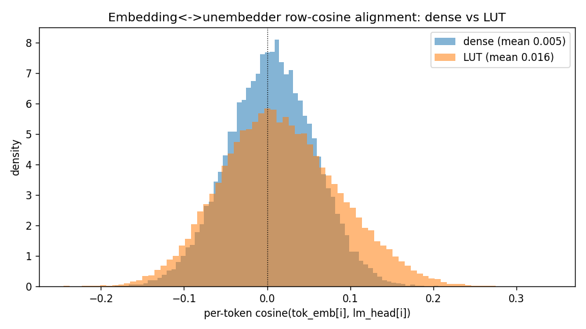

# exp071 — Embedding ↔ unembedder alignment: dense vs LUT (does the LUT reshape the residual stream?)

**Hypothesis under test:** the LUT FFN slot "reshapes" the residual stream so that
`token_embedding` no longer doubles as a good unembedder — which would explain why
weight-tying helps the LUT model much less than the dense model. Prediction: DENSE shows
higher `tok_emb`↔`lm_head` alignment (cheap to tie); LUT shows lower alignment (costly to tie).

**Method (read-only, no training):** two fully-trained **16k-step UNTIED** checkpoints, each
with an independently-learned `lm_head` and a separate `tok_emb` (both [32768, 384]):
- **dense** = `exp003_untied_vanilla_baseline_nebius_astarostin` (16k dense FFN, val_bpb 1.2014).
  *(Used in place of exp002 — same config/result, but exp002's checkpoint wasn't retained on
  disk; exp003 is the same 16k untied dense baseline.)*
- **LUT** = `exp070` (CompressionMultiHeadLUT, 6 heads, inner 64/64, nap6, gamma0; val_bpb 1.2310).

## Results

| metric | dense (exp003) | LUT (exp070) | hypothesis predicts | supports? |
|---|---|---|---|---|
| row-cosine **mean** | 0.0050 | **0.0165** | dense > LUT | **NO** (LUT higher) |
| row-cosine median | 0.0054 | 0.0129 | dense > LUT | NO |
| row-cosine std | 0.052 | 0.070 | — | — |
| linear **CKA** | **0.088** | 0.071 | dense > LUT | weak yes |
| Frobenius cosine ⟨E,U⟩ | 0.0046 | **0.0164** | dense > LUT | NO |
| orthogonal Procrustes err (↓ = aligned; max √2≈1.414) | 1.230 | **1.213** | dense < LUT | NO (LUT more aligned) |
| **control** — shuffled-row cosine mean | 0.0015 | −0.0001 | ≈ 0 | ✓ ≈ 0 |

Row-cosine percentiles (p1/p5/p25/p50/p75/p95/p99):
- dense: −0.117 / −0.081 / −0.030 / 0.005 / 0.041 / 0.090 / 0.125
- LUT:   −0.135 / −0.094 / −0.033 / 0.013 / 0.063 / 0.139 / 0.187

(`||tok_emb||_F, ||lm_head||_F`: dense 85.5 / 167.9; LUT 92.0 / 173.7 — lm_head is ~2× the
embedding's magnitude in both.)

## Verdict — the reshaping hypothesis is NOT supported

In **both** models the token embedding and the learned unembedder are **essentially
orthogonal / unaligned**: row-cosine ≈ 0.005–0.016 (barely above the ~0 shuffled control),
linear CKA ≈ 0.07–0.09, and the best-rotation (orthogonal Procrustes) error is ≈ 1.21–1.23,
close to the √2 ≈ 1.414 maximum for orthogonal matrices. So the untied `lm_head` learns a
representation nearly orthogonal to `tok_emb` **regardless of whether the FFN is dense or LUT**.

Crucially, the **dense model does NOT show higher alignment** than the LUT model — on 3 of the
4 alignment metrics (row-cosine mean/median, Frobenius cosine, Procrustes) the LUT is
*marginally more* aligned, not less; only CKA slightly favors dense (0.088 vs 0.071), and all
differences are tiny against a backdrop of near-orthogonality.

Therefore the observed asymmetry — weight-tying helping the dense model far more than the LUT
model — is **not explained by embedding↔unembedder geometric alignment**. Tying is a
comparably strong (geometrically costly) constraint for both, since neither model's `tok_emb`
already points like its `lm_head`. The differential benefit of tying must come from something
else (regularization / effective parameter budget / optimization coupling), not from
`tok_emb` serving as a better unembedder in the dense model.

Reproduce: `alignment_stats.json` holds the full numbers; the analysis script computes
row-cosine, linear CKA, Frobenius cosine, unit-norm orthogonal Procrustes, and a
shuffled-row control from the two checkpoints.
