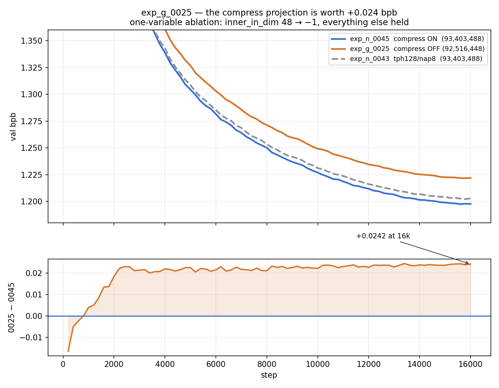

# exp_g_0025 — the compress projection is worth +0.024 bpb

**Result: `final_val_bpb = 1.2219291` (best 1.2217854), 92,516,448 params, 3.963 h.**

| | val bpb @ 16k | params | Δ vs 0045 |
|---|---|---|---|
| exp_n_0045 — compress **ON** | **1.1977670** | 93,403,488 | — |
| exp_n_0043 — tph128/nap8 | 1.2029199 | 93,403,488 | +0.005153 |
| **exp_g_0025 — compress OFF** | **1.2219291** | 92,516,448 | **+0.024162** |

Removing the compress projection costs **+0.0242 bpb** for a saving of **887,040
params (0.95% of the model)**. That is a bad trade: exp_n_0043 gives up only
+0.0052 bpb for the *same* param count, so the compress Linears buy roughly
**4.7× more bpb per param** than the tph/nap knob does at this scale.

## Why this is the clean experiment

The complete config diff against exp_n_0045, computed by comparing every key, is
one line:

```
lut_inner_in_dim: 48 -> -1
```

`diff train.py` against exp_n_0045's shows **only added comment lines, zero code
difference**. Batch and eval fields are asserted equal to exp_n_0045's field by
field — `device_batch_size 48`, `grad_accum 1`, `eval_steps 10`, tokens/step
24,576, val tokens 245,760 — so there is no batch-size difference either.

Param arithmetic closes exactly:

```
93,403,488 (exp_n_0045 as-run)  -  887,040 (six compress Linears)  =  92,516,448  ✓
```

The `887,040` is `6 * (384*48*8 + 48*8)` — the six compress Linears and nothing
else. Getting that "nothing else" required using the **stock per-head-loop**
`CompressionMultiHeadLUT`, not the batched path: the loop gives each head its own
`(log_soft_score_temp, log_select_temp)` — 16 per slot — which is what the
exp_n_0045 checkpoint has. The batched path shares one pair per slot (2), which
would have been a second variable worth −84 params. See
`local_mh_compression.py`, retained but unused, for the full story.

## Shape of the curve

exp_g_0025 is **below** exp_n_0045 only at the first four evals (steps 200–800,
min −0.016407 at 200), crosses at ~step 900, and the gap then saturates fast:

```
step   2,400 onward   delta sits in a +0.021 .. +0.024 band
last 20 aligned evals (12,200..16,000)   mean delta +0.023742
max delta +0.024394 @ 13,400     final +0.024162 @ 16,000
0025 above 0045 at 76 / 80 aligned eval steps
```

The gap is **flat, not widening** over the second half — this is a fixed
capability offset, not a divergence, and there is no sign 0025 would close it
with more steps.



## Reading it

The compress Linear is not doing something redundant that the LUT could absorb.
Routing each head on its own learned 48-d projection of the slot input beats
routing all 8 heads on the same raw 384-d vector, and the advantage appears early
(by step ~2,400) and holds. Note the LUT tables themselves are unchanged between
the two runs — 75,497,472 params either way — so this is purely about *what the
tables get to look at*, not how much table there is.

## Context

exp_g_0024 (also compress-off) was stopped at step 11,000 tracking ~+0.029 above
exp_n_0043; it is **not** comparable, because it additionally moved `n_heads`
8 → 1 and `tph` 256 → 2048 and is 1.66M params smaller. exp_g_0025 exists to
remove exactly that confound, and it lands at +0.0242 vs exp_n_0045 — a smaller
penalty than 0024's confounded curve suggested.
