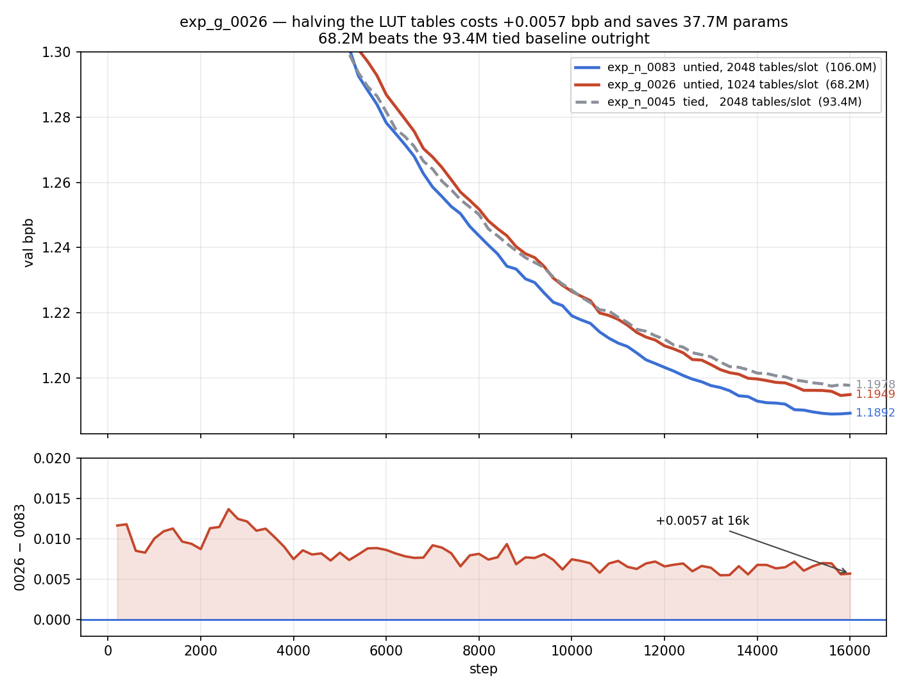

# exp_g_0026 — halving the LUT tables costs +0.0057 bpb and saves 37.7M params

**Result: `final_val_bpb = 1.1949408` (best 1.1946398), 68,237,580 params, 2.333 h.**

| | val bpb @ 16k | params | tables/slot |
|---|---|---|---|
| exp_n_0083 — untied, tph256 | **1.1892311** | 105,986,316 | 8×256 = 2048 |
| **exp_g_0026 — untied, tph128** | **1.1949408** | **68,237,580** | 8×128 = 1024 |
| exp_n_0045 — tied, tph256 | 1.1977670 | 93,403,488 | 8×256 = 2048 |

**The headline: 68.2M beats the 93.4M tied baseline.** exp_g_0026 finishes
**−0.0028 below exp_n_0045** while being **25.2M params smaller (−27%)**. Against
its own parent it gives up only **+0.0057 bpb for −37,748,736 params (−35.6%)**.

So on this axis the LUT tables are heavily over-provisioned: the second half of
them buys 0.0057 bpb, whereas untying the unembedder buys 0.0085 bpb for
+12.6M — roughly **6× better bpb per param** than the tables at this size.

## Shape of the curve

exp_g_0026 is above exp_n_0083 at all 80 aligned eval steps, but the gap
*narrows* over the run rather than widening:

```
max delta +0.013675 @ step 2,600
mean over last 20 aligned evals (12,200..16,000)   +0.006385
min delta +0.005501 @ step 13,200      final +0.005710 @ 16,000
```

Against the **tied** baseline exp_n_0045 it crosses late and durably — below it at
every eval from **step 10,600** onward, ending −0.0028:

```
15,600   0026 1.195932   0045 1.197526   -0.001594
15,800   0026 1.194640   0045 1.197960   -0.003320
16,000   0026 1.194941   0045 1.197767   -0.002826
```



## Paired with exp_n_0084 — the heads-vs-tph axis

exp_g_0026 (8 heads × 128 tables) and exp_n_0084 (4 heads × 256 tables) both hold
**1024 tables per slot**, verified identical to the parameter:

```
                          total     LUT tables  compress  decompress  temps
exp_g_0026 H8 tph128   68,237,580   37,748,736   887,040     887,040     12
exp_n_0084 H4 tph256   67,351,692   37,748,736   443,520     444,672     12
                          +885,888           +0  +443,520    +442,368     +0
```

The entire +885,888 is projection width — 0026 keeps 8 heads, so its compress is
`384→8·48` and decompress `8·48→384`, twice as wide as 0084's. **exp_n_0084 has
not been run** (config and train.py only, no metrics), so the pair is not yet
closed; running it would isolate head-count from table-count at matched capacity
for ~1% param difference.

## Build

Clone of exp_n_0083 with `train.py` **byte-identical**; the complete config diff is
one field, `lut_tables_per_head: 256 → 128`. Batched FastMHL path verified at
runtime (one module per slot, `weights (1024,128,48)`, 6 forward calls across 6
slots — the per-head loop ran 0 times); untied head confirmed via `data_ptr`.
Batch settings inherited unchanged from exp_n_0083 (`device_batch 24 /
grad_accum 2`, 24,576 tok/step), so there is no batch difference from either
reference. Shared `src/spiky/lutorch/` untouched.
