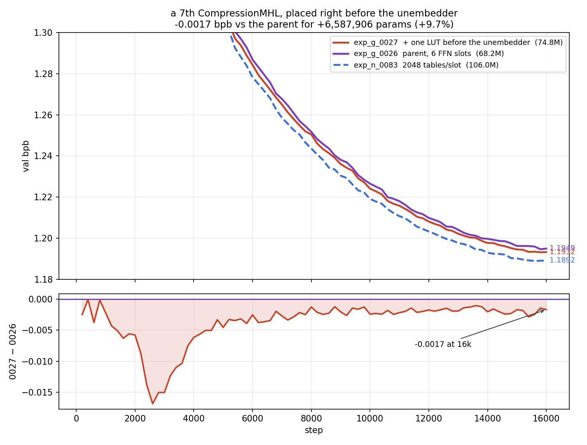

# exp_g_0027 — a 7th CompressionMHL before the unembedder buys −0.0017 bpb

**Result: `final_val_bpb = 1.1932468` (best 1.1931804), 74,825,486 params, 2.664 h.**

| | val bpb @ 16k | params | LUT slots |
|---|---|---|---|
| exp_n_0083 — untied, 2048 tables/slot | **1.1892311** | 105,986,316 | 6 |
| **exp_g_0027 — exp_g_0026 + head slot** | **1.1932468** | **74,825,486** | **7** |
| exp_g_0026 — untied, 1024 tables/slot | 1.1949408 | 68,237,580 | 6 |
| exp_n_0045 — tied, 2048 tables/slot | 1.1977670 | 93,403,488 | 6 |

Adding one CompressionMHL immediately before the unembedder lowers bpb by
**−0.0016940** for **+6,587,906 params (+9.65%)** and +14% wall-clock.

## The shape of the win: real, consistent, but decaying

exp_g_0027 is below its parent at **all 80 aligned eval steps** — there is no step
at which the extra slot is behind. But the advantage *shrinks* monotonically:

```
quarter means (0027 − 0026)
    200- 4,000   -0.007625
  4,200- 8,000   -0.003383
  8,200-12,000   -0.002004
 12,200-16,000   -0.001819      final -0.001694

min -0.016829 @ step 2,600      max -0.000076 @ step 400
mean over all 80 aligned evals  -0.003708
```

So most of what the extra slot buys is **faster convergence**, not a better
converged model. At step 2,600 it was ahead by 0.0168; by 16k that has decayed to
0.0017, and the trend is still flattening downward. A longer run would likely
narrow it further. This is the opposite of the exp_g_0026 / exp_n_0084 heads-vs-tables
pair, where the gap *grew* by quarter — that one looked like a real capacity
difference, this one looks mostly like optimization speed.



## Where it sits on the bpb-per-parameter curve

Three ways to spend parameters from the exp_g_0026 base, ranked:

```
                                      Δ bpb      Δ params    m-bpb / Mparam
untie the unembedder (0045 -> 0083)  -0.0085   +12,582,828        0.675
add a slot before the unembedder     -0.0017    +6,587,906        0.257
double the LUT tables (0026 -> 0083) -0.0057   +37,748,736        0.151
```

The new slot is **~1.7× more parameter-efficient than doubling the tables**, and
still well behind untying the head. It does not reach exp_n_0083: at 74.8M it is
**+0.0040 above** that 106.0M run, while being 31.2M smaller.

## Caveat — this is not a matched comparison

The extra slot *adds* 9.65% params, so this measures what the layer buys, not
whether the placement is special. The open question it raises: how much of the
−0.0017 is **placement** (a slot reading the final residual, right before the
unembedder) versus **just a 7th slot anywhere**? Inserting the same slot as a
normal 7th block would separate those two, and is the natural follow-up.

## Build

Clone of exp_g_0026 with the complete config diff being one field, `head_lut: true`.
The layer mirrors an FFN sub-layer exactly:

```
h = head_ln(x)
x = x + head_ffn(h)          # pre-norm + residual, decompress zero-init
logits = head(ln_f(x))
```

`head_ln` is its own `LayerNorm((384,), eps=1e-5, affine)` — configured identically
to the FFN slots' `ln2`, shared with nothing. The trunk now ends
`... blocks ... -> head_ln -> head_ffn -(+residual)-> ln_f -> head`, so `ln_f` still
feeds the unembedder as before.

The slot's LUT hyperparameters are identical to the FFN slots', verified at the
module level rather than in config: `n_heads 8`, `weights (1024, 128, 48)`, nap 7,
inner_in/out 48, `forward_mode hard`, learnable temps, batched path, 6,587,138
params — the same count an FFN slot has. Only `random_seed` differs (1006 vs the
slots' 1000..1005). The new modules are registered *after* `head`, so `tok_emb` /
`blocks` / `ln_f` / `head` keep the baseline's init RNG stream.

Pre-launch smoke was a real forward + backward + 3 real `optimizer.step()` calls:
param delta exactly +6,587,906 (6,587,138 slot + 768 LayerNorm), head slot fired
once per forward, decompress took finite nonzero gradients and moved off zero, peak
23.54 GiB with 7.8 GiB headroom. Batch settings inherited unchanged from exp_g_0026
(`device_batch 24 / grad_accum 2`, 24,576 tok/step). Throughput 0.600 s/step
sustained over a 1,500-step window — 1.14× the parent, consistent with 7 LUT slots
against 6. Shared `src/spiky/lutorch/` untouched.
