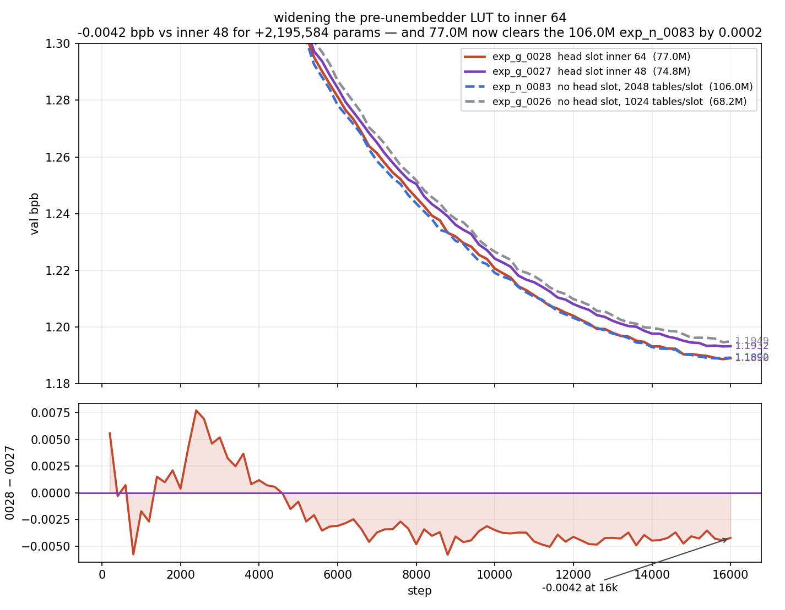

# exp_g_0028 — widening the pre-unembedder LUT to inner 64: −0.0042 bpb, and 77M clears the 106M run

**Result: `final_val_bpb = 1.1890093` (best 1.1886971), 77,021,070 params, 2.679 h.**

| | val bpb @ 16k | params | head slot | wall |
|---|---|---|---|---|
| **exp_g_0028 — head slot inner 64** | **1.1890093** | **77,021,070** | inner 64 | 2.679 h |
| exp_n_0083 — no head slot, 2048 tables/slot | 1.1892311 | 105,986,316 | — | 3.571 h |
| exp_g_0027 — head slot inner 48 | 1.1932468 | 74,825,486 | inner 48 | 2.664 h |
| exp_g_0026 — no head slot, 1024 tables/slot | 1.1949408 | 68,237,580 | — | 2.333 h |

Widening that one slot from inner 48 to 64 buys **−0.0042375 bpb for +2,195,584
params (+2.93%)** and essentially no wall-clock (+0.6%).

## Two findings

**1. It is the best parameter trade measured on this branch — by a wide margin.**

```
                                        Δ bpb      Δ params    m-bpb / Mparam
widen the head slot 48 -> 64 (0027->0028)  -0.0042    +2,195,584       1.930
untie the unembedder      (0045 -> 0083)   -0.0085   +12,582,828       0.675
add the head slot at all  (0026 -> 0027)   -0.0017    +6,587,906       0.257
double the LUT tables     (0026 -> 0083)   -0.0057   +37,748,736       0.151
```

Widening is **~7.5× more parameter-efficient than adding the slot** was, and ~13×
better than doubling the tables. The full 0026 → 0028 move (add the slot, then widen
it) comes to −0.0059315 for +8,783,490 params, a rate of 0.675 — dead level with
untying the unembedder, while the *marginal* step is far better than either.

**2. exp_g_0028 clears exp_n_0083, the standing best, at 27% fewer parameters.**

```
exp_g_0028   1.1890093   77,021,070   2.679 h
exp_n_0083   1.1892311  105,986,316   3.571 h
delta        -0.0002218  -28,965,246   -25% wall
```

Honest reading: **−0.0002 is small** — best-vs-best agrees in sign (1.1886971 vs
1.1889611, −0.000264) but a margin that size is within what a single eval can move.
Call it *at least a tie on bpb*, and decisive on the axes that are not close: 29.0M
fewer parameters and 0.9 h less wall-clock.

## The quarter-by-quarter contrast — capacity vs optimization speed

This is the most informative part of the pair, and it separates the two changes:

```
                                    Q1        Q2        Q3        Q4
add the slot     (0027 - 0026)  -0.007625 -0.003383 -0.002004 -0.001819   DECAYS
widen the slot   (0028 - 0027)  +0.002038 -0.002534 -0.004133 -0.004310   GROWS
```

Adding the slot helps most early and the advantage decays tenfold by 16k — that is
the signature of **faster optimization**, not a better model. Widening it does the
opposite: exp_g_0028 is *behind* for the first quarter (max +0.007722 at step 2,400),
crosses at step 4,600, and pulls away monotonically thereafter. That is the signature
of **real capacity** — it costs something to fit early and pays off late.

Step-aligned over 80 common evals: mean −0.002235, min −0.005818 @ 8,800, below at
62/80 steps, **durably below from step 4,600**, mean over the last 10 evals −0.004213.

Because the gap is still widening at 16k, a longer run would likely favour exp_g_0028
further — the opposite of what to expect from exp_g_0027.



## Build

Clone of exp_g_0027; the complete config diff is three keys, all scoped to the one
slot:

```
head_lut_n_heads        8      (pinned — the value it already had)
head_lut_inner_in_dim   48 -> 64
head_lut_inner_out_dim  48 -> 64
```

train.py gained optional `head_lut_*` keys (inner_in_dim, inner_out_dim,
n_anchor_pairs, tables_per_head, n_heads) that size the pre-unembedder slot
independently; each falls back to the matching `lut_*` value, so omitting them all
reproduces exp_g_0027 exactly. The 6 FFN slots always read `lut_*`.

CPU audit before launch confirmed the override did not leak: all 6 FFN slots stayed
byte-identical at `weights (1024, 128, 48)`, 6,587,138 params each. Only the head slot
moved — `(1024, 128, 64)`, compress `(384,384)→(512,384)`, decompress
`(384,384)→(384,512)`, 8,782,722 params, now 1.333× an FFN slot. `head_ln` unchanged
(its own `LayerNorm((384,), eps=1e-5, affine)`, identical to the FFN slots' `ln2`),
decompress still zero-initialized, order still
`... blocks ... -> head_ln -> head_ffn -(+residual)-> ln_f -> head`. Param delta
+2,195,584 vs exp_g_0027, entirely the head slot.

### Memory: required `expandable_segments`

The first launch **OOM'd before step 1** — it asked for 6.00 GiB (the LUT backward
surrogate `[12288, 1024, 128]` fp32) with 5.62 GiB free while **7.13 GiB sat stranded
as allocator fragmentation**. `PYTORCH_ALLOC_CONF=expandable_segments:True` collapses
that gap to 0.4 GiB:

```
peak allocated 24.57 GiB   peak reserved 24.98 GiB   card 31.4 GiB   headroom 6.4 GiB
(exp_g_0027 at inner 48 peaked 23.54 GiB)
```

That changes allocator behaviour only — `device_batch 24 / grad_accum 2 / 24,576
tok/step` are inherited unchanged from exp_g_0027, so the pair is a clean comparison.
The `device_batch 24 → 12` fallback was not needed.

Note the widened slot does **not** widen the `[N, n_tables, 2^nap]` surrogate — inner
dim is the *value* width, not the key width. The extra ~1 GiB is wider values, enough
to tip a run already near the ceiling.

The first smoke missed this because it ran one micro-batch per backward instead of the
real `grad_accum=2` loop and never touched the eval path. The smoke now replicates
train.py's actual step on real data plus a real `evaluate_bpb`, so both peaks are
measured rather than assumed. Shared `src/spiky/lutorch/` untouched.
