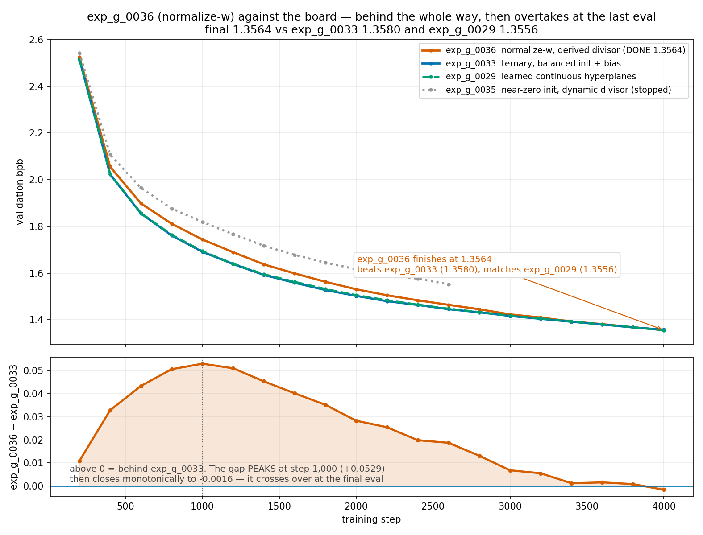
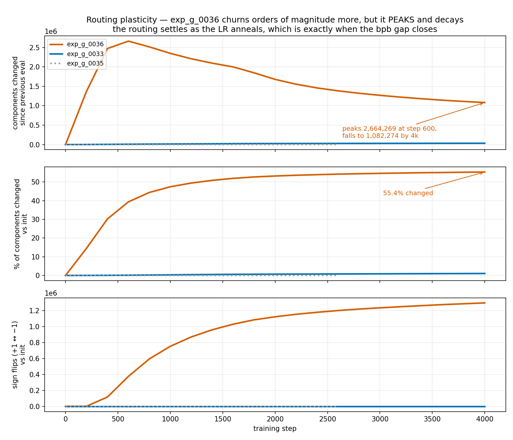
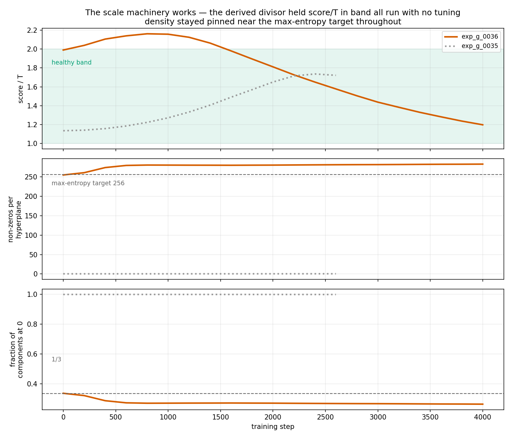

# exp_g_0036 — ternary routing reaches continuous-hyperplane parity, with zero tuned constants

**Result: `final_val_bpb = 1.3564438` (best, same), 340,169,484 params, 1.281 h.**

| | val bpb @ 4k | params | routing |
|---|---|---|---|
| exp_g_0029 | **1.3555723** | 340,166,412 | learned real-valued hyperplanes |
| **exp_g_0036** | **1.3564438** | 340,169,484 | **ternary {−1,0,+1}, normalize-w** |
| exp_g_0033 | 1.3579983 | 340,169,484 | ternary, balanced init + bias |
| exp_g_0031 | 1.3685852 | 330,704,652 | fixed random anchor pairs |
| exp_g_0030 | 1.3715980 | 340,144,908 | ternary, q frozen at anchors |

**exp_g_0036 is the best ternary result on the board** — it beats exp_g_0033 by
−0.0015545 and lands **+0.0008715** from exp_g_0029's learned continuous hyperplanes,
which is inside what a single eval moves. A routing that needs no multiplications at
inference now costs essentially nothing against one that does.

All five runs share the same pure topology, the same 4,000 steps on the same held
16,000-step LR schedule, the same batch and seed. They differ only in how a table row
is selected.

## What makes it work: three derived constants, none tuned

The design has **zero free scale hyperparameters**. Every constant follows from
`input_dim` and the max-entropy condition:

1. **normalize-w** — each hyperplane's weight vector is standardized to unit std every
   forward, *before* ternarization: `w' = (w − mean)/(std + 1e-5)` over the `input_dim`
   axis. The overall-magnitude degree of freedom is removed, so only the direction
   pattern trains, and the gradient flows *through* the normalization.

2. **Max-entropy temperature** — with unit-std weights the zero fraction is set by the
   band alone, so `T = Φ⁻¹((1+f)/2) / ln3`. At `f = 1/3` that is
   **0.43073 / 1.09861 = 0.392065**, giving equal thirds of −1/0/+1. Same derivation
   `_balanced_sigma` uses, solved for T at σ=1 rather than for σ at fixed T — one
   derivation in the tree, not two.

3. **Derived divisor** — `D = sqrt(input_dim · (1 − f))` = `sqrt(384 · 2/3)` =
   **`sqrt(256)` = 16**, computed at construction from `input_dim`, not hardcoded. A
   *fixed* divisor is correct here precisely because normalize-w pins the density every
   forward, so there is nothing for a dynamic divisor to track.

Realized at startup, asserted rather than assumed: split `+1 0.3323 / 0 0.3360 /
−1 0.3317`, 254.98 non-zeros per hyperplane against an expected 256, normalized `w`
mean −6.1e-12 and std 0.9888, **score/T = 1.9950 — in band with no tuning**.

## The shape of the run: behind the whole way, then it overtakes

```
  step     0036     0033     0029     0035   0036−0033
   400   2.0551   2.0223   2.0242   2.1071     +0.0328
  1000   1.7530   1.7001   1.7018   1.8360     +0.0529   <- gap PEAKS here
  1200   1.6897   1.6388   1.6402   1.7664     +0.0509
  2000   1.5310   1.5027   1.5056   1.6169     +0.0283
  3200   1.4100   1.4044   1.4063        —     +0.0056
  4000   1.3564   1.3580   1.3556        —     -0.0016   <- crosses over
```

It is behind at 19 of 20 aligned evals and wins only at the last one. The gap peaks at
step 1,000 and closes monotonically thereafter — a mid-run snapshot reads as a failing
run, which it isn't.



## Why: the routing reorganises fast, then settles

```
  step      churn/eval   hamming %   score/T
     0               0        0.00    1.9897
   600       2,664,269       39.4     ~2.1     <- churn PEAKS
  1600       1,999,931       51.97    1.9807
  2400       1,458,986       53.93    1.6503
  4000       1,082,274       55.35    1.1979
```

exp_g_0036 churns **orders of magnitude** more than any previous run — 55% of all
components change over the run, with 1.3M sign flips. That initially looks like the
instability that sank exp_g_0032. It isn't: churn **peaks around step 600 and decays**
as the LR anneals, and the bpb gap closes on exactly that schedule. Removing the
magnitude DOF also removed what anchored components on their side of the boundary, so
the model reorganises aggressively early and consolidates late.



## The scale machinery, validated

`score/T` drifted 1.99 → 1.20 across the whole run and **never left the healthy band**,
with density pinned near the max-entropy target throughout. The derived divisor needed
no adjustment at any point — which is the claim the design rests on.



## Lineage — what each prior run established

- **exp_g_0030** (ternary, `anchor_pairs` init): q never moved, *zero* components
  changed in 4,000 steps. The init put every component maximally far from the boundary.
- **exp_g_0032** (balanced init, no normalization): routing moved freely, but the dense
  init made the raw projection std ~16 against temperatures tuned for ~1.4, saturating
  the surrogate. Diverged badly; stopped at step 3,000.
- **exp_g_0034 / exp_g_0035** (near-zero init): structurally unrecoverable. Density grew
  ~1e-5 per step against a target of 256 (~21M steps needed) and ~2/3 of hyperplanes
  stayed permanently dead. exp_g_0035's dynamic per-hyperplane divisor held score/T in
  band the whole way and still could not rescue it — which cleanly separated the
  *divisor* problem from the *init* problem.
- **exp_g_0036**: normalize-w removes the scale question entirely rather than tuning
  around it.

## Build

`TernaryHyperplaneMultiHeadLUT` with `normalize_weights=True`,
`ternary_temp_init="max_entropy"`, `normalize_projection="sqrt_expected_nonzero"`,
`trainable_bias=True`; `soft_score_temp` and `select_temp` left at their log(0.5)
trainable-scalar inits. Raw weight init is plain random normal, since per-hyperplane
standardization erases the init magnitude anyway. Pure topology (no compress/decompress,
full 384-dim input, 384-dim cells, shared-input/summed-heads), n_heads 4, nap 8, tph 128
(512 tables/slot, 6 slots), untied head, depth 6 / n_embd 384 / n_head 6 / seq 512,
lr 3e-4, wd 0.1, seed 1, device_batch 12 / grad_accum 4 (24,576 tok/step).

`train.py` asserts unit std, the derived T, the derived D and score/T-in-band at
startup, so a mis-specified config cannot silently start a doomed run. Every new flag is
additive and default-off, with the off path verified as a strict no-op. Shared parent
classes untouched.
