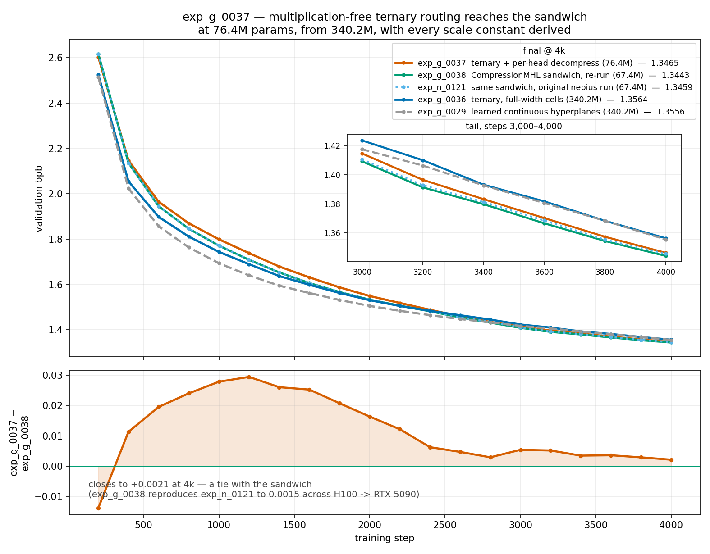

# exp_g_0037 — ternary routing reaches the sandwich baseline at 76.4M params

**Result: `final_val_bpb = 1.3464590` (best, same), 76,373,004 params, 0.571 h.**

| | val bpb @ 4k | params | routing |
|---|---|---|---|
| exp_g_0038 | **1.3443295** | 67,351,692 | CompressionMHL sandwich (baseline re-run) |
| exp_n_0121 | 1.3458620 | 67,351,692 | same, original nebius run |
| **exp_g_0037** | **1.3464590** | **76,373,004** | **ternary + per-head decompress** |
| exp_g_0029 | 1.3555723 | 340,166,412 | learned continuous hyperplanes |
| exp_g_0036 | 1.3564438 | 340,169,484 | ternary, full-width cells |

**A multiplication-free ternary routing now matches the learned compress/decompress
sandwich.** exp_g_0037 lands **+0.0021 from exp_g_0038** and **+0.0006 from
exp_n_0121** — inside what a single eval moves — at 1.13× the parameters. Against the
previous ternary best it is **−0.0100 at 0.22× the parameters**.

All runs share the same pure-topology trainer, the same 4,000 steps on the same held
16,000-step LR schedule, the same batch, seed, data and tokenizer.

## The change: per-head output decompression

By analogy with `CompressionMultiHeadLUT` (`compression_mhl.py:184, :226`):

```python
self.decompress = nn.Linear(n_heads * out_raw, output_dim)
return self.decompress(torch.cat(parts, dim=-1))
```

Each LUT table now stores a **48-dim** vector instead of 384. Each head sums its own
128 tables to a 48-dim result, the 4 head outputs are **concatenated** to 192, and a
learned `Linear(192 → 384)` projects back.

```
                     exp_g_0036      exp_g_0037        delta
LUT tables          301,989,888      37,748,736   -264,241,152   (6 × 512×256×384 → ×48)
decompress                    0         444,672        +444,672   (6 × (192×384 + 384))
hyperplane_weight     9,437,184       9,437,184              0    routing untouched
non-FFN              28,714,752      28,714,752              0
TOTAL               340,169,484      76,373,004   -263,796,480   (-77.55%)
```

It also trains **2.2× faster** — 0.571 h against exp_g_0036's 1.281 h.

## Behind the whole way, then it overtakes

```
  step      0037      0036    n_0121   0037-0036  0037-0121
   200    2.6037    2.5253    2.6175     +0.0784    -0.0138
  1000    1.7995    1.7440    1.7714     +0.0555    +0.0281
  1800    1.5876    1.5628    1.5666     +0.0247    +0.0210
  2600    1.4597    1.4644    1.4555     -0.0048    +0.0042   <- crosses exp_g_0036
  3400    1.3833    1.3932    1.3812     -0.0099    +0.0020
  4000    1.3465    1.3564    1.3459     -0.0100    +0.0006
```

Behind exp_g_0036 at 12 of 20 evals, crossing at step 2,600 and holding. Behind
exp_n_0121 at 19 of 20, converging to a tie. **This late-catch-up shape has now appeared
three times on this board** (exp_g_0033, exp_g_0036, exp_g_0037), so a mid-run g-series
snapshot says little about the final ordering.

## Two things this run changed at once

Worth stating plainly for anyone reading the delta: exp_g_0037 differs from exp_g_0036
in **two** ways, not one.

1. **Cell width** 384 → 48, which is where the 264M parameter saving comes from.
2. **`n_heads` became functional.** In the pure summed topology heads were provably
   inert — `(n_heads=4, tph=128)` and `(n_heads=1, tph=512)` produce bit-identical
   outputs to 3e-8, because sum-of-per-head-sums is just the total sum. **Concatenating
   instead of summing, then projecting, is exactly what restores head identity.**

So the −0.0100 does not attribute cleanly between "narrower cells" and "heads now mean
something". An `inner_out=384` decompress run would separate them.

## Init: the slot is CONSTANT at step 0, not zero

Following the sandwich convention, `train.py` zero-initializes `decompress.weight` — but
not `.bias`, and `_init_weights` only touches `.weight`. So at step 0 the slot emits
`0·x + bias` = the bias vector: input-independent, verified equal to `decompress.bias`
(|mean| 0.0367, std 0.0418). Identical to what exp_n_0121 and the other sandwich runs
have always done, but it differs from exp_g_0036, which had no decompress and emitted
the LUT's own table noise.

## Held from exp_g_0036, and verified at startup

`normalize_weights=True`, `T = max_entropy` (0.392065, derived), divisor
`sqrt_expected_nonzero` (16, derived from `input_dim`), `trainable_bias=True`, random
init, n_heads 4, nap 8, tph 128. Realized at init: split `+1 0.3323 / 0 0.3360 /
−1 0.3317`, 254.98 non-zeros per hyperplane, **score/T 1.9950**. train.py asserts the
table third dim is 48 and the decompress is 192→384, alongside exp_g_0036's asserts.

Final drift: score/T 1.0244 (in band all run), nnz/hyperplane 269.04, frac_zero 0.2994,
63.07% of components changed, churn down to 1,029,846, 1.85M sign flips, b absmean
0.00794 with 100% off zero.

## Caveat

Every run on this board stops at **94% of peak LR**, having traversed ~6% of the
cosine — the schedule is anchored to 16,000 and merely stopped at 4,000. exp_n_0121
goes on to 1.1915 by step 16,000. So "ternary matches the sandwich" is established
**at 4k**; a +0.0006–0.0021 margin is far too small to assume it survives a full anneal.


