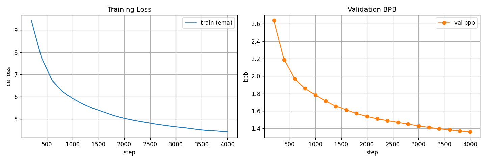

# exp_g_0039 — one-way sparsity penalty, lambda 100

**Result: `final_val_bpb = 1.3615717`, 21.44 non-zeros per hyperplane
(of 384), 0.576 h.**

| run | regime | nnz/hyperplane | frac_zero | val bpb @ 4k | vs lambda 0 |
|---|---|---|---|---|---|
| exp_g_0037 | no penalty (reference) | 269.04 | 0.2994 | 1.346459 | — |
| exp_g_0044 | target 192 | 161.58 | 0.5792 | 1.348412 | +0.001953 |
| exp_g_0043 | target 128 | 84.71 | 0.7794 | 1.358134 | +0.011675 |
| exp_g_0042 | target 64 | 47.85 | 0.8754 | 1.365208 | +0.018749 |
| **exp_g_0039** | **one-way lambda 100** | **21.44** | **0.9442** | **1.361572** | **+0.015113** |
| exp_g_0040 | one-way lambda 50 | 21.37 | 0.9443 | 1.362309 | +0.015850 |

The first penalised run. `penalty = 100 * surrogate` added to the loss — a **one-way
push**, with no floor: it never stops wanting fewer non-zeros, and over 4,000 steps it
drives the routing from 255 non-zeros per hyperplane to 21.44, **12.5x
sparser**, for **+0.0151 bpb**.

## It leads, then it loses

The cost is not a trend, it is a dip. exp_g_0039 goes *ahead* of the unpenalised run at
step ~676, reaches −0.0226 at step 1,400, crosses back at ~2,345, and settles at
+0.0151:

| step | frac_zero | nnz/hp | surrogate | val bpb | vs lambda 0 |
|---|---|---|---|---|---|
| 0 | 0.3360 | 254.97 | 0.6246 | — | — |
| 800 | 0.9218 | 30.04 | 0.0815 | 1.8629 | -0.0073 |
| 1,600 | 0.9361 | 24.54 | 0.0667 | 1.6132 | -0.0185 |
| 2,400 | 0.9406 | 22.81 | 0.0613 | 1.4910 | +0.0026 |
| 3,200 | 0.9428 | 21.96 | 0.0587 | 1.4126 | +0.0161 |
| 4,000 | 0.9442 | 21.44 | 0.0571 | 1.3616 | +0.0151 |

This is the mirror image of the late-catch-up pattern recorded on exp_g_0033/0036/0037,
where the smaller run trailed and overtook late. Here the sparse run leads early and loses
late. Both say the same thing: **a mid-run snapshot does not predict the final ordering, in
either direction.**

## What is held fixed

A fork of **exp_g_0037** (1.346459 at 76,373,004 params) with the penalty as the only
change: `decompress_heads=True` with `inner_out=48`, `normalize_weights=True`,
`T = max_entropy` (0.392065, derived), divisor `sqrt_expected_nonzero` (16, derived),
`trainable_bias=True`, random init, n_heads 4, nap 8, tph 128 — same seed, same data, same
batch, same held 16,000-step LR schedule stopped at 4,000. Parameter count is unchanged at
76,373,004: the penalty adds no parameters and no `state_dict` entries.

The surrogate is `mean(|tanh(w / 2T)|)` over all 9,437,184 routing components, with **T
detached**. That detachment is not cosmetic — with T live, the penalty widens the dead band
instead of moving any weight, because the gradient to `log_ternary_temp` aggregates over
all N components while the mean reduction leaves each weight only O(lambda/N).

## Final drift

score/T 0.5828 (inside the healthy 0.2–10 band the whole way), frac_zero
0.9442, churn down to 2,736 routing changes per eval, T
0.392065 → 0.380774 (0.971x — the penalty cannot move it).

## Caveat, as on every run on this board

The run stops at **94% of peak LR**, having traversed ~6% of the cosine — the schedule is
anchored to 16,000 steps and merely stopped at 4,000. exp_n_0121 goes on to 1.1915 by step
16,000. Every number here is an early-trajectory reading. It is fair *relative* to
exp_g_0037, which is identical in every respect but the penalty, but a full-anneal verdict
is not established by it.

