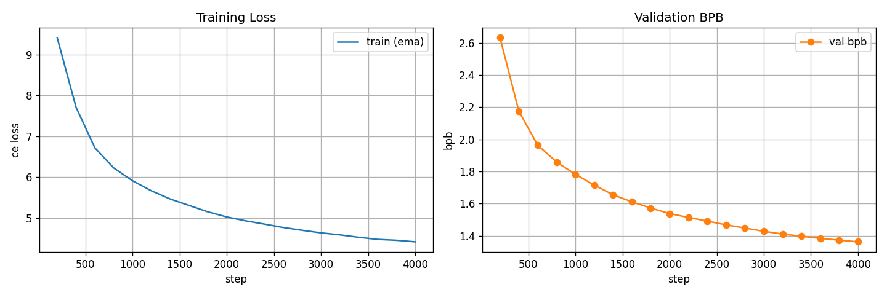

# exp_g_0040 — lambda 50: halving lambda changes nothing

**Result: `final_val_bpb = 1.3623090`, 21.37 non-zeros per hyperplane,
0.591 h.**

| run | regime | nnz/hyperplane | frac_zero | val bpb @ 4k | vs lambda 0 |
|---|---|---|---|---|---|
| exp_g_0037 | no penalty (reference) | 269.04 | 0.2994 | 1.346459 | — |
| exp_g_0044 | target 192 | 161.58 | 0.5792 | 1.348412 | +0.001953 |
| exp_g_0043 | target 128 | 84.71 | 0.7794 | 1.358134 | +0.011675 |
| exp_g_0042 | target 64 | 47.85 | 0.8754 | 1.365208 | +0.018749 |
| exp_g_0039 | one-way lambda 100 | 21.44 | 0.9442 | 1.361572 | +0.015113 |
| **exp_g_0040** | **one-way lambda 50** | **21.37** | **0.9443** | **1.362309** | **+0.015850** |

Identical to exp_g_0039 except `lambda = 50` instead of 100. **The two runs are
indistinguishable.** Final bpb differs by 0.0007; final density
differs by 0.07 non-zeros out of 384. The trajectories agree to
five decimal places from the first eval:

| step | lambda 50 frac_zero | lambda 100 frac_zero | lambda 50 nnz/hp | lambda 100 nnz/hp |
|---|---|---|---|---|
| 200 | 0.831469 | 0.831464 | 64.7160 | 64.7180 |
| 400 | 0.890582 | 0.890600 | 42.0165 | 42.0200 |

The penalty *value* is exactly halved (51.30 against 102.61 at step 200), so lambda is
genuinely being applied. It simply does not move where the weights go.

## Why: AdamW cancels lambda

Adam divides each parameter's update by that parameter's own running gradient magnitude.
Wherever the penalty gradient dominates a weight, lambda cancels in `m / sqrt(v)` and the
update is ~`lr` in the same direction regardless of lambda's size. Lambda only bites where
the task gradient is comparable in magnitude.

**Lambda is not a density knob.** The density reached is set by the surrogate's fixed point
and the LR. This is what motivated the target-density hinge in exp_g_0042–0044, and it is
also why a planned lambda=10 rung (exp_g_0041) was dropped before launch — see
`exp_g_0041_DROPPED_lam10_redundant/DROPPED.md`.

It also corrects an earlier estimate on this board: the measured penalty/task gradient-norm
ratio (~8.2e-4 per unit lambda) was used to predict lambda 100 would be mild. It was not —
and the same statistic would have predicted a large gap between 100 and 50, which does not
exist. **A gradient-norm ratio is the wrong statistic under Adam, in both directions.**

| step | frac_zero | nnz/hp | surrogate | val bpb | vs lambda 0 |
|---|---|---|---|---|---|
| 0 | 0.3360 | 254.97 | 0.6246 | — | — |
| 800 | 0.9216 | 30.09 | 0.0818 | 1.8585 | -0.0117 |
| 1,600 | 0.9360 | 24.59 | 0.0669 | 1.6110 | -0.0207 |
| 2,400 | 0.9406 | 22.81 | 0.0613 | 1.4910 | +0.0026 |
| 3,200 | 0.9429 | 21.93 | 0.0586 | 1.4104 | +0.0139 |
| 4,000 | 0.9443 | 21.37 | 0.0569 | 1.3623 | +0.0158 |

## What is held fixed

A fork of **exp_g_0037** (1.346459 at 76,373,004 params) with the penalty as the only
change: `decompress_heads=True` with `inner_out=48`, `normalize_weights=True`,
`T = max_entropy` (0.392065, derived), divisor `sqrt_expected_nonzero` (16, derived),
`trainable_bias=True`, random init, n_heads 4, nap 8, tph 128 — same seed, same data, same
batch, same held 16,000-step LR schedule stopped at 4,000. Parameter count is unchanged at
76,373,004: the penalty adds no parameters and no `state_dict` entries.

The surrogate is `mean(|tanh(w / 2T)|)` over all 9,437,184 routing components, with **T
detached**. That detachment is not cosmetic — with T live, the penalty widens the dead band
instead of moving any weight, because the gradient to `log_ternary_temp` aggregates over
all N components while the mean reduction leaves each weight only O(lambda/N).

## Final drift

score/T 0.5608, frac_zero 0.9443, churn 2,923, T
0.392065 → 0.386142 (0.985x).

## Caveat, as on every run on this board

The run stops at **94% of peak LR**, having traversed ~6% of the cosine — the schedule is
anchored to 16,000 steps and merely stopped at 4,000. exp_n_0121 goes on to 1.1915 by step
16,000. Every number here is an early-trajectory reading. It is fair *relative* to
exp_g_0037, which is identical in every respect but the penalty, but a full-anneal verdict
is not established by it.

