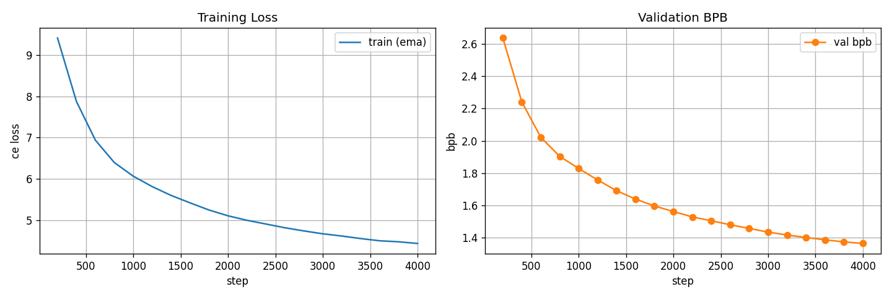

# exp_g_0042 — target-density hinge at 64/384

**Result: `final_val_bpb = 1.3652082`, 47.85 non-zeros per hyperplane
against a target of 64, 0.58 h.**

| run | regime | nnz/hyperplane | frac_zero | val bpb @ 4k | vs lambda 0 |
|---|---|---|---|---|---|
| exp_g_0037 | no penalty (reference) | 269.04 | 0.2994 | 1.346459 | — |
| exp_g_0044 | target 192 | 161.58 | 0.5792 | 1.348412 | +0.001953 |
| exp_g_0043 | target 128 | 84.71 | 0.7794 | 1.358134 | +0.011675 |
| **exp_g_0042** | **target 64** | **47.85** | **0.8754** | **1.365208** | **+0.018749** |
| exp_g_0039 | one-way lambda 100 | 21.44 | 0.9442 | 1.361572 | +0.015113 |
| exp_g_0040 | one-way lambda 50 | 21.37 | 0.9443 | 1.362309 | +0.015850 |

`penalty = 100 * relu(surrogate - 0.166667)` — a **one-sided hinge** rather than the
one-way push of exp_g_0039/0040. Full pressure while the router is denser than the target;
**exactly zero** value and gradient once it is not. The hinge is plain, not squared, so the
hold at the target is sharp instead of fading in.

## It reaches the target, releases, and holds

The hinge released at **step 400**, and the density then stayed put rather than
continuing to collapse:

| step | frac_zero | nnz/hp | surrogate | slack | hinge | val bpb | vs lambda 0 |
|---|---|---|---|---|---|---|---|
| 0 | 0.3360 | 254.97 | 0.6246 | +0.4580 | pushing | — | — |
| 800 | 0.8736 | 48.52 | 0.1593 | -0.0074 | released | 1.9039 | +0.0337 |
| 1,600 | 0.8751 | 47.96 | 0.1550 | -0.0117 | released | 1.6401 | +0.0084 |
| 2,400 | 0.8753 | 47.89 | 0.1606 | -0.0061 | released | 1.5054 | +0.0170 |
| 3,200 | 0.8754 | 47.86 | 0.1593 | -0.0074 | released | 1.4175 | +0.0210 |
| 4,000 | 0.8754 | 47.85 | 0.1612 | -0.0055 | released | 1.3652 | +0.0187 |

## The anomaly on this board

exp_g_0042 holds **2.2x more** non-zeros than the one-way runs (47.85 against 21.44) and
still costs **more** bpb (+0.0187 against +0.0151). It is the one point where the frontier
turns back on itself; from 48 non-zeros upward the frontier is monotone.

The likeliest reading is not density but **freezing**. At 888 routing changes per eval this
is the most frozen run on the board — three times more frozen than the one-way runs that
are twice as sparse, and four orders of magnitude below the unregularised 1,029,846. Its T
also rises the most (1.195x), so part of the held sparsity is band-widening rather than
weight structure. Ordering the target family by churn reproduces the cost ordering exactly;
the two one-way runs are the ones that sit slightly off it.

## Calibration: the target is on the SOFT surrogate

The target is compared against `mean(|tanh(w / 2T)|)`, not against the hard non-zero count,
and the two are not equal. This run **asked for 64 and settled at 47.85
(0.75x)**. Across the three targets the undershoot is 0.84x / 0.66x / 0.75x —
not a constant, so a wanted hard count cannot be obtained by scaling the soft target by a
fixed factor. `ternary_drift.csv` logs `target_nonzero_frac`, `sparsity_slack` and
`hinge_active` next to `frac_zero` and `mean_nonzero_count` so the mapping is measured
rather than assumed.

## What is held fixed

A fork of **exp_g_0037** (1.346459 at 76,373,004 params) with the penalty as the only
change: `decompress_heads=True` with `inner_out=48`, `normalize_weights=True`,
`T = max_entropy` (0.392065, derived), divisor `sqrt_expected_nonzero` (16, derived),
`trainable_bias=True`, random init, n_heads 4, nap 8, tph 128 — same seed, same data, same
batch, same held 16,000-step LR schedule stopped at 4,000. Parameter count is unchanged at
76,373,004: the penalty adds no parameters and no `state_dict` entries.

The surrogate is `mean(|tanh(w / 2T)|)` over all 9,437,184 routing components, with **T
detached**. That detachment is not cosmetic — with T live, the penalty widens the dead band
instead of moving any weight, because the gradient to `log_ternary_temp` aggregates over
all N components while the mean reduction leaves each weight only O(lambda/N).

## Final drift

score/T 0.7907, frac_zero 0.8754, churn 888 routing changes per
eval (against the unregularised run's 1,029,846), T
0.392065 → 0.468444 (**1.195x**). The penalty has T detached, so
it cannot widen the band — but after release the *task* gradient is the only thing acting
on T, and nothing holds it.

## Caveat, as on every run on this board

The run stops at **94% of peak LR**, having traversed ~6% of the cosine — the schedule is
anchored to 16,000 steps and merely stopped at 4,000. exp_n_0121 goes on to 1.1915 by step
16,000. Every number here is an early-trajectory reading. It is fair *relative* to
exp_g_0037, which is identical in every respect but the penalty, but a full-anneal verdict
is not established by it.

