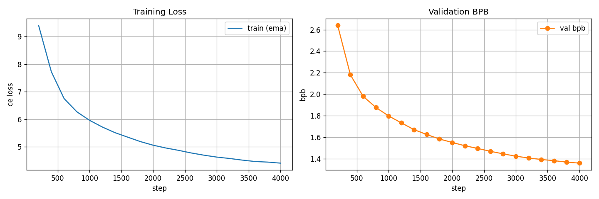

# exp_g_0043 — target-density hinge at 128/384

**Result: `final_val_bpb = 1.3581339`, 84.71 non-zeros per hyperplane
against a target of 128, 0.581 h.**

| run | regime | nnz/hyperplane | frac_zero | val bpb @ 4k | vs lambda 0 |
|---|---|---|---|---|---|
| exp_g_0037 | no penalty (reference) | 269.04 | 0.2994 | 1.346459 | — |
| exp_g_0044 | target 192 | 161.58 | 0.5792 | 1.348412 | +0.001953 |
| **exp_g_0043** | **target 128** | **84.71** | **0.7794** | **1.358134** | **+0.011675** |
| exp_g_0042 | target 64 | 47.85 | 0.8754 | 1.365208 | +0.018749 |
| exp_g_0039 | one-way lambda 100 | 21.44 | 0.9442 | 1.361572 | +0.015113 |
| exp_g_0040 | one-way lambda 50 | 21.37 | 0.9443 | 1.362309 | +0.015850 |

`penalty = 100 * relu(surrogate - 0.333333)` — a **one-sided hinge** rather than the
one-way push of exp_g_0039/0040. Full pressure while the router is denser than the target;
**exactly zero** value and gradient once it is not. The hinge is plain, not squared, so the
hold at the target is sharp instead of fading in.

## It reaches the target, releases, and holds

The hinge released at **step 200**, and the density then stayed put rather than
continuing to collapse:

| step | frac_zero | nnz/hp | surrogate | slack | hinge | val bpb | vs lambda 0 |
|---|---|---|---|---|---|---|---|
| 0 | 0.3360 | 254.97 | 0.6246 | +0.2913 | pushing | — | — |
| 800 | 0.7806 | 84.23 | 0.2988 | -0.0345 | released | 1.8765 | +0.0063 |
| 1,600 | 0.7835 | 83.14 | 0.3175 | -0.0159 | released | 1.6243 | -0.0074 |
| 2,400 | 0.7824 | 83.56 | 0.3142 | -0.0191 | released | 1.4948 | +0.0064 |
| 3,200 | 0.7755 | 86.22 | 0.3283 | -0.0050 | released | 1.4059 | +0.0094 |
| 4,000 | 0.7794 | 84.71 | 0.3146 | -0.0187 | released | 1.3581 | +0.0117 |

## Where the free region ends

At 84.71 non-zeros per hyperplane — 3.2x sparser than unregularised — the cost is +0.0117.
That is roughly **six times** the +0.0020 of exp_g_0044 at 161.58, and far outside eval
noise (exp_g_0038 and exp_n_0121 are the same configuration on two different machines and
differ by 0.0015). So the boundary between free and paid-for sparsity lies somewhere
between 85 and 162 non-zeros per hyperplane.

## Calibration: the target is on the SOFT surrogate

The target is compared against `mean(|tanh(w / 2T)|)`, not against the hard non-zero count,
and the two are not equal. This run **asked for 128 and settled at 84.71
(0.66x)**. Across the three targets the undershoot is 0.84x / 0.66x / 0.75x —
not a constant, so a wanted hard count cannot be obtained by scaling the soft target by a
fixed factor. `ternary_drift.csv` logs `target_nonzero_frac`, `sparsity_slack` and
`hinge_active` next to `frac_zero` and `mean_nonzero_count` so the mapping is measured
rather than assumed.

## What is held fixed

A fork of **exp_g_0037** (1.346459 at 76,373,004 params) with the penalty as the only
change: `decompress_heads=True` with `inner_out=48`, `normalize_weights=True`,
`T = max_entropy` (0.392065, derived), divisor `sqrt_expected_nonzero` (16, derived),
`trainable_bias=True`, random init, n_heads 4, nap 8, tph 128 — same seed, same data, same
batch, same held 16,000-step LR schedule stopped at 4,000. Parameter count is unchanged at
76,373,004: the penalty adds no parameters and no `state_dict` entries.

The surrogate is `mean(|tanh(w / 2T)|)` over all 9,437,184 routing components, with **T
detached**. That detachment is not cosmetic — with T live, the penalty widens the dead band
instead of moving any weight, because the gradient to `log_ternary_temp` aggregates over
all N components while the mean reduction leaves each weight only O(lambda/N).

## Final drift

score/T 0.7710, frac_zero 0.7794, churn 166,796 routing changes per
eval (against the unregularised run's 1,029,846), T
0.392065 → 0.404144 (**1.031x**). The penalty has T detached, so
it cannot widen the band — but after release the *task* gradient is the only thing acting
on T, and nothing holds it.

## Caveat, as on every run on this board

The run stops at **94% of peak LR**, having traversed ~6% of the cosine — the schedule is
anchored to 16,000 steps and merely stopped at 4,000. exp_n_0121 goes on to 1.1915 by step
16,000. Every number here is an early-trajectory reading. It is fair *relative* to
exp_g_0037, which is identical in every respect but the penalty, but a full-anneal verdict
is not established by it.

