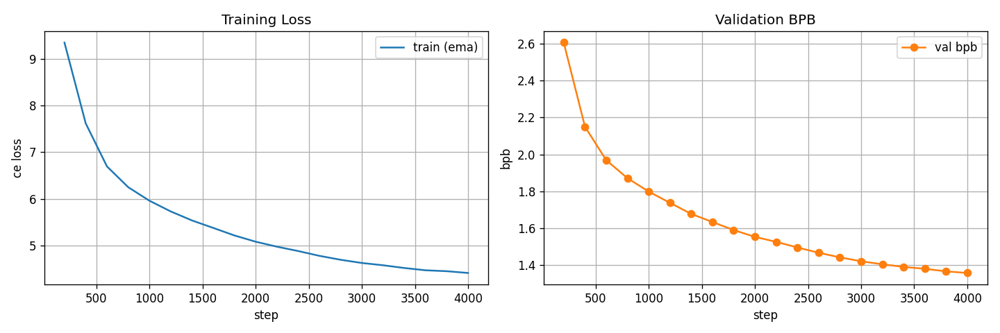

# exp_g_0046 — trained hard top-128 per hyperplane

**Result: `final_val_bpb = 1.3582949`, exactly 128.00 non-zeros per hyperplane,
76,373,004 params, 0.585 h.**

| run | K | nnz/hyperplane | val bpb @ 4k | vs no-penalty exp_g_0037 |
|---|---|---|---|---|
| exp_g_0045 | 64 | 64.00 | 1.366177 | +0.019718 |
| **exp_g_0046** | **128** | **128.00** | **1.358295** | **+0.011836** |
| exp_g_0047 | 192 | 192.00 | 1.355937 | +0.009478 |

"Train what you deploy": every forward keeps exactly the top-128 components of each
hyperplane, ranked by confidence `|normalized_weight()|` — how far past the dead-zone
boundary the component sits — and takes their ternary sign. The same mask applies in the
hard eval path, so train-mode and deploy-mode are the same function.

**Density is pinned exactly.** `nonzero_per_hyperplane` took a single distinct value
across all 21 evals: 128.0000, with `frac_zero` 0.666667 =
1 − 128/384 at every row.

## What it has to beat

| comparison | nnz/hyperplane | val bpb | exp_g_0046 − it | verdict |
|---|---|---|---|---|
| post-hoc prune of exp_g_0044 to 128 | 128.00 | 1.351329 | +0.006966 | pruning wins |
| exp_g_0043 (target 128) | 84.71 | 1.358134 | +0.000161 | **penalty wins, with fewer components** |

## The straight-through estimator is what makes this trainable

```python
return s + (self._q_hard_from(s) - s).detach()
```

The mask sits **inside** the `.detach()`, so it changes the forward VALUE and never
multiplies the backward. Every component — masked-out included — receives the full
gradient its position earns, can grow, and can displace a weaker one on a later step.
Masking the backward instead would freeze each excluded component at whatever value it
held when it dropped out, and the set could only ever shrink. Verified in the module's
sanity block (7c): 100% of masked-out components receive gradient, and 25 Adam steps moved
64 components into the top-K from outside.

## Does the top-K set settle?

The set is 128 × 24,576 = **3,145,728 components** of the 9,437,184 total.
Churn below is normalised by that set, not by all slots — a larger K can move more
components while replacing a smaller share of its own routing, so "% of all slots" would
rank the runs wrongly.

| step | entered the set | % of set replaced | % of set differing from init |
|---|---|---|---|
| 800 | 1,133,514 | 36.0% | 64.7% |
| 1,600 | 1,056,002 | 33.6% | 66.6% |
| 2,400 | 839,668 | 26.7% | 66.7% |
| 3,200 | 771,527 | 24.5% | 66.8% |
| 4,000 | 770,832 | 24.5% | 66.8% |

It falls from 41.2% to 24.5% of the set replaced per eval, and over the
last five evals it moved -0.1%: **FLAT — it has stopped converging**. The distance from the initial mask
plateaus, so the set is not travelling anywhere — it churns in place. For scale, the
hinge-trained exp_g_0042 ends at 0.08% turnover.

## A kept component is ±1 even inside the dead zone

That is deliberate, and it is the likeliest reason this family underperforms. The
alternative — intersecting the top-K with the dead-zone survivors — would give "at most K",
a count that drifts with T. Exactly-K was chosen so the deployed count is fixed.

The cost is that top-K **cannot emit zero as a decision**. It must nominate exactly K
components and give each of them full ±1 weight, however unconfident it is about them. The
penalty-trained runs keep the third state and can spend it: a component they are unsure
about simply quantises to 0. The zero is not merely absence, it carries information, and
top-K trades it away for a fixed count.

## Trajectory

| step | val bpb | vs exp_g_0037 | nnz/hp | score/T | T_mean |
|---|---|---|---|---|---|
| 800 | 1.8717 | +0.0015 | 128.00 | 1.4161 | 0.389128 |
| 1,600 | 1.6344 | +0.0027 | 128.00 | 1.2672 | 0.377377 |
| 2,400 | 1.4965 | +0.0080 | 128.00 | 1.0483 | 0.357421 |
| 3,200 | 1.4053 | +0.0088 | 128.00 | 0.8760 | 0.336443 |
| 4,000 | 1.3583 | +0.0118 | 128.00 | 0.7458 | 0.315230 |

## What is held fixed

A fork of **exp_g_0037** (1.346459 at 76,373,004 params) with the top-K as the only
change: `decompress_heads=True` with `inner_out=48`, `normalize_weights=True`,
`T = max_entropy` (0.392065, derived), divisor `sqrt_expected_nonzero` (16, derived),
`trainable_bias=True`, random init, n_heads 4, nap 8, tph 128 — same seed, same data, same
batch, same held 16,000-step LR schedule stopped at 4,000. **The sparsity penalty is off**
(lambda 0, target 0): top-K sets the density directly, so the hinge has nothing to do.
Parameter count unchanged at 76,373,004 — `topk_per_hyperplane` is a plain int and adds no
parameters and no `state_dict` entries.

## Caveat, as on every run on this board

The run stops at **94% of peak LR**, having traversed ~6% of the cosine — the schedule is
anchored to 16,000 steps and merely stopped at 4,000. exp_n_0121 goes on to 1.1915 by step
16,000. Every number here is an early-trajectory reading, fair *relative* to exp_g_0037,
which is identical but for the routing constraint.


