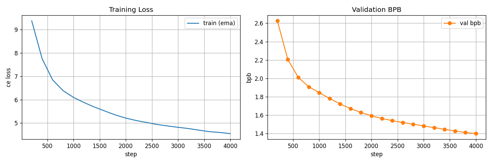

# exp_g_0051 — Escape 1: a deferred product-of-experts decompress

**Result: `final_val_bpb = 1.3997852` (best, same), 67,353,996 params,
0.553 h.**

| | val bpb @ 4k | params | decompress |
|---|---|---|---|
| exp_n_0121 (the anchor this forks from) | **1.345862** | 67,351,692 | linear |
| **exp_g_0051** | **1.399785** | 67,353,996 | exp, then linear |
| exp_n_0136 (raw FastMHL) | 1.369537 | 330,704,652 | none |

Against the linear decompress it replaces: **+0.053923**. That is ~36x the
cross-machine eval noise on this board (0.0015, from exp_g_0038 vs exp_n_0121), so it is a
real gap. It beats the raw no-projection fork by 0.0302 at 4.9x fewer
parameters — but the anchor beats it by more, so **reading the summed codes as a product
costs quality for no capacity gain.**

## The idea, and why it is cheap

`CompressionMultiHeadLUT.forward` ends with

```python
return self.decompress(torch.cat(parts, dim=-1))    # [N, H*inner_out] -> [N, output]
```

and `parts` are the per-head gather-**sums** — each head has already summed its
tph=128 gathered cell codes. So that call site runs **once per token** on a 192-dim vector.
Reading those sums as log-space and exponentiating there gives

    exp( sum_i log c_i ) = prod_i c_i

a product over the 128 cells a head gathered, for **192 exponentials per token instead of
4x128x48 = 24,576** — a 128x saving that only exists because the exp is applied *after* the
sum. A logsumexp *over* cells needs exp-per-cell *before* the sum and is deliberately not
implemented here; it would destroy exactly this property.

Measured: 0.500 s/step against the anchor's own code path at 0.515 s/step, +2,304
parameters (a per-dim scale and shift on 192 dims x 6 slots), +0.78% over the 73,728
MAC/token linear decompress. **The nonlinearity really is free. It just is not better.**

## It did not plateau-stall

That was the failure signature worth watching, and it did not happen. Over the last three
evals it improved 0.0468 against the anchor's 0.0354 — **1.32x the anchor**, i.e. improving
*faster* at the end. The gap against the raw fork closes monotonically all run, 0.1800 at
step 400 down to 0.0302 at 4,000. The anchor gap peaked at +0.0747 around
step 1,000 and narrowed thereafter.

| step | val bpb | vs exp_n_0121 | vs exp_n_0136 | pre-exp max | clipped |
|---|---|---|---|---|---|
| 800 | 1.9092 | +0.0632 | +0.1449 | +2.346 | 0.0000% |
| 1,600 | 1.6722 | +0.0670 | +0.1073 | +4.028 | 0.0000% |
| 2,400 | 1.5407 | +0.0581 | +0.0700 | +5.784 | 0.0000% |
| 3,200 | 1.4648 | +0.0720 | +0.0503 | +6.616 | 0.0000% |
| 4,000 | 1.3998 | +0.0539 | +0.0302 | +6.863 | 0.0413% |

## The clamp starts to bind, and that decides whether 16k is safe

The pre-exp argument grew steadily all run, +0.461 at step 200 to +6.863 at 4,000 against a
clamp of ±10, and the clipped fraction went from **exactly zero through step 3,400** to
0.0002% at 3,600, 0.0005% at 3,800 and **0.0413% at 4,000** — an 80x jump in the last 400
steps, with no sign of levelling off.

At 4k this is harmless. But this is a 4k slice of a 16k-anchored schedule, and on this
trajectory a full run would drive the argument through the clamp, at which point those
components receive **exactly zero gradient** and are silently lost. **Raise the clamp before
running this to 16k.** `poe_gate.csv` logs the range and the clipped fraction at every eval
so this is visible rather than assumed.

## Stability design

A learnable per-dim scale (init 1) and shift (init 0) so the model can shrink its own
argument rather than be clipped; a hard clamp with zero gradient outside so a runaway cannot
feed itself; and instrumentation instead of trust. At init the anchor zero-initialises
`decompress.weight`, so the run starts at the anchor's own output and departs smoothly.

## Placement

Two placements were built and smoked; `poe_placement='a'` is what ran.

* **'a'** `y = M @ exp(s*u + b)` — exp on the summed code, then the linear lift.
* **'b'** `y = expm1(M @ u)` — linear first, then exp on the 384-d output.

(b) is structurally handicapped: exp is strictly positive, so it could only ever *add* to
the residual stream. expm1 keeps it signed and centred but still bounded below by −1. In
(a) the exp output is positive but M carries signs, so y is unrestricted — hence (a).

## Caveat

4,000 steps on the FULL 16,000-step LR schedule — the schedule is anchored to 16,000 and
the run is simply cut, so it ends at **94% of peak LR** having traversed ~6% of the cosine.
Comparable to every other short run on this board and to the first 4k of any 16k run of the
same recipe. No full-anneal conclusion follows from it.


