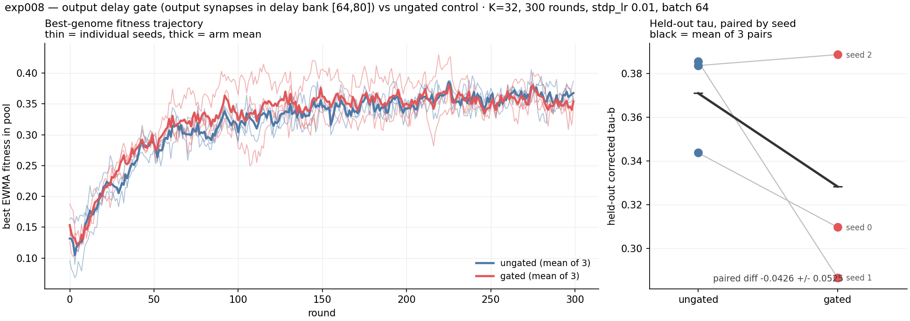

# exp008 — output delay gate

> ## RESULT: no benefit. The gate works exactly as designed and does not help selection.
> Paired over 3 seeds, held-out corrected tau-b is **−0.0426 ± 0.0525** for gated vs ungated
> — a difference smaller than its own spread, on n = 3. The honest read is **no significant
> difference, with no hint of an advantage and a weak hint of a cost.** The gate is
> mechanically sound and free to keep as an option; it is not a win.

## Hypothesis

The chapter's declared timing — `[0,32)` input, `[32,64)` computation, `[64,96)` readout — has
never been enforced; it is a propagation budget and nothing more. Output neurons are driven
straight through by the input volley and land their first spikes during the input phase, so
they rank each other on spikes emitted **before the network has computed anything**.

The literature's answer to this (LC-TTFS's per-layer permissible windows; Paugam-Moisy et al.'s
trained readout delays) is to make the phase physically real. **Hypothesis: routing every
output-TARGETING synapse through a high-delay bank `[64,80]`, so nothing can reach an output
before tick 64, gives evolution a readout that reflects the whole input and therefore a better
mapping.**

Not by inhibitory current: that was tried first and **diverges**. The engine integrates
`V += dt * ((0.04V + 5)V + 140 − U + I)`, whose intrinsic term turns positive below V = −82.6,
so a clamp strong enough to matter drives V past that root and the quadratic runs away upward —
the outputs then fire on *every* tick. Measured: −200 halved early firing, −250 inverted it,
−500 and beyond saturated at every cell on every tick. Raising `spike_threshold` fails too (V
overshoots to ~4×10³ normally and 3×10⁶ when diverging). A delay bank has nothing to diverge.

## Design

Two arms, **paired**, identical except the gate. `seed_genome` draws the base genome *before*
`apply_out_delay_gate` touches it, so at a given seed both arms start from the same topology
and the same weights and differ **only** in the delays of output-targeting synapses.

| | |
|---|---|
| arms | `ungated` (production) vs `gated` (`--out-delay-gate --out-delay-range 64 80`) |
| config | K = 32, 300 rounds, batch 64, `stdp_lr` 0.01, `d_max` 20 — matches exp001 |
| seeds | 0, 1, 2 (3 per arm, 6 runs) |
| metric | held-out corrected Kendall tau-b, 2000 never-trained samples |
| metas | 40 ungated / **57 gated** (the gate adds 17; raising `d_max` to 80 would have cost 160) |

## Result

| arm | seed | best member | final EWMA | **held-out tau** |
|---|---:|---:|---:|---:|
| ungated | 0 | 2 | +0.3563 | **+0.3438** |
| ungated | 1 | 11 | +0.3595 | **+0.3856** |
| ungated | 2 | 15 | +0.3868 | **+0.3837** |
| gated | 0 | 19 | +0.3577 | **+0.3098** |
| gated | 1 | 0 | +0.3428 | **+0.2867** |
| gated | 2 | 6 | +0.3617 | **+0.3887** |

| | ungated | gated |
|---|---:|---:|
| held-out tau, mean ± sd | **+0.3710 ± 0.0236** | **+0.3284 ± 0.0535** |
| range | [+0.3438, +0.3856] | [+0.2867, +0.3887] |
| final EWMA, mean | +0.3675 | +0.3541 |

**Paired difference (gated − ungated): −0.0426 ± 0.0525**, per seed −0.0340, −0.0989, +0.0050.
**Gated wins 1 of 3.**

## Reading it honestly

With n = 3 and a paired sd larger than the paired mean, **this does not establish that the gate
hurts.** What it does establish is that there is **no sign of the hypothesised benefit**: the
gated arm is behind on 2 of 3 seeds, behind on the mean, and behind on final EWMA. If gating
helped materially we would expect to see it at this effect size.

Two observations that are more interesting than the headline:

**The gated arm is much noisier — sd 0.0535 vs 0.0236, and its range spans 0.10 vs 0.04.** It
contains both the worst run (+0.2867) and the best single run of the whole experiment
(+0.3887). Whatever the gate does, it widens the outcome distribution.

**The gated arm generalises slightly worse relative to its own training fitness.** Ungated ends
at EWMA +0.3675 → held-out +0.3710 (no drop). Gated ends at EWMA +0.3541 → held-out +0.3284
(a 0.026 drop). `gated_seed0` is the sharpest case: highest EWMA of any run at round 150
(+0.406), yet only +0.3098 held out.

**The trajectories are nearly indistinguishable.** Both arms climb at the same rate, reach the
same plateau by round ~100, and wander in the same band thereafter. The gate does not slow
learning down, which is worth knowing — the concern that pushing all output activity into a
32-tick window would starve selection did not materialise.

## What the gate does mechanically (verified separately)

On held-out states, before any evolution: **zero output spikes before tick 64** (earliest 72,
vs tick 9 ungated), **no silent output cells**, distinct first-spike ticks per state unchanged
(4.71 vs 4.62 / 6). The `[64,80]` range rather than `[64,96]` is what avoids losing cells to
spikes landing past the end of the episode. The mutation clamp holds: after 20 rounds of
`mutate_structural` + `mutate`, output-targeting synapses grew 560 → 1500 and every delay
stayed in range.

**A side benefit that survives this result:** with the gate on, the full-96 readout and
`--readout-window 32` give *identical* scores, because all activity is already inside the
window. Ungated, that same window collapses the readout (tie rate 0.87) — which is exactly how
[exp007](../exp007_window_first_readout/) failed. The gate makes windowed readout redundant
rather than destructive.

## Run notes

- **Two of six runs died with `cudaErrorInvalidValue` at `spnet_runtime.cu:440`** — a buffer
  realloc inside `process_ticks(do_train=True)` — while six K=32 runs shared the GPU
  (~21.7 / 32.6 GB). Both were `ungated` (seeds 0 and 1), so the gate is not implicated. Both
  were **resumed from checkpoint with the rng state restored**, so the seed pairing is intact;
  seed 1 completed alone at ~5.5 s/round. **Six concurrent K=32 runs is over the edge on this
  box; three is the safe number.**
- Wall clock: ~75 min for the six-way batch, ~22 min for a single run alone.
- No build issues from the gate itself. 57 metas is nowhere near exp004's 96-meta trouble.

## Where the numbers live

`{arm}_seed{n}/run.log` (full log incl. the final held-out line), `{arm}_seed{n}/
steady_state_{arm}_s{n}.json` (300-round history), `ck.npz.hist.json` (checkpoint-side twin).
Checkpoints (`ck.npz`, ~11 MB each) and `snapshots/` are gitignored per chapter convention.
`plot_exp008.py` regenerates the figure from the logs and histories.
