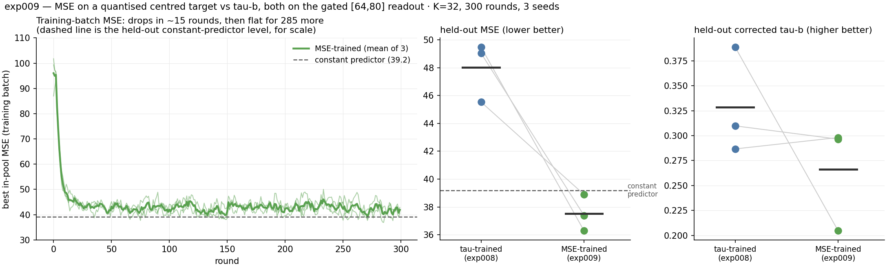

# exp009 — MSE on a quantised centred target

> ## RESULT: MSE training does what it says on its own metric, and it is at odds with tau.
> Held-out MSE **48.03 → 37.52** (tau-trained → MSE-trained), held-out tau **+0.3284 →
> +0.2664**. But **37.52 barely beats the constant-predictor baseline of 39.19** — a 4 %
> improvement. The diagnostic below says why, and it is the useful part of this experiment:
> **both objectives extract the same amount of signal (mean |r| ≈ 0.32 either way); MSE
> training only fixes its SIGN.**



## Hypothesis

MSE on a quantised target is a more direct training signal than a rank correlation for a
first-spike readout: tau-b only says "put these six in the right order", MSE says "put this one
at tick 17". With the [exp008](../exp008_output-delay-gate/) gate on, output offsets live on
exactly the same 0..31 scale as a 32-level quantised target, so the two are directly comparable
and MSE is well-posed.

## The target — exact formula

Per output dimension *d*, with **mu_d and sigma_d fitted on the TRAINING POOL ONLY** and then
frozen (fitting them on the held-out set would leak it into the target the net is selected
against):

```
z = clip((y_d - mu_d) / sigma_d, -C, +C)        C = 2.5 (--target-clip-sigma)
u = (z + C) / (2C)                              -> [0, 1]
target_d = round((1 - u) * 31)                  -> 0 .. 31
```

**Centred and scaled, not min-maxed** — per-dimension mean subtracted, per-dimension sigma
divided, clipped at ±2.5 sigma, then quantised to 32 levels.

`1 - u` **on purpose**: the chapter's convention everywhere is EARLIER SPIKE = LARGER VALUE
(`fitness()` ranks on `-first`; `LatencyEncoder` maps large inputs to early ticks). So the
largest action in a dimension targets offset 0 and the smallest targets 31, and input and
output share one latency convention.

Measured on the pool: target offsets have mean 15.47, sd 6.12, and **all 32 levels are used**.
Per-dimension means are all ≈15.5 by construction (each dimension is z-scored before
quantising), so a per-dimension constant predictor and a global constant predictor coincide.

**Readout:** gate on, `--readout-window 32`. Each output's first spike inside [64,96) re-based
to 0..31. **A silent output reads 32** — one step later than the latest real target, so silence
costs strictly more than being maximally late. Under tau-b every silent output instead ties and
is discarded, which is one of the things MSE fixes.

**Fitness = −MSE** over the 6 dimensions and the batch, so selection still maximises. No null
correction: MSE has an absolute zero, unlike tau-b whose chance level depends on the model's own
ordering statistics.

## Config

Identical to exp008's gated arm except the objective: K = 32, 300 rounds, batch 64,
`stdp_lr` 0.01, `d_max` 20, gate `[64,80]`, `--readout-window 32`, seeds 0/1/2, 57 metas.
Comparison arm is **exp008's gated runs**, which are the same configuration trained on tau.

## Result

| seed | held-out MSE | held-out tau | constant baseline |
|---:|---:|---:|---:|
| 0 | **37.387** | +0.2965 | 39.537 |
| 1 | **36.286** | +0.2981 | 38.969 |
| 2 | **38.892** | +0.2047 | 39.049 |
| **mean** | **37.522 ± 1.334** | **+0.2664 ± 0.0535** | 39.185 |

Against exp008's tau-trained gated nets, scored on **both** metrics at their own seeds:

| | held-out MSE | held-out tau |
|---|---:|---:|
| tau-trained (exp008) | 48.026 ± 2.161 | **+0.3284 ± 0.0535** |
| MSE-trained (exp009) | **37.522 ± 1.334** | +0.2664 ± 0.0535 |
| constant predictor | 39.185 | 0 |

**Each objective wins on its own metric and loses on the other.** MSE training buys −10.5 MSE
and costs −0.062 tau. They are at odds.

## Why — the part worth keeping

`score()`'s tau-b is **within-state, across the six dimensions**: "did the net rank *this*
state's six action dims correctly". Pearson r per dimension is **across states**: "does output
*d*'s timing track dim *d*'s value". **These are different quantities, and MSE needs both.**
tau-b never asked for the second.

Per-dimension across-state correlation of the best evolved net:

| | per-dimension r | mean r | mean \|r\| |
|---|---|---:|---:|
| tau-trained | `+0.34 +0.07 +0.56 −0.59 −0.10 −0.33` | **+0.010** | 0.332 |
| MSE-trained | `+0.36 +0.31 +0.62 −0.11 +0.30 −0.22` | **+0.187** | 0.320 |

**The magnitude of the signal is identical — |r| ≈ 0.32 in both arms. What differs is the
sign.** tau-b is sign-blind per dimension: it constrains only the within-state ordering, so a
tau-trained net happily ends up with three of six dimensions **anti-correlated** with their own
target and still scores tau +0.33. MSE training flips most of those signs, and that alone
accounts for the whole 48.0 → 37.5 improvement.

Two more numbers that say the same thing:
- **Optimally rescaled MSE is ~29 for BOTH arms** (per-dimension least-squares `a·pred + b`).
  Given a free affine correction the two objectives are indistinguishable — more evidence the
  information content is the same and only its orientation differs.
- **Prediction spread shrinks under MSE**: pred sd 2.88 (MSE-trained) vs 3.35 (tau-trained) vs
  target sd 6.11, and the regression slope is +0.24 rather than 1.0. That is the classic MSE
  hedge — when uncertain, predict near the mean. It is also why MSE only just beats the
  constant predictor: the net is *partly being* the constant predictor.

## Did MSE training help?

**On MSE, yes and clearly: 48.03 → 37.52, and it beats the constant baseline on all three
seeds.** But the margin over "predict 15.5 for everything" is 1.66 (4 %), so in absolute terms
these nets still barely regress the action values.

**On tau, no: +0.3284 → +0.2664.** With n = 3 and sd 0.0535 that is not individually
significant, but it points the same way on 2 of 3 seeds and is consistent with the mechanism
above.

**The honest summary: MSE is the better-posed objective — it is sign-aware, it penalises
silence, and it has an absolute zero — but on this substrate it does not unlock more
information, it just orients the information tau was already finding.**

## Runtime

3 concurrent K=32 runs (three, per exp008's lesson), ~21 GB of 32.6 GB, **~40 min wall clock**,
~8 s/round. **No crashes** — the six-way concurrency that broke two exp008 runs was the cause,
and three is comfortable. All three exited 0. 57 metas, no build issues.

## What I would try next

The prediction-spread number is the actionable one. The net's offsets span sd 2.9 against a
target sd of 6.1, so it is using under half the available window. Before changing the objective
again, it may be worth asking why the readout will not spread out — the `--drive-gene`
(exp006) and tie-penalty (exp005) levers both aimed at this and neither was run to a conclusion
on the gated readout.

## Files

`mse_seed{n}/run.log` (incl. the final held-out MSE and tau lines), `mse_seed{n}/
steady_state_mse_s{n}.json` (300-round history), `summary.json`, `diagnostics.txt` (the
per-dimension correlation decomposition), `plot_exp009.py`. Checkpoints gitignored.
