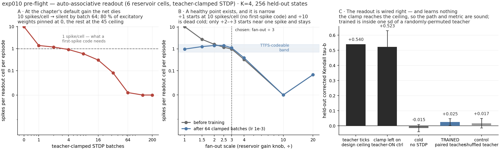

# exp010 — auto-associative readout (PRE-FLIGHT ONLY, no full run)

> ## VERDICT: NO-GO on the 300-round run as specified. Three separate blockers, all measured.
> The design is implemented and the plumbing is provably correct — a **teacher-ON control
> reaches +0.523 against a +0.540 design ceiling**, so the readout path, the encoding and the
> metric are all wired the way we think. What does not work is the learning: at the chapter's
> default gain **teacher-clamped STDP kills the network within 64 batches**, and at the one
> healthy operating point **400 clamped batches leave the held-out tau indistinguishable from
> a randomly-permuted teacher** (+0.025 vs +0.017, member-to-member sd 0.03).

## What was built

Everything is opt-in; with the flags off every prior run reproduces byte for byte.

`steady_state.py --assoc`
* **No dedicated output neurons.** The readout is excitatory reservoir cells **794..799** —
  the last 6 of 800. They are *not* segregated: they keep their ordinary ~105 incoming
  recurrent synapses (about 2 of them straight from the input layer) and send ~95 back into
  the pool. Measured per net at the default fan-outs: 631 in, 571 out over 4 nets.
* `seed_genome` drops the exc→output block entirely, and **both** mutation paths
  (`mutate_structural`, `mutate`) drop `OUTP` from their target-population draw and
  renormalise onto EXC/INH — otherwise a mutation would keep inventing synapses onto the now
  inert output pool. `build_pool` asserts no genome targets `OUTP`.
* The dedicated output pool still *exists* in the `SpikingNet` (meta 3), so ids, indices and
  every build path stay identical. In assoc mode those 6 neurons per net are simply inert.

`harness.run_episode(..., teacher_ticks=, teacher_current=)`
* `H["readout_ids"]` redirects the spike export from `ids[3]` to any set of P·6 global ids.
* `teacher_ticks` [B, 6] injects `teacher_current` into each readout cell at its own tick, on
  top of the input volley, and widens `n_input_ticks` from 32 to 96 so a teacher tick may sit
  anywhere in the episode. `teacher_ticks=None` is the previous behaviour exactly.

**Teacher target** = exp009's transform verbatim (per-dimension z-score on **training-pool**
statistics, clipped at ±2.5σ, quantised to 32 levels, `1 - u` so the largest action fires
earliest), then shifted by `--teacher-offset`.

**Training** (`--assoc-train-batches`, default 4/round over the whole pool): input volley +
teacher clamp, `do_train=True`. The stock loop gives STDP only to newborns, which cannot write
an association into every member. **Evaluation**: clamp off, plain TTFS, corrected tau-b.

## Implementation choices you should overrule if you disagree

1. **`--teacher-offset`, default 64.** The brief says "the SAME latency encoding scheme we use
   for inputs", which literally means ticks 0..31. But STDP is causal — with offset 0 the
   clamp fires the readout cells *during* the input volley, before the reservoir has
   propagated anything, so there is nothing presynaptic to associate with. I made the offset a
   knob and measured 0, 24, 32 and 64. **32 is the best of them** and 64 is the worst; see the
   table below.
2. **Whole-pool training pass.** Added rather than reusing newborn maturation, for the reason
   above. 4 batches/round by default.
3. **No MSE line in assoc mode.** The teacher is a spike *time* on a 32-level scale offset into
   the episode; the readout is a raw tick in [0,96). An MSE between them is a number about
   nothing. tau reads only the order and stays valid.

## The three blockers

### 1. The readout cells are not first-spike coders — they fire ~10× per episode

At the chapter's default gain each readout cell emits **10.4 spikes per 96-tick episode**, and
**100 %** of them are already spiking before their teacher tick arrives. A clamp can add a
spike; it cannot remove the earlier ones. So the teacher never controls the first spike, and
"time to first spike" is sampling an ongoing train rather than reading a code.

### 2. Teacher-clamped STDP destroys the network

At the default gain and `--stdp-lr 0.01`, spikes per readout cell go
**10.0 → 1.4 (1 batch) → 0.6 (8) → 0.1 (32) → 0.0 (64)** and never recover. Afterwards **80 %
of excitatory weights sit below 0.1 (median exactly 0)** and the survivors are pinned at the
45 ceiling — textbook unbalanced-STDP runaway. `weight_scaling_cf` is 0 on these metas, so
nothing pulls the depressed weights back up.

There is a clean squeeze on the learning rate, at fan-out ÷3, teacher offset 32, 400 batches.
All tau below is the **windowed** readout [32,96) — the one that can actually see the answer;
member-to-member sd is ~0.03 throughout, so every gain in the last column is noise:

| `--stdp-lr` | frac of exc weights < 0.1 | trained tau | shuffled-teacher tau | association gain |
|---:|---:|---:|---:|---:|
| 1e-4 | 0.0001 (nothing moved) | −0.023 | −0.023 | +0.000 |
| 3e-4 | 0.009 | −0.005 | −0.003 | −0.002 |
| **1e-3** | **0.78** | **+0.025** | **+0.017** | **+0.008** |
| 3e-3 | 0.89 | +0.038 | +0.051 | −0.013 |
| 1e-2 | 0.92 | +0.035 | +0.034 | +0.002 |

**No rate both moves the weights and leaves a network standing.** Below 3e-4 nothing happens;
at 1e-3 and above the weights bimodalise to {0, ceiling}.

### 3. Whatever STDP does, it does the same with a shuffled teacher

The decisive control: retrain a fresh copy with teacher ticks drawn from a **permuted** batch of
actions, so the input→target pairing is destroyed while the clamp's rate, tick distribution and
STDP load are all preserved. **Paired and shuffled are within one member-to-member sd at every
setting tried** — the largest gap is +0.008 windowed (+0.016 on plain TTFS) at lr 1e-3, against
a sd of 0.03. The teacher's *identity* is not reaching the weights.

## What DOES check out

* **The design ceiling is +0.540**, not +1.0. The teacher ticks themselves, scored against the
  LUT actions with the chapter's corrected tau-b, give **raw +0.639, null +0.099, corrected
  +0.540** with 5.23 distinct ticks per state out of 6. The reason is worth fixing: exp009's
  transform **z-scores each dimension separately**, so its within-state *order* is not the raw
  action vector's within-state order. A perfect student of this teacher cannot exceed +0.54.
* **The teacher-ON control reaches +0.523** (offset 32) and **+0.518** (offset 24) — i.e. right
  at that ceiling. The readout ids, the net-major column striding, the encoder and the metric
  are all correct.
* **A healthy operating point exists**: fan-out ÷2 to ÷3 gives ~1 spike/cell before *and* after
  training, 5.6 distinct ticks out of 6, ~0 silent, no collapse over 400 batches at lr ≤ 3e-4.

## The specified metric cannot see a correct answer

Under plain TTFS over [0,96) — the specified metric — the teacher-ON control scores **−0.030**
at offset 32 and **−0.027** at offset 64. A student that reproduced the teacher *exactly* would
score zero, because the readout cells' first spike lands in the input phase long before the
teacher window. Restricting the read to [offset, 96) is what turns −0.03 into +0.52.

| teacher offset | teacher-ON, plain TTFS [0,96) | teacher-ON, windowed [offset,96) |
|---:|---:|---:|
| 0 | **+0.383** | (same window) |
| 24 | −0.030 | **+0.518** |
| 32 | −0.030 | **+0.523** |
| 64 | −0.027 | +0.065 (reservoir activity is over by tick ~72) |

Offset 0 is the only one where plain TTFS works, and only because the clamp then *is* the first
spike. Note also that reservoir activity spans ticks ~16–72 and is gone by 72, so the declared
readout phase [64,96) is mostly past the end of the burst — 64 is the worst available offset.

## Go/no-go

**No-go on 300 rounds as specified.** Nothing in the recipe would produce a signal to select on:
at default gain the pool dies in the first round's training pass, and at a healthy gain the
association gain is zero. Three things would have to change first, in this order:

1. **Run at fan-out ÷2–÷3** (or another gain knob) so the readout is a first-spike code at all.
2. **Window the readout to the teacher's own phase**, and set the teacher offset to 24–32, not
   64. Without this the metric is blind to a perfect answer.
3. **Find an STDP rule that can write without destroying** — the current one has no
   homeostasis. Options: non-zero `weight_scaling_cf`, a much shorter clamped burst against a
   frozen reservoir, or clamping *only* the readout cells' afferents as plastic and freezing
   the rest of the reservoir.

Item 3 is the open research question; 1 and 2 are bookkeeping. It is also worth deciding
whether the teacher should encode the **z-scored** order (ceiling +0.54, what is implemented)
or the **raw within-state** order (ceiling +1.0) — the second is a one-line change and makes
the whole scale interpretable.

## Files

`../src/steady_state.py` (`--assoc`, `--teacher-offset`, `--teacher-current`,
`--teacher-levels`, `--assoc-train-batches`), `../src/harness.py` (`readout_ids`,
`teacher_ticks`), `../src/assoc_sanity.py` (the four checks + the three controls),
`../src/assoc_probe.py` (the gain × rate sweep), `sanity/*.json` (every number above),
`plot_exp010.py`.

Reproduce the headline: `sbox python assoc_sanity.py --pool 4 --n-val 256 --train-batches 400
--fanout-scale 3.0 --stdp-lr 0.001 --teacher-offset 32`
