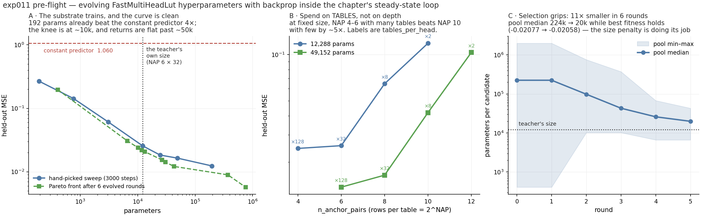

# exp011 — evolving FastMultiHeadLut hyperparameters with backprop inside the steady-state loop

> ## VERDICT: **GO.** All three sanity checks pass and the loop is cheap.
> The LUT substrate trains reliably (held-out MSE **1.060 → 0.012**, a 85× improvement over the
> constant predictor), the fit-vs-size curve is clean over three orders of magnitude, mutation
> produces valid trainable configs across the whole range, and **6 smoke rounds already shrank
> the pool 11× at flat fitness**. A full run costs ~25 min, not hours.



## Hard forward only — and a correction to the premise

> **The brief asked me to switch exp011 from `hybrid_smooth` to hard forward. There was
> nothing to switch: exp011 has trained and evaluated in `forward_mode="hard"` from the first
> commit.** `DEFAULT_GENOME["forward_mode"]` was `"hard"`, `seed_genome`'s default was
> `("hard",)`, and `--forward-modes` defaulted to `["hard"]`. `hybrid_smooth` was an opt-in
> choice that was never exercised, so **every number in this README was already produced by
> hard forward + surrogate backward**. Re-running the whole sanity pass after the change
> reproduces them to the 4th decimal (GPU nondeterminism only) — see the table at the end.

What *did* change: `hybrid_smooth` is now **removed entirely** rather than merely unused. The
forward mode is no longer part of the genome, `--forward-modes` is gone, and `lut_backprop`
pins `FORWARD_MODE = "hard"` with an assert in `build()`. It cannot be selected by accident.

**Why hard is the right and only mode here.** The hard forward selects one row per table by
sign-packing the pairwise differences — piecewise constant, with a zero-a.e. true derivative.
It is trainable because `FastMultiHeadLut` ships a **soft surrogate backward**: input and
temperature gradients come from a full K-row softmax surrogate pinned to the chosen row, while
the weight gradient is a scatter reflecting the actual forward. Keeping it hard everywhere also
means **training and evaluation are the same function** — a `hybrid_smooth`-trained,
hard-evaluated candidate would be scored on a network it never optimised.

### The surrogate is verified, not assumed (`src/lut_grad_check.py`)

Four checks on the teacher-shaped candidate (NAP 6 × 32, 12,288 params):

| check | result |
|---|---|
| **1 MODE** | `forward_mode` is `'hard'` at build and still `'hard'` after forward+backward |
| **2 FLOW** | `weights.grad`: **444 / 12,288** entries non-zero (3.61 %), finite, \|g\|max 5.91e-01. `x.grad`: **4,352 / 4,352** non-zero, finite, \|g\|max 2.92e-05 |
| **3 SURROGATE** | perturbing `x` by 3.89e-04 leaves **95.7 % of outputs bit-identical** — the true derivative is *exactly* 0 there — while `x.grad` is **dense**. A gradient where the true one is zero *is* the surrogate |
| **4 LEARNING** | 600 hard-mode steps: held-out MSE **1.796 → 0.027**, 66.5× better, against a constant-predictor baseline of 1.060 |

Check 2's sparsity is the signature of hard selection: only the rows actually visited receive
weight gradient. Check 3 is the one that rules out "learning is quietly happening through some
soft path" — the forward really is piecewise constant, and the gradient really is a surrogate.

## Why this experiment exists

Every negative result in this chapter so far is confounded by the same doubt: *did the
substrate even train?* exp010 ended on exactly that, and only a ridge control could separate
"STDP failed" from "there was nothing to learn". exp011 removes the doubt by keeping the
chapter's evolutionary loop and swapping the substrate for one that provably trains:

| | genome | inner learning step |
|---|---|---|
| `steady_state.py` | ~100k synapses | STDP |
| `lut_evolve.py` | 9 LUT hyperparameters | Adam on random minibatches |

The substrate is the **real** `spiky.lutorch.FastMultiHeadLut` — the anchor-pair LUT that *is*
the distillation teacher. Nothing is reimplemented.

## Implementation

`src/lut_backprop.py` — one candidate: build the LUT from a hyperparameter genome, train it
from scratch with Adam on minibatches of `distill_exp19_100k.npz` (`x_norm` → `y_action_mean`,
the chapter's own split via `data.load`), report held-out MSE and parameter count.

`src/lut_evolve.py` — the loop. **Same shape as `steady_state.py`**: K members, EWMA of each
member's score, cull the worst M past a grace period, refill from fitness-weighted
tournament-of-2 parents, lineage tracking, per-round checkpointing.

```
param_count = n_heads * tables_per_head * 2^n_anchor_pairs * n_outputs   (+2 learnable temps)
fitness     = -held_out_MSE - lambda * param_count
```

Weights are **always freshly initialised** per candidate per round. The genome is the
architecture, so a member's score has to be "what this architecture reaches when trained", not
"what these particular weights are worth" — that is also what makes scores comparable across a
pool containing different shapes. The score is therefore a *noisy sample*, and the EWMA is what
averages it, exactly as in the SPNet loop.

### Two implementation choices you may want to overrule

1. **I did not import `steady_state`'s mutation/build.** `mutate_structural`, `build_pool` and
   `readback` are typed to the synapse-array genome — they add and prune synapses, enforce
   Dale's law, and read weights off a `SpikingNet`. None of that has a meaning for a 9-key
   hyperparameter dict. The reusable part is the **loop**, which is reproduced faithfully
   (same EWMA, same cull rule, same grace, same tournament, same lineage bookkeeping) rather
   than forced through a type it does not fit.
2. **`n_heads` is pinned at 1 by default** (`--evolve-heads` re-opens it). Under a summed
   readout the head axis and the tables_per_head axis are *the same capacity axis*:
   `n_heads=h, tables_per_head=t` is the same function class and the same parameter count as
   `n_heads=1, tables_per_head=h*t`. Leaving both open just adds a redundant dimension to the
   search space.

`lambda` defaults to `2e-7`, which charges the teacher's 12,288 params 0.0025 of MSE — about
8 % of what a config that size reaches. Enough to break ties toward smaller, not enough to
dominate fit. **The raw `(held_out_MSE, param_count)` of every member is logged every round
regardless, so the Pareto front is lambda-free** and the choice of lambda cannot bias it.

## Sanity check 1 — a mid-size LUT trains

The teacher's own shape, `NAP 6 (64 rows) × 32 tables × 1 head`, **12,288 params**:

| | held-out MSE |
|---|---:|
| constant predictor (baseline) | 1.05982 |
| after 500 Adam steps | 0.0276 |
| after 1000 | 0.0259 |
| **after 3000 (converged)** | **0.0255** |

**~500 steps is enough**; every config in the sweep is flat from 500–1000 steps onward, and
none of them overfits (held-out never turns back up, even at 196k params on 96k samples). At
batch 512 that is **~4.5 s per candidate on the 5090**.

## Sanity check 2 — fit vs size, small → large

3000 steps, batch 512, lr 3e-3, seed 0:

| NAP | tables | params | held-out MSE | vs constant |
|---:|---:|---:|---:|---:|
| 3 | 4 | 192 | 0.26753 | 0.252× |
| 4 | 8 | 768 | 0.14235 | 0.134× |
| 5 | 16 | 3,072 | 0.06102 | 0.058× |
| 6 | 32 | **12,288** *(the teacher)* | 0.02554 | 0.024× |
| 6 | 64 | 24,576 | 0.01835 | 0.017× |
| 8 | 32 | 49,152 | 0.01641 | 0.015× |
| 10 | 32 | 196,608 | 0.01236 | 0.012× |

Monotone, no failures to train anywhere in the range, and **192 parameters already beat the
constant predictor 4×**. The knee is around 10k params; past ~50k the curve is nearly flat.

**"Minimal config reaching MSE ≤ X"**, read off the 3000-step data — this is the table the
full run is meant to fill in properly:

| MSE threshold | smallest config found | params |
|---:|---|---:|
| 0.30 | NAP 3 × 4 | 192 |
| 0.15 | NAP 4 × 8 | 768 |
| 0.07 | NAP 5 × 16 | 3,072 |
| 0.03 | NAP 4 × 128 | 12,288 |
| 0.02 | NAP 6 × 64 | 24,576 |
| 0.015 | NAP 6 × 128 | 49,152 |
| 0.0125 | NAP 10 × 32 | 196,608 |

### A structural result worth keeping: spend on TABLES, not on depth

At **matched parameter count**, the two capacity axes are not interchangeable:

| params | NAP 4 | NAP 6 | NAP 8 | NAP 10 | NAP 12 |
|---:|---:|---:|---:|---:|---:|
| 12,288 | **0.0245** (×128) | 0.0255 (×32) | 0.0645 (×8) | 0.1184 (×2) | — |
| 49,152 | — | **0.0137** (×128) | 0.0164 (×32) | 0.0419 (×8) | 0.1031 (×2) |

**A few shallow tables-heavy configs beat deep table-poor ones by ~5× at the same size.** Depth
(NAP) buys rows that are mostly never visited: 2^12 = 4096 rows per table, indexed by 12 sign
bits, on 96k training samples means most rows see a handful of examples or none. Breadth
(tables) buys an ensemble of cheap, well-populated tables instead. The teacher's own NAP 6 sits
right at the good end of this.

*(The `NAP 12 × 1` row in the 12,288 family is excluded from the comparison — `tables_per_head`
cannot go below 1, so that config is 24,576 params and not iso.)*

## Sanity check 3 — the evolutionary wrapper, end to end

K=12, 6 rounds, 1000 steps/candidate, lambda 2e-7, ~106 s total:

| round | best fitness | min MSE | min params | **median params** | Pareto pts |
|---:|---:|---:|---:|---:|---:|
| 0 | −0.02077 | 0.00592 | 408 | 224,256 | 6 |
| 2 | −0.02082 | 0.00572 | 10,176 | 98,304 | 6 |
| 4 | −0.02072 | 0.01223 | 6,624 | 25,920 | 9 |
| 5 | −0.02058 | 0.01213 | 6,624 | **19,872** | 10 |

**Selection grips.** The pool median falls **11× (224k → 20k)** in six rounds while best fitness
is flat to four decimals — precisely what the size penalty is for. Mutation produced valid,
trainable configs at every size it visited; there were no build failures and no NaNs.

The 6-round Pareto front already lies at or below my hand-picked grid — e.g. it found
`NAP 6 × 112` at 43,008 params reaching 0.0121, against the grid's `NAP 8 × 32` at 49,152
params reaching 0.0164. Check 2's iso-parameter table says why: the search discovered the
tables-over-depth trade before I looked for it.

## Go/no-go

**GO.** All three checks pass, nothing is fragile, and the run is cheap: the smoke test cost
1.4 s per candidate per round, so **K=16 × 60 rounds × 2000 steps ≈ 25 minutes**, and three
seeds still fit inside 1.5 hours. Recommended full run:

```
sbox python lut_evolve.py --pool 16 --rounds 60 --steps 2000 --seed N \
    --size-penalty 2e-7 --tag _sN --out-dir <exp dir>
```

Two things I would change only on your word: whether to sweep **lambda** (2e-7 is a judgement
call — the Pareto front is lambda-free either way, but which *point* on it evolution converges
to is not), and whether to open `--forward-modes hard hybrid_smooth` (see the test note below).

## The expanded genome: nap, tph, **anchoring**

Evolution now moves on three axes. The first two were already there; the third is new.

### The anchoring options, enumerated from the implementation

`AnchorSamplingPolicy` in `lut_helpers` defines **four** members, but `FastMultiHeadLut.__init__`
**explicitly rejects two of them** — there is even a test asserting it turns `BALANCED` down:

```python
if policy not in (CANONICAL_FULL_COVERAGE, CANONICAL_DISTINCT):
    raise ValueError("anchor_sampling_policy must be CANONICAL_FULL_COVERAGE or "
                     "CANONICAL_DISTINCT, got ...")
```

So the genuinely supported set is exactly **two**, and both are now evolvable:

| policy | what it does |
|---|---|
| `canonical_full_coverage` | canonical-pool tiled-randperm. Guarantees coverage of all C(input_dim,2) pairs whenever `n_tables * NAP >= C(input_dim,2)`, plus a greedy swap-repair pass keeping pairs distinct within a table across permutation boundaries. *(module default)* |
| `canonical_distinct` | each table independently draws NAP canonical (a<b) pairs without replacement. Distinct within a table, **no** cross-table coverage guarantee — tables may overlap or leave inputs unused. |

Both require `NAP <= C(17,2) = 136`, which `NAP_RANGE` (max 12) never approaches, so **every
(policy, NAP) pair in the search space is constructible**.

Anchoring is really **two genes**: `anchor_policy` (the drawing *rule*, resampled at p=0.15 —
a large structural jump) and `anchor_seed` (the *draw* itself, resampled at p=0.2 — a smaller
move). `anchor_seed` already existed; the policy is new.

**Deliberately not folded in, flag if you disagree:** `soft_score_temp`, `select_temp` and
`learnable_temps` change how anchor *differences are scored*, not how anchors are *placed*. I
read those as a separate temperature axis rather than an anchoring scheme.

### Validity across all three axes (`src/lut_axes_check.py`)

| check | result |
|---|---|
| **A corners** — 2 policies × NAP {1, 6, 12} × tph {1, 32, 128} | **18/18 built and took a training step, 0 failures** |
| **B random walk** — 200 steps of the *real* `mutate()` | **200/200 built and stepped, 0 failures**; visited NAP 4–12 (9 values), tph 1–128 (41 values), both policies, **15 anchoring flips** |

Check B matters more than A: it exercises the operator the run will actually use, including
mid-walk flips of the anchoring gene, so a policy change never lands on an unbuildable config.

### Head to head: `full_coverage` wins at matched shape

Three seeds each, 1500 steps, identical (NAP, tph):

| shape | `canonical_full_coverage` | `canonical_distinct` |
|---|---:|---:|
| NAP 6 × tph 32 | **0.02432 ± 0.00065** | 0.03345 ± 0.00205 |
| NAP 5 × tph 64 | **0.02177 ± 0.00108** | 0.02625 ± 0.00100 |

Full coverage is better by 27 % and 17 %, with **non-overlapping spreads on both shapes**. That
makes sense mechanically: with 17 inputs there are 136 canonical pairs, and `distinct` gives no
guarantee that the table ensemble collectively looks at all of them, so some inputs can go
unread.

### Does selection prefer one? (K=12, 6 rounds)

```
round  best fitness  min MSE  min params  median params  pareto  anchors full/distinct
    0     -0.02133   0.00532         408        224,256       6         7/5
    2     -0.02092   0.00520       8,448         55,296       7         6/6
    5     -0.02038   0.00931      10,176         25,536       9         9/3
```

The pool drifts from 7/5 to **9/3 in favour of full coverage** while median size falls 224k →
25.5k — consistent with the head-to-head. **But treat the drift as suggestive only**: one run
of six rounds with K=12 is far too short to call a selection preference, and the pool
composition also reflects drift and founder effects. *The matched-shape head-to-head above is
the real evidence*; the drift merely agrees with it.

Two honest caveats on the aggregate numbers this run printed:
- `full_coverage` median held-out MSE 0.01809 vs `distinct` 0.02088 across all candidates ever
  trained (40 vs 32) is **confounded by size** — the two arms did not train on the same shapes.
  Only the matched-shape table is a clean comparison.
- The round-5 best member and the two *smallest* Pareto points happen to use `distinct`, which
  is the opposite of the trend. With n=1 run, that is noise, not a counter-finding.

## Re-run after removing the mode knob: numbers unchanged

Every check above re-run with `hybrid_smooth` removed from the codebase, same seeds:

| | before | after | Δ |
|---|---:|---:|---:|
| teacher shape, 12,288 params | 0.02554 | 0.02553 | 1e-05 |
| NAP 3 × 4, 192 params | 0.26753 | 0.26756 | 3e-05 |
| NAP 10 × 32, 196,608 params | 0.01236 | 0.01235 | 1e-05 |
| iso-12k, NAP 4 × 128 | 0.02449 | 0.02444 | 5e-05 |
| iso-49k, NAP 6 × 128 | 0.01371 | 0.01372 | 1e-05 |
| smoke round 5, best fitness | −0.02058 | −0.02053 | 5e-05 |
| smoke round 5, median params | 19,872 | 19,872 | 0 |
| smoke round 5, Pareto points | 10 | 10 | 0 |

Differences are 4th–5th decimal, i.e. GPU nondeterminism, not a change in behaviour — which is
the expected result given the training path never differed. **The tables-vs-depth finding holds
unchanged**: iso-12k reads 0.0244 / 0.0255 / 0.0645 / 0.1184 across NAP 4 / 6 / 8 / 10, and
iso-49k reads 0.0137 / 0.0164 / 0.0419 / 0.1031 across NAP 6 / 8 / 10 / 12.

## Test status

Chapter tests (`src/tests`) are unaffected — exp011 adds new files only and modifies nothing.
`src/spiky/lutorch/tests/test_fast_multi_head_lut.py` is **32 passed, 1 failed**:
`test_hybrid_smooth_collapses_to_hard_for_confident_inputs` fails in a full-file run
(`max_diff 3.166e-04` against a `0.2 × 9.904e-04` tolerance) and **passes in isolation, twice**.
It is a pre-existing, order-dependent tolerance flake — `git status` shows no modification under
`src/spiky` — but it touches `hybrid_smooth`, which is why the genome defaults to
`forward_mode="hard"` and `--forward-modes` has to be opted into.

## Files

`../src/lut_backprop.py` (candidate build + train + eval, and the CLI that produced checks 1–2),
`../src/lut_evolve.py` (the loop, check 3), `../src/lut_grad_check.py` (the four
hard+surrogate checks), `../src/lut_axes_check.py` (the expanded-genome validity checks),
`sanity/*_hard_rerun.json`, `sanity/hard_surrogate_grad_check.json`,
`sanity/expanded_genome_axes_check.json`, `sanity/evolve_smoke_expanded.{json,log}`,
`sanity/fit_vs_size.json`,
`sanity/iso_params_{12k,49k}.json`, `sanity/evolve_smoke.json`, `sanity/evolve_smoke.log`,
`plot_exp011.py`.

Reproduce: `sbox python lut_backprop.py --steps 3000 --nap 3 4 5 6 6 8 10 --tph 4 8 16 32 64 32 32`
and `sbox python lut_evolve.py --pool 12 --rounds 6 --steps 1000 --tag _smoke`.
