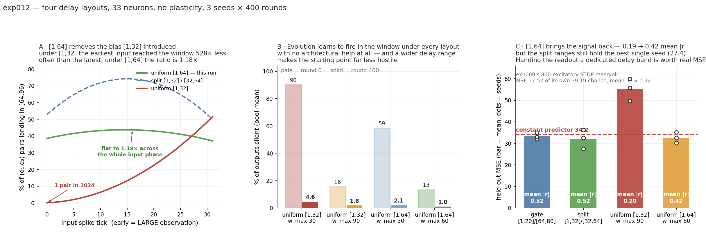

# exp012 — a 33-neuron net where every synapse is a gene, and nothing learns

> ## PRE-FLIGHT ONLY. No full run launched, nothing committed.
> Four delay layouts have now been measured. **The delay layout, not the learning rule, is
> what decides whether this works.** A 33-neuron net with *no plasticity at all* beats
> exp009's 1000-neuron STDP reservoir — but only when the delay range lets every input tick
> reach the readout window about equally often. When it does not, the failure is exact
> arithmetic, not a tuning problem.



## What is different from every earlier experiment in this chapter

exp001–exp011 all evolved a *scaffold* — which input wires where, with what delay — and left
STDP to settle the weights inside an 800 + 200 reservoir. Here there is no reservoir, no
settling step and no plasticity anywhere:

```
17 input  ->  8 excitatory + 2 inhibitory hidden  ->  6 output        33 neurons
```

`learning_rate=0` on every `SynapseMeta`, `do_train=False` on every episode. **The weights
the genome ships are the weights that run.** Topology, per-synapse delay and per-synapse
weight all mutate directly.

### The genome is the whole adjacency matrix

27 possible sources (17 in + 8 exc + 2 inh) × 16 possible targets (8 exc + 2 inh + 6 out) =
432 cells, of which **330 are legal**: outputs are sinks, inputs project only to hidden units
(no one-hop shortcut), self-loops on hidden units allowed. Three `[27, 16]` arrays — mask,
delay, weight — so "evolve the topology" is a bitmask mutation.

### Dale's law and edge legality are structural, not policed

A synapse's sign is a property of its **source row** and is never itself a gene; rows 0–24
clip to `[0, +ceiling]`, rows 25–26 to `[-ceiling, 0]`. Mutation only ever switches on cells
that are already legal. Neither invariant can be violated by any genome that can be
constructed — **0 violations of either over 200 chained mutations.**

## The four layouts, measured

| | hidden delays | output delays | held-out MSE (3 seeds) | mean \|r\| |
|---|---|---|---|---|
| **v1** gate | [1, 20] | [64, 80] | 32.1 / 35.0 / 32.9 | 0.52 |
| **v2** split | [1, 32] | [32, 64] | 36.2 / 32.5 / **27.4** | 0.52 |
| **v3** uniform, `w_max` 30 | [1, 32] | [1, 32] | 42.6 / 61.3 / 66.8 | 0.18 |
| **v3** uniform, `w_max` 90 | [1, 32] | [1, 32] | 55.7 / 59.9 / 49.6 | 0.20 |
| **v4** uniform, `w_max` 30 | [1, 64] | [1, 64] | 38.4 / 35.9 / 42.9 | 0.34 |
| **v4** uniform, `w_max` 60 | [1, 64] | [1, 64] | **30.2** / 35.1 / 32.6 | 0.42 |
| *exp009*, 800 exc + 200 inh, **STDP**, 300 rounds | | | *37.52 (its chance 39.19)* | *≈ 0.32* |

Constant predictor on this split: **34.15**. All diagnostics run on seed 0's held-out split
so the arms are mutually comparable.

## The mechanism: two-hop reachability of the readout window

Every input→output path is at least two hops, so an output spike lands in `[64, 96)` only if
`input_tick + d₁ + d₂` falls there. Counting the `(d₁, d₂)` pairs that do:

| input tick | 0 | 8 | 16 | 24 | 31 | max/min |
|---|---|---|---|---|---|---|
| **[1,32]**, of 1024 | **1** | 45 | 153 | 325 | **528** | **528×** |
| **[1,64]**, of 4096 | 1582 | 1750 | 1790 | 1702 | 1520 | **1.18×** |

The chapter's convention is **earlier spike = larger value**. So under `[1,32]` the
observations the code puts *first* were precisely the ones the readout could almost never
see — a 528× bias, monotone in the encoded value, which destroys the latency code's
monotonicity. `mean |r|` measures exactly that, and it tracks the bias: **0.52 → 0.19** when
the bias is introduced, **0.19 → 0.42** when `[1,64]` removes it. Raising `w_max` to 90 fixes
the silence problem outright and does *not* recover the signal, which is the control that
rules out initialisation as the cause.

**Widening the range fixes the bias but does not fully replace a dedicated readout band.**
`[1,64]`'s best seed is 30.2 against the split ranges' 27.4, and its mean `|r|` is 0.42
against 0.52. Giving the readout its own delay band is still worth real MSE.

## What evolution solves unaided

Under every layout, evolution discovers how to land spikes in the readout window with no
architectural help at all — it finds hidden→hidden recurrence as a way to accumulate delay.

| layout | silent at round 0 | at round 400 |
|---|---|---|
| uniform [1,32], `w_max` 30 | 90 % | 4.6 % |
| uniform [1,32], `w_max` 90 | 16 % | 1.8 % |
| uniform [1,64], `w_max` 30 | 59 % | 2.1 % |
| uniform [1,64], `w_max` 60 | 13 % | 1.0 % |

The cost is budget: under `[1,32]` at `w_max` 30 it takes **284–367 rounds** to get under 5 %
silence, so most of the run goes on learning to fire rather than on the task. `[1,64]` at
`w_max` 60 starts at 13 % and converges by round ~350 (last-50 ≈ previous-50 on every seed).

## Pre-flight — six checks, all green (5.1 s, uniform [1,64])

| # | check | result |
|---|---|---|
| 1 | **GENOME** — Dale, delay range and edge legality over 200 chained mutations | 0 / 0 / 0 violations |
| 2 | **BUILD** — every synapse round-trips out of the compiled net | 5,300 / 5,300 weights **and** delays exact, incl. all 508 negative; 0 missing |
| 3 | **ISOLATION** — a candidate packed with 31 others scores as it does alone | max abs diff **0.0** |
| 4 | **ALIVE** — round 0 is neither silent nor constant | `w_max` 30: 62 % silent; `w_max` 60: 11 % silent, 33/32 offsets used |
| 5 | **SPREAD** — selection has something to select | pool MSE 123.1 – 238.7, sd 30.8 |
| 6 | **MOVE** — fitness goes down | 50-round hill-climb, batch MSE 207.3 → 37.6 |

## Two engineering notes

**`harness.py` was deliberately not modified.** Its `D_MIN, D_MAX = 1, 20` are shared by
exp001–exp011 and `steady_state.py`; rebinding them would silently change every other
experiment in the chapter. exp012 defines its own range locally.

**Two meta banks cannot overlap.** `register_synapse_meta` deduplicates metas that agree on
every field and returns the existing id, so a `[1,32]` bank and a `[32,64]` bank collide at
delay 32 and trip `assert m_id == i` at `spnet.py:105`. A meta here *is* just a delay, so the
bank is one per distinct delay and the per-class range lives in the genome.

## Files

`src/tiny_snn.py` substrate · `src/tiny_evolve.py` the loop · `src/tiny_preflight.py` the six
checks · `src/tiny_diag.py` the MSE decomposition · `sanity/` current (uniform [1,64]) ·
`sanity_v3_uniform1-32/` · `sanity_v2_split1-32_32-64/` · `sanity_v1_gate64-80/`.
