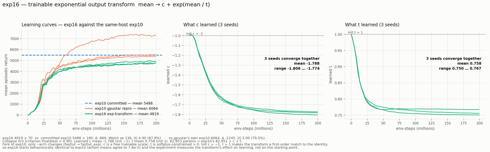

# exp16_lut-anchor-pair-t32-expout — trainable exponential output transform

Fork of `exp10_lut-anchor-pair-t32` with one change: a trainable exponential transform on
the actor's action mean,

```
mean  ->  c + exp(mean / t)        c free trainable scalar,  t trainable, softplus > 0
```

Everything else is exp10's: anchor-pair `FastMultiHeadLut` actor tph=32, [256,256] Tanh MLP
critic, bench7 recipe (truncation bootstrap, return-norm, KL early-stop, cosine LR → 3e-5,
log_std floor −1.897), 8192 envs, 768 updates, 3 seeds in parallel. Only `--arch` changes:
`fastlut` → `fastlut_exp`. 82,953 params = exp10's 82,951 + `c` + `t`.

**Verdict: it hurts. 4819.2 ± 70.1 against exp10's committed 5488.4 ± 179.9 — −669,
|t| 4.90. Every one of exp16's three seeds finishes below every one of the six exp10 seeds
available (exact permutation p = 0.012). No collapse (0/3), and the tightest spread of any
arm in the comparison.**



## 1. The result

| seed | best | final | final/best | learned c | learned t |
|---:|---:|---:|---:|---:|---:|
| 0 | 4763.0 | **4763.0** | 1.000 | −1.806 | 0.756 |
| 1 | 4795.7 | **4776.7** | 0.996 | −1.783 | 0.767 |
| 2 | 4970.6 | **4918.0** | 0.989 | −1.774 | 0.750 |

| arm | final | best | collapse |
|---|---|---|:-:|
| **exp16 (exp transform)** | **4819.2 ± 70.1** | 4843.1 ± 94.1 | 0/3 |
| exp10 committed (nebius) | 5488.4 ± 179.9 | 5551.0 ± 175.9 | 0/3 |
| exp10 gpustar reproduction | 6063.9 ± 879.3 | 6098.8 ± 912.4 | 0/3 |

| comparison | Δ | Welch se | \|t\| | % of ref |
|---|---:|---:|---:|---:|
| vs exp10 committed | −669.2 | 136.5 | **4.90** | 87.8% |
| vs exp10 gpustar reproduction | −1244.7 | 623.7 | 2.00 | 79.5% |

**The rank statement is the robust one.** The two Welch tests disagree in strength only
because gpustar's exp10 reproduction carries one 7305 outlier seed that inflates its sd.
Ignore both and just rank the nine runs: exp16's best seed (4918.0) finishes below exp10's
worst (5319.3), across two independent hosts. Complete separation of 3 from 9 has exact
permutation probability 1/C(9,3) = **0.012** under the null. The transform costs return.

Cost: 756 s wall for 3 parallel seeds, 12.4 min/seed, 269,799 env-steps/s — indistinguishable
from exp10's on this host, so the transform is free at runtime. It is not free in return.

## 2. What c and t learned, and why it matters

All three seeds converge to essentially the same place — **c ≈ −1.788, t ≈ 0.758** — from
`c = −1, t = 1`. Seed-to-seed range is 0.032 in `c` and 0.017 in `t`. That reproducibility
is itself informative: the transform has a well-defined optimum here, and the policy finds it.

Substituting the learned values, `action = −1.788 + exp(y / 0.758)`:

| target action | required LUT output y | d(action)/dy |
|---:|---:|---:|
| −1.0 | −0.181 | 1.04 |
| 0.0 | +0.440 | 2.36 |
| +1.0 | +0.777 | 3.68 |

Two things follow, and they are the mechanism:

1. **The policy gradient is asymmetric by 3.54×.** The same downstream error produces 3.5×
   more gradient into the LUT when the actor is producing +1 than when it is producing −1.
   The negative half of the action range also needs **1.84× more y-range** than the positive
   half (0.621 vs 0.337). Walker2d needs symmetric torque authority on all six actuators;
   an exponential can't give it, because a convex map cannot be symmetric about its midpoint.
2. **It also raised the effective actor gain to 2.36×** exp10's unit slope at the zero-action
   operating point — the policy learned `t < 1` and pushed its operating point up the curve
   into the steeper region.

**These two are confounded, and this experiment cannot separate them.** The deficit may be
the convexity/asymmetry, or it may be that a ~2.4× actor gain is simply the wrong scale for
this PPO recipe (whose LR schedule was tuned at exp10's unit gain). Both stories predict
what was measured.

## 3. What would separate them

A **linear control**: `mean -> a * mean + b` with `a`, `b` trainable scalars, everything else
identical. It has the same two extra parameters and the same freedom to rescale and shift the
actor output, but **no curvature** — so gradients stay symmetric across the action range.

- If the linear control also loses ~670 → the loss is about *gain/scale*, not the exponential,
  and the finding is "a trainable output rescaling destabilises this recipe".
- If the linear control matches exp10 → the loss is the exponential's *curvature*, and the
  finding is "asymmetric action-space warping costs ~12% of return on Walker2d".

That is one 13-minute run on gpustar and it converts an ambiguous result into a clean one.

## 4. Honest caveats

- **n = 3.** exp16's spread is unusually tight (sd 70), so its own mean is well determined,
  but the comparison inherits exp10's sampling noise. The rank argument is what survives that.
- **The init is a choice, and results depend on it.** `c = −1, t = 1` was picked so the
  transform is a first-order match to the identity at init — verified: exp16 and exp10 action
  means agree to 7.6e-5 from the same seed, and update 1 is identical in both (ep_ret −1.7,
  max 20.5, len 16). A different init would measure a different experiment. This is the most
  favourable defensible init, which makes the −669 a *lower bound* on the transform's cost.
- **One documented deviation:** the exponent is clamped at +20 as an fp32 overflow guard
  (exp(20) ≈ 4.9e8, nine orders past the action clamp). It never bound in this run — the
  largest exponent observed is far below it — and exists only to stop an `inf` mean from
  turning the Gaussian log-prob into NaN.
- **Cross-host comparison.** The primary reference (5488.4) was produced on nebius. gpustar's
  own reproduction of exp10 is included as the same-host control precisely so this isn't a
  hidden host comparison; both point the same way.

## 5. Files

| file | what |
|---|---|
| `run_exp16.sh` | the run — 3 seeds parallel, flags verbatim from exp10 except `--arch` |
| `collect.py` | builds `config.json` / `metrics.csv` / `summary.json`; metric defs from `summarize_bench.py` |
| `plot_exp16.py`, `exp16_result.png` | the figure |
| `progress_monitor_exp16.py` | live Slack progress bar |
| `ppo_s{0,1,2}.json` | raw per-seed records (`c` and `t` in every history row) |
| `agg.gpu` | GPU utilization trace |

Framework changes (in shared `src/`, additive, same pattern as the `fastlut2` commit):
`models.py` gains the registered arch `fastlut_exp`; `ppo.py` gains a two-line `extra_log()`
hook so an architecture can add scalars to each history row. Nothing existing is altered, so
exp00–exp12 remain byte-reproducible.
