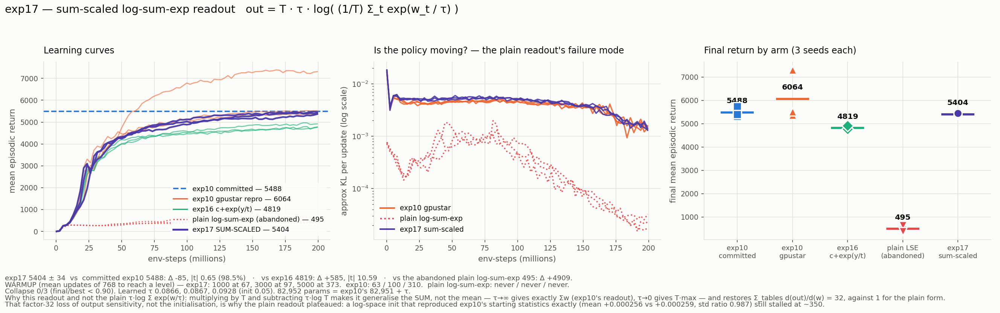

# exp17_lut-anchor-pair-t32-logsumexp — sum-scaled log-sum-exp table readout

Fork of `exp10_lut-anchor-pair-t32` replacing the anchor-pair actor's plain sum over a
head's tables with a **sum-scaled (mean-normalised) temperature-τ log-sum-exp**:

```
out = T · τ · log( (1/T) · Σ_t exp( w_t / τ ) )     τ > 0, softplus, the only new parameter
```

τ→∞ recovers exp10's `Σ_t w_t` exactly; τ→0 gives `T·max(w)`. Everything else is exp10's:
tph=32 anchor-pair actor, [256,256] Tanh MLP critic, bench7 recipe, 8192 envs, 768 updates,
3 seeds in parallel. 82,952 params = exp10's 82,951 + τ. Plain additive weight init — this
readout needs no special init.

**Verdict: it works, and it costs essentially nothing. 5403.8 ± 34.4 against exp10's
committed 5488.4 ± 179.9 — Δ −85, |t| 0.65, no detectable difference, 98.5% of the
reference. 0/3 collapse. Warmup is indistinguishable from exp10's.**



## 1. The result

| seed | best | final | final/best | learned τ |
|---:|---:|---:|---:|---:|
| 0 | 5366.6 | **5366.6** | 1.000 | 0.0866 |
| 1 | 5430.0 | **5395.2** | 0.994 | 0.0867 |
| 2 | 5481.4 | **5449.6** | 0.994 | 0.0928 |

| arm | final | collapse |
|---|---|:-:|
| **exp17 sum-scaled log-sum-exp** | **5403.8 ± 34.4** | 0/3 |
| exp10 committed (nebius) | 5488.4 ± 179.9 | 0/3 |
| exp10 gpustar reproduction | 6063.9 ± 879.3 | 0/3 |
| exp16 `c + exp(y/t)` | 4819.2 ± 70.1 | 0/3 |
| plain log-sum-exp (abandoned) | 495.2 ± 112.3 | 1/3 |

| comparison | Δ | Welch se | \|t\| | % of ref |
|---|---:|---:|---:|---:|
| vs exp10 committed | −84.6 | 129.5 | **0.65** | 98.5% |
| vs exp10 gpustar reproduction | −660.1 | 622.2 | 1.06 | 89.1% |
| vs exp16 | **+584.6** | 55.2 | **10.59** | 112.1% |
| vs the abandoned plain readout | +4908.6 | 83.1 | 59.08 | 1091% |

exp17's seed spread (sd 34.4) is the tightest of any arm in the chapter — all three seeds
land inside 83 points.

## 2. It trains normally now — warmup and KL

Mean updates (of 768) to first reach a return level:

| arm | 1000 | 3000 | 5000 |
|---|---:|---:|---:|
| **exp17 sum-scaled** | **67** | **97** | **373** |
| exp10 committed | 67 | 103 | 307 |
| exp10 gpustar reproduction | 63 | 100 | 310 |
| exp16 | 70 | 120 | never |
| plain log-sum-exp | never | never | never |

exp17 reaches 1000 and 3000 **at the same point as exp10** (67 vs 67, 97 vs 103) and is
slightly slower only to 5000 (373 vs 307). Approx-KL sits on top of exp10's throughout
(~5e-3 early, decaying with the cosine LR), against the plain readout's ~1e-3 decaying to
1e-4. The plateau is gone.

Cost: 795 s wall for 3 parallel seeds, 13.0 min/seed at 257,176 env-steps/s — the same band
as exp10 on this host. The readout is free.

## 3. Why the plain readout failed, and why this one doesn't

Two attempts at the plain `τ · log Σ_t exp(w_t/τ)` are kept under `attempt*/`. They are the
evidence for the diagnosis, which is a single number:

| readout | Σ_tables d(output)/d(weight) |
|---|---:|
| exp10 plain sum | **32** |
| plain log-sum-exp | **1** |
| exp17 sum-scaled | **32** |

`τ·log Σ exp(w/τ)` is a smooth **mean/max**: its output is bounded by the range of the
individual entries instead of accumulating across them, so the same weight step moves the
action **32× less**. With Adam taking ~lr-sized steps regardless of gradient magnitude, the
actor needs ~32× more updates to cover the same distance in action space, and never gets
there inside 768.

**That is a property of the aggregation, not of the initialisation** — which the two
abandoned attempts establish directly:

- `attempt1_additive_init/` (τ=0.1, plain additive init) — the weights sit *inside* exp(),
  so with `w ~ U(±1e-3)` every term is ≈1: the head pinned at the constant `τ·log(32) =
  0.3466`, output std 32× too small, gradients perfectly uniform (32.0/32 effective
  tables). **Final 495.2.**
- `attempt2_plain_lse_logspace_init/` (τ=0.05, weights-as-logarithms init: centre
  `μ = −τ·log(T)` minus the spread's Jensen gap, per-entry spread T× larger) — this
  **fixed the initialisation exactly**: output mean +0.000256 vs exp10's +0.000259, std
  ratio 0.987, 30.0/32 effective tables. It **still plateaued at ~350** and was stopped at
  update 430. Logs only (killed before the JSONs are written).

Multiplying by `T` and subtracting `τ·log T` turns the readout into a smooth generalisation
of the **sum** instead of the mean. It restores the factor of 32, and because it reduces to
`Σw` at large τ the plain additive init is correct again — no special init needed.

## 4. What τ learned

All three seeds move τ **up**, 0.05 → 0.0866 / 0.0867 / 0.0928. Larger τ means *more
sum-like* (τ→∞ is exp10 exactly). So the policy is pushing the readout back toward the plain
sum rather than toward the max — consistent with exp17 landing statistically on top of
exp10 rather than beating it. The soft-max freedom is available and the optimiser mostly
declines it.

That is the honest reading of this result: **the sum-scaled log-sum-exp is a safe
generalisation of exp10's readout — it costs nothing and breaks nothing — but on this task
it does not buy anything either.** Its value is as a mechanism that *could* pay off (a
learnable interpolation between sum and max), not as a win in itself.

## 5. Caveats

- **n = 3.** exp17's own spread is very tight (sd 34), but the comparison inherits exp10's
  sampling noise; the −85 gap is well inside it (|t| 0.65). exp17 is *not* rank-separated
  from the pooled exp10 seeds.
- **The gpustar exp10 reproduction reads 6064** because of one 7305 outlier seed; against
  that arm exp17 is −660 at |t| 1.06, still not significant. The committed 5488 is the
  fairer reference and is what the headline uses.
- **τ init 0.05 is a choice.** It was picked so the readout starts numerically
  indistinguishable from exp10 (matching to 5.4% of the output std, the residual being the
  Jensen gap). Since τ trains upward from there, a larger init would likely behave the same;
  a much smaller one would start in the max-like regime and is untested.
- **`exp_clamp = 60` guard.** `torch.logsumexp` subtracts the row max internally so exp()
  cannot overflow; the clamp only guards the degenerate τ→0 case. It never bound here.

## 6. Files

| file | what |
|---|---|
| `run_exp17.sh` | the run — 3 seeds parallel, exp10's flags except `--arch fastlut_lse_sum` |
| `collect.py` | `config.json` / `metrics.csv` (τ per row) / `summary.json`; metric defs from `summarize_bench.py` |
| `plot_exp17.py`, `exp17_result.png` | the result figure |
| `plot_diagnosis.py`, `exp17_diagnosis.png` | the plain-readout failure diagnosis |
| `verify_exp_outputs.py` | correctness gate for the `exp_outputs` flag (row selection, LSE math, gradients, overflow) |
| `check_sum_scaled.py` | verifies the sum-scaled readout: reduces to exp10's sum, gradient sums to T, both τ limits |
| `design_init.py`, `check_init.py`, `check_init2.py` | the log-space init derivation and its verification |
| `attempt1_additive_init/`, `attempt2_plain_lse_logspace_init/` | the two abandoned plain-readout runs |

Framework changes are **additive and flag-gated only**; exp00–16 verified untouched
(`fastlut` bit-identical, critic init unchanged, exp16 arch unaffected):

- `src/spiky/lutorch/fast_multi_head_lut.py` — `exp_outputs` (off by default) plus
  `exp_outputs_scale` (`"mean"`/`"sum"`), `exp_outputs_init` (`"logspace"`/`"additive"`),
  `exp_outputs_tau_init`, `exp_outputs_clamp`, and `_lse_init_offset`.
- `experiments/walker2d-lut/src/models.py` — arches `fastlut_lse` and `fastlut_lse_sum`.
- `experiments/walker2d-lut/src/ppo.py` — a two-line `extra_log()` hook so an architecture
  can add scalars (here τ) to each history row.

Not committed or pushed.
