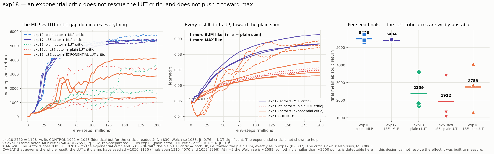

# exp18_lut-lse-lutcrit-t32 — an exponential critic to match the exponential actor

exp17's sum-scaled log-sum-exp actor paired with an anchor-pair **LUT critic carrying the
same exponential readout**, each head with its own trainable τ:

```
out = T · τ · log( (1/T) · Σ_t exp( w_t / τ ) )      actor τ and critic τ, both softplus > 0
```

Actor tph=32, critic tph=32 (matching the actor, and matching exp13's config exactly).
14,344 params = exp13's 14,342 + two τ. Everything else is exp10's bench7 recipe: 8192
envs, 768 updates, 3 seeds.

**Motivation:** in exp17 the actor's τ drifted *up* toward the plain sum, apparently because
an MLP critic's advantage signal is additive in structure, leaving the soft-max freedom
unused. Giving the value head matching exponential geometry should give τ a reason to use
the max-like regime.

**Verdict: it doesn't. τ still drifts up toward the sum, the exponential critic is not shown
to help over a plain LUT critic (Δ +830, |t| 0.76), and the MLP-vs-LUT critic gap continues
to dominate everything (−2651 vs exp17, rank-separated).**



## 1. The arms

| arm | actor readout | critic | final | collapse |
|---|---|---|---|:-:|
| exp10 | plain sum | MLP | 5488.4 ± 179.9 | 0/3 |
| exp17 | LSE-sum | MLP | 5403.8 ± 34.4 | 0/3 |
| exp13 | plain sum | LUT, plain sum | 2358.6 ± 878.6 | 1/3 |
| **exp18ctl** (control) | LSE-sum | LUT, **plain sum** | **1922.2 ± 1047.8** | 0/3 |
| **exp18** (treatment) | LSE-sum | LUT, **log-sum-exp** | **2752.5 ± 1127.6** | 0/3 |

Per seed:

| seed | exp18 best | exp18 final | actor τ | critic τ | | ctl best | ctl final | actor τ |
|---:|---:|---:|---:|---:|---|---:|---:|---:|
| 0 | 1378.5 | **1315.4** | 0.0662 | 0.0847 | | 3690.9 | **3396.2** | 0.0713 |
| 1 | 3073.8 | **2872.6** | 0.0685 | 0.0856 | | 1131.5 | **1053.2** | 0.0707 |
| 2 | 4090.9 | **4069.6** | 0.0757 | 0.0888 | | 1346.9 | **1317.3** | 0.0697 |

| comparison | Δ | Welch se | \|t\| | |
|---|---:|---:|---:|---|
| exp18 vs **its control** (only the critic readout differs) | +830.3 | 1088.4 | **0.76** | not significant |
| exp18 vs exp17 (same actor, MLP critic) | −2651.3 | 797.7 | **3.32** | rank-separated |
| exp18 vs exp10 | −2735.9 | 807.4 | **3.39** | rank-separated |
| exp18 vs exp13 (plain actor, LUT critic) | +393.9 | 1010.8 | 0.39 | not significant |

## 2. The τ question — answered, and the answer is no

| | actor τ | critic τ |
|---|---:|---:|
| init | 0.0500 | 0.0500 |
| exp17 (MLP critic) | 0.0887 | — |
| **exp18ctl** (plain LUT critic) | 0.0706 | — |
| **exp18** (exponential LUT critic) | 0.0701 | 0.0863 |

τ **up** means more sum-like (τ→∞ *is* the plain sum); τ down means more max-like.

Every τ in the chapter moves **up**. The exponential critic's own τ rises to 0.0863 — it too
prefers the sum. The actor's τ under an exponential critic (0.0701) is *lower* than under an
MLP critic (0.0887), which is the only trace of the predicted effect, but it is a smaller
rise, not a fall, and the two LUT-critic arms agree with each other (0.0701 vs 0.0706)
regardless of whether the critic is exponential. So the difference tracks *the critic being
a LUT*, not *the critic being exponential*.

**The hypothesis is not supported.** Nothing here pushes the readout into the max regime.

## 3. The caveat that governs the whole result

The LUT-critic arms are wildly unstable: exp18's finals span **1315 → 4070** and the
control's span **1053 → 3396**, with seed sds of 1128 and 1048. That is the same instability
exp13 shows (sd 878.6).

At n=3 with a pooled sd of 1333, the Welch se is **1088**:

- the **smallest detectable gap** (|t| ≥ 2) is **~2177 points**;
- resolving the observed +830 at 80% power would need **~41 seeds per arm**.

So this design *cannot* resolve the effect it was built to measure. The +830 in the
treatment's favour is entirely consistent with noise, and so is the control's shortfall
against exp13. The only conclusions that survive are the large ones: the LUT critic costs
~2700 points against an MLP critic (|t| 3.3, rank-separated, and consistent with exp13–15),
and no τ goes toward max.

**What would actually answer this** is not more of the same: it is either (a) n ≈ 40 per
arm, which is ~9 GPU-hours here and probably not worth it for a mechanism that shows no
signal, or (b) finding out *why* the LUT critic is unstable first — the value head, not its
readout, is what is broken, and fixing the readout of a broken head is unlikely to pay.

## 4. Honest notes

- **The control is the right one.** exp13–15 already established that a LUT critic costs a
  lot versus an MLP critic, so comparing exp18 to exp17 alone would only re-measure that.
  The control holds actor, critic topology, tph, init and recipe fixed and toggles *only*
  the critic's readout. Verified at init: the two arms have a numerically identical actor
  (action mean +0.000360, same std) and the control's critic is identical to `fastlut2`'s
  (value mean +0.000212, std 3.170988e-3).
- **Critic tph = 32** was chosen to match the actor and to match exp13 exactly, so exp13
  serves as the both-plain corner of the 2×2. A larger critic (exp14/15 suggest tph=64
  helps: 3425.5) was not tried here.
- **n = 3**, as everywhere in this chapter. See §3 — here it is not a minor caveat, it is
  the result.

## 5. Files

Both arms hold the convention trio. The control lives in the sibling folder
`../exp18ctl_lut-lse-plaincrit-t32/`.

| file | what |
|---|---|
| `run_exp18.sh` | both arms — 2 sequential groups of 3 parallel seeds |
| `collect.py` | writes the trio into *both* arm folders, plus the comparison table |
| `plot_exp18.py`, `exp18_result.png` | the figure |
| `progress_monitor_exp18.py` | live Slack progress bar (6 runs) |
| `ppo_s{0,1,2}.json` | raw per-seed records (`tau_actor`, `tau_critic` in every row) |

Framework changes are additive and flag-gated: `models.py` gains `fastlut_lse_sum2` and
`fastlut_lse_sum2_plaincrit`, both reusing the existing `exp_outputs` / `exp_outputs_scale`
flags on `FastMultiHeadLut` for the critic path. Nothing existing is altered — exp00–17
remain reproducible (`fastlut2` still 14,342 params and bit-identical).

Cost: 844 s + 892 s wall (13.8 and 14.7 min/seed), 99% GPU. Not committed or pushed.
