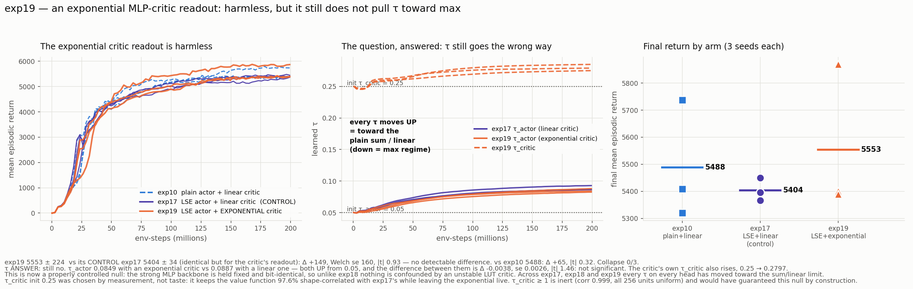

# exp19_lut-lse-expmlpcrit-t32 — an exponential readout on the MLP critic

exp17's sum-scaled log-sum-exp **actor** paired with the exp10 **MLP critic whose final
linear readout is replaced** by the matching sum-scaled log-sum-exp over its 256 penultimate
per-unit contributions:

```
plain (exp10, exp17):  value = Σ_i w_i·h_i + b
exp19:                 value = T · τ_c · log( (1/T) Σ_i exp( w_i·h_i / τ_c ) ) + b,   T = 256
```

The critic **backbone is untouched** — obs → [256,256] Tanh, same orthogonal gain-1.0 init,
built by the identical call, so its weights and the RNG stream are bit-identical to exp10's
and exp17's. τ_c is one new trainable positive scalar. 82,953 params = exp17's 82,952 + τ_c.

**exp17 is the control**: same actor, same critic backbone, plain *linear* readout. The only
difference between the two experiments is the critic's readout.

**Verdict: the exponential critic readout is harmless — 5553.1 ± 223.6 vs the control's
5403.8 ± 34.4 (Δ +149, |t| 0.93) — but it does not do what it was built to do. τ_actor still
drifts *up* toward the plain sum (0.0849 vs the control's 0.0887, |t| 1.46 — not
distinguishable), and the critic's own τ_c rises too, 0.25 → 0.2797.**



## 1. The result

| seed | best | final | final/best | τ_actor | τ_critic |
|---:|---:|---:|---:|---:|---:|
| 0 | 5427.5 | **5400.5** | 0.995 | 0.0825 | 0.2791 |
| 1 | 5876.7 | **5869.2** | 0.999 | 0.0880 | 0.2850 |
| 2 | 5411.1 | **5389.6** | 0.996 | 0.0841 | 0.2751 |

| arm | actor | critic readout | final | collapse |
|---|---|---|---|:-:|
| exp10 | plain sum | linear | 5488.4 ± 179.9 | 0/3 |
| **exp17** (control) | LSE-sum | **linear** | 5403.8 ± 34.4 | 0/3 |
| **exp19** | LSE-sum | **log-sum-exp** | **5553.1 ± 223.6** | 0/3 |

| comparison | Δ | Welch se | \|t\| | |
|---|---:|---:|---:|---|
| vs exp17 (the control) | +149.3 | 159.9 | 0.93 | not significant |
| vs exp10 | +64.7 | 202.9 | 0.32 | not significant |

14.3 min/seed at 234,825 env-steps/s — the readout costs nothing.

## 2. The τ question, answered — and the answer is still no

| | τ_actor | τ_critic |
|---|---:|---:|
| init | 0.0500 | 0.2500 |
| exp17 (linear critic) | 0.0887 | — |
| **exp19 (exponential critic)** | **0.0849** | **0.2797** |

τ **up** means more sum-like (τ→∞ *is* the plain sum / plain linear layer); τ down would be
the max regime.

The actor's τ under an exponential critic (0.0849) is very slightly *lower* than under a
linear one (0.0887) — the direction the hypothesis predicted — but:

- it is still a **rise** from the 0.05 init (+0.0349 vs the control's +0.0387), not a fall;
- the difference between the two is **Δ −0.0038, se 0.0026, |t| 1.46 — not significant**;
- the **critic's own τ_c also rises** (0.25 → 0.2797), i.e. the exponential value head
  itself prefers to be more linear.

So giving the critic exponents does not give the actor's τ a reason to use the max regime.

**This is now a properly controlled null.** exp18 tested the same idea by swapping the
critic for a LUT, which is unstable on its own (seed sd ~1000+, exp13–15 and exp18) and
confounded the measurement. Here the strong MLP backbone is held fixed and bit-identical, so
the only moving part is the readout — and the answer is unchanged.

Across exp17, exp18 and exp19, **every τ on every head in every configuration has moved
toward the sum/linear limit.** That is five independent τ now (exp17 actor, exp18 actor and
critic, exp19 actor and critic). The optimiser is consistently declining the soft-max
freedom, which is a real and repeated finding rather than a single null.

## 3. Two things that had to be got right first

**τ_c init = 0.25, chosen by measurement** (`design_tau_critic.py`, on real normalised
observations through a real initialised critic):

| τ_c | shape dev vs plain | corr | effective units (of 256) |
|---:|---:|---:|---:|
| 4.0 | 1.3% | 0.9999 | 256.0 ← inert |
| 1.0 | 5.3% | 0.9987 | 256.0 ← inert |
| **0.25** | **21.1%** | **0.9763** | **255.6** ← chosen |
| 0.10 | 52.8% | 0.8199 | 253.3 |
| 0.05 | 108.4% | 0.3753 | 244.6 |
| 0.02 | 339.5% | −0.1776 | 175.7 |

The pooled terms `u_i = w_i·h_i` are tiny (std 0.0146), so the readout only becomes
non-linear as τ_c approaches that scale. "Deviation" is measured *after removing each head's
mean*, because the raw deviation is dominated by the Jensen gap ≈ T·Var(u)/(2τ_c), which is
very nearly a constant and is absorbed by the layer's own bias within a few updates.

The trade-off is real and worth stating: **τ_c ≥ 1 would have guaranteed this null by
construction** — the exponential is inert there (all 256 units uniform, correlation 0.999
with the linear head, no gradient to move τ_c). τ_c ≤ 0.05 starts a substantially different
value function. 0.25 keeps the value function 97.6% correlated with exp17's while leaving
the exponential measurably live.

**A numerics fix was required.** The natural `τ·(logsumexp(u/τ) − log T)` subtracts two
values that are *both* ≈ log(256) = 5.545 when τ ≫ spread(u), and their true difference is
~1e-7 — pure fp32 cancellation. Measured error: **0.061 at τ=500 against a value std of
0.18**, i.e. the τ→∞ limit did not land on the plain linear head. Rewriting as
`τ·log1p(mean(expm1(d)))` on mean-centred `d` (algebraically identical, exact near zero)
brings that to **1.2e-4**, a 500× improvement. Verified limits:

| τ_c | max abs error |
|---|---|
| 500 → plain linear | 1.2e-4 |
| 50 | 1.2e-3 |
| 1.0 | 6.0e-2 ← the genuine Jensen gap ∝ 1/τ, not numerical error |

(The `±60` clamp binds only for τ_c below ~2.7e-3, far outside the operating range and
below where the τ floor sits; the τ→0 limit is therefore approximate there by design.)

## 4. Caveats

- **n = 3.** exp19's spread (sd 224) is larger than exp17's (34), so the +149 sits well
  inside noise. Nothing here claims the exponential critic *helps*.
- **τ_c init is a choice that bounds the conclusion.** The null is "at τ_c = 0.25, with
  τ_c free to move, nothing reaches for max". A run started deep in the max regime
  (τ_c ≈ 0.02) would be a different — and much more disruptive — experiment; it is untested.
- The critic backbone, actor, and RNG stream were verified bit-identical to exp17's, so the
  comparison isolates exactly one thing.

## 5. Files

| file | what |
|---|---|
| `run_exp19.sh` | the run — 3 seeds parallel, exp10's flags except `--arch` |
| `design_tau_critic.py` | the τ_c grid measured on real observations (the table above) |
| `collect.py` | `config.json` / `metrics.csv` (τ_actor and τ_critic per row) / `summary.json` |
| `plot_exp19.py`, `exp19_result.png` | the figure |
| `progress_monitor_exp19.py` | live Slack progress bar |
| `ppo_s{0,1,2}.json` | raw per-seed records |

Framework change is additive and flag-gated: `models.py` gains the arch
`fastlut_lse_sum_expmlpcrit`. Nothing existing is altered — exp00–18 remain reproducible.
Not committed or pushed.
