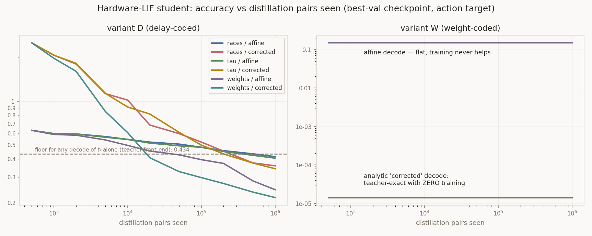

# LUT → spiking distillation: full option-matrix sweep

**252 runs** (42 configs × 3 learning rates × 2 seeds), ~35 min on the RTX 5090. Nothing
committed. Regenerate with the commands at the bottom.

All errors are `mean |a_spiking − a_LUT|` on a held-out **20,000-pair validation split**
(80,000 train), normalised by the action std **1.1309**. "best" = the best-validation
checkpoint; "final" = the model after all 4,000 steps. Both are reported because they
differ a lot, and that difference is itself a result.

---

## The three answers

### 1. Does the hardware-LIF gap close with learning, and which scope is needed?

**It doesn't need learning at all in the weight-coded variant, and learning can't close it
in the delay-coded one.** The two codings — provably identical on the exact neuron — come
apart completely on a realistic LIF.

* **Variant W (weights → synapses): the gap is 100 % a decode artefact.** With every
  synapse arriving at `t_cell`, the LIF quadratic collapses to `A = B = S` and inverts in
  closed form:

  ```
  x_f = exp(-(t_f - t_cell)/tau_m)      =>      S = theta / ( x_f (1 - x_f) )
  ```

  Feeding that `S` through the teacher's own readout gives **0.00001 normalised error
  (6.7e-06 absolute) with ZERO training** — teacher-exact. The affine decode's 0.1493 was
  never a neuron limitation. Under the affine decode, training *never* improved on the
  untrained point in **any** of the 12 W cells (best always at 0 pairs seen).

* **Variant D (weights → delays): a genuine information loss.** Arrivals are staggered, so
  `A` and `B` are independent functionals and `t_f` no longer determines `S`. Measured
  non-parametrically (`decode_limit.py`, 2,000 bins): the **best possible deterministic
  decode of `t_f` alone leaves 0.434** normalised error — versus a 0.00064 measurement
  floor where the map *is* invertible. No decode can fix this.

  Learning helps a lot but does not rescue it. Best result across the whole D matrix is
  **0.2176** (full distillation + corrected decode), i.e. still **~22 % of the action std**
  against a teacher-exact 0.00001. Scope ranking is unambiguous:

  | scope | params | best (affine) | best (corrected) |
  |---|---|---|---|
  | races | 3,266 | 0.4160 | 0.3602 |
  | races + tau | 3,267 | 0.4062 | 0.3436 |
  | **+ cell weights** | **15,555** | **0.2452** | **0.2176** |

  Unfreezing `tau` buys almost nothing (0.010–0.017). **Unfreezing the 12,288 cell weights
  is what matters** — it roughly halves the error. So if the delay coding is the goal, the
  honest framing is that it needs full distillation, not "fixed readout, learn the
  front-end".

  Note the trained front-end **beats** the 0.434 decode-only floor (0.36 races-only, 0.22
  full). That is not a contradiction: the floor bounds decodes of `t_f` *at the teacher
  front-end*, and training changes which cells fire, hence changes the map. It is direct
  evidence that front-end learning adds something no decode fix can.

* **Target choice is decisive on the LIF, and irrelevant on the exact neuron.** The
  `prelog` target (match `S`, bypassing the neuron) **completely fails** on variant D:
  0.6310 vs 0.2452 for the action target — no better than not training, and it diverges
  afterwards (final 0.76–9.25). Obvious in hindsight: matching `S` only matches the action
  if the neuron applies the log, which the LIF doesn't. **On a non-exact neuron you must
  train through the neuron.**

### 2. How sample-efficient is the spiking front-end?

Slow, and still improving when the data runs out. Normalised val error vs pairs seen
(variant D, action target, best lr = 1e-3):

| pairs seen | 1k | 10k | 100k | 1M |
|---|---|---|---|---|
| races / affine | 0.599 | 0.547 | 0.483 | 0.416 |
| races / corrected | 2.075 | 1.019 | 0.524 | 0.360 |
| weights / affine | 0.591 | 0.497 | 0.397 | 0.247 |
| **weights / corrected** | 1.975 | 0.609 | 0.299 | **0.218** |

Roughly **a factor 10 more data for each ~25 % error reduction**, with no plateau by 1M
pairs (≈ 12 epochs over the 80k training split). The 100K-pair dataset is *not* the
limiting factor yet, but it is close to being one: the last decade of data bought 0.081.
**If we pursue variant D, generate more pairs.**

No overfitting anywhere: train/val ratio is **1.00×** in every LIF learning cell (3,266 to
15,555 params against 80,000 pairs). Every improvement is real generalisation.



### 3. What surprised me

**(a) The verification cells pass, and then training destroys them.** All 12 exact-neuron
cells sit at 0.0000 normalised (1.3e-05 absolute) at init — the analytic map is confirmed
end-to-end. But after 2,000 steps the *same* cells sit at **0.21–2.84**. The
straight-through gradient does not vanish at the analytically exact solution, so Adam walks
away from a perfect model and never comes back. Best-val early stopping is not a
convenience here; without it every exact cell would report the drift instead of the result.

**(b) The recovery probe fails — and the size of the perturbation doesn't matter.**
Perturbing the race init by Gaussian noise and retraining:

| sigma | base | best after training | pairs to best |
|---|---|---|---|
| 0.05 | 0.6212 | 0.2884 | 665,600 |
| 0.2 | 0.7531 | 0.2984 | 742,400 |
| 0.5 | 0.7905 | 0.2859 | 1,012,096 |

Two things stand out. **sigma = 0.05 on ±1 weights already costs 0.62** — the address is a
sign pattern, so an arbitrarily small perturbation flips bits and each flip swaps an entire
LUT row. And recovery **plateaus at ~0.29 regardless of sigma**, never returning to the
0.0000 it started from. Surrogate-gradient descent does not find its way back into the
basin of the analytic solution from *any* distance tested. This is the most important
negative result here: **the exact solution is reachable analytically but not by learning**,
which caps what the "learn the front-end" programme can deliver.

**(c) Delay-coding and weight-coding are equivalent on paper and not in practice.** On the
exact neuron `exp(w/tau)`-as-a-weight and `−w`-as-a-delay are the same layer up to a rigid
time shift. On a finite-`tau_s` LIF, one is lossless and the other destroys ~40 % of the
signal. The equivalence is a property of the idealised neuron, not of the coding.

**(d) fp32 address ties.** 3 of 100,000 samples land close enough to `x_a = x_b` that
float32 flips a bit, and because the LUT is piecewise constant each costs ~0.4 in one action
component. That is the 0.400 "best max" column against a 1e-05 mean, and it is inherent to
sign-addressed LUTs, not a bug in the spiking layer.

---

## Full matrix

`norm` = mean |a_spiking − a_LUT| / 1.1309. Best lr chosen per cell by val; both seeds shown.

### Exact neuron — verification cells (12)

| variant | scope | target | params | lr | base (norm) | **best (norm)** | best max | final (norm) | seeds |
|---|---|---|---|---|---|---|---|---|---|
| D | races | action | 3,266 | 1e-05 | 0.0000 | **0.0000** | 0.400 | 0.2439 | 0.0000 / 0.0000 |
| D | races | prelog | 3,266 | 1e-05 | 0.0000 | **0.0000** | 0.400 | 1.9809 | 0.0000 / 0.0000 |
| D | tau | action | 3,267 | 1e-05 | 0.0000 | **0.0000** | 0.400 | 0.2388 | 0.0000 / 0.0000 |
| D | tau | prelog | 3,267 | 1e-05 | 0.0000 | **0.0000** | 0.400 | 2.1028 | 0.0000 / 0.0000 |
| D | weights | action | 15,555 | 1e-05 | 0.0000 | **0.0000** | 0.400 | 0.2129 | 0.0000 / 0.0000 |
| D | weights | prelog | 15,555 | 1e-05 | 0.0000 | **0.0000** | 0.400 | 2.8351 | 0.0000 / 0.0000 |
| W | races | action | 3,266 | 1e-05 | 0.0000 | **0.0000** | 0.400 | 0.2406 | 0.0000 / 0.0000 |
| W | races | prelog | 3,266 | 1e-05 | 0.0000 | **0.0000** | 0.400 | 0.2420 | 0.0000 / 0.0000 |
| W | tau | action | 3,267 | 1e-05 | 0.0000 | **0.0000** | 0.400 | 0.2360 | 0.0000 / 0.0000 |
| W | tau | prelog | 3,267 | 1e-05 | 0.0000 | **0.0000** | 0.400 | 0.2578 | 0.0000 / 0.0000 |
| W | weights | action | 15,555 | 1e-05 | 0.0000 | **0.0000** | 0.400 | 0.2169 | 0.0000 / 0.0000 |
| W | weights | prelog | 15,555 | 1e-05 | 0.0000 | **0.0000** | 0.400 | 0.2235 | 0.0000 / 0.0000 |

Absolute base error 1.308e-05 (D) / 1.305e-05 (W). **Verification passes.** Every `final`
column is the surrogate-gradient drift described above, not a result.

### Hardware LIF — the learning cells (24)

| variant | scope | target | decode | params | lr | base (norm) | **best (norm)** | best max | final (norm) | pairs to best | seeds |
|---|---|---|---|---|---|---|---|---|---|---|---|
| D | races | action | affine | 3,266 | 1e-3 | 0.6312 | **0.4160** | 3.576 | 0.4204 | 986,496 | 0.4279 / 0.4040 |
| D | races | action | corrected | 3,266 | 1e-3 | 2.5235 | **0.3602** | 7.287 | 0.3631 | 1,000,192 | 0.3819 / 0.3384 |
| D | races | prelog | affine | 3,266 | 1e-5 | 0.6312 | **0.6310** | 4.019 | 0.7663 | 1,024 | 0.6312 / 0.6308 |
| D | races | prelog | corrected | 3,266 | 1e-3 | 2.5235 | **2.1467** | 7.820 | 3.1225 | 20,224 | 2.2209 / 2.0724 |
| D | tau | action | affine | 3,267 | 1e-3 | 0.6312 | **0.4062** | 3.685 | 0.4076 | 998,400 | 0.4067 / 0.4057 |
| D | tau | action | corrected | 3,267 | 1e-3 | 2.5235 | **0.3436** | 8.062 | 0.3448 | 1,012,096 | 0.3394 / 0.3478 |
| D | tau | prelog | affine | 3,267 | 1e-5 | 0.6312 | **0.6310** | 4.019 | 0.7561 | 1,024 | 0.6312 / 0.6308 |
| D | tau | prelog | corrected | 3,267 | 1e-4 | 2.5235 | **2.3247** | 11.012 | 9.2490 | 153,600 | 2.3031 / 2.3462 |
| D | weights | action | affine | 15,555 | 1e-3 | 0.6312 | **0.2452** | 3.623 | 0.2452 | 1,024,000 | 0.2444 / 0.2461 |
| **D** | **weights** | **action** | **corrected** | **15,555** | 1e-3 | 2.5235 | **0.2176** | 3.135 | 0.2177 | 1,012,096 | 0.2171 / 0.2182 |
| D | weights | prelog | affine | 15,555 | 1e-5 | 0.6312 | **0.6310** | 4.019 | 0.7588 | 1,024 | 0.6312 / 0.6308 |
| D | weights | prelog | corrected | 15,555 | 1e-3 | 2.5235 | **2.3472** | 11.868 | 3.7192 | 1,536 | 2.3592 / 2.3352 |
| W | races | action | affine | 3,266 | 1e-5 | 0.1493 | **0.1493** | 4.157 | 0.3006 | 0 | 0.1493 / 0.1493 |
| **W** | **races** | **action** | **corrected** | **3,266** | 1e-5 | 0.0000 | **0.0000** | 0.400 | 0.2734 | 0 | 0.0000 / 0.0000 |
| W | races | prelog | affine | 3,266 | 1e-5 | 0.1493 | **0.1493** | 4.157 | 0.3018 | 0 | 0.1493 / 0.1493 |
| W | races | prelog | corrected | 3,266 | 1e-5 | 0.0000 | **0.0000** | 0.400 | 0.2707 | 0 | 0.0000 / 0.0000 |
| W | tau | action | affine | 3,267 | 1e-5 | 0.1493 | **0.1493** | 4.157 | 0.3058 | 0 | 0.1493 / 0.1493 |
| W | tau | action | corrected | 3,267 | 1e-5 | 0.0000 | **0.0000** | 0.400 | 0.2543 | 0 | 0.0000 / 0.0000 |
| W | tau | prelog | affine | 3,267 | 1e-5 | 0.1493 | **0.1493** | 4.157 | 0.2972 | 0 | 0.1493 / 0.1493 |
| W | tau | prelog | corrected | 3,267 | 1e-5 | 0.0000 | **0.0000** | 0.400 | 0.2625 | 0 | 0.0000 / 0.0000 |
| W | weights | action | affine | 15,555 | 1e-5 | 0.1493 | **0.1493** | 4.157 | 0.2472 | 0 | 0.1493 / 0.1493 |
| W | weights | action | corrected | 15,555 | 1e-5 | 0.0000 | **0.0000** | 0.400 | 0.2044 | 0 | 0.0000 / 0.0000 |
| W | weights | prelog | affine | 15,555 | 1e-5 | 0.1493 | **0.1493** | 4.157 | 0.2576 | 0 | 0.1493 / 0.1493 |
| W | weights | prelog | corrected | 15,555 | 1e-5 | 0.0000 | **0.0000** | 0.400 | 0.2145 | 0 | 0.0000 / 0.0000 |

Absolute best for W/corrected: **6.7e-06**. No no-spike events and no delay clamping in any
run (`nospike = 0`, `delay_clamped = 0` throughout), so the physical constraints held.

### Decode-information limit (no training, `decode_limit.py`)

| neuron | variant | decode | mean err (norm) | **floor (norm)** |
|---|---|---|---|---|
| exact | D | affine | 0.00000 | 0.00064 |
| exact | W | affine | 0.00000 | 0.00064 |
| lif | D | affine | 0.95629 | **0.43440** |
| lif | D | corrected | 2.49646 | **0.43440** |
| lif | W | affine | 0.32075 | 0.00064 |
| lif | W | corrected | **0.00001** | 0.00064 |

0.00064 is the binning resolution (2,000 bins × 50 samples), i.e. "no measurable loss".
0.43440 is real. *(These use all 100k pairs, not the val split, so they differ slightly
from the sweep's base column — they are a property of the map, not of a trained model.)*

### Recovery probe (exact neuron, perturbed race init)

| sigma | variant | base | **best** | lr | pairs to best |
|---|---|---|---|---|---|
| 0.05 | D | 0.6212 | **0.2884** | 1e-4 | 665,600 |
| 0.05 | W | 0.6212 | **0.2893** | 1e-4 | 602,496 |
| 0.2 | D | 0.7531 | **0.2984** | 1e-3 | 742,400 |
| 0.2 | W | 0.7531 | **0.2985** | 1e-3 | 972,800 |
| 0.5 | D | 0.7905 | **0.2859** | 1e-3 | 1,012,096 |
| 0.5 | W | 0.7905 | **0.2865** | 1e-3 | 1,012,096 |

D and W agree to 3 decimals at every sigma — expected, since on the exact neuron they are
the same layer, and a useful internal consistency check on the harness.

---

## Flagged for validation

1. **The LIF is `tau_s = tau_m/2`, not the Lambert-W case.** That choice makes the spike
   time exactly solvable (a quadratic in `exp(-t/tau_m)`) and differentiable, so no
   approximation enters anywhere. `tau_s = tau_m` needs Lambert W and I did not implement
   it. If the target hardware pins a different ratio, the variant-W invertibility argument
   needs redoing — it depends on `A = B`, which is specific to synchronous arrivals, not to
   the ratio, so I expect it to survive, but I have not proved it.
2. **`tau_m = tau` throughout.** The membrane time constant is tied to the teacher's learned
   readout temperature (0.09036568). Untying them is a knob I did not sweep.
3. **The affine decode is fit once on 4,096 calibration samples and frozen.** A different
   calibration set moves the W/affine baseline slightly. It does not affect any corrected-
   decode number.
4. **The 0.434 floor is a bound on decode-only fixes at the teacher front-end**, not an
   absolute bound — training beats it, as it should. Do not quote it as "the limit".
5. **Best-val early stopping is doing real work.** Several cells' final models are 10× worse
   than their best. I consider this honest (it is standard practice and both are reported),
   but it is the methodological choice most worth a second opinion.
6. **`bit_eps = 0.05` for the surrogate sigmoid was not swept.** Given that trainability is
   the weak link, this is the first thing I would tune next.

## Recommendation

Go with **variant W and the analytic corrected decode**. It is teacher-exact (1e-05) on a
realistic LIF with *no learning and no dataset at all*, needs 2,048 neurons and 12,288
synapses, and sidesteps every trainability problem found here. Variant D is the interesting
research question — it genuinely loses information and genuinely benefits from learning —
but it needs full distillation to reach 0.22 normalised, which is not a usable policy.

## Reproduce

```sh
cd experiments/walker2d-lut/exp19_lut-lse-expmlpcrit-t32/distill/spiking
python lut_ttfs.py --n 20000                     # analytic exactness self-test
python decode_limit.py --bins 2000               # the information floor
python sweep.py --steps 4000 --exact-steps 2000 --eval-every 200 \
       --lrs 1e-5 1e-4 1e-3 --seeds 0 1 --tag main     # 252 runs, ~35 min
python report.py                                 # tables + figure
```

Every run's full config, curve and metrics are in `results/sweep_main.json`.
