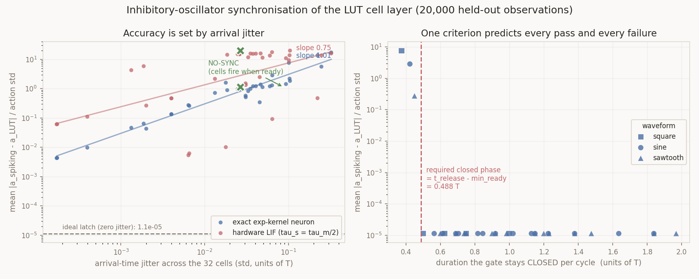

# Does an inhibitory oscillator replace the latch? — 332 configs, 20,000 held-out samples

**Yes, cleanly — but only if the cells have persistent memory, and the requirement is not
the one we expected.** An imposed fixed-period inhibitory rhythm recovers the teacher-exact
1.145e-05 with *all three* waveforms and *both* neuron models. What decides success is not
the period, not the waveform, and not the inhibition strength on their own, but a single
derived quantity — **how long the gate stays closed per cycle**. The emergent (ING) rhythm
**fails outright**.

Total runtime ~100 s. Nothing committed. Files: `inhib_sync.py`, `plot_inhib.py`,
`results/inhib_sync.json`, `results/inhib_sync.png`.

---

## What the latch was actually hiding

A cell's address bit is a race, and a race is only *resolved* at the later of the two
spikes. So `r[t,i] = max(t_a, t_b)` and `ready[t] = max_i r[t,i]`, and both are
data-dependent. On 20,000 real observations with the encoder window `T = 1.0`:

| | value |
|---|---|
| `ready` (per cell) | min **0.5011**, mean 0.6375, max **0.9685** |
| per-sample spread of `ready` across the 32 cells | mean **0.0873**, p99 0.3175, max 0.3802 |

That spread is exactly what the idealised latch erases. Its cost, measured directly:

| reference | arrival jitter (span) | exact neuron | hardware LIF |
|---|---|---|---|
| **IDEAL LATCH** (all 32 released together) | 0 | **1.1e-05** | **1.4e-05** |
| **NO SYNC** (each cell fires the instant it is ready) | 0.0873 | **1.141** | **19.97** |

So the latch is worth five orders of magnitude on the exact neuron and six on the LIF.
Without *some* synchronisation the whole weight-coded result collapses. The question is
whether a rhythm can supply it.

## The answer: one criterion predicts every result

Model each cell as a coincidence detector whose threshold is raised by a periodic
inhibition, `Theta(tau) = Theta0 + A*phi(tau)`, with `Theta0 = 5.2` strictly between 5 and 6
so all six races must match. Then:

> **The gate must stay CLOSED continuously from the earliest cell's `ready` time until the
> release. Its closed-phase duration must satisfy**
> ```
> closed_duration  >=  t_release - min_ready  =  0.989 - 0.501  =  0.488 T
> ```
> **If it does, arrival jitter is exactly zero and the readout is teacher-exact. If it does
> not, cells that ripen during an earlier open window escape early and jitter appears.**

Tested against all six waveform/amplitude combinations at `P = 0.75 T` and `P = 1.0 T`
(latch memory, aligned release, exact neuron) — **it predicts every pass and every failure,
with no exceptions**:

| waveform | A | closed fraction | closed duration @ P=0.75 | predicted | measured jitter | measured error |
|---|---|---|---|---|---|---|
| square (duty 0.5) | – | 0.500 | 0.375 | **FAIL** | 0.271 | 7.642 |
| sawtooth | 2 | 0.600 | 0.450 | **FAIL** | 0.034 | 0.275 |
| sine | 2 | 0.564 | 0.423 | **FAIL** | 0.245 | 2.865 |
| sine | 10 | 0.820 | 0.615 | pass | 0.000 | **1.145e-05** |
| sawtooth | 10 | 0.920 | 0.690 | pass | 0.000 | **1.145e-05** |
| sine | 50 | 0.920 | 0.690 | pass | 0.000 | **1.145e-05** |

At `P = 1.0 T` every one of them passes (closed durations 0.500–0.984, all ≥ 0.488).

**This reframes the P ≥ T bound.** P ≥ T is *sufficient but not necessary*. A 50 %-duty
square gate genuinely needs `P >= 2 x 0.488 ≈ T`; but a sharply-tuned sine or sawtooth,
whose open window is only 8–18 % of the cycle, runs happily at **P = 0.75 T**. The binding
constraint is on the closed phase, and stronger inhibition buys a shorter period. The
Izhikevich fixed-period story holds up — with the refinement that what matters is the duty
cycle of suppression, not the period.



## Accuracy is linear in arrival jitter, and the LIF is 14x more fragile

Across all 72 non-degenerate configs (log–log fit over the jitter range 1.7e-04 to 0.32):

| neuron | slope | error / jitter_std, small-jitter regime | jitter budget for 1 % error |
|---|---|---|---|
| exact exp-kernel | **1.01** | ~25 | `jitter_std < 4e-04 T` |
| hardware LIF | 0.75 | ~350 | `jitter_std < 3e-05 T` |

The exact neuron's slope of 1.01 with a coefficient of ~25 is the predicted behaviour:
`a = tph*tau*log S`, so a relative perturbation `delta/tau` in `S` moves the action by
`tph*delta = 32*delta`. Measured 25 rather than 32 because symmetric jitter partially
cancels at first order.

**The LIF is ~14x more jitter-sensitive**, and that is structural, not a constant factor.
Its corrected decode is exact *because* synchronous arrivals force `A = B`; jitter breaks
that identity, and `B` weights arrivals by `exp(2s/tau_m)` against `A`'s `exp(s/tau_m)`, so
the two drift apart at different rates. Practically: **on real hardware the synchrony
budget is ~3e-05 of the coding window**, which in practice means a hard gate, not a soft
rhythm.

## Cell memory is the real requirement — and it is expensive

The two cell models give qualitatively different answers, and this is the modelling choice
that matters most.

**With `latch` memory** (each arrived race latches; a ready cell holds its address until
released), every ready cell sits at exactly `u = 6`. They are therefore *indistinguishable*
to the threshold, so they all cross at the same instant **whatever the waveform** — hence
three waveforms giving byte-identical 1.145e-05. The waveform is irrelevant; only the
closed-phase duration matters.

**With `decay` memory** (`u = sum_i exp(-(tau - r_i)/tau_c)`, no persistence) the drive
falls away while the cell waits, so holding a cell until a late release silently drops it.
The dedicated `tau_c` sub-sweep (P = 1.5 T, aligned release, exact neuron):

| `tau_c` | square | sine | sawtooth |
|---|---|---|---|
| 0.5 T | miss 100 %, err 186 | miss 100 % | miss 100 % |
| 1 T | miss 100 %, err 186 | miss 100 % | miss 100 % |
| 3 T | miss 36 %, err 2.81 | miss 97 %, err 168 | miss 97 %, err 168 |
| **10 T** | miss 0 %, **1.145e-05** | miss 0 %, **0.0465** | miss 0 %, **0.0645** |

So a coincidence detector needs a synaptic time constant of **≥ 10x the whole input coding
window** to survive being held. That is a real hardware cost, and it is the honest price of
"no latch".

And note what happens at `tau_c = 10 T`: the **square** gate is still exact (1.145e-05)
while **sine and sawtooth are not** (0.046 / 0.064, from a residual jitter of 0.005). This
is the clean statement of the waveform question: **waveform only matters when the cell has
no memory.** Without persistence, cells have slightly different drive levels (their race
spreads differ), so a graded threshold releases them at slightly different times; a hard
gate releases them together regardless.

## The emergent (ING) rhythm fails

Best ING result over 24 configs (`tau_i` ∈ {0.1, 0.3, 1.0}, `g` ∈ {5, 20}):

| memory | neuron | best error | jitter | miss |
|---|---|---|---|---|
| latch | exact | **1.132** | 0.139 | 0 % |
| latch | lif | 10.99 | 0.233 | 0 % |
| decay | exact | 3.918 | 0.061 | 74 % |
| decay | lif | 5.117 | 0.021 | 90 % |

**1.132 is no better than no synchronisation at all (1.141).** The reason is structural and
I think it generalises: in ING the inhibition is *driven by the cells that fire*, so the
first cells to ripen fire, and their own spikes then raise the threshold and **suppress the
cells that were about to follow**. Self-generated inhibition *staggers* firing — it is a
sequencing mechanism, not a synchronising one. What this circuit needs is inhibition that
is released *simultaneously for everyone*, which requires a pacemaker driven by something
other than the cells themselves.

**This is the one place where the biological story does not carry over**, and it is worth
flagging as a genuine negative result rather than a tuning failure: I swept an order of
magnitude in both `tau_i` and `g`, and the mechanism is wrong in kind, not in degree.

## Anything surprising

1. **The waveform turned out to be a red herring** under the assumption we were most
   likely to make (latching cells). Three quite different inhibition profiles give
   *byte-identical* results. The interesting axis was duty cycle all along.
2. **P < T can work.** I expected `P >= T` to be a hard bound and it is not — a sharply
   tuned sine at `P = 0.75 T` is teacher-exact. Stronger inhibition buys a shorter period.
3. **The LIF's jitter fragility (~14x)** was not something I anticipated; it follows from
   `A` and `B` responding to arrival time at different exponential rates. It means the
   earlier "variant W is teacher-exact on a realistic LIF" result is *conditional on very
   tight synchrony* — a caveat that belongs next to that headline.
4. **ING actively desynchronises.** I expected it to be noisier than a clock, not to fail
   in principle.

## Modelling assumptions — please check these

1. **`Theta0 = 5.2`, strictly between 5 and 6.** This makes address recovery correct *by
   construction*: a 5-of-6 cell can never cross, for any `tau_c`, waveform or period. So
   this experiment measures TIMING only and cannot surface address errors. That was
   deliberate, but it means "address recovery stays correct" is an assumption here, not a
   finding.
2. **The decoder's reference time is the population median firing time**, not a nominal
   clock phase. Any real decoder calibrates to what it receives, and this makes the
   comparison purely about arrival *spread*. Using a nominal phase instead would add a bulk
   offset that is trivially correctable and would obscure the jitter effect.
3. **Cells that never fire contribute nothing** — a dropped synapse. That is why miss rates
   translate into enormous errors (186 normalised at 100 % miss, where `S` collapses to the
   clamp). Those rows are "the circuit did not fire", not a meaningful accuracy.
4. **`min_ready = 0.501` is a property of this dataset**, so the 0.488 T threshold is
   empirical. The *form* of the criterion is general; the number is not.
5. **The ING pool is per-sample**, i.e. each observation is an independent network with its
   own 32 cells driving its own inhibitory unit. A shared pool across a batch would be a
   different (and less meaningful) experiment.
6. **Only variant W (weight-coded) is simulated here**, since that is the configuration
   that was teacher-exact. Delay coding would add the delays on top of the arrival jitter;
   given it already loses information with *perfect* sync, I did not pursue it.

## Recommendation

A fixed-period inhibitory gate is a sound replacement for the latch, and cheap: any
waveform works, and `P` can be *below* the coding window if the inhibition is strong. But
the two hard requirements are unavoidable:

* **cells must latch** (persistent drive), or need `tau_c >= 10 T`, which is worse;
* **synchrony must be near-perfect on a real LIF** — a budget of ~3e-05 T, which argues for
  a hard square gate rather than a graded rhythm.

Do not pursue ING for this circuit. If a biologically-generated rhythm is wanted, it needs
a pacemaker population that is not driven by the cells it gates.

## Reproduce

```sh
cd experiments/walker2d-lut/exp19_lut-lse-expmlpcrit-t32/distill/spiking
python inhib_sync.py --n-val 20000 --steps 3000 --ing-steps 1200 --tag inhib_sync
python plot_inhib.py
```
