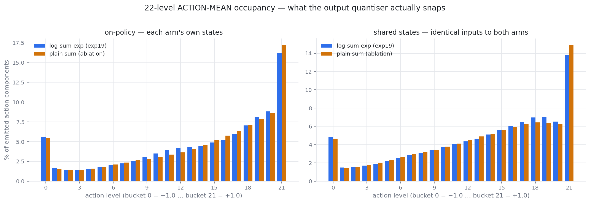
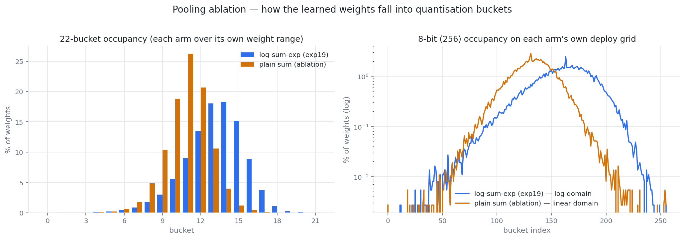
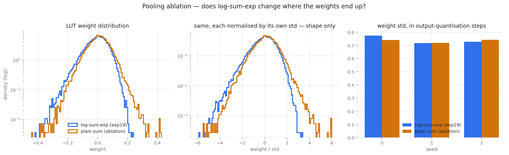

# exp24 — does log-sum-exp pooling justify itself on quantisation grounds?

**Takeaway: no.** On the quantity the 22 levels actually snap — the **action mean** — the two
arms are indistinguishable: normalised entropy **0.9504 vs 0.9493**, all 22 buckets occupied
by both, rail mass 18.6 % vs 19.5 %. Log-sum-exp does not quantise better into the 22 action
buckets. It also does not change the weight scale (std 0.0706 vs 0.0699) and does not help
return (5707 vs 6196 for plain sum). The post's existing hedge, *"a plain sum would have been
fine too"*, is the right call and is now measured rather than asserted.

The one place log-sum-exp does look better — weight-bucket evenness, 0.72 vs 0.63 — is on a
quantity **nothing in the deploy path quantises to 22 levels**. See the correction below.

## First, a correction to the framing

The experiment was posed as "22-bucket **weight** quantisation". There is no such thing in
the repo. Two different quantisers, on two different quantities:

| | what it snaps | levels | spacing | where |
|---|---|---|---|---|
| `UniformActionQuantizer` | the **action mean** | **22** | **linear**, `linspace(-1, +1, 22)`, step 2/21 = 0.0952 | `src/act_quant.py` |
| Stage-3 weight fit | the **LUT weights** | **256 (8-bit)** | **uniform in `L = W/τ`**, i.e. **log domain** | `stage3_cd_bigdata.py:74-78` |

```python
L0 = W0 / tau
lo, hi = L0.min(), L0.max()
step = (hi - lo) / 255.0
L = lo + np.round((L0 - lo) / step) * step
```

The weight grid is log-domain *because* the readout exponentiates (`S = Σ_t exp(L_t)`), which
is the whole point of the log-sum-exp. **It is therefore not defined for the plain-sum arm at
all**: with no τ and no exponential, a plain-sum readout decodes linearly and its natural
weight grid is uniform in `W` itself. Both are reported below, each arm on its own grid.

## Setup

Two arches differing in exactly one constructor argument:

| | arm A | arm B |
|---|---|---|
| arch | `fastlut_lse_sum_expmlpcrit` (exp19) | `fastlut_sum_expmlpcrit` (new) |
| pooling | `out = T·τ·log((1/T)·Σ_t exp(w_t/τ))` | `out = Σ_t w_t` |
| `exp_outputs` | `True` | `False` |

Everything else identical, and *verified* identical: built with the same seed, every tensor
the two arms share is bit-identical — LUT weights, both anchor-pair buffers, the
soft-backward buffers, `log_std`, `tau_c_raw`, and all six critic tensors. The only extra
parameter in A is the actor's `tau_raw`. Arm B is the τ→∞ limit of arm A, not a different
architecture: the sum-scaled log-sum-exp was constructed so that limit is exact.

3 seeds each, trained from scratch, 768 updates, 8192 envs, under exp23's full quantisation
regime — input quantiser (128 ticks, σ=1.0), **22-level output quantisation**, `--oob-penalty
0.1` — and deployment-matched physics (`--obs-clip-vel 10 --solver-iters 100 --ls-iters 50`).
From scratch rather than fine-tuned from an exp19 checkpoint, which would have handed arm B
weights already shaped by the operator under test. 1815 s wall for all six.

## Task performance — plain sum is not worse

Deterministic closed-loop return, 512 envs × 2000 steps, both quantisers on:

| seed | A (log-sum-exp) | B (plain sum) |
|---|---:|---:|
| 0 | 5923.7 ± 614.6 | 5639.9 ± 886.0 |
| 1 | 5680.7 ± 548.3 | 6567.5 ± 357.2 |
| 2 | 5516.9 ± 88.6 | 6379.5 ± 579.3 |
| **mean** | **5707.1** | **6195.6** |

Arm B walks, and walks well — the point estimate favours it by **+488 (8.6 %)**. With three
seeds and this spread that is not a significant win for plain sum, but it is decisively *not*
a win for log-sum-exp: A's best seed (5923.7) is below B's worst-but-one, and B's minimum
(5639.9) sits above A's median. Whatever the pooling operator buys, it is not return.

## Weight distributions — nearly the same, except in the tails

Pooled over 3 seeds, 36,864 weights per arm:

| | A (log-sum-exp) | B (plain sum) |
|---|---:|---:|
| mean | −0.00744 | +0.00797 |
| **std** | **0.07056** | **0.06992** |
| min / max | −0.4148 / +0.2345 | −0.4408 / +0.4198 |
| **dynamic range** | **0.6493** | **0.8606** |
| \|w\|max | 0.4148 | 0.4408 |
| p99 \|w\| | 0.2069 | 0.2008 |
| excess kurtosis | +0.86 | +1.13 |
| \|w\| < 1e-3 | 2.14 % | 2.38 % |
| \|w\| < 1e-2 | 12.67 % | 13.02 % |

The **scale is the same to within 1 %** — the pooling operator does not make the weights
tighter or wider in std, and does not change how much mass sits near zero. Two differences
are real:

* **B's dynamic range is 33 % wider** (0.861 vs 0.649), driven entirely by its positive tail
  (+0.42 vs +0.23). For a spiking build that matters directly: Stage-3 delay span is set by
  the *spread* of the table weights, so a wider range costs ticks.
* **B is more peaked** (excess kurtosis 1.13 vs 0.86) — more mass in the centre, longer thin
  tails.

## THE HEADLINE — 22-bucket occupancy of the ACTION MEAN

This is the comparison that bears on the post, because the action mean is what the 22 levels
snap. Measured two ways, both pooled over 3 seeds:

* **on-policy** — each arm drives its own trajectory (512 envs × 2000 steps, every 4th step
  recorded, 768k action components per arm). The deployment-relevant distribution, but the
  arms visit different states.
* **shared-state** — both arms evaluated on the *same* 240k states, the union of all six
  runs sampled evenly so neither arm's own distribution dominates. This is the controlled
  comparison: identical inputs, only the pooling differs.

| shared state | A (log-sum-exp) | B (plain sum) |
|---|---:|---:|
| **normalised entropy** | **0.9504** | 0.9493 |
| near-empty buckets | **0 / 22** | **0 / 22** |
| busiest bucket | **13.78 %** | 14.88 % |
| rail mass (±1 buckets) | **18.59 %** | 19.53 % |
| out-of-band before clipping | **14.96 %** | 16.05 % |
| std(μ) | 0.6352 | 0.6451 |

| on-policy | A | B |
|---|---:|---:|
| normalised entropy | **0.9294** | 0.9239 |
| busiest bucket | **16.23 %** | 17.20 % |
| rail mass | **21.84 %** | 22.65 % |
| out-of-band | **16.67 %** | 17.71 % |

**The arms are the same to three decimal places.** A is marginally better on every metric —
and every margin is a fraction of a percent. Both use all 22 buckets, neither leaves any
near-empty, and both pile the same ~19–23 % of their mass on the rails.



Two things that are true of *both* arms and worth more attention than the A-vs-B gap:

* **The rails dominate, asymmetrically.** The `+1` bucket alone holds 13.8–17.2 % of all
  emitted components; the `−1` bucket holds 4.7–5.6 %. The `+1` rail is roughly three times
  the `−1` rail in both arms.
* **~15–18 % of raw μ is still out of band** even with `--oob-penalty 0.1` running. The
  penalty reduces the sprawl; it does not remove it.

Per action dimension, shared-state — rail mass and entropy:

| dim | A rails | A H | B rails | B H |
|---|---:|---:|---:|---:|
| 0 | 23.00 % | 0.8146 | 21.46 % | 0.8170 |
| 1 | 17.27 % | 0.9519 | 15.10 % | 0.9604 |
| 2 | 14.28 % | 0.9790 | 14.99 % | 0.9870 |
| 3 | 23.54 % | 0.7854 | 23.45 % | 0.8210 |
| **4** | **16.73 %** | 0.9194 | **24.95 %** | 0.9058 |
| 5 | 16.74 % | 0.9791 | 17.24 % | 0.9807 |

Dims 0 and 3 are the most rail-bound in both arms (~23 %). The one genuine per-dim
difference is **dim 4**, where plain sum saturates half again as often — 24.95 % vs 16.73 %.
That is the only place in this experiment where the pooling operator visibly changes
behaviour on a single output, and it is a point *against* plain sum rather than for it.

## Weight-bucket occupancy — the wrong quantity, kept for completeness

Nothing in the deploy path quantises weights to 22 levels; they go to 256 (8-bit, log
domain). This section is retained because it was the original framing and because the 256-bucket
half *is* the real weight grid.

**22 buckets**, each arm over its own weight range (evenness as normalised entropy
H/log 22; 1.0 = perfectly uniform):

| | A (log-sum-exp) | B (plain sum) |
|---|---:|---:|
| **normalised entropy** | **0.7206** | **0.6320** |
| near-empty buckets (<0.1 %) | **6 / 22** | 9 / 22 |
| occupied buckets | 22 / 22 | 22 / 22 |
| busiest bucket | **18.28 %** | 26.21 % |

**256 buckets (8-bit), each arm on its own deploy grid** — A in the log domain (`W/τ`,
τ = 0.0905), B in the linear domain:

| | A (log domain) | B (linear domain) |
|---|---:|---:|
| grid span | [−4.582, +2.591], step 0.0281 | [−0.441, +0.420], step 0.0034 |
| **normalised entropy** | **0.8490** | 0.7990 |
| near-empty buckets | **128 / 256** | 157 / 256 |
| occupied buckets | **222 / 256** | 197 / 256 |
| busiest bucket | **2.46 %** | 2.85 % |

So arm A *does* fill its weight buckets more evenly, on both grids — about 0.09 of normalised
entropy on 22 buckets and 0.05 on 256, with a third fewer near-empty buckets. Part of that is
mechanical rather than learned: quantising in the log domain stretches the small-\|w\| region
where most of the mass sits, which is precisely what a log-domain grid is *for*.

**But this is not the quantisation the post's 22 levels refer to.** On the action mean, where
those 22 levels actually apply, the same comparison gives 0.9504 vs 0.9493 — a gap of 0.001
instead of 0.09. The weight-side advantage does not survive the move to the right quantity.





## For the post's Constraint 2 paragraph

The post currently says the log-sum-exp is buildable because *"a synapse can supply an
exponential, a dendrite can supply a sum, and an exponentially growing membrane supplies a
logarithm as its time-to-threshold"*, and adds *"a plain sum would have been fine too; a
softmax or a matmul would not."*

That parenthetical is doing more work than it looks. Measured: a plain sum trains to the same
place (**within 1 % on weight std, within seed noise on return, if anything better**) and
**quantises into the 22 action levels indistinguishably** — entropy 0.9504 vs 0.9493, same
number of occupied buckets, same rail mass to within a percentage point.

What log-sum-exp does buy, and this ablation does not test, is that its *own* Stage-3
construction exists and is cheap: exp/sum/log map onto synapse/dendrite/membrane directly,
and the 33 %-narrower weight range means fewer ticks of delay span.

**One-line takeaway:** log pooling is not required by the quantisation — on the 22 action
levels the two poolings are indistinguishable and 8 bits is free for both — but it *is*
required by **this** spiking build, whose output neuron is an anti-leaky membrane whose
time-to-threshold is a logarithm. The exponential's justification is the substrate, not the
numerics.

## The spiking analogue of plain sum — BLOCKED, and the reason is the finding

The natural next step is to build arm B's spiking counterpart and see whether it still walks.
**It is not a config flip, and the reason is more interesting than the result would have
been: both spiking pipelines are structurally built on the exponential.**

Where it is baked in, in the amplitude build
(`experiments/neurodarwinism/src/tiny_lut_quantised_pipeline.py`):

| line | what |
|---|---|
| 156, 299 | `tau = float(Z["tau_actor"])` — a **required field** of the policy npz. Arm B has no `tau`; there is nothing to read. |
| 222 | the synaptic weight is literally `beta[o] * np.exp(W[t,k,o] / tau)` — **the synapse supplies the exponential** |
| 127-141 | the calibration solves `n = tau_eff · log(1/(beta·S))` with `S = Σ_t exp(w_t/tau)`, then picks `beta` from the reachable output range — **the whole crossing-time calculus assumes the log** |
| 317 | the reference readout it validates against is `log(exp(sel/tau).mean(1))` |

And the output neuron itself, in **both** pipelines:

```python
NeuronMeta(neuron_type=6, cf_2=0.0, cf_1=+1.0 / TAU_M_OUT, cf_0=0.0, ...)
```

`cf_1` is **positive** — an anti-leaky, exponentially *growing* membrane. Its time-to-threshold
is what supplies the logarithm. That is the mechanism the post describes as "an exponentially
growing membrane supplies a logarithm as its time-to-threshold", and it is a property of the
neuron type, not a parameter.

The delay-encoded build is not an escape hatch: `tiny_lut_full_pipeline.py`'s own docstring
says *"STAGE 3 — 6 anti-leaky output neurons, arrival-time logsumexp → affine decode"*, it
hardcodes `TAU = 0.09036568`, its amplitude calibration is
`amps[o] = 1/(2·Σ exp((arr.max()-arr)/tau_eff))`, and its reference readout is
`TPH·TAU·(log(Σ exp(ws_q/TAU)) − log(TPH))`. **Delay vs amplitude is a choice about how the
weight is delivered; both pool with a log-sum-exp.** There is no plain-sum readout anywhere
in the repo.

### What a clean plain-sum path would take

Stages 1 and 2 — order detection and one-hot lookup — are pooling-independent and would carry
over unchanged. Stage 3 is a new construction:

1. **A different output neuron.** A perfect integrator (`cf_2 = 0, cf_1 = 0`) with a constant
   drive `cf_0 = I` crosses threshold at `T = (θ − Σ_t w_t)/I` — affine in the plain sum,
   which is exactly what is wanted. spnet supports it; it is a `NeuronMeta` away.
2. **A new calibration.** The `beta` / `tau_eff` log-crossing solve is replaced by choosing
   `I`, `θ` and the affine decode so the reachable `Σ w` range maps onto the tick budget.
3. **Signed weight delivery.** The exponential made every synaptic weight positive; a plain
   sum needs signed weights. spnet allows negative weights, but the memory/gate charge
   accounting in Stage 2→3 assumes the current sign convention and would need rechecking.
4. **A new export + actor.** The npz carries `tau_actor`, `beta` and the affine decode; a
   plain-sum artefact needs its own fields and its own numpy actor.
5. **Re-verification end to end** — Stage-3 parity, the tick budget, and the coordinate-descent
   weight fit all assume the log domain and would be redone.

That is a Stage-3 rebuild on the scale of the original, not an afternoon. Reported rather than
hacked around, per the brief.

## What *can* be measured without the spiking substrate: 8-bit weight quantisation

The other half of the question needs no new neuron. Each arm's weights quantised to **256
levels on its own natural grid** — log domain (`L = W/τ`) for A, linear in `W` for B, since
there is no τ to divide by — and evaluated in **gymnasium Walker2d-v5, 30 episodes**, with the
same input (128-tick companding) and output (22-level) quantisers.

| arm | seed | float32 | 8-bit | full-1000 (float → 8-bit) |
|---|---|---:|---:|---|
| A log-sum-exp | 0 | 5857.9 ± 773.4 | 5695.9 ± 1183.7 | 28/30 → 28/30 |
| A | 1 | 5580.1 ± 947.5 | 5763.0 ± 90.0 | 29/30 → **30/30** |
| A | 2 | 5520.3 ± 55.8 | 5517.6 ± 73.9 | 30/30 → 30/30 |
| B plain sum | 0 | 5839.3 ± 160.7 | 5847.5 ± 124.6 | 30/30 → 30/30 |
| B | 1 | **6587.1 ± 78.5** | **6597.1 ± 52.7** | 30/30 → 30/30 |
| B | 2 | 6411.9 ± 502.6 | 6275.6 ± 983.9 | 29/30 → 29/30 |

| arm | float mean | 8-bit mean | Δ |
|---|---:|---:|---:|
| A (log grid) | 5652.7 | 5658.8 | **+6.1** |
| B (linear grid) | 6279.4 | 6240.1 | **−39.4** |

**8 bits is free for both.** Both deltas are far inside the seed spread — the log grid is not
buying robustness to quantisation that the linear grid lacks. Plain sum survives 8-bit
*linear* weight quantisation exactly as well as log-sum-exp survives 8-bit *log* quantisation.

Arm B's deploy seed by the usual criterion (deployed performance, never-falls preferred) is
**seed 1** — highest mean (6587.1), lowest spread (± 78.5) and 30/30 full episodes, both
before and after quantisation. No trade-off to make.

## Caveats

* Three seeds, one configuration, trained from scratch rather than fine-tuned from exp19 —
  the regime the shipped artefact actually came from.
* The 8-bit comparison puts each arm on a *different* grid (log vs linear) because that is
  what each arm's deploy path would use. The entropies are therefore not measured in the same
  units; the 22-bucket comparison, which is linear for both, is the like-for-like one.
* Return is measured in the warp env with the training quantisers, not in gymnasium.
