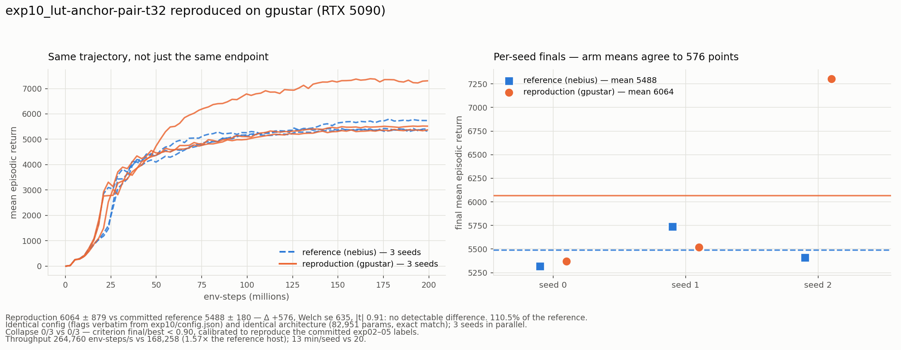

# repro_exp10_gpustar — exp10 reproduced on gpustar (RTX 5090)

A **host-verification rerun**, not a new experiment: it re-runs `exp10_lut-anchor-pair-t32`
verbatim on gpustar to confirm the walker2d-lut framework installs and trains correctly on
this machine before gpustar joins the programme. Deliberately named outside the `expNN_`
sequence so it cannot collide with `exp13/14/15`, which `src/run_bench13.sh` already claims.

**Verdict: reproduced. 6063.9 ± 879.3 vs the committed 5488.4 ± 179.9 — Δ +575, Welch
se 635, |t| 0.91. No detectable difference. 0/3 collapse, matching the reference.**



## 1. The result

| seed | best | final | final/best |
|---:|---:|---:|---:|
| 0 | 5387.7 | **5369.6** | 0.997 |
| 1 | 5521.9 | **5517.7** | 0.999 |
| 2 | 7386.8 | **7304.5** | 0.989 |

| arm | final | best | collapse | throughput | wall |
|---|---|---|:-:|---:|---:|
| reference (nebius, committed) | 5488.4 ± 179.9 | 5551.0 ± 175.9 | 0/3 | 168,258 /s | 19.9 min/seed |
| **reproduction (gpustar)** | **6063.9 ± 879.3** | 6098.8 ± 912.4 | 0/3 | **264,760 /s** | **12.7 min/seed** |

**Read the seeds, not just the mean.** Seeds 0 and 1 land essentially *on* the reference
(5370 and 5518 against its 5319 / 5738 / 5408). The entire +575 mean shift and the 4.9×
larger standard deviation come from **seed 2 alone**, which drew a 7305 run — above every
seed in the reference. That is a good draw, not an anomaly: `exp02` already produced a 7007
seed on this task with the MLP actor. Per-seed matching is not expected anyway (different
GPU ⇒ different nondeterministic reductions ⇒ different trajectory from the same seed); the
arm means and the collapse count are what carry the claim, and both agree.

At n=3 this comparison cannot resolve a real ~500-point difference from a lucky draw. It is
not evidence that gpustar trains *better* — it is evidence that gpustar trains *the same
thing*, which is all a host check needs to establish.

## 2. Why the comparison is trustworthy

- **Config is verbatim.** Flags copied from `exp10/config.json` (provenance `bench12/t32`),
  identical to the tph=32 line of `src/run_bench12.sh`. Only deviation: `--out` takes an
  absolute path, because `ppo.py` resolves `--out` relative to `dirname(ppo.py)` (`src/`),
  and the original ran from a repo root that *was* the src dir. Pure I/O routing.
- **Architecture is bit-for-bit the same size** — 82,951 params, an exact match to the
  committed `config.json`, checked in a 3-update smoke run before spending GPU.
- **Metric definitions taken from `src/summarize_bench.py`**, not re-invented: `final` = last
  `ep_ret_mean`, `best` = max over history, aggregate std = population (ddof=0). Verified by
  reproducing the committed 5488.4 ± 179.9 from the reference's own per-seed records.
- **Collapse criterion calibrated, not guessed.** No numeric definition exists in the repo —
  the READMEs only describe collapse qualitatively. `final/best < 0.90` reproduces every
  committed label exactly (exp02 2/3, exp03 1/3, exp04 1/3, exp05 0/3), with a wide margin
  between collapsed (≤0.796) and healthy (≥0.940) seeds. Applied identically to both arms.
  As a side effect it independently confirms the top-level README's "0/9 collapse" claim for
  the anchor-pair family (exp10/11/12 all ≥ 0.981).

## 3. Environment on gpustar

The framework ran cleanly on the first attempt after one install. `warp-lang` and
`mujoco_warp` were **absent** from `~/projects/spiky/.venv` and had to be installed from the
network (the one approval this task needed):

```
pip install warp-lang mujoco-warp     ->  warp-lang 1.16.0, mujoco-warp 3.11.0
```

Everything else was already present and needed nothing: torch 2.9.1+cu130, mujoco 3.10.0,
gymnasium 1.3.0, numpy 2.2.6, and the editable `spiky` install providing
`spiky.lutorch.fast_multi_head_lut.FastMultiHeadLut`. `warp_env.py`'s self-test passed
(`SELF-TEST OK`), physics CUDA-graph capture works, and the run held **99% mean GPU / 7.7 GB**
across three co-resident seeds.

Note the top-level README claims `torch 2.13+cu130`; gpustar has **2.9.1+cu130** and the
reproduction is unaffected. `mujoco_warp` 3.11 also runs fine against `mujoco` 3.10.

## 4. Cost

**772 s wall (12.9 min) for all three seeds in parallel**, 12.7 min/seed, at 264,760
env-steps/s — **1.57× the reference host's 168,258**. The reference took 19.9 min/seed.

## 5. Files

| file | what |
|---|---|
| `run_repro.sh` | the run — 3 seeds in parallel, flags verbatim from exp10 |
| `collect.py` | builds `config.json` / `metrics.csv` / `summary.json`; metric defs from `summarize_bench.py` |
| `plot_repro.py`, `repro_exp10.png` | the comparison figure |
| `progress_monitor_repro.py` | live Slack progress bar (adapted from `src/progress_monitor12.py`) |
| `ppo_s{0,1,2}.json` | raw per-seed run records (full per-update history) |
| `agg.gpu` | GPU utilization trace |

Checkpoints not saved (never tracked); reproduce from `config.json`.
