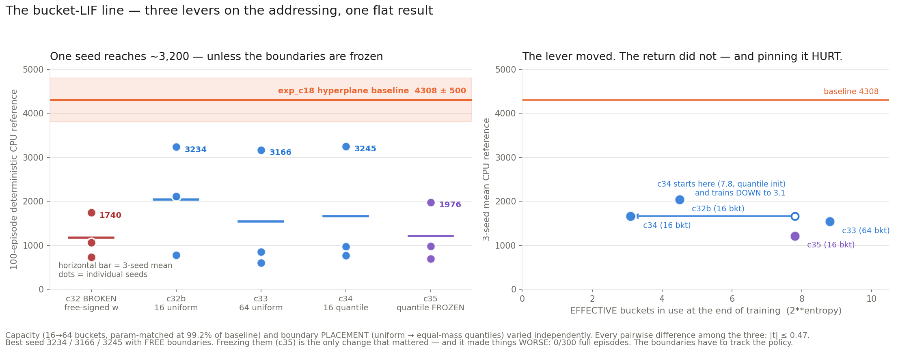

# The bucket-LIF line (exp_c32 → exp_c35) — summary

Five 3-seed runs of `BucketLIFDetectorsMHL` as the Walker2d SAC actor's index front-end.
The model gives each table ONE LIF neuron and uses **which time bucket its first spike lands
in** as the row index — a monotone quantisation of one scalar, where every other front-end
in this chapter addresses with a set of independent sign tests.

**Bottom line: the bucket readout tops out near 3,200 on Walker2d, and none of capacity,
resolution or boundary placement moves it. The baseline is 4,308 ± 500.**

| run | what changed | params | CPU-ref mean | best seed | full ep |
|---|---|---:|---:|---:|---:|
| c32 | BROKEN — free-signed `w` | 7,840 | 1174.4 ± 517.2 | 1739.9 | 0/300 |
| c32b | the three fixes | 7,840 | **2041.2 ± 1230.1** | 3234.2 | 98/300 |
| c33 | 64 buckets, **param-matched** | 27,808 | 1536.2 ± 1416.8 | 3165.9 | 83/300 |
| c34 | quantile boundaries | 7,840 | 1661.8 ± 1375.0 | 3245.2 | 91/300 |
| c35 | quantile + **frozen** | 7,840 | 1212.9 ± 676.0 | 1975.9 | **0/300** |
| — | exp_c18 hyperplane baseline | 28,032 | **4308.0 ± 500.1** | 5286.6 | — |

## 1. The fixes were real but not sufficient

nucstar's three corrections — bounded excitatory `w = 2·sigmoid(w_raw)`, hot init
`w_raw ~ N(-2.2, 0.5)`, tau floor 1e-3 → 1.0 — took the model from **0/300 full episodes to
98/300**. The first dominates: with free-signed weights the membrane rarely reached
`theta_mem`, neurons never spiked, and non-spiking folds into the last bucket by
construction (no-spike mass 0.97 → 0.030 at init).

On the mean that is +866.8, |t| 1.13 — not resolvable at three seeds. The qualitative
rescue is unambiguous; the quantitative one is not established.

## 2. Capacity is not the constraint

exp_c33 restores 64 rows/table and is **param-matched at 99.2%** of the baseline (27,808 vs
28,032, same 24,576-entry table). Result: **no better than 16 buckets** (−505, |t| 0.47) and
still resolvably below the baseline (|t| 3.29). The 16-row table was never the explanation
for c32b's shortfall.

Going 16 → 64 buckets added **2.00 bits of capacity and 0.52 bits of realised entropy**:
effective buckets 4.5 → 8.8 while the *unused* fraction rose from 72% to **86%**. Adding
resolution to a range the model does not enter buys nothing.

## 3. Placement is not the constraint either — and the collapse is an attractor

exp_c34 places the boundaries at equal-mass quantiles of the measured first-spike
distribution (measured on a random-action rollout inside the trainer). Motivation: on a
trained c32b actor the middle 50% of spike times spans **3.27 of 32 time units (10% of the
window)**, so uniform cuts waste ~90% of their resolution.

It worked as designed at init — **7.8 effective buckets vs c32b's 4.5 after full training**,
100% bucket coverage during training vs 83–87%. Return: **no difference** (−379, |t| 0.36).

The unexpected part: **c34 trained DOWN from 7.8 effective buckets to 3.1** — below the
uniform-init run it was meant to beat. The narrow addressing is not a bad initialisation to
be corrected; it is where this objective actively drives the model.

## 4. …but the movement is necessary. Freezing it hurts.

exp_c35 pins the boundaries at the quantile init (gradients on `beta_base`/`beta_raw`
zeroed; verified — final span `[13.54, 32.60]` is exactly the init span). If the collapse
were the problem, preventing it should help.

It does the opposite: **1212.9 ± 676.0 and 0/300 full episodes** — the only configuration
after the original bug where *no* seed learned to walk. Best seed 1975.9 against ~3,200
everywhere else.

So the boundaries must **track the policy**. Freezing them at the random-policy spike
distribution locks in a quantisation that goes stale as the policy changes. The entropy drop
is the model following its own shifting spike distribution, not a pathology.

This also corrects the framing I carried into Phase 3: "uniform boundaries waste resolution,
place them by quantiles" was wrong in an interesting way — *any* fixed placement is a
snapshot, and the fix is not a better snapshot.

## 5. What is left

Three independent levers moved the addressing statistics substantially and left the return
flat; the fourth (freezing) moved the return, downward. Best seed across the free-boundary
configurations: **3234 / 3166 / 3245 — a spread of 79 points.** Every pairwise difference
among them is |t| ≤ 0.51.

The shape is identical everywhere: **exactly one seed reaches ~3,200 with 83–91/100 full
episodes; the rest stall under 1,100 with 0/100.** Configuration changes nothing about the
ceiling; it changes only whether a given seed takes off.

The remaining structural difference from every stronger model in this chapter is
expressivity of the index: **16 or 64 ordered outcomes from one monotone scalar, versus 2⁶
outcomes from six independent sign tests.** That is the hypothesis I would test next, and it
is not a tuning question. Two concrete forms:

- **More than one neuron per table.** Two neurons × 8 buckets each gives 64 combinations
  from the same parameter budget, and restores independence between address dimensions.
- **Give no-spike its own row** instead of folding it into the last bucket. 15–26% of the
  mass is that atom; it currently sits inside the ordered range and cannot be split by any
  boundary scheme, which is also where the degenerate quantile gaps come from.

## Caveat

Three seeds per configuration, and the outcome is strongly bimodal — one seed up, two down.
Every mean here carries an sd comparable to itself. The *ceiling* (best seed ≈ 3,200, four
times reproduced) is much better established than any of the means. Nothing here is
committed.
